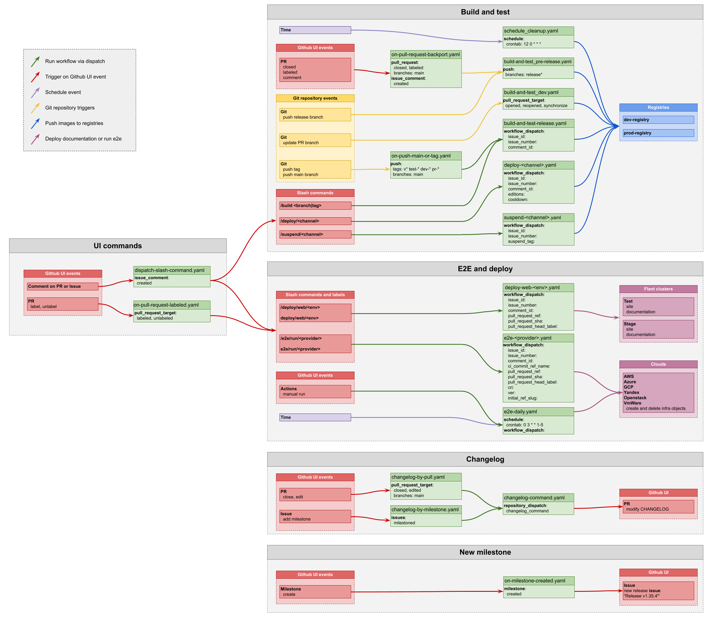

# Workflows development

## Templates

Files in workflows directory render from 3 directories with templates: workflow_templates,
ci_templates, and ci_includes. Use render-workflows.sh to render workflows directory
after changing templates (requires Docker):

```
cd .github
./render-workflows.sh
```

## Testing

We use pull_request_target and workflow_dispatch events which require workflow file
be committed in the main branch.
There are additional repositories for workflow tests which do not interfere with ones in the main repo.

Add remotes:

```
git remote add test-1 git@github.com:deckhouse/deckhouse-test-1
git remote add test-2 git@github.com:deckhouse/deckhouse-test-2
```

Commit and push current branch to the main branch in test-1 repo:

``` 
git commit ...
git push test-1 HEAD:main --force
```

### Differences with main repo:

1. No two-repo schema for werf build.
2. Final images are pushed to ghcr.io (e.g. ghcr.io/deckhouse/deckhouse-test-1).
3. Repo for documentation and site images is ghcr.io.
4. Only AWS and static providers available for E2E tests.
5. No alerts on E2E fails in main branch.
6. Push for deploy and suspend can be skipped with SKIP_PUSH_FOR_SUSPEND and SKIP_PUSH_FOR_DEPLOY variables.
7. No registry cleanup.
8. Autoclose for Dependabot PRs (can be enabled with secret ENABLE_DEPENDABOT_IN_FORKS=true).

## Fuzz build and corpus replay

The local `ci_templates/build_fuzz.yml` and `ci_templates/replay_fuzz.yml`
adapt `Build_Fuzz.gitlab-ci.yml` and `Replay_Fuzz.gitlab-ci.yml` from
`deckhouse/modules-gitlab-ci` at commit `6c44e20`, as used by `operator-argo`.
The replay scripts are kept in `scripts/fuzz/`; no remote CI template is loaded.

`build_fuzz` enables `FUZZ_BUILD_ENABLED=true`, builds the intermediate `*-fuzz`
images and pushes them to the dev registry for both PRs and main. It uploads a
filtered `images_fuzz_tags_werf.json` artifact and produces a replay matrix.
The images use the same pinned `fuzz-go` base as `operator-argo`, import source
artifacts directly, and download Go dependencies at build time. Regular builds
do not render fuzz images. S3 credentials are only needed for replay/publication.

`replay_fuzz` runs one job per image. PRs replay the `main` corpus; main replays
its own branch corpus. Minimized, recovery and Go cache seeds are downloaded
from `s3://anomaloys-materials/<repository>/<branch>/<component>/` and replayed
with `go test -run`. Existing source seeds are preserved. Logs, failing seeds
and reproduction commands are uploaded even on failure and kept for seven days.
On main, `publish_fuzz_report` publishes the build report to S3 only after all
replay jobs succeed. PRs do not publish the report to S3.

Run the replay integration checks with Go, Bash 4+ and jq available in `PATH`:

```sh
python3 -m unittest discover -s .github/scripts/fuzz -v
```

These checks use real Go fuzz targets and a local S3 fixture, without Docker,
registry access or credentials. Regenerate workflows with `render-workflows.sh`
after changing CI templates.


## Workflows schema 

Trigger -> workflow -> result.


