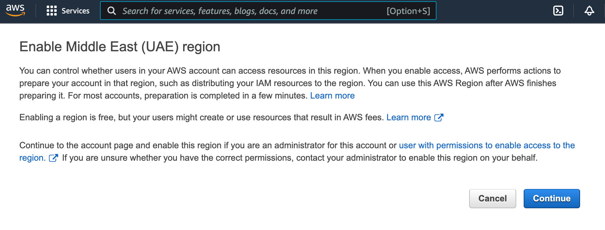



Для работы `cloud-provider` и `machine-controller-manager` требуется доступ в API AWS из-под IAM-пользователя, который обладает достаточным набором прав.


Убедитесь в наличии доступа к нужному региону и наличии необходимых квот.



Провайдер поддерживает работу только с одним диском в шаблоне виртуальной машины. Убедитесь, что шаблон содержит только один диск.


## JSON-спецификация Policy

Сначала подготовьте JSON-файл с конфигурацией необходимых прав:

<!-- The partial below is in the /docs/documentation/_includes/cloud-providers/aws/policy.json file -->
```json
{
    "Version": "2012-10-17",
    "Statement": [
        {
            "Sid": "VisualEditor0",
            "Effect": "Allow",
            "Action": [
                "autoscaling:DescribeAutoScalingGroups",
                "autoscaling:DescribeLaunchConfigurations",
                "autoscaling:DescribeTags",
                "ec2:AllocateAddress",
                "ec2:AssociateAddress",
                "ec2:AssociateRouteTable",
                "ec2:AttachInternetGateway",
                "ec2:AttachVolume",
                "ec2:AuthorizeSecurityGroupEgress",
                "ec2:AuthorizeSecurityGroupIngress",
                "ec2:CreateInternetGateway",
                "ec2:CreateKeyPair",
                "ec2:CreateNATGateway",
                "ec2:CreateRoute",
                "ec2:CreateRouteTable",
                "ec2:CreateSecurityGroup",
                "ec2:CreateSubnet",
                "ec2:CreateTags",
                "ec2:CreateVolume",
                "ec2:CreateVpc",
                "ec2:DeleteInternetGateway",
                "ec2:DeleteKeyPair",
                "ec2:DeleteNATGateway",
                "ec2:DeleteRoute",
                "ec2:DeleteRouteTable",
                "ec2:DeleteSecurityGroup",
                "ec2:DeleteSubnet",
                "ec2:DeleteTags",
                "ec2:DeleteVolume",
                "ec2:DeleteVpc",
                "ec2:DescribeAccountAttributes",
                "ec2:DescribeAddresses",
                "ec2:DescribeAddressesAttribute",
                "ec2:DescribeAvailabilityZones",
                "ec2:DescribeImages",
                "ec2:DescribeInstanceAttribute",
                "ec2:DescribeInstanceCreditSpecifications",
                "ec2:DescribeInstances",
                "ec2:DescribeInstanceTypes",
                "ec2:DescribeInstanceTopology",
                "ec2:DescribeInternetGateways",
                "ec2:DescribeKeyPairs",
                "ec2:DescribeNatGateways",
                "ec2:DescribeNetworkInterfaces",
                "ec2:DescribeRegions",
                "ec2:DescribeRouteTables",
                "ec2:DescribeSecurityGroups",
                "ec2:DescribeSecurityGroupRules",
                "ec2:DescribeSubnets",
                "ec2:DescribeTags",
                "ec2:DescribeVolumesModifications",
                "ec2:DescribeVolumes",
                "ec2:DescribeVpcAttribute",
                "ec2:DescribeVpcClassicLink",
                "ec2:DescribeVpcClassicLinkDnsSupport",
                "ec2:DescribeVpcs",
                "ec2:DetachInternetGateway",
                "ec2:DetachVolume",
                "ec2:DisassociateAddress",
                "ec2:DisassociateRouteTable",
                "ec2:ImportKeyPair",
                "ec2:ModifyInstanceAttribute",
                "ec2:ModifySubnetAttribute",
                "ec2:ModifyVolume",
                "ec2:ModifyVpcAttribute",
                "ec2:ReleaseAddress",
                "ec2:RevokeSecurityGroupEgress",
                "ec2:RevokeSecurityGroupIngress",
                "ec2:RunInstances",
                "ec2:TerminateInstances",
                "ec2:DescribeVpcPeeringConnections",
                "ec2:CreateVpcPeeringConnection",
                "ec2:DeleteVpcPeeringConnection",
                "ec2:AcceptVpcPeeringConnection",
                "ec2:CreateNetworkInterface",
                "ec2:DescribeNetworkInterfaceAttribute",
                "ec2:ModifyNetworkInterfaceAttribute",
                "ec2:DeleteNetworkInterface",
                "ec2:DescribeNetworkInterfaces",                
                "elasticloadbalancing:AddTags",
                "elasticloadbalancing:ApplySecurityGroupsToLoadBalancer",
                "elasticloadbalancing:AttachLoadBalancerToSubnets",
                "elasticloadbalancing:ConfigureHealthCheck",
                "elasticloadbalancing:CreateListener",
                "elasticloadbalancing:CreateLoadBalancer",
                "elasticloadbalancing:CreateLoadBalancerListeners",
                "elasticloadbalancing:CreateLoadBalancerPolicy",
                "elasticloadbalancing:CreateTargetGroup",
                "elasticloadbalancing:DeleteListener",
                "elasticloadbalancing:DeleteLoadBalancer",
                "elasticloadbalancing:DeleteLoadBalancerListeners",
                "elasticloadbalancing:DeleteTargetGroup",
                "elasticloadbalancing:DeregisterInstancesFromLoadBalancer",
                "elasticloadbalancing:DeregisterTargets",
                "elasticloadbalancing:DescribeListeners",
                "elasticloadbalancing:DescribeLoadBalancerAttributes",
                "elasticloadbalancing:DescribeLoadBalancerPolicies",
                "elasticloadbalancing:DescribeLoadBalancers",
                "elasticloadbalancing:DescribeTargetGroups",
                "elasticloadbalancing:DescribeTargetHealth",
                "elasticloadbalancing:DetachLoadBalancerFromSubnets",
                "elasticloadbalancing:ModifyListener",
                "elasticloadbalancing:ModifyLoadBalancerAttributes",
                "elasticloadbalancing:ModifyTargetGroup",
                "elasticloadbalancing:RegisterInstancesWithLoadBalancer",
                "elasticloadbalancing:RegisterTargets",
                "elasticloadbalancing:SetLoadBalancerPoliciesForBackendServer",
                "elasticloadbalancing:SetLoadBalancerPoliciesOfListener",
                "iam:AddRoleToInstanceProfile",
                "iam:CreateInstanceProfile",
                "iam:CreateRole",
                "iam:CreateServiceLinkedRole",
                "iam:DeleteInstanceProfile",
                "iam:DeleteRole",
                "iam:DeleteRolePolicy",
                "iam:GetInstanceProfile",
                "iam:GetRole",
                "iam:GetRolePolicy",
                "iam:ListInstanceProfilesForRole",
                "iam:ListRolePolicies",
                "iam:ListAttachedRolePolicies",
                "iam:PassRole",
                "iam:PutRolePolicy",
                "iam:RemoveRoleFromInstanceProfile",
                "iam:TagRole",
                "kms:DescribeKey",
                "sts:GetCallerIdentity"
            ],
            "Resource": "*"
        }
    ]
}
```

Инструкции, как применить этот JSON-файл, ниже.

## Настройка IAM через веб-интерфейс

Чтобы настроить IAM через веб-интерфейс, сначала создайте новую политику (Policy) и примените к ней созданный ранее JSON-файл:

1. Откройте `Identity and Access Management (IAM)`.
1. Перейдите в раздел `Policies` и нажмите `Create Policy`.
1. Выберите вкладку `JSON` и вставьте приведенную выше спецификацию.
1. Нажмите `Next: Tags`, затем `Next: Review`.
1. Задайте название политики в поле `Name` (например, `D8CloudProviderAWS`).
1. Нажмите `Create Policy`.

Затем добавьте нового пользователя:

1. Перейдите в раздел `Users` IAM и нажмите `Add users`.
1. Задайте имя в поле `User name` (например, `deckhouse`).

Примените к нему созданную Policy:

1. В разделе `Select AWS credential type` выберите `Access key - Programmatic access`.
1. Нажмите `Next: Permissions`.
1. Выберите вкладку `Attach existing policies directly`.
1. Введите в поле поиска (`Filter policies`) имя политики, указанное на предыдущих шагах (например, `D8CloudProviderAWS`), и в полученном списке отметьте checkbox напротив искомой политики.
1. Нажмите `Next: Tags`, затем `Next: Review`.
1. Нажмите `Create user`.

Сохраните полученные `Access key ID` и `Secret access key`.

> Проверьте, есть ли у вашей учетной записи (и, соответственно, у созданного пользователя) доступ к нужным регионам. Для этого выберите необходимый регион в выпадающем списке в правом верхнем углу.
>
> Если произойдет переключение в выбранный регион, доступ к региону есть.
>
> Если доступа к региону нет, вы получите следующее сообщение (может отличаться):
>
> 
>
> В этом случае нажмите `Continue`, чтобы разрешить использование региона.

## Настройка IAM через CLI

Также IAM можно настроить через интерфейс командной строки.

Для этого с помощью следующей команды сохраните JSON-спецификацию в файл `policy.json`:

```shell
cat > policy.json << EOF
<Policy JSON spec>
EOF
```

Затем создайте новую Policy с именем `D8CloudProviderAWS` и примечанием `ARN`, используя JSON-спецификацию из файла `policy.json`:

```shell
aws iam create-policy --policy-name D8CloudProviderAWS --policy-document file://policy.json
```

В ответ отобразится следующий текст:

```yaml
{
    "Policy": {
        "PolicyName": "D8CloudProviderAWS",
        "PolicyId": "AAA",
        "Arn": "arn:aws:iam::123:policy/D8CloudProviderAWS",
        "Path": "/",
        "DefaultVersionId": "v1",
        "AttachmentCount": 0,
        "PermissionsBoundaryUsageCount": 0,
        "IsAttachable": true,
        "CreateDate": "2020-08-27T02:52:06+00:00",
        "UpdateDate": "2020-08-27T02:52:06+00:00"
    }
}
```

Создайте нового пользователя:

```shell
aws iam create-user --user-name deckhouse
```

В ответ отобразится следующий текст:

```yaml
{
    "User": {
        "Path": "/",
        "UserName": "deckhouse",
        "UserId": "AAAXXX",
        "Arn": "arn:aws:iam::123:user/deckhouse",
        "CreateDate": "2020-08-27T03:05:42+00:00"
    }
}
```

Разрешите доступ к API и сохраните пару `AccessKeyId` + `SecretAccessKey`:

```shell
aws iam create-access-key --user-name deckhouse
```

В ответ отобразится следующий текст:

```yaml
{
    "AccessKey": {
        "UserName": "deckhouse",
        "AccessKeyId": "XXXYYY",
        "Status": "Active",
        "SecretAccessKey": "ZZZzzz",
        "CreateDate": "2020-08-27T03:06:22+00:00"
    }
}
```

Объедините `User` и `Policy`:

```shell
aws iam attach-user-policy --user-name username --policy-arn arn:aws:iam::123:policy/D8CloudProviderAWS
```

## Настройка IAM через Terraform

Пример настройки IAM через Terraform:

```hcl
resource "aws_iam_user" "user" {
  name = "deckhouse"
}

resource "aws_iam_access_key" "user" {
  user = aws_iam_user.user.name
}

resource "aws_iam_policy" "policy" {
  name        = "D8CloudProviderAWS"
  path        = "/"
  description = "Deckhouse policy"

  policy = <<EOF
<JSON-спецификация Policy>
EOF
}

resource "aws_iam_user_policy_attachment" "policy-attachment" {
  user       = aws_iam_user.user.name
  policy_arn = aws_iam_policy.policy.arn
}
```
