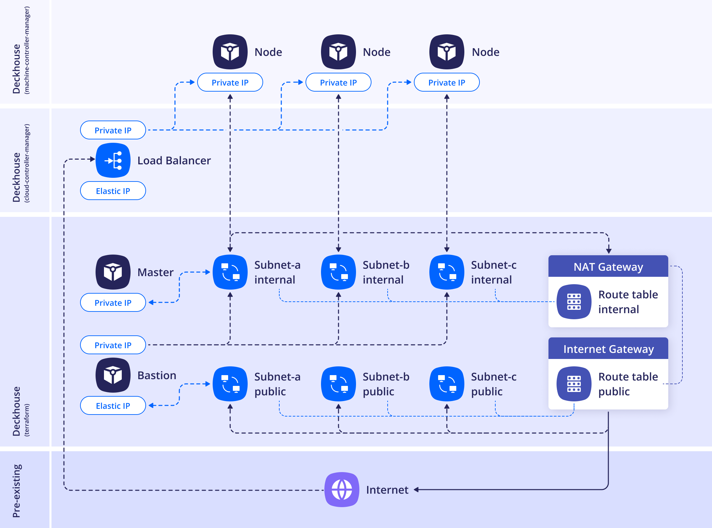

Two layouts are supported. Below is more information about each of them.

## WithoutNAT

**Recommended layout.**

Under this placement strategy, each node gets a public IP (ElasticIP). NAT is not used at all.


<!--- source : https://www.figma.com/design/T3ycFB7P6vZIL359UJAm7g/%D0%98%D0%BA%D0%BE%D0%BD%D0%BA%D0%B8-%D0%B8-%D1%81%D1%85%D0%B5%D0%BC%D1%8B?node-id=995-10681&t=IvETjbByf1MSQzcm-0 --->

Example of the layout configuration:

```yaml
apiVersion: deckhouse.io/v1
kind: AWSClusterConfiguration
layout: WithoutNAT
vpcNetworkCIDR: "10.241.0.0/16"
nodeNetworkCIDR: "10.241.32.0/20"
sshPublicKey: <SSH_PUBLIC_KEY>
provider:
  providerAccessKeyId: '<AWS_ACCESS_KEY>'
  providerSecretAccessKey: '<AWS_SECRET_ACCESS_KEY>'
  region: eu-central-1
masterNodeGroup:
  replicas: 1
  instanceClass:
    # Type of the instance.
    instanceType: m5.xlarge
    # Amazon Machine Image ID
    # AMI Catalog in the AWS console: EC2 -> AMI Catalog
    ami: ami-0caef02b518350c8b
    # Master node VM disk size.
    diskSizeGb: 30
    # Master node VM disk type to use.
    diskType: gp3
nodeGroups:
  - name: mydb
    nodeTemplate:
      labels:
        node-role.kubernetes.io/mydb: ""
    replicas: 2
    instanceClass:
      instanceType: t2.medium
      ami: ami-0caef02b518350c8b
    additionalTags:
      backup: srv1
tags:
  team: rangers
```

## WithNAT

> **Caution!** A bastion host is required to access nodes (it can be created alongside the cluster by specifying the parameters in the section `withNAT.bastionInstance`).
>
> **Caution!** The NAT Gateway is always created in zone `a` in this layout. If cluster nodes are placed in other zones, then if there are problems in zone `a`, they will also be unavailable. In other words, when choosing the `WithNat` layout, the availability of the entire cluster will depend on the availability of zone `a`.

Virtual machines access the Internet using a NAT Gateway with a shared (and single) source IP.


<!--- source: https://www.figma.com/design/T3ycFB7P6vZIL359UJAm7g/%D0%98%D0%BA%D0%BE%D0%BD%D0%BA%D0%B8-%D0%B8-%D1%81%D1%85%D0%B5%D0%BC%D1%8B?node-id=995-9864&t=IvETjbByf1MSQzcm-0 --->

Example of the layout configuration:

```yaml
apiVersion: deckhouse.io/v1
kind: AWSClusterConfiguration
layout: WithNAT
provider:
  providerAccessKeyId: '<AWS_ACCESS_KEY>'
  providerSecretAccessKey: '<AWS_SECRET_ACCESS_KEY>'
  region: eu-central-1
withNAT:
  bastionInstance:
    zone: eu-central-1a
    instanceClass:
      instanceType: m5.large
      ami: ami-0caef02b518350c8b
      diskType: gp3
masterNodeGroup:
  # Number of master nodes.
  # If there is more than one master node, the etcd cluster will be set up automatically.
  replicas: 1
  instanceClass:
    # Type of the instance.
    instanceType: m5.xlarge
    # Amazon Machine Image ID.
    # AMI Catalog in the AWS console: EC2 -> AMI Catalog
    ami: ami-0caef02b518350c8b
    # Master node VM disk size.
    diskSizeGb: 30
    # Master node VM disk type to use.
    diskType: gp3
nodeGroups:
  - name: mydb
    nodeTemplate:
      labels:
        node-role.kubernetes.io/mydb: ""
    replicas: 2
    instanceClass:
      instanceType: t2.medium
      ami: ami-0caef02b518350c8b
    additionalTags:
      backup: me
vpcNetworkCIDR: "10.241.0.0/16"
nodeNetworkCIDR: "10.241.32.0/20"
sshPublicKey: <SSH_PUBLIC_KEY>
tags:
  team: rangers
```
