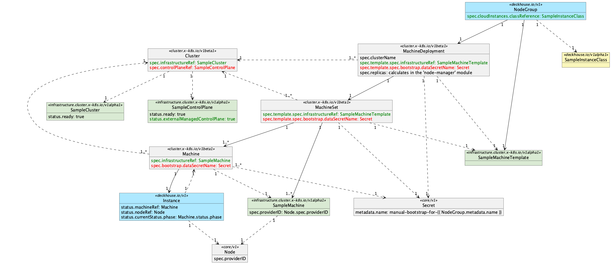

# Cluster API Provider

Cluster API Provider управляет виртуальными машинами в облачной инфраструктуре. Он предоставляет реализацию интерфейса Cluster API для конкретного облачного провайдера.

С точки зрения [концепций Cluster API](https://cluster-api.sigs.k8s.io/user/concepts) `management cluster` и `workload cluster` — это один и тот же кластер Kubernetes, управляемый Deckhouse.

Для нового Deckhouse cloud-provider необходимо реализовать Cluster API контроллеры:
* [<cloud-provider-name>Cluster](cluster-api-controllers/sample-cluster.md)
* [<cloud-provider-name>ControlPlane](cluster-api-controllers/sample-control-plane.md)
* [<cloud-provider-name>Machine](cluster-api-controllers/sample-machine.md)

## Cluster API Provider Sample

Пример реализации Cluster API Provider можно найти в отдельной ветке репозитория Deckhouse - [cloud-provider-sample](https://github.com/deckhouse/deckhouse/tree/cloud-provider-sample/ee/modules/030-cloud-provider-sample).

Схема связей между ресурсами Cluster API Provider Sample:

Прямые линии представляют «управление». Например, «MachineSet управляет Machine». Пунктирная линия представляет «ссылку». Например, «поле `spec.infrastructureRef` Machine ссылается на SampleMachine».

Направление стрелок указывает направление «управления» или «ссылки». Например, «отношение между MachineSet и Machine — это управление от MachineSet к Machine», поэтому стрелка указывает от MachineSet к Machine.
