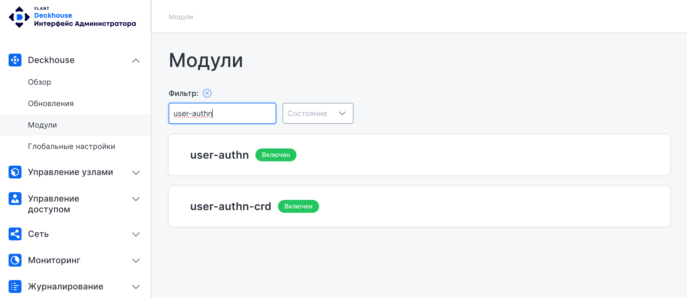
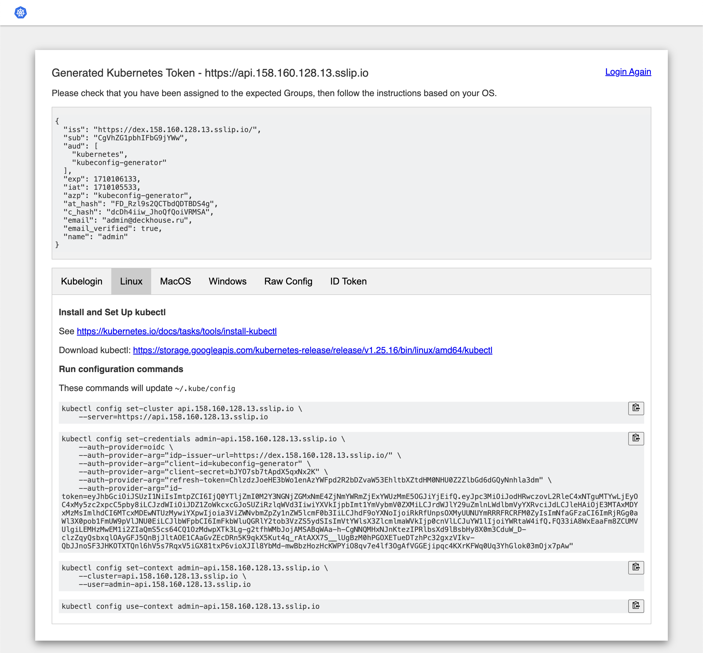

## Описание в таблице: https://deckhouse.ru/scheme/

Платформа Deckhouse предоставляет разнообразные методы подключения, позволяющие взаимодействовать с её API и web-интерфейсами.
Основной метод - публикация API вместе с веб-интерфейсами через HTTPS-балансировщик, который рекомендуется использовать по умолчанию. Дополнительно существует опция публикации API напрямую в корпоративной сети при условии [интеграции платформы для публикации сервисов](ссылку на раздел интеграции)) и возможность подключения по OpenVPN.
Эти возможности обеспечивают простое и надежное подключение пользователей, учитывая особенности сетевой инфраструктуры и требования по безопасности конкретной компании.

   * Установка
   * Настройка
   * Подключение узлов
   * Kubernetes Dashboard? (https://deckhouse.ru.test.flant.com/documentation/v1/modules/500-dashboard/)
   
   (Сюда-же добавить сценарии установки через консоль и UI)

## Список фич в гугл-файле: https://docs.google.com/spreadsheets/d/1n7sPRng-V4uWQS-36159No57B1kSF1gU6EWwXcOJSls/edit#gid=205229375

## Сценарии подключения пользователей

1. Создание супер-администратора создается автоматически (не предоставляется пользователям).

### Подключение через Dex

#### Настройка kubectl для доступа в кластер

Настройка `kubectl` применяется, чтобы пользователь `admin` получил доступ в кластер. Для этого:

1. Перейдите в консоль администратора.

2. Для просмотра адрес консоли администратора, выполните на узле `static-master-0` команду:

   ```bash
   kubectl -n d8-system get ingress admin-frontend
   ```

3. В разделе **Deckhouse** откройте страницу **Модули** и в фильтре выбора введите название модуля *user-authn*:



4. Нажмите на модуль *user-authn* и переопределите его настройки:

Версия схемы настроек — 1.

Настройки:

```
controlPlaneConfigurator:
  dexCAMode: DoNotNeed
publishAPI:
  enable: true
  https:
    global:
      kubeconfigGeneratorMasterCA: ''
    mode: Global
```

5. Нажмите **Сохранить**.

6. В разделе **Deckhouse** откройте страницу *Обзор* и перейдите по ссылке kubeconfig-generator.

7. Аутентифицируйтесь с помощью email с теми же логином и паролем, которые используйте для доступа в консоль администратора.

8. В открывшемся окне kubeconfig-generator перейдите на вкладку *Linux*:



9. Подключитесь по SSH к серверу bastion и выполните команды конфигурации `kubectl` из окна конфигуратора.

10. Убедитесь, что `kubectl` на сервере bastion отображает информацию из кластера.

### Драфты сценариев подключения пользователей

1. Создание учетных записей пользователей. 

Создайте пользователей с соответствующими ролями и правами на доступ к кластеру.

2. Создание объекта пользователя в Kubernetes API.

`kubectl`, например, или другой инструмент управления, создайте файл с расширением .yaml, описывающий пользователя и его роли.

3. Публикация объекта пользователя.

Например, используя `kubctl apply`, опубликуйте созданный объект пользователя в кластере.

4. Загрузка файла ролей и учетных записей пользователей в сервер аутентификации (например, Keycloak, Dex, или OpenID Connect).

Пользователи должны пройти аутентификацию и авторизацию с помощью сервера аутентификации.
После успешной аутентификации и авторизации, пользователь получает токен, который можно использовать для подключения к Kubernetes API.
Пользователь использует `kubectl` или другое приложение для подключения к кластеру с использованием токена.

## Сценарий коммандера (нужен доступ)

1. шаг

1. шаг

1. шаг

## Публикация API через HTTPS-балансировщик

1. Установка и настройка Deckhouse.

Необходимо установить и настроить Deckhouse....

Идет сценарий установки

2. Создание и настройка балансировщика

 Создайте и настройте балансировщик HTTPS на стороне Deckhouse.
 
3. Подключение к балансировщику.

На стороне пользователя, подключитесь к балансировщику через Интернет или корпоративную сеть.

## Публикация API напрямую в корпоративной сети

1. Интеграция платформы для публикации сервисов.

2. Настройка сети с API Deckhouse. (Получается тут надо описать настройку брандмауэра и других сетевых устройств).

3. Подключение по OpenVPN.


## Черновые варианты сценариев

### Файл kubeconfig

По умолчанию инструмент командной строки для управления кластерами `kubectl` задействуется через командную строку (например, через bash) и использует контексты для взаимодействия с кластером. Контекст - это набор параметров доступа, содержащий кластер, пользователя и пространство имен. Контексты используются для доступа к определенному кластеру и пространству имен с помощью учетной записи пользователя. 
Установка того, с каким кластером взаимодействует ДКП и изменение конфигурационной информации осуществляются посредством `kubectl`.

### Control plane

Компоненты управляющего слоя, которые отвечают за основные операции кластера ДКП (например, планирование), а также обрабатывают события кластера ДКП (например, запускают новый pod, когда поле развертывания `replicas` не соответствует требуемому количеству реплик).
Минимальный набор таких компонентов: `etcd`, `API-server`, `controller manager`.
Помимо управляющих компонентов, в ДКП входят `kubelet` и `kubeproxy`, которые запущены на всех узлах кластера ДКП. Компоненты Control plane могут быть запущены на любой машине в кластере. Однако сценарии настройки обычно запускают все компоненты управляющего слоя на одном компьютере и в то же время не позволяют запускать пользовательские контейнеры на этом компьютере.

### API-server

Центральный компонент кластера ДКП. Он является связывающим компонентом для всех остальных сервисов. Все взаимодействие как самих компонентов, так и обращение извне к кластеру проходит через kube-apiserver и проверяется им. 

<!--Уточнить-->

Это единственный компонент кластера ДКП, который общается с базой данных `etcd`, где хранится состояние кластера ДКП.
В самом API Server нет бизнес-логики. API Server не принимает решения, например, за то, на каком узле запустить тот или иной сервис.
В нем существует логика проверки формата запросов, аутентификации, проверки прав и т.д.
Еще одной функцией API Server является рассылка изменений конфигураций и состояния кластера ДКП.
Другие компоненты подписываются на события, отслеживают их и обрабатывают, либо с определенной периодичностью считывают конфигурацию через API Server.

### Etcd

Высоконадежное распределенное хранилище данных. ДКП хранит в нем информацию о состоянии существующих кластеров ДКП, сервисах, сети и т. д.
Доступ к данным осуществляется через `REST API`. При изменениях записей вместо поиска и изменения предыдущей копии, все предыдущие записи помечаются как устаревшие, а новые значения записываются в конец. Позже устаревшие значения удаляются специальным процессом. В небольших временных кластерах `etcd` можно запускать в единственном экземпляре и на одном узле с ведущими компонентами.
В важных системах, требующих избыточности и высокой доступности, `etcd` следует создавать в виде кластера ДКП, состоящего из нескольких узлов.
Сервер API является основной точкой управления всего кластера ДКП. Он обрабатывает операции REST, проверяет их и обновляет соответствующие объекты в `etcd`. Сервер API обслуживает ДКП API и задуман как простой сервер, с большей частью бизнес-логики, реализованной в отдельных компонентах или в плагинах. Ниже приведены некоторые примеры API, доступных на сервере API.

### Kube-scheduler

Компонент управляющего слоя, с его помощью необходимо отслеживать созданные поды без привязанного узла и осуществлять выбор узла, на котором поды должны работать. При развертывании подов на узлах, учитывается множество факторов, включая требования к ресурсам, ограничения, связанные с аппаратными/программными политиками, принадлежности (affinity) и непринадлежности (anti-affinity) узлов/подов, местонахождения данных, предельных сроков.
Используя механизм оповещения об изменениях API Server, `kube-scheduler` получает сообщения от управляющего слоя, когда необходимо запустить экземпляр сервиса и принимает решение о том, на каком узле он должен быть запущен, и через API server обновляет состояние кластера ДКП. Сам `kube-scheduler` ничего не запускает.

### Kubelet

Сервис, который управляет подами, основываясь на их спецификации, является главным сервисом для рабочих узлов. Сервис взаимодействует с `API-server`.
Для запуска полезной нагрузки на узлах используется `kubelet`. В отличие от компонентов управляющего слоя, он запущен на каждом узле: управляющем и рабочем. `kubelet` читает событие с помощью `API Server`, что экземпляр сервиса распределен посредством `kube-scheduler` на узел, на котором он работает, и запускает экземпляр сервиса.
Для изоляции сервисов друг от друга они запускаются `kubelet` в контейнерном окружении `containerd`. <!--Уточнить--> Также c использованием `kubelet` возможно отслеживание работоспособности контейнеров, которые были запущены с его помощью.

### Controller-manager

Компонент, отвечающий за запуск контроллеров, которые определяют текущее состояние системы.
Каждый контроллер представляет собой отдельный процесс, и для упрощения все такие процессы скомпилированы в один двоичный файл и выполняются в одном процессе.
Эти контроллеры включают:

* контроллер узла (Node Controller): уведомляет и реагирует на сбои узла;
* контроллер репликации (Replication Controller): поддерживает правильное количество подов для каждого объекта контроллера репликации в системе;
* контроллер конечных точек (Endpoints Controller): заполняет объект конечных точек (Endpoints), то есть связывает сервисы (Services) и поды;
* контроллеры учетных записей и токенов (Account & Token Controllers): создают стандартные учетные записи и токены доступа API для новых пространств имен.

<!--Уточнить-->

## Настройка кластера ДКП для подключения

1. При определении конфигураций укажите последнюю стабильную версию API.

2. Файлы конфигурации храните в системе управления версиями перед отправкой в кластер ДКП. Это позволяет быстро откатить изменение конфигурации при необходимости. Это также помогает в повторном создании и восстановлении кластера.

3. Запишите файлы конфигурации, используя YAML, а не JSON. Хотя эти форматы могут использоваться взаимозаменяемо почти во всех сценариях, YAML, как правило, более удобен для пользователя.

4. Группируйте связанные объекты в один файл всякий раз, когда это имеет смысл. Часто одним файлом управлять проще, чем несколькими. Посмотрите файл guestbook-all-in-one.yaml в качестве примера этого синтаксиса.

Обратите также внимание, что многие `kubectl` команды могут вызываться в каталоге. Например, можно вызвать каталог конфигурационных файлов `kubectl apply`.

5. Не указывайте значения по умолчанию без необходимости: простая, минимальная конфигурация сделает ошибки менее вероятными.

6. Поместите описания объектов в аннотации, чтобы обеспечить лучший самоанализ.


1. Не используйте открытые поды (то есть поды, не привязанные к набору реплик или развертыванию), если можно этого избежать. Открытые поды не будут перенесены в случае сбоя узла.

Развертывание, которое одновременно создает набор копий, чтобы гарантировать, что желаемое количество подов всегда доступно, и определяет стратегию замены подов (например, RollingUpdate), почти всегда предпочтительнее, чем прямое создание подов.


