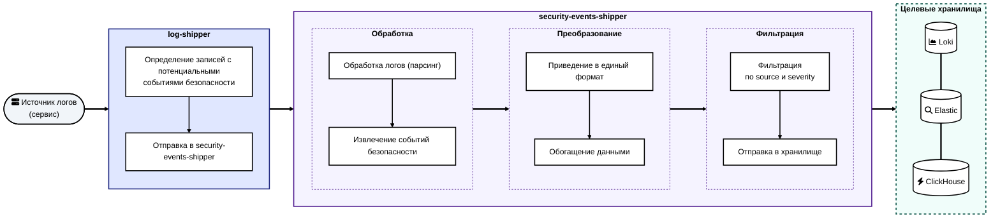

```mermaid
flowchart LR
  %% --- СТИЛИ УЗЛОВ (Черный текст + Четкие границы) ---
  classDef step fill:#ffffff,stroke:#000000,color:#000000,stroke-width:2px;
  classDef source fill:#f1f5f9,stroke:#000000,color:#000000,stroke-width:2px;
  classDef storage fill:#ffffff,stroke:#000000,color:#000000,stroke-width:2px;

  %% --- ПОТОК ---
  A(["fa:fa-server Источник логов <br/>(сервис)"]):::source ==> LS

  subgraph LS [<b><font color='black'>log-shipper</font></b>]
    direction TB
    ls1[Определение записей с потенциальными<br/>событиями безопасности]:::step --> ls2[Отправка в security-events-shipper]:::step
  end

  LS ==> SES

  subgraph SES [<b><font color='black'>security-events-shipper</font></b>]
    direction LR

    subgraph P [<b><font color='black'>Обработка</font></b>]
      direction TB
      p1["Обработка логов (парсинг)"]:::step --> p2[Извлечение событий безопасности]:::step
    end

    P ==> E

    subgraph E [<b><font color='black'>Преобразование</font></b>]
      direction TB
      e1[Приведение в единый формат]:::step --> e2[Обогащение данными]:::step
    end

    E ==> F

    subgraph F [<b><font color='black'>Фильтрация</font></b>]
      direction TB
      f1[Фильтрация <br/> по source и severity]:::step --> f2[Отправка в хранилище]:::step
    end
  end

  %% --- БЛОК 3: ХРАНИЛИЩА ---
  SES ==> ST

  subgraph ST [<b><font color='black'>Целевые хранилища</font></b>]
    direction TB
    S1[("fa:fa-chart-area Loki")]:::storage
    S2[("fa:fa-search Elastic")]:::storage
    S3[("fa:fa-bolt ClickHouse")]:::storage
    S1 ~~~ S2 ~~~ S3
  end

  %% --- ЦВЕТОВАЯ ГРУППИРОВКА (СВЕТЛАЯ) ---
  style LS fill:#e0e7ff,stroke:#1a237e,stroke-width:2px,color:#000000
  style SES fill:#f5f3ff,stroke:#4a148c,stroke-width:2px,color:#000000
  style ST fill:#f0fdfa,stroke:#004d40,stroke-dasharray: 5 5,stroke-width:2px,color:#000000
  
  style P fill:none,stroke:#4a148c,stroke-dasharray: 3 3
  style E fill:none,stroke:#4a148c,stroke-dasharray: 3 3
  style F fill:none,stroke:#4a148c,stroke-dasharray: 3 3

  %% --- ТЕМНЫЕ ЖЕСТКИЕ СТРЕЛКИ ---
  linkStyle default stroke:#000000,stroke-width:2px;
  linkStyle 0,2,4,6,8,9,10 stroke:#000000,stroke-width:3px;

```
