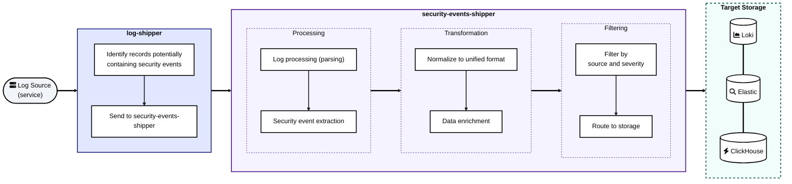

```mermaid
flowchart LR
  classDef step fill:#ffffff,stroke:#000000,color:#000000,stroke-width:2px;
  classDef source fill:#f1f5f9,stroke:#000000,color:#000000,stroke-width:2px;
  classDef storage fill:#ffffff,stroke:#000000,color:#000000,stroke-width:2px;

  A(["fa:fa-server Log Source <br/>(service)"]):::source ==> LS

  subgraph LS [<b><font color='black'>log-shipper</font></b>]
    direction TB
    ls1[Identify records potentially<br/>containing security events]:::step --> ls2[Send to security-events-shipper]:::step
  end

  LS ==> SES

  subgraph SES [<b><font color='black'>security-events-shipper</font></b>]
    direction LR

    subgraph P [<font color='black'>Processing</font>]
      direction TB
      p1["Log processing (parsing)"]:::step --> p2[Security event extraction]:::step
    end

    P ==> E

    subgraph E [<font color='black'>Transformation</font>]
      direction TB
      e1[Normalize to unified format]:::step --> e2[Data enrichment]:::step
    end

    E ==> F

    subgraph F [<font color='black'>Filtering</font>]
      direction TB
      f1[Filter by <br/> source and severity]:::step --> f2[Route to storage]:::step
    end
  end

  SES ==> ST

  subgraph ST [<b><font color='black'>Target Storage</font></b>]
    direction TB
    S1[("fa:fa-chart-area Loki")]:::storage
    S2[("fa:fa-search Elastic")]:::storage
    S3[("fa:fa-bolt ClickHouse")]:::storage
    S1 ~~~ S2 ~~~ S3
  end

  style LS fill:#e0e7ff,stroke:#1a237e,stroke-width:2px,color:#000000
  style SES fill:#f5f3ff,stroke:#4a148c,stroke-width:2px,color:#000000
  style ST fill:#f0fdfa,stroke:#004d40,stroke-dasharray: 5 5,stroke-width:2px,color:#000000
  
  style P fill:none,stroke:#4a148c,stroke-dasharray: 3 3
  style E fill:none,stroke:#4a148c,stroke-dasharray: 3 3
  style F fill:none,stroke:#4a148c,stroke-dasharray: 3 3

  linkStyle default stroke:#1a1a1a,stroke-width:2px;
  linkStyle 0,2,4,6,8,9,10 stroke:#000000,stroke-width:3px;

```
