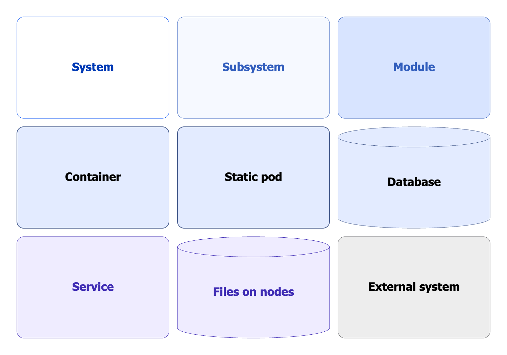
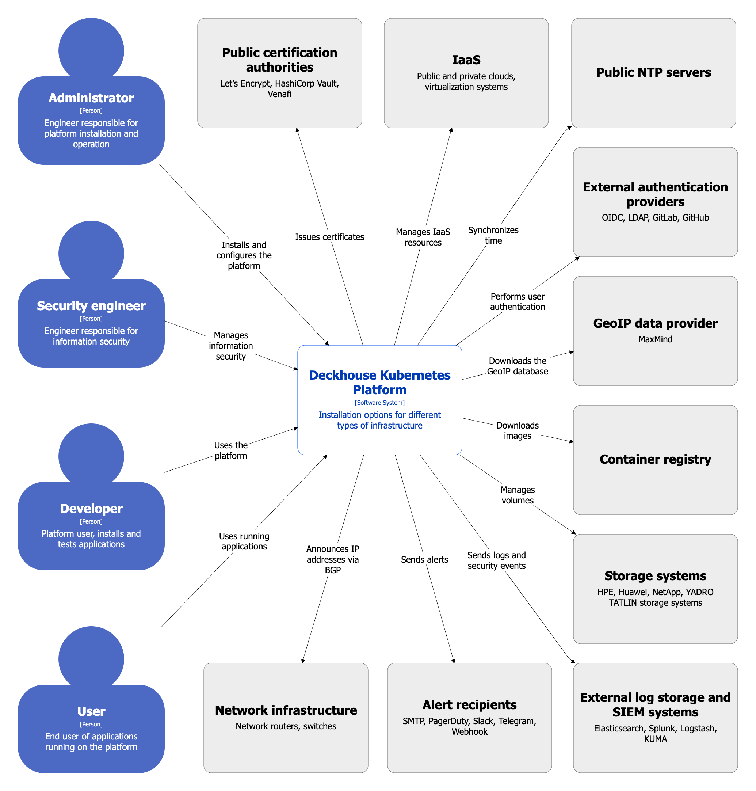
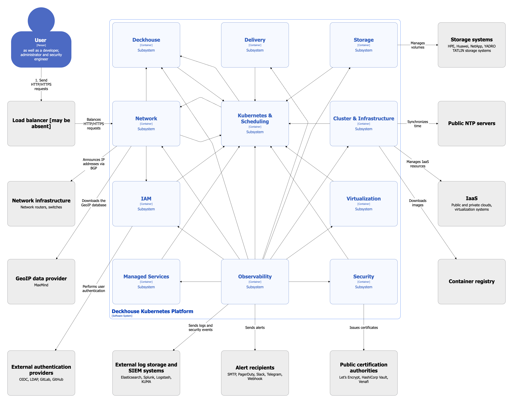
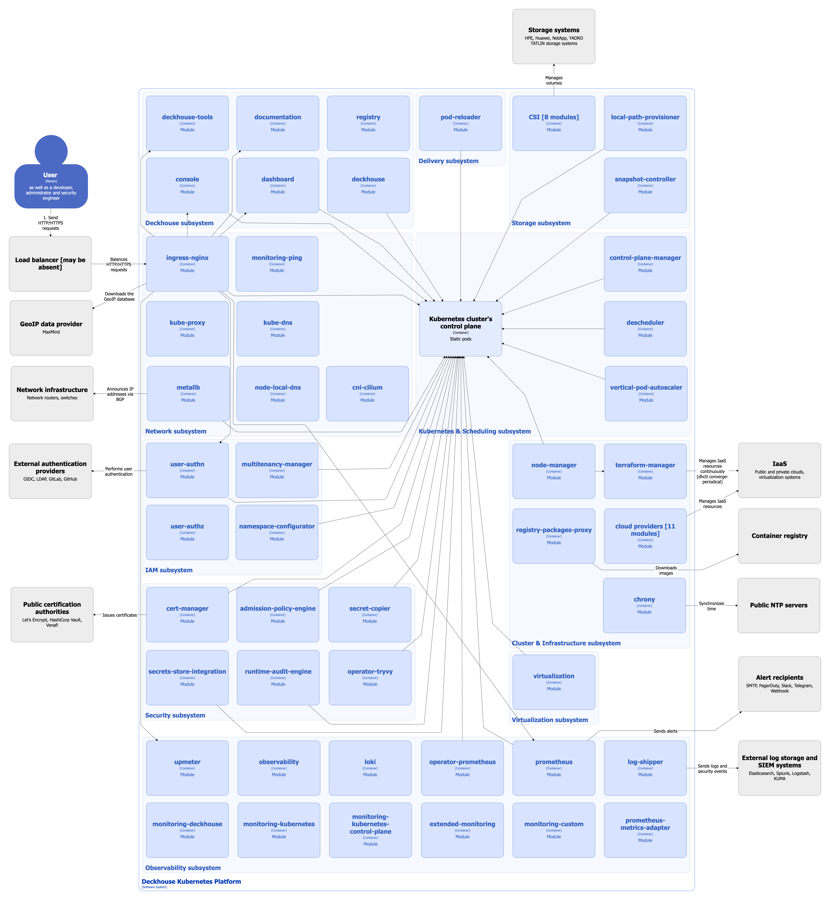

[Модель С4](https://c4model.com/) используется для графического изображения архитектуры системы и объяснения декомпозиции системы на элементы. Диаграммы в этой модели организуются по принципу увеличения масштаба и детализации элементов:

* **Уровень 1: диаграмма контекста.** Отражает положение системы во внешнем контексте: возможные пользовательские роли и другие системы, непосредственно участвующие в работе.

* **Уровень 2: диаграмма контейнеров.** Разбивает систему на контейнеры (основные подсистемы) и отражает основные пути взаимодействия между ними. Контейнер в модели C4 (не путать с Docker-контейнерами) — это исполняемая и развертываемая подсистема, например, исполняемый файл.

* **Уровень 3: диаграмма компонентов.** Разбивает каждый контейнер на компоненты и отражает взаимодействие компонентов между собой (внутри одного контейнера) и с другими контейнерами. Компонент в модели C4 — это программный модуль (подсистема) в коде контейнера (исполняемого файла). Этот уровень описан в архитектурных диаграммах каждого сервиса.

* **Уровень 4: диаграмма кода.**  Описывает элементы кода, с помощью которых реализуются компоненты.

Из-за большого количества элементов на уровне 2 полная диаграмма контейнеров здесь не приводится. Вместо этого после диаграммы уровня 1 представлены следующие промежуточные диаграммы:

* [диаграмма подсистем](#диаграмма-подсистем);
* [диаграмма модулей](#диаграмма-модулей).

Диаграммы уровня 2 и выше приведены в разделах, описывающих архитектуру отдельных модулей.

Чтобы получить общее представление об архитектуре Deckhouse Kubernetes Platform (DKP), достаточно изучить диаграмму уровня 1, а также диаграммы подсистем и модулей. Для детального изучения устройства каждого сервиса обратитесь к диаграммам уровня 2 и выше, представленным в соответствующих разделах.

## Условные обозначения

Для элементов диаграмм используется следующие графические символы:

<!--- Source: structurizr code from https://fox.flant.com/team/d8-system-design/doc/-/tree/main/architecture/diagrams/C4 --->

## Диаграмма контекста

<!--- Source: structurizr code from https://fox.flant.com/team/d8-system-design/doc/-/tree/main/architecture/diagrams/C4 --->

С DKP взаимодействуют:

* **Администратор** — устанавливает и настраивает платформу.
* **Инженер безопасности** — управляет информационной безопасностью.
* **Разработчик** — использует платформу для установки и тестирования разрабатываемых приложений.
* **Пользователь** — использует запущенные на платформе приложения.

Взаимодействие с внешними сервисами описано в диаграммах следующих уровней.

## Диаграмма подсистем

На данной диаграмме изображены подсистемы DKP.


Связи между подсистемами показаны в обобщённом виде и без детализации.


<!--- Source: structurizr code from https://fox.flant.com/team/d8-system-design/doc/-/tree/main/architecture/diagrams/C4 --->

## Диаграмма модулей

На данной диаграмме изображены все модули в составе [набора модулей](../../admin/configuration/#наборы-модулей) Default, а также наиболее важные дополнительные модули. Модули сгруппированы по подсистемам.


Связи между модулями показаны в обобщённом виде и без детализации.


<!--- Source: structurizr code from https://fox.flant.com/team/d8-system-design/doc/-/tree/main/architecture/diagrams/C4 --->

