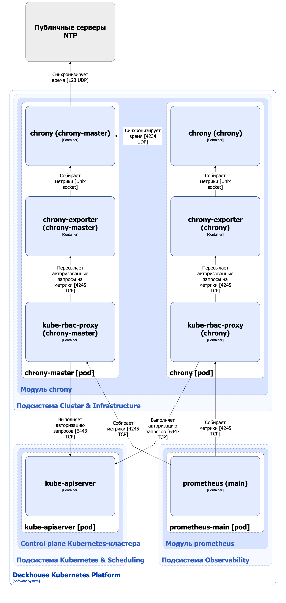

Модуль [`chrony`](/modules/chrony/) обеспечивает синхронизацию времени на всех узлах кластера Deckhouse Kubernetes Platform (DKP) с использованием реализации NTP-сервера/клиента [chrony](https://chrony-project.org/).

Подробнее с описанием модуля можно ознакомиться [в соответствующем разделе документации](/modules/chrony/configuration/).

## Архитектура модуля


Для упрощения схемы приняты следующие допущения:

* На схеме показано, что контейнеры разных подов взаимодействуют друг с другом напрямую. Фактически они взаимодействуют через соответствующие сервисы Kubernetes (внутренние балансировщики). Названия сервисов не указываются, если они очевидны из контекста. В остальных случаях название сервиса указано над стрелкой.
* Поды могут быть запущены в нескольких репликах, однако на схеме все поды изображены в одной реплике.


Архитектура модуля [`chrony`](/modules/chrony/) на уровне 2 модели C4 и его взаимодействия с другими компонентами Deckhouse Kubernetes Platform (DKP) изображены на следующей диаграмме:

<!--- Source: structurizr code from https://fox.flant.com/team/d8-system-design/doc/-/tree/main/architecture/diagrams/C4_RU --->

## Компоненты модуля

Модуль состоит из следующих компонентов:

1. **Chrony-master** — реализация сервиса синхронизации времени на master-узлах кластера с внешними NTP-серверами.

   Состоит из следующих контейнеров:

   - **chrony** — основной контейнер;
   - **chrony-exporter** — сайдкар-контейнер, собирающий метрики контейнера chrony и предоставляющий их в формате Prometheus;
   - **kube-rbac-proxy** — сайдкар-контейнер с авторизующим прокси на основе Kubernetes RBAC для организации защищенного доступа к метрикам контейнера chrony-exporter.

1. **Chrony** — реализация сервиса синхронизации времени на всех узлах кластера, кроме master-узлов, с компонентом chrony-master.

   Состоит из следующих контейнеров:

   - **chrony** — основной контейнер;
   - **chrony-exporter** — сайдкар-контейнер, собирающий метрики контейнера chrony и предоставляющий их в Prometheus формате;
   - **kube-rbac-proxy** — сайдкар-контейнер с авторизующим прокси на основе Kubernetes RBAC для организации защищенного доступа к метрикам контейнера chrony-exporter.

## Взаимодействия модуля

Модуль взаимодействует со следующими компонентами:

1. **Kube-apiserver** — авторизация запросов на получение метрик.

1. **Внешние NTP-серверы** — синхронизация времени.

С модулем взаимодействуют следующие внешние компоненты:

- **Prometheus-main** — сбор метрик chrony и chrony-master.
