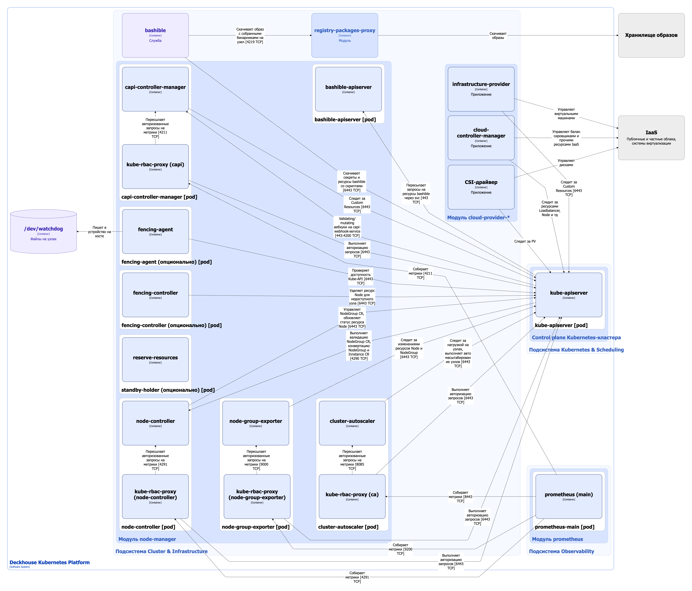

На данной странице описана архитектура модуля [`node-manager`](/modules/node-manager/) для CloudEphemeral-узлов.

## Архитектура модуля


Для упрощения схемы приняты следующие допущения:

* На схеме показано, что контейнеры разных подов взаимодействуют друг с другом напрямую. Фактически они взаимодействуют через соответствующие сервисы Kubernetes (внутренние балансировщики). Названия сервисов не указываются, если они очевидны из контекста. В остальных случаях название сервиса указано над стрелкой.
* Поды могут быть запущены в нескольких репликах, однако на схеме все поды изображены в одной реплике.


Архитектура модуля [`node-manager`](/modules/node-manager/) на уровне 2 модели C4 и его взаимодействия с другими компонентами Deckhouse Kubernetes Platform (DKP) изображены на следующей диаграмме:

## Компоненты модуля


Bashible — это ключевой компонент подсистемы Cluster & Infrastructure, обеспечивающий работу модуля `node-manager`. При этом он не является компонентом модуля, поскольку работает на уровне ОС в качестве системной службы. Bashible подробно описан в [соответствующем разделе документации](bashible.html)


Модуль, управляющий CloudEphemeral-узлами, состоит из следующих компонентов:

1. **Bashible-api-server** — [Kubernetes Extension API Server](https://kubernetes.io/docs/tasks/extend-kubernetes/setup-extension-api-server/), развернутый на master-узлах. Генерирует bashible-скрипты из шаблонов, хранящихся в кастомных ресурсах. При обращении к kube-apiserver за ресурсами, содержащими бандлы bashible, kube-apiserver перенаправляет запрос в bashible-api-server и возвращает сформированный результат. Подробнее с описанием работы bashible и bashible-api-server можно ознакомиться в [соответствующем разделе документации](bashible.html).

1. **Node-controller** (Deployment) — контроллер, управляющий жизненным циклом кастомных ресурсов [NodeGroup](/modules/node-manager/cr.html#nodegroup). Node-controller выполняет следующие операции:

   * управляет жизненным циклом кастомного ресурса [NodeGroup](/modules/node-manager/cr.html#nodegroup);
   * реализует вебхуки для валидации кастомных ресурсов [NodeGroup](/modules/node-manager/cr.html#nodegroup) через механику [Validating Admission Controllers](https://kubernetes.io/docs/reference/access-authn-authz/admission-controllers/);
   * реализует вебхуки для конверсии кастомных ресурсов [NodeGroup](/modules/node-manager/cr.html#nodegroup) и [Instance](/modules/node-manager/cr.html#instance);
   * выполняет очистку лейблов и тейнтов ресурса Node, которые остаются после первого запуска [bashible](bashible.html) для инициализации узла;
   * обеспечивает перевод узла кластера [в режим обслуживания (draining a node)](https://kubernetes.io/docs/tasks/administer-cluster/safely-drain-node/);
   * применяет лейблы, тейнты и аннотации из секции [`spec.nodeTemplate`](/modules/node-manager/cr.html#nodegroup-v1-spec-nodetemplate) кастомного ресурса NodeGroup ко всем принадлежащим к нему ресурсам Node;
   * вычисляет и обновляет субресурс `status` кастомных ресурсов NodeGroup на основании агрегированной информации, полученной из соответствующих ресурсов Node и инфраструктурных кастомных ресурсов;
   * устанавливает атрибут `spec.providerID = "static://"` для ресурсов Node типа Static при его отсутствии;
   * управляет жизненным циклом обновления узлов: одобрение обновления, обработка прерываний в работе узлов, перевод узла кластера [в режим обслуживания (draining a node)](https://kubernetes.io/docs/tasks/administer-cluster/safely-drain-node/) и очистка после успешного обновления.

   Компонент включает в себя следующие контейнеры:

   * **node-controller** — основной контейнер;
   * **kube-rbac-proxy** — сайдкар-контейнер с авторизующим прокси на основе Kubernetes RBAC для организации защищенного доступа к метрикам контроллера.

1. **Node-group-exporter** (Deployment) — компонент, экспортирующий метрики ресурса NodeGroup в формате Prometheus, содержащие информацию о количестве узлов в каждой группе узлов: общее количество, количество узлов в статусе `Ready`, количество узлов в ошибке, минимальное и максимальное количество узлов в группе и т.д.

   Компонент включает в себя следующие контейнеры:

   * **node-group-exporter** — основной контейнер;
   * **kube-rbac-proxy** — сайдкар-контейнер с авторизующим прокси на основе Kubernetes RBAC для организации защищенного доступа к метрикам экспортера.

1. **Capi-controller-manager** (Deployment) — основные контроллеры из проекта [Kubernetes Cluster API](https://github.com/kubernetes-sigs/cluster-api). Cluster API является расширением Kubernetes, которое дает возможность управлять кластерами как кастомными ресурсами внутри другого Kubernetes-кластера.

   Компонент включает в себя следующие контейнеры:

   * **control-plane-manager** — основной контейнер;
   * **kube-rbac-proxy** — сайдкар-контейнер с авторизующим прокси на основе Kubernetes RBAC для организации защищенного доступа к метрикам контроллера.

1. **Cluster-autoscaler** (Deployment) — [дополнительный компонент Kubernetes](https://github.com/kubernetes/autoscaler/tree/master/cluster-autoscaler), который автоматически изменяет количество узлов в кластере в зависимости от нагрузки. Подробнее с автоматическим масштабированием узлов можно ознакомиться в [разделе документации по управлению узлами](overview.html#масштабирование-узлов-в-облаке).

   Компонент включает в себя следующие контейнеры:

   * **cluster-autoscaler** — основной контейнер;
   * **kube-rbac-proxy** — сайдкар-контейнер с авторизующим прокси на основе Kubernetes RBAC для организации защищенного доступа к метрикам **cluster-autoscaler**.

1. **Fencing-agent** (DaemonSet) и **fencing-controller** — компоненты, реализующие механизм fencing. Принцип работы компонентов подробно разобран [в описании параметра `spec.fencing.mode`](/modules/node-manager/cr.html#nodegroup-v1-spec-fencing-mode) ресурса NodeGroup. Подробнее о том, как механизм fencing обрабатывает разные типы узлов, можно почитать [в разделе «FAQ»](/modules/node-manager/faq.html#как-механизм-fencing-обрабатывает-разные-типы-узлов) документации модуля `node-manager`.

1. **Standby-holder** (Deployment) — под для резервирования узлов. При включенном параметре [`spec.cloudinstances.standby`](/modules/node-manager/cr.html#nodegroup-v1-spec-cloudinstances-standby) кастомного ресурса NodeGroup в соответствующей группе узлов во всех [зонах](/modules/node-manager/cr.html#nodegroup-v1-spec-cloudinstances-zones) создаются резервные узлы.

   Резервный узел — это узел кластера, на котором резервируются ресурсы, доступные в любой момент для масштабирования. Наличие такого узла позволяет cluster-autoscaler не ждать инициализации узла (которая может занимать несколько минут), а сразу размещать на нем нагрузку.

   Standby-holder не выполняет никакой полезной работы, а резервирует ресурсы, не позволяя cluster-autoscaler удалить временно неиспользуемый узел.

   У пода standby-holder минимальный PriorityClass, и он вытесняется с узла при появлении реальной нагрузки. Подробнее о приоритизации и вытеснении подов можно почитать в [документации Kubernetes](https://kubernetes.io/docs/concepts/scheduling-eviction/pod-priority-preemption/).

   Компонент содержит один контейнер **reserve-resources**.

## Взаимодействия модуля

Модуль взаимодействует со следующими компонентами:

1. **Kube-apiserver**:

   * получение секрета `kube-system/d8-node-manager-cloud-provider` для подключения к облаку;
   * работа с кастомными ресурсами Cluster API;
   * работа с ресурсами Node и NodeGroup;
   * отслеживание нагрузки на узлах;
   * автомасштабирование узлов;
   * авторизация запросов на метрики.

1. Файлы на узлах:

   * `/dev/watchdog` — отправляет сигнал в Watchdog для сброса сторожевого таймера.


Модуль взаимодействует с модулем `cloud-provider` через kube-apiserver, используя секрет `kube-system/d8-node-manager-cloud-provider`, для получения всех необходимых настроек подключения к облаку и создания CloudEphemeral-узлов. Также `cloud-provider` предоставляет модулю `node-manager` шаблоны для создания кастомных ресурсов Cluster API, специфичных для определенных провайдеров.


С модулем взаимодействуют следующие внешние для него компоненты:

1. **Kube-apiserver**:

   * выполняет validating- и conversion-вебхуки node-controller;
   * выполняет mutating- и validating-вебхуки capi-controller-manager;
   * пересылает в bashible-api-server запросы на ресурсы bashible.

1. **Prometheus-main** — сбор метрик компонентов модуля `node-manager`.

## Особенности архитектуры, специфичные для CloudEphemeral-узлов

1. Узлы эфемерны, автоматически создаются и удаляются модулем.
1. Для взаимодействия с инфраструктурой облака необходим установленный и настроенный облачный провайдер (`cloud-provider-*` на схеме). Включает также csi-driver и cloud-controller-manager.
1. **Capi-controller-manager** — компонент, обеспечивающий жизненный цикл самого кластера и его узлов. Не заказывает узлы в облаке самостоятельно, работает с кастомными ресурсами более высокого уровня, не привязанного к инфраструктуре. Генерирует инфраструктурные кастомные ресурсы, оставляя всю работу для инфраструктурного провайдера, который развертывается модулем конкретного облачного провайдера `cloud-provider`.
1. **Cluster-autoscaler** — обеспечивает автомасштабирование узлов кластера.
1. Поддерживается резервирование узлов.
