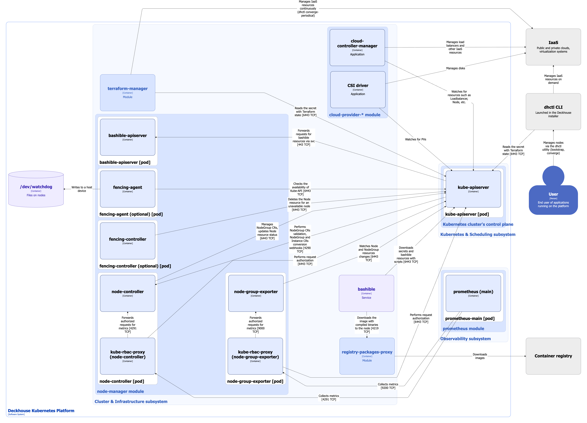

This page describes the architecture of the [`node-manager`](/modules/node-manager/) module for CloudPermanent nodes.

## Module architecture


The following simplifications are made in the diagram:

* The diagram shows containers in different pods interacting directly with each other. In reality, they communicate via the corresponding Kubernetes Services (internal load balancers). Service names are omitted if they are obvious from the diagram context. Otherwise, the Service name is shown above the arrow.
* Pods may run multiple replicas. However, each pod is shown as a single replica in the diagram.


The Level 2 C4 architecture of the [`node-manager`](/modules/node-manager/) module and its interactions with other Deckhouse Kubernetes Platform (DKP) components are shown in the following diagram:

## Module components


Bashible is a key component of the Cluster & Infrastructure subsystem that enables the operation of the `node-manager` module. However, it is not part of the module itself, as it runs at the OS level as a system service. For Bashible details, refer to the [corresponding documentation section](bashible.html).


The module managing CloudPermanent nodes consists of the following components:

1. **Bashible-api-server**: A [Kubernetes Extension API Server](https://kubernetes.io/docs/tasks/extend-kubernetes/setup-extension-api-server/) deployed on master nodes. It generates bashible scripts from templates stored in custom resources. When kube-apiserver receives a request for resources containing bashible bundles, it forwards the request to bashible-api-server and returns the generated result. For more details about bashible and bashible-api-server, refer to the [corresponding documentation section](bashible.html).

1. **Node-controller** (Deployment): A controller that manages [NodeGroup](/modules/node-manager/cr.html#nodegroup) custom resources lifecycle. Node-controller performs the following operations:

   * Manages [NodeGroup](/modules/node-manager/cr.html#nodegroup) custom resources lifecycle.
   * Implements [NodeGroup](/modules/node-manager/cr.html#nodegroup) custom resources validating webhooks using the [Validating Admission Controllers](https://kubernetes.io/docs/reference/access-authn-authz/admission-controllers/) mechanism.
   * Implements [NodeGroup](/modules/node-manager/cr.html#nodegroup) and [Instance](/modules/node-manager/cr.html#instance) custom resources conversion webhooks.
   * Cleans up Node resource labels and taints that remain after the [bashible](bashible.html) first run to initialize the node.
   * Ensures [draining a node](https://kubernetes.io/docs/tasks/administer-cluster/safely-drain-node/).
   * Applies labels, taints and annotations from the [`spec.nodeTemplate`](/modules/node-manager/cr.html#nodegroup-v1-spec-nodetemplate) section of a NodeGroup custom resource to all Node resources belonging to it.
   * Calculates and updates a NodeGroup custom resource `status` subresource based on aggregated information obtained from the corresponding Node resources and infrastructure custom resources.
   * Sets the `spec.providerId = "static://"` attribute for Static type Node resources if it is missing.
   * Manages the node update lifecycle: approving updates, handling node disruptions, [draining a node](https://kubernetes.io/docs/tasks/administer-cluster/safely-drain-node/) and cleanup after a successful update.

   The component includes:

   * **node-controller**: Main container.
   * **kube-rbac-proxy**: Sidecar container providing an RBAC-based authorization proxy for secure access to controller metrics.

1. **Node-group-exporter** (Deployment): A component that exports NodeGroup resource metrics in Prometheus format, containing information about the number of nodes in each node group: the total number, the number of nodes in the `Ready` status, the number of nodes in error, the minimum and maximum number of nodes in the group, etc.

   The component includes:

   * **node-group-exporter**: Main container.
   * **kube-rbac-proxy** Sidecar container providing an RBAC-based authorization proxy for secure access to exporter metrics.

1. **Fencing-agent** (DaemonSet) and **fencing-controller**: Components that implement the fencing mechanism. The operation principles of both components are described in detail in the [`spec.fencing.mode`](/modules/node-manager/cr.html#nodegroup-v1-spec-fencing-mode) parameter description of the NodeGroup resource. For details on how the fencing mechanism handles different node types, refer to [FAQ](/modules/node-manager/faq.html#how-the-fencing-mechanism-handles-different-node-types) in the `node-manager` module documentation.

## Module interactions

The module interacts with the following components:

1. **Kube-apiserver**:

   * Manages Node resources.
   * Authorizes metric requests.

1. Node filesystem:

   * `/dev/watchdog`: Sends signals to reset the Watchdog timer.

The following external components interact with the module:

1. **Kube-apiserver**:

   * Executes validating and conversion webhooks of node-controller.
   * Forwards requests for bashible resources to bashible-api-server.

1. **Prometheus-main**:

   * Collects metrics from `node-manager` module components.

## Architecture features specific to CloudPermanent nodes

1. Nodes are persistent and are created, managed, and deleted by the user. Node management is performed not directly in the infrastructure but via the **dhctl** utility executed as part of the DKP installer.
1. `Terraform-manager` is a [module](/modules/terraform-manager/) used for automated management of cloud infrastructure resources. It checks the Terraform state and applies non-destructive changes to infrastructure resources. The module architecture is described on the [corresponding documentation page](../infrastructure/terraform-manager.html).
1. **Csi-driver** is used to provision disks in the cloud infrastructure.
1. **Cloud-controller-manager** is used to provision load balancers and other infrastructure resources according to its specification.
1. **Infrastructure-provider** is not required. All node management operations are performed by the user via the **dhctl** utility and the `terraform-manager` module.
1. Automatic node scaling is not supported.
