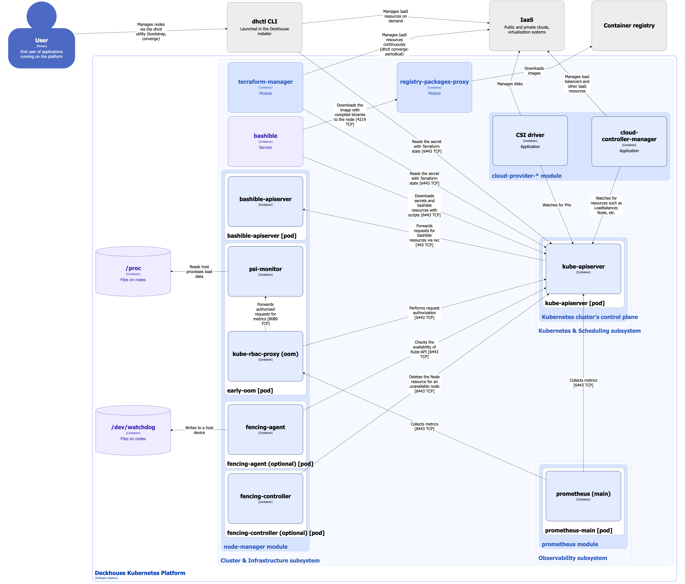

На данной странице описана архитектура модуля [node-manager](/modules/node-manager/) для CloudPermanent-узлов.

## Архитектура модуля


Для лучшего восприятия схемы на ней допущены следующие упрощения:

* На схеме выглядит так, что контейнеры подов взаимодействуют с контейнерами других подов напрямую. На самом деле они взаимодействуют через соответствующие им сервисы Kubernetes (внутренние балансировщики). Если взаимодействие происходит через специфичный сервис, в подписи над стрелкой указано название сервиса.
* Поды могут быть запущены несколькими репликами. На схеме все поды изображены в одной реплике.


Архитектура модуля [node-manager](/modules/node-manager/) на уровне 2 модели C4 и его взаимодействия с другими компонентами платформы изображены на следующей диаграмме:

<!--- Source: structurizr code from https://fox.flant.com/team/d8-system-design/doc/-/tree/main/architecture/diagrams/C4 --->

## Компоненты модуля


**Bashible** - ключевой компонент подсистемы **Cluster & Infrastructure**, на котором завязана работа модуля. Однако он не является компонентом модуля, так как работает на уровне ОС как системная служба. **Bashible** подробно описан в соответствующем [разделе документации](../bashible/)


Модуль, управляющий CloudPermanent-узлами, состоит из следующих компонентов:

1. **bashible-api-server** - [Kubernetes Extension APIServer](https://kubernetes.io/docs/tasks/extend-kubernetes/setup-extension-api-server/), который деплоится на Master-узлы. **bashible-api-server** генерирует bashible-скрипты из шаблонов, которые хранятся в Custom Resources. При обращении к **kube-apiserver** за ресурсами, содержащими бандлы **bashible**, **kube-apiserver** обращается к **bashible-api-server** и возвращает результат от него. Подробнее с работой **bashible** и **bashible-api-server** можно ознакомиться в соответствующем [разделе документации](bashible/).

2. **early-oom** (DaemonSet) - на каждом узле разворачивается под, который читает из каталога `/proc` метрики по загрузке ресурсов на хосте и в случае повышенной нагрузки уничтожает поды раньше, чем это сделает [kubelet](../kubernetes-and-scheduling/kubelet/). **early-oom** по умолчанию включен, но его можно отключить в [настройках модуля](/modules/node-manager/configuration.html#parameters-earlyoomenabled), если его работа создаёт проблемы в нормальной работе узлов. Включает в себя следующие контейнеры:

   * **psi-monitor** - основной контейнер, он следит за метрикой *PSI (Pressure Stall Information)*, которая показывает время, в течение которого процессы ожидают освобождения определённых ресурсов, таких как CPU, память или I/O.
   * **kube-rbac-proxy** - sidecar-контейнер с авторизирующим прокси на основе Kubernetes RBAC для организации защищенного доступа к метрикам **early-oom**.

3. **fencing-agent** (DaemonSet) - разворачивается на определенной группе узлов (NodeGroup) при включённой [настройке в спецификации Custom Resource NodeGroup](/modules/node-manager/cr.html#nodegroup-v1-spec-fencing). После запуска агент активирует Watchdog и устанавливает специальную метку `node-manager.deckhouse.io/fencing-enabled` на узле, где он функционирует. Агент регулярно проверяет доступность Kubernetes API. Если API доступен, агент отправляет сигнал в Watchdog, что сбрасывает сторожевой таймер. Также агент отслеживает специальные метки обслуживания на узле и, в зависимости от их наличия, включает или отключает Watchdog. В качестве Watchdog используется модуль ядра *softdog* с параметрами `soft_margin=60` и `soft_panic=1`. Это означает, что время таймаута сторожевого таймера составляет 60 секунд. По истечении этого времени происходит *kernel-panic*, и узел остается в этом состоянии до тех пор, пока пользователь не выполнит его перезагрузку. Состоит из одного контейнера:

   * **fencing-agent** - выполняет описанные выше проверки, сигнал в Watchdog отправляется посредством записи в файл `/dev/watchdog` на хосте.

4. **fencing-controller** - контроллер, который отслеживает все узлы с установленной меткой `node-manager.deckhouse.io/fencing-enabled`. Если какой-либо из узлов становится недоступным на протяжении более 60 секунд, контроллер удаляет все поды с этого узла и затем удаляет сам узел.

## Взаимодействия модуля

Модуль взаимодействует с:

1. **kube-apiserver**:

   * работа с ресурсами Node.
   * авторизация запросов на метрики.

2. Файлами на узлах:

   * `/proc` - читает метрики PSI для OOM Kill.
   * `/dev/watchdog` - отправляет сигнал в Watchdog для сброса сторожевого таймера.

С модулем взаимодействуют следующие внешние для него компоненты:

1. **kube-apiserver**:

   * Пересылает **bashible-api-server** запросы на ресурсы **bashible**.

2. **prometheus-main** - сбор метрик компонентов модуля **node-manager**.

## Особенности архитектуры, специфичные для CloudPermanent-узлов

1. Узлы постоянны. Они создаются, управляются и удаляются пользователем. Пользователь управляет узлами не напрямую в IaaS, а через утилиту **dhctl**, запущенную в инсталляторе Deckhouse.
2. **terraform-manager** - [модуль](/modules/terraform-manager/), который используется для автоматического управления ресурсами IaaS (проверяет состояние Terraform’а и применяет недеструктивные изменения к ресурсам IaaS). С архитектурой модуля **terraform-manager** можно ознакомиться на соответствующей [странице][../terraform-manager/]
3. **csi-driver** - используется для заказа дисков в облачном IaaS.
4. **cloud-controller-manager** - используется для заказа балансировщиков и прочих ресурсов IaaS согласно своей спецификации.
5. **infrastructure-provider** *не требуется*, вся работа с узлами осуществляется пользователем через утилиту **dhctl** и модуль **terraform-manager**
6. Автоматическое масштабирование узлов не поддерживается.
