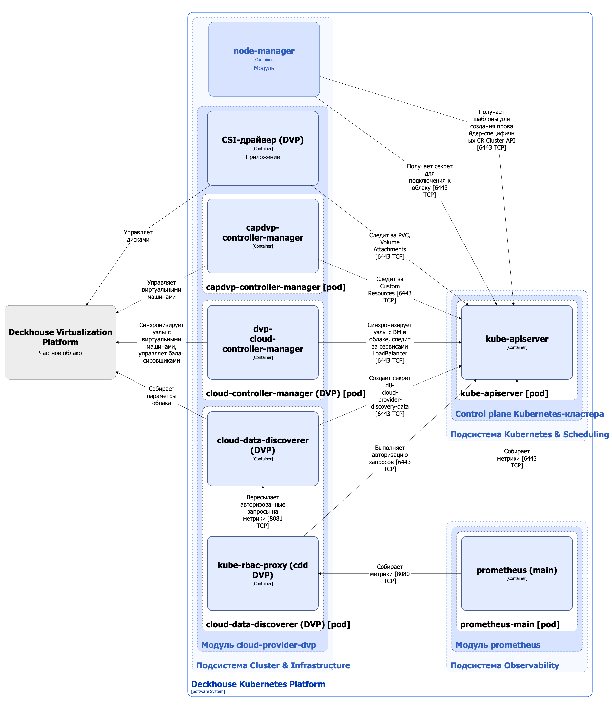

Модуль `cloud-provider-dvp` управляет взаимодействием с облачными ресурсами [Deckhouse Virtualization Platform (DVP)](/products/virtualization-platform/). Он позволяет модулю [`node-manager`](/modules/node-manager/) использовать ресурсы DVP при заказе узлов для описанной [группы узлов](/modules/node-manager/cr.html#nodegroup).

Подробнее с описанием модуля можно ознакомиться в [соответствующем разделе документации](/modules/cloud-provider-dvp/).

## Архитектура модуля


Для упрощения схемы приняты следующие допущения:

* На схеме показано, что контейнеры разных подов взаимодействуют друг с другом напрямую. Фактически они взаимодействуют через соответствующие сервисы Kubernetes (внутренние балансировщики). Названия сервисов не указываются, если они очевидны из контекста. В остальных случаях название сервиса указано над стрелкой.
* Поды могут быть запущены в нескольких репликах, однако на схеме все поды изображены в одной реплике.


Архитектура модуля [`cloud-provider-dvp`](/modules/cloud-provider-dvp/) на уровне 2 модели C4 и его взаимодействия с другими компонентами Deckhouse Kubernetes Platform (DKP) изображены на следующей диаграмме:

<!--- Source: structurizr code from https://fox.flant.com/team/d8-system-design/doc/-/tree/main/architecture/diagrams/C4_RU --->

## Компоненты модуля

Модуль состоит из следующих компонентов:

1. **Capdvp-controller-manager** — Kubernetes Cluster API Provider для DVP. [Cluster API](https://github.com/kubernetes-sigs/cluster-api) является расширением для Kubernetes, которое дает возможность управлять Kubernetes-кластерами как кастомными ресурсами внутри другого Kubernetes-кластера. Cluster API Provider позволяет для кластеров под управлением Cluster API заказывать виртуальные машины в инфраструктуре облачного провайдера, в данном случае DVP. **Capdvp-controller-manager** работает со следующими кастомными ресурсами:

   * DeckhouseCluster — описание кластера на базе DVP.
   * DeckhouseMachineTemplate — шаблон с описанием характеристик создаваемых машин в облаке.
   * DeckhouseMachine — описание характеристик созданной на основе DeckhouseMachineTemplate машины.

   Состоит из одного контейнера:

   * **capdvp-controller-manager**.

2. **Сloud-controller-manager** — реализация [Сloud сontroller manager](https://kubernetes.io/ru/docs/concepts/architecture/cloud-controller/) для DVP, обеспечивает взаимодействие с облаком DVP и выполняет следующие функции:

   * реализует связь 1:1 между объектом узла в Kubernetes (Node) и виртуальной машиной в облачном провайдере. Для этого:

     * заполняет поля `spec.providerID` и `nodeInfo` ресурса Node;
     * проверяет наличие виртуальной машины в облаке и при ее отсутствии удаляет ресурс Node в кластере.

   * при создании ресурса Service типа LoadBalancer в Kubernetes создаёт балансировщик в облаке, который направит трафик извне к узлам кластера.

   Подробнее о **Сloud-controller-manager** можно почитать в [документации Kubernetes](https://kubernetes.io/ru/docs/concepts/architecture/cloud-controller/)

   Состоит из одного контейнера:

   * **dvp-cloud-controller-manager**.

3. **Cloud-data-discoverer** — отвечает за сбор данных из API облачного провайдера и предоставление их в виде секрета `kube-system/d8-cloud-provider-discovery-data`. Этот секрет содержит параметры конкретного облака, которые используется другими компонентами модуля `cloud-provider-dvp`. Например, для DVP — это такие параметры, как список зон доступности, ресурсов StorageClass и т.д.

   Состоит из следующих контейнеров:

   * **cloud-data-discoverer** — основной контейнер;
   * **kube-rbac-proxy** — сайдкар-контейнер с авторизующим прокси на основе Kubernetes RBAC для организации защищенного доступа к метрикам контейнера **cloud-data-discoverer**.

4. **CSI-драйвер (DVP)** — реализация CSI-драйвера для DVP. С типовой архитектурой CSI-драйвера, используемого в модулях `cloud-provider-*` DKP, можно ознакомиться на [соответствующей странице документации](csi-driver.html). **CSI-драйвер (DVP)** не поддерживает работу со снимками, по этой причине в поде **Сsi-controller** отсутствует сайдкар-контейнер **snapshotter** ([external-snapshotter](https://github.com/kubernetes-csi/external-snapshotter)).

## Взаимодействия модуля

Модуль взаимодействует со следующими компонентами:

1. **Kube-apiserver**:

    * мониторинг ресурсов PersistentVolumeClaim, VolumeAttachment;
    * работа с кастомными ресурсами DeckhouseCluster, DeckhouseMachineTemplate, DeckhouseMachine;
    * создание секрета `kube-system/d8-cloud-provider-discovery-data`;
    * синхронизация узлов Kubernetes с виртуальными машинами в облаке;
    * мониторинг сервисов типа LoadBalancer;
    * авторизация запросов на получение метрик.

2. Облако DVP:

    * получает параметры облака;
    * управляет виртуальными машинами;
    * получает `ProviderID` и прочую информацию о виртуальных машинах, которые являются узлами кластера;
    * управляет балансировщиками;
    * управляет дисками.

С модулем взаимодействуют следующие внешние компоненты:

1. **Prometheus-main** — сбор метрик **Cloud-data-discoverer**.

Непрямые взаимодействия:

1. Модуль `cloud-provider-dvp` предоставляет [`node-manager`](/modules/node-manager/) следующие артефакты:

   * Шаблоны для создания провайдер-специфичных кастомных ресурсов Cluster API, которые будет использовать **cloud-provider-dvp** для создания виртуальных машин в облаке.
   * Секрет `kube-system/d8-node-manager-cloud-provider`, в котором содержатся все необходимые настройки для подключения к облаку и создания CloudEphemeral-узлов. Эти настройки прописываются в провайдер-специфичных кастомных ресурсах Cluster API, созданных на основе упомянутых выше шаблонов.

2. Модуль `cloud-provider-dvp` предоставляет составляющие Terraform/OpenTofu для DVP, которые используются при сборке исполняемого файла утилиты [dhctl](https://github.com/deckhouse/deckhouse/tree/main/dhctl) для компонентов модуля [`terraform-manager`](/modules/terraform-manager/), такие как:

   * terraform/OpenTofu-провайдер;
   * terraform-модули;
   * layouts - набор схем размещения в облаке: как создается базовая инфраструктура, как и с какими дополнительными характеристиками для данного размещения должны создаваться узлы. Например, для одной схемы узлы будут иметь публичные IP, а для другой нет. Каждый layout должен иметь 3 модуля:

     * `base-infrastructure` (базовая инфраструктура, например, создаются сети, но может быть и пустым);
     * `master-node`;
     * `static-node`.
