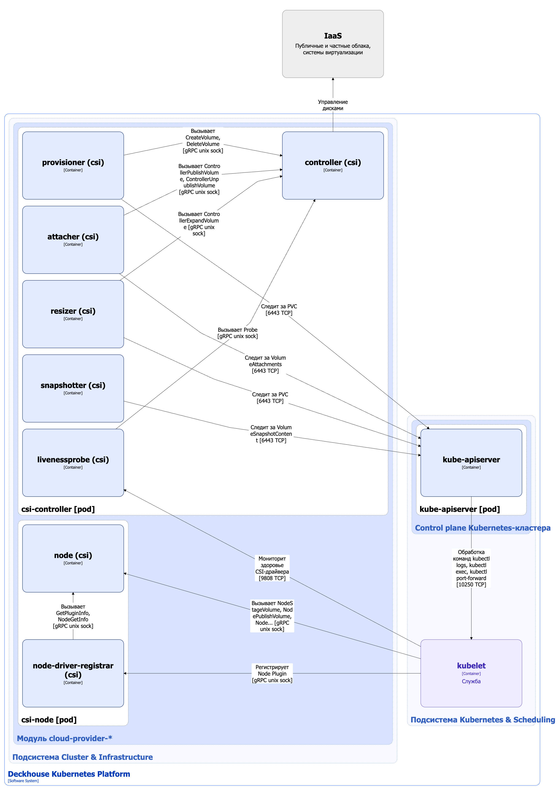

В платформе DKP для управления постоянными томами хранения используется CSI-драйвер (плагин).

[CSI (Container Storage Interface)](https://github.com/container-storage-interface/spec/blob/master/spec.md) — это стандартный интерфейс, который унифицирует доступ к хранилищам и упрощает интеграцию различных систем хранения в кластере. CSI-драйвер входит в состав модулей **cloud-provider-** DKP. Хотя для каждого поддерживаемого платформой облачного провайдера или системы хранения используется своя реализация спецификации CSI, архитектура CSI-драйвера у всех реализаций одинаковая. Реализации могут для некоторых модулей отличаться по составу Capabilities (возможностей) и компонентов. Далее будет описана используемая в DKP типовая архитектура CSI-драйвера, включающая все возможные компоненты и реализующая всю используемую в модулях DKP функциональность.

## Архитектура драйвера


Для лучшего восприятия схемы на ней допущены следующие упрощения:

* На схеме выглядит так, что контейнеры подов взаимодействуют с контейнерами других подов напрямую. На самом деле они взаимодействуют через соответствующие им сервисы Kubernetes (внутренние балансировщики). Если взаимодействие происходит через специфичный сервис, в подписи над стрелкой указано название сервиса.
* Поды могут быть запущены несколькими репликами. На схеме все поды изображены в одной реплике.


Типовая архитектура CSI-драйвера на уровне 2 модели C4 и его взаимодействия с другими компонентами платформы изображены на следующей диаграмме:

<!--- Source: structurizr code from https://fox.flant.com/team/d8-system-design/doc/-/tree/main/architecture/diagrams/C4 --->

## Компоненты драйвера

CSI-драйвер состоит из следующих компонентов:

1. **csi-controller** (Deployment) - **Controller Plugin**, отвечает за глобальные операции: создание/удаление томов, подключение/отключение к нодам, управление снимками. Например, в AWS это вызывает EC2 API для создания EBS. В свою очередь состоит из следующих контейнеров:

   * **controller** - собственно сам контроллер, реализует поддерживаемую в CSI-драйвере функциональность (capabilities) в виде gRPC-сервисов **Identity Service** и **Controller Service** согласно [спецификации CSI](https://github.com/container-storage-interface/spec/blob/master/spec.md#rpc-interface).

   * **Sidecar-контейнеры контроллера** - поддерживаемые сообществом Kubernetes **external controllers** (внешние контроллеры). Они необходимы, поскольку *persistent volume controller*, запущенный в **kube-controller-manager** (компонент [Control Plane Kubernetes-кластера](../../kubernetes-and-scheduling/control-plane/)), не имеет какого-либо интерфейса взаимодействия с CSI-драйверами. **external controllers** следят за ресурсами `PersistentVolumeClaim` и вызывают в **controller** функции CSI-драйвера, соответствующие выполняемыми над томами операциями, либо служебные функции, такие как получение информации о плагине и его capabilities, мониторинг здоровья CSI-драйвера (livenessprobe). **external controllers** взаимодействуют c **controller** по gRPC через Unix-сокеты. В **csi-controller** входят следующие **external controllers**:

      * **provisioner** - [external-provisioner](https://github.com/kubernetes-csi/external-provisioner), следит за ресурсами `PersistentVolumeClaim`, вызывает `CreateVolume`/`DeleteVolume` RPC. Также использует `ValidateVolumeCapabilities` RPC для проверки совместимости.
      * **attacher** - [external-attacher](https://github.com/kubernetes-csi/external-attacher), следит за `VolumeAttachment` ресурсами, после того, как под запланирован на ноду, подключает и отключает тома через `ControllerPublishVolume`/`ControllerUnpublishVolume` RPC.
      * **resizer** - [external-resizer](https://github.com/kubernetes-csi/external-resizer), следит за обновлениями ресурсов `PersistentVolumeClaim`, расширяет тома с помощью `ControllerExpandVolume` RPC, если пользователь запросил больше дискового пространства для PVC и если драйвер поддерживает capability EXPAND_VOLUME.
      * **snapshotter** - [external-snapshotter](https://github.com/kubernetes-csi/external-snapshotter), работает совместно с модулем [snapshot-controller](/modules/snapshot-controller/stable/), следит за ресурсами `VolumeSnapshotContent`, управляет снимками через `CreateSnapshot`, `DeleteSnapshot` и `ListSnapshots` RPC (если драйвер это поддерживает).
      * [livenessprobe](https://github.com/kubernetes-csi/livenessprobe) - осуществляет мониторинг здоровья через Probe RPC из Identity Service. Предоставляет HTTP-эндпойнт `/healthz`, за которым следит [Kubelet](../../kubernetes-and-scheduling/kubelet/). В случае непрохождения *livenessProbe* Kubelet перезапускает под **csi-controller**.

2. **csi-node** (DaemonSet) - **Node Plugin**, работает на всех узлах кластера. Монтирует/размонтирует тома локально. **Важно**: плагин работает на каждой ноде и имеет привилегированный доступ к файловой системе (на Linux требуется `CAP_SYS_ADMIN`). Это необходимо, чтобы выполнять монтирование и работать с блочными устройствами. В свою очередь состоит из следующих контейнеров:

   * **node** -  основной контейнер, реализует поддерживаемую в CSI-драйвере функциональность (capabilities) в виде gRPC-сервисов **Identity Service** и **Node Service** согласно [спецификации CSI](https://github.com/container-storage-interface/spec/blob/master/spec.md#rpc-interface).
   * **node-driver-registrar** - sidecar-контейнер, регистрирует **Node Plugin** в [Kubelet](../../kubernetes-and-scheduling/kubelet/). Вызывает в контейнере **node** `GetPluginInfo` и `NodeGetInfo` RPC, чтобы получить информацию о плагине и ноде. **node-driver-registrar** взаимодействуют c контейнером **node** по gRPC через Unix-сокет.


Некоторые sidecar-контейнеры из списка **external controllers**, например **snapshotter**, могут отсутствовать в Deployment определенных **cloud-provider-**, если данный функционал не поддерживается реализацией CSI-драйвера.


## Взаимодействия модуля

Модуль взаимодействует с:

1. **kube-apiserver** - мониторинг сущностей `PersistentVolumeClaim`, `VolumeAttachment`, `VolumeSnapshotContent`.
2. IaaS облака (системы виртуализации) - создание/удаление томов, подключение/отключение к нодам, управление снимками.  

С модулем взаимодействуют следующие внешние для него компоненты:

1. [Kubelet](../../kubernetes-and-scheduling/kubelet/):

   * проверка *livenessProbe* CSI-драйвера,
   * регистрация **Node Plugin**,
   * вызов `NodeStageVolume`, `NodeUnstageVolume`, `NodePublishVolume`, `NodeUnpublishVolume`, `NodeExpandVolume` RPC в **Node Plugin**.

   [Kubelet](../../kubernetes-and-scheduling/kubelet/) взаимодействует с **Node Plugin** по gRPC через Unix-сокет.
