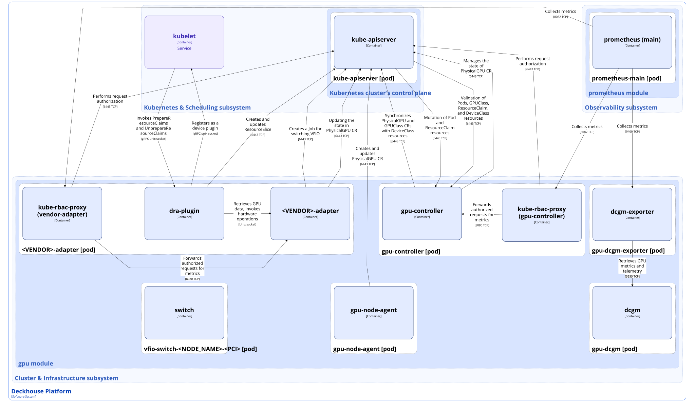
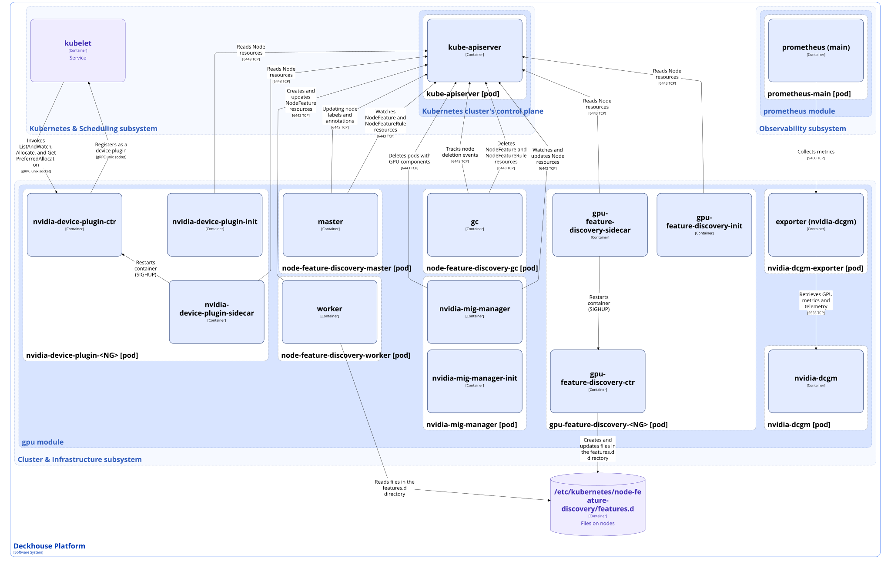

The [`gpu`](/modules/gpu/) module manages GPUs (Graphics Processing Units) in Deckhouse Kubernetes Platform (DKP).

The module operates in two mutually exclusive modes.
The mode is defined by the [dra.enabled](/modules/gpu/configuration.html#parameters-dra) parameter:

- [DRA (Dynamic Resource Allocation)](https://kubernetes.io/docs/concepts/scheduling-eviction/dynamic-resource-allocation/) mode: The module uses a Kubernetes mechanism for requesting and sharing devices that provides dynamic and declarative allocation of GPU compute resources.
- Device Plugin mode (default): The module uses the classic Kubernetes model for working with node compute resources and publishes `nvidia.com/gpu` or `nvidia.com/mig-*` resources, which kube-scheduler uses to schedule pods that consume these resources.

For more details, refer to the [corresponding documentation section](/modules/gpu/configuration.html).

The module architecture depends on the operating mode.

## DRA mode

In DRA mode, the module is built around a vendor-independent core and adapters for the NVIDIA and MetaX vendors.

The module works with the following resources:

- DeviceClass: A DRA resource that stores descriptions of device classes that can be used for dynamic resource assignment.
- [GPUClass](/modules/gpu/cr.html#gpuclass): A custom resource that stores requirements for a GPU group (memory size, hardware capabilities) and the usage and compatibility policy.
- [PhysicalGPU](/modules/gpu/cr.html#physicalgpu): A custom resource that stores a description of a physical GPU, including device characteristics.
- ResourceClaim: A DRA resource that contains a request to allocate a resource for a pod and describes the required characteristics and usage parameters.
- ResourceSlice: A DRA resource that represents an allocated share or part of a resource assigned within a ResourceClaim.

### Module architecture (DRA mode)


The following simplifications are made in the diagram:

* The diagram shows containers in different pods interacting directly with each other. In reality, they communicate via the corresponding Kubernetes Services (internal load balancers). Service names are omitted if they are obvious from the diagram context. Otherwise, the Service name is shown above the arrow.
* Pods may run multiple replicas. However, each pod is shown as a single replica in the diagram.


The Level 2 C4 architecture of the [`gpu`](/modules/gpu/) module in DRA mode and its interactions with other DKP components are shown in the following diagram:

### Module components (DRA mode)

The module consists of the following components:

1. **gpu-controller** (Deployment): A controller that processes GPU resource requests and runs admission webhooks for DRA objects through the [Validating/Mutating Admission Controllers](https://kubernetes.io/docs/reference/access-authn-authz/admission-controllers/) mechanism. The controller runs on master nodes.

   The gpu-controller performs the following actions:

   - Creates and updates DeviceClass DRA resources based on PhysicalGPU and GPUClass custom resources.
   - Validates and mutates Pod create and update requests, creating ResourceClaim resources when necessary.
   - Watches ResourceClaim resource changes and, based on this data, maintains the state and occupancy of PhysicalGPU resources.
   - Validates Pod, GPUClass, ResourceClaim, and DeviceClass resources.
   - Manages the PhysicalGPU state.

   It consists of the following containers:

   - **gpu-controller**: Main container.
   - **kube-rbac-proxy**: Sidecar container with an authorization proxy based on Kubernetes RBAC that provides secure access to the main container. This component is an [Open Source project](https://github.com/brancz/kube-rbac-proxy).

1. **gpu-node-agent** (DaemonSet): A component that consists of a single **gpu-node-agent** container and performs the following actions:

   - Scans the host `/sys` filesystem and the PCI ID database.
   - Matches devices against the `gpu-supported-vendors` ConfigMap.
   - Creates PhysicalGPU custom resources for each discovered card.
   - Sets the `gpu.deckhouse.io/vendor=<VENDOR>` labels on the Node resource.

   The component runs on all cluster nodes except the control plane.

1. **&lt;VENDOR&gt;-adapter** (DaemonSet): A component that works with hardware to prepare, allocate, and release GPU resources. Currently, two hardware vendors are supported: NVIDIA and MetaX.

   The component performs the following actions:

   - Registers in [kubelet](../../kubernetes-and-scheduling/kubelet.html) as a DRA kubelet plugin.
   - Prepares and releases allocated resources for pods through the PrepareResourceClaims and UnprepareResourceClaims operations.
   - Publishes the list of available devices through ResourceSlice resources.
   - Retrieves hardware capabilities.
   - Performs hardware partitioning and passthrough.
   - Enriches the status in PhysicalGPU resources.

   It consists of the following containers:

   - **dra-plugin**: Sidecar container that implements the DRA kubelet plugin and interacts with the vendor adapter.
   - **&lt;VENDOR&gt;-adapter**: Vendor-specific sidecar container that interacts with the hardware on the node.
   - **kube-rbac-proxy**: Sidecar container with an authorization proxy based on Kubernetes RBAC that provides secure access to the dra-plugin container.

   The component runs on all cluster nodes that have the `gpu.deckhouse.io/vendor=<VENDOR>` label.

1. **gpu-dcgm** (DaemonSet): A component that consists of a single **dcgm** container and runs [Data Center GPU Manager (DCGM)](https://github.com/nvidia/dcgm), which collects raw GPU telemetry (health, Error Correction Code (ECC), power, utilization). It works only with NVIDIA cards.

1. **gpu-dcgm-exporter** (DaemonSet): A component that consists of a single **dcgm-exporter** container, retrieves GPU metrics from the gpu-dcgm component, and exposes them in Prometheus format.

1. **vfio-switch-&lt;NODE_NAME&gt;-&lt;PCI&gt;** (Job): A component that consists of a single **switch** container and switches the driver in use between nvidia and vfio-pci. The component is created by nvidia-adapter to control the switching process.

### Module interactions (DRA mode)

The module interacts with the following components:

1. **Kube-apiserver**:

   - Authorizes requests to retrieve metrics.
   - Works with PhysicalGPU and GPUClass custom resources.
   - Updates Node resources.
   - Validates Pod, GPUClass, ResourceClaim, and DeviceClass resources.
   - Works with DeviceClass, ResourceClaim, and ResourceSlice resources.
   - Creates and monitors `vfio-switch-<NODE_NAME>-<PCI>` Jobs.

1. **Kubelet**: Registers the module as a DRA kubelet plugin.

The following external components interact with the module:

1. **Kubelet**: Calls the PrepareResourceClaims and UnprepareResourceClaims gRPC methods.

1. **Kube-apiserver**: Validates Pod, GPUClass, ResourceClaim, and DeviceClass resources.

1. **Prometheus-main**: Collects metrics from the gpu-dcgm and &lt;VENDOR&gt;-adapter components.

## Device Plugin mode

In Device Plugin mode, the module consists of components that work only with NVIDIA adapters.

The module interacts with the following resources:

- NodeFeature: Stores actual information about the hardware capabilities of a specific node.
- NodeFeatureRule: Stores a set of rules used by the module to configure labels, annotations, and taints for a cluster node.

### Module architecture (Device Plugin mode)

The Level 2 C4 architecture of the [`gpu`](/modules/gpu/) module in Device Plugin mode and its interactions with other DKP components are shown in the following diagram:

### Module components (Device Plugin mode)

The module consists of the following components:

1. **node-feature-discovery-master** (Deployment): A component that consists of a single **master** container, collects node hardware capabilities from NodeFeature resources, and publishes them as `feature.node.kubernetes.io/*` and `nvidia.com/*` labels on the corresponding nodes. The master obtains the rules for assigning labels, taints, and annotations from NodeFeatureRule resources.

1. **node-feature-discovery-worker** (DaemonSet): A component that consists of a single **worker** container, runs on each GPU node, discovers PCI/USB devices on the node, and publishes them as NodeFeature resources. The component also publishes information received from the gpu-feature-discovery-&lt;NG&gt; component as NodeFeature resources.

1. **node-feature-discovery-gc** (Deployment): A component that consists of a single **gc** container and deletes obsolete NodeFeature resources when a node is deleted.

1. **gpu-feature-discovery-&lt;NG&gt;** (DaemonSet): A component that queries the GPU driver via the NVIDIA Management Library (NVML) and writes GPU hardware capabilities to the `/etc/kubernetes/node-feature-discovery/features.d/gfd` file. Node-feature-discovery-worker publishes them as NodeFeature resources, from which node-feature-discovery-master updates the corresponding `nvidia.com/*` labels for cluster nodes.

   The component is created by the Deckhouse controller of the [`deckhouse`](/modules/deckhouse/) module for every NodeGroup (NG) whose configuration specifies the [`.spec.gpu`](/modules/node-manager/cr.html#nodegroup-v1-spec-gpu) parameter.

   It consists of the following containers:

   - **gpu-feature-discovery-init**: Init container that prepares the configuration for the main gpu-feature-discovery-ctr container.
   - **gpu-feature-discovery-ctr**: Main container.
   - **gpu-feature-discovery-sidecar**: Sidecar container that watches configuration changes and restarts the main container to apply them.

1. **nvidia-device-plugin-&lt;NG&gt;** (DaemonSet): A component that registers with kubelet through the [Kubernetes Device Plugin API](https://kubernetes.io/docs/concepts/extend-kubernetes/compute-storage-net/device-plugins/) and publishes GPU resources for kube-scheduler.

   To work with resources, kubelet calls the ListAndWatch, Allocate, and GetPreferredAllocation gRPC methods on nvidia-device-plugin-ctr. After that, the component updates the number of available resources on the node and returns this information through kubelet.

   It consists of the following containers:

   - **nvidia-device-plugin-init**: Init container that prepares the configuration for the main nvidia-device-plugin-ctr container.
   - **nvidia-device-plugin-ctr**: Main container.
   - **nvidia-device-plugin-sidecar**: Sidecar container that watches configuration changes and restarts the main container to apply them.

1. **nvidia-mig-manager** (DaemonSet): An optional component that manages changes to the [Multi-Instance GPU (MIG)](https://www.nvidia.com/en-us/technologies/multi-instance-gpu/) profile on nodes with A100/H100.

   The component performs the following actions:

   - Retrieves the desired MIG profile (the `nvidia.com/mig.config` label) and the current state.
   - Puts the node into maintenance mode when necessary (applies a taint, cordon, and drain).
   - Stops pods that use GPUs on the node.
   - Applies the MIG profile.
   - Initiates a node reboot when necessary.
   - Returns the node to service.

   It consists of the following containers:

   - **nvidia-mig-manager-init**: Init container that prepares executables and libraries.
   - **nvidia-mig-manager**: Main container.

1. **nvidia-dcgm** (DaemonSet): A component that consists of a single **nvidia-dcgm** container and runs [Data Center GPU Manager (DCGM)](https://github.com/nvidia/dcgm). DCGM collects raw GPU telemetry (health, Error Correction Code (ECC), power, utilization).

1. **nvidia-dcgm-exporter** (DaemonSet): A component that consists of a single **exporter** container, retrieves GPU metrics from the nvidia-dcgm component, and exposes them in Prometheus format.

### Module interactions (Device Plugin mode)

The module interacts with the following components:

1. **Kube-apiserver**:

   - Authorizes requests to retrieve metrics.
   - Works with NodeFeature and NodeFeatureRule resources.
   - Watches and updates Node resources.
   - Terminates pods that use GPU resources when the MIG profile changes.

1. **Kubelet**: Registers the module through the Device Plugin API.

The following external components interact with the module:

1. **Kubelet**: Calls the ListAndWatch, Allocate, and GetPreferredAllocation gRPC methods.

1. **Prometheus-main**: Collects metrics from nvidia-dcgm.
