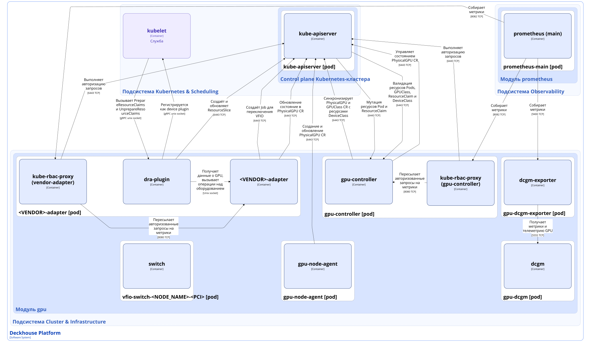
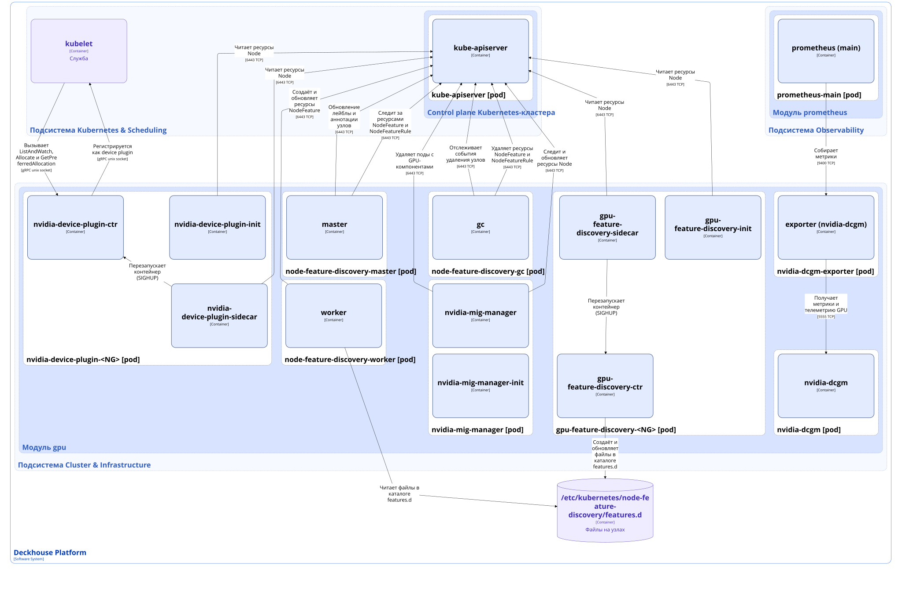

Модуль [`gpu`](/modules/gpu/) обеспечивает управление GPU (Graphics Processing Unit) в Deckhouse Kubernetes Platform (DKP).

Модуль работает в двух взаимоисключающих режимах, выбор задаётся параметром [dra.enabled](/modules/gpu/configuration.html#parameters-dra):

- режим [DRA (Dynamic Resource Allocation)](https://kubernetes.io/docs/concepts/scheduling-eviction/dynamic-resource-allocation/) — механизм Kubernetes для запроса и совместного использования устройств, который обеспечивает динамическое и декларативное выделение вычислительных ресурсов GPU;
- режим Device Plugin (по умолчанию) — классическая модель работы с вычислительными ресурсами узла в Kubernetes. В этом режиме модуль публикует ресурсы `nvidia.com/gpu` или `nvidia.com/mig-*`, которые использует kube-scheduler для планирования размещения подов, использующих эти ресурсы.

Подробнее с описанием модуля можно ознакомиться [в соответствующем разделе документации](/modules/gpu/configuration.html).

Архитектура модуля зависит от режима работы.

## Режим DRA

В режиме DRA модуль построен вокруг не зависящего от вендора ядра и адаптеров для вендоров NVIDIA и MetaX.

Модуль работает со следующими ресурсами:

- DeviceClass — DRA-ресурс, хранящий описание классов устройств, которые могут быть использованы для динамического назначения ресурсов;
- [GPUClass](/modules/gpu/cr.html#gpuclass) — кастомный ресурс, который хранит требования к группе GPU (объём памяти, аппаратные возможности) и политику их использования и совместимости;
- [PhysicalGPU](/modules/gpu/cr.html#physicalgpu) — кастомный ресурс, который хранит описание физического GPU, включая характеристики устройства;
- ResourceClaim — DRA-ресурс, который содержит запрос на выделение ресурса для пода и описывает требуемые характеристики и параметры использования;
- ResourceSlice — DRA-ресурс, представляющий выделенную долю или часть ресурса, которая назначается в рамках ResourceClaim.

### Архитектура модуля (в режиме DRA)


Для упрощения схемы приняты следующие допущения:

* На схеме показано, что контейнеры разных подов взаимодействуют друг с другом напрямую. Фактически они взаимодействуют через соответствующие сервисы Kubernetes (внутренние балансировщики). Названия сервисов не указываются, если они очевидны из контекста. В остальных случаях название сервиса указано над стрелкой.
* Поды могут быть запущены в нескольких репликах, однако на схеме все поды изображены в одной реплике.


Архитектура модуля [`gpu`](/modules/gpu/) в режиме DRA на уровне 2 модели C4 и его взаимодействия с другими компонентами DKP изображены на следующей диаграмме:

### Компоненты модуля (в режиме DRA)

Модуль состоит из следующих компонентов:

1. **gpu-controller** (Deployment) — контроллер, который реализует обработку запросов на GPU-ресурсы и выполняет admission-вебхуки для DRA-объектов. Контроллер работает на master-узлах.

   Контроллер gpu-controller выполняет следующие действия:

   - создаёт и обновляет DRA-ресурсы DeviceClass на основе кастомных ресурсов PhysicalGPU и GPUClass;
   - выполняет валидацию и мутацию запросов на создание и обновление Pod, создавая при необходимости ресурсы ResourceClaim;
   - отслеживает изменения ресурсов ResourceClaim и на основе этих данных поддерживает состояние и занятость ресурсов PhysicalGPU;
   - валидирует ресурсы Pod, GPUClass, ResourceClaim и DeviceClass;
   - управляет состоянием PhysicalGPU.

   Состоит из следующих контейнеров:

   - **gpu-controller** — основной контейнер;
   - **kube-rbac-proxy** — сайдкар-контейнер с авторизующим прокси на основе Kubernetes RBAC для организации защищённого доступа к основному контейнеру. Является [Open Source-проектом](https://github.com/brancz/kube-rbac-proxy).

1. **gpu-node-agent** (DaemonSet) — компонент, состоящий из одного контейнера **gpu-node-agent**, выполняет следующие действия:

   - сканирует`/sys` хоста и базы PCI ID;
   - сопоставляет устройства с ConfigMap `gpu-supported-vendors`;
   - создаёт кастомных ресурсов PhysicalGPU для каждой обнаруженной карты;
   - устанавливает лейблы `gpu.deckhouse.io/vendor=<VENDOR>` на ресурс Node.

   Компонент работает на всех узлах кластера, исключая узлы control plane.

1. **&lt;VENDOR&gt;-adapter** (DaemonSet) — компонент, обеспечивающий работу с оборудованием по подготовке, выделению и освобождению ресурсов GPU. На данный момент поддерживается два поставщика оборудования: NVIDIA, MetaX.

   Компонент выполняет следующие действия:

   - регистрируется в [kubelet](../../kubernetes-and-scheduling/kubelet.html) как DRA kubelet plugin;
   - подготавливает и освобождает выделенные ресурсы для подов через операции PrepareResourceClaims и UnprepareResourceClaims;
   - публикует список доступных устройств через ресурсы ResourceSlice;
   - получает аппаратные возможности оборудования;
   - выполняет партиционирование и проброс оборудования;
   - обогащает статус в ресурсах PhysicalGPU.

   Состоит из следующих контейнеров:

   - **dra-plugin** — сайдкар-контейнер, реализующий DRA kubelet plugin и обеспечивающий взаимодействие с адаптером вендора;
   - **&lt;VENDOR&gt;-adapter** — сайдкар-контейнер, зависящий от вендора и выполняющий взаимодействие с оборудованием на узле;
   - **kube-rbac-proxy** — сайдкар-контейнер с авторизующим прокси на основе Kubernetes RBAC для организации защищённого доступа к контейнеру dra-plugin.

   Компонент запускается на всех узлах кластера, у которых есть лейбл `gpu.deckhouse.io/vendor=<VENDOR>`.

1. **gpu-dcgm** (DaemonSet) — компонент, состоящий из одного контейнера **dcgm**, запускает [Data Center GPU Manager (DCGM)](https://github.com/nvidia/dcgm), который собирает сырую телеметрию GPU (здоровье, Error Correction Code (ECC), мощность, утилизация). Работает только с картами NVIDIA.

1. **gpu-dcgm-exporter** (DaemonSet) — компонент, состоящий из одного контейнера **dcgm-exporter**, получает метрики GPU из компонента gpu-dcgm и отдаёт их в Prometheus-формате.

1. **vfio-switch-&lt;NODE_NAME&gt;-&lt;PCI&gt;** (Job) — компонент, состоящий из одного контейнера **switch**, выполняет переключение используемого драйвера с nvidia на vfio-pci и наоборот. Компонент создаётся nvidia-adapter для контроля процесса переключения.

### Взаимодействия модуля (в режиме DRA)

Модуль взаимодействует со следующими компонентами:

1. **Kube-apiserver**:

   - авторизация запросов на получение метрик;
   - работа с кастомными ресурсами PhysicalGPU и GPUClass;
   - обновление ресурсов Node;
   - работа с ресурсами DeviceClass и ResourceClaim.

1. **Kubelet** — регистрация в kubelet как DRA kubelet plugin.

С модулем взаимодействуют следующие внешние компоненты:

1. **Kubelet** — вызов gRPC-методов PrepareResourceClaims и UnprepareResourceClaims.

1. **Prometheus-main** — сбор метрик с компонентов gpu-dcgm и &lt;VENDOR&gt;-adapter.

## Режим Device Plugin

В режиме Device Plugin модуль работает со следующими ресурсами:

- NodeFeature — хранит фактическая информация об аппаратных возможностях конкретного узла;
- NodeFeatureRule — хранит набор правил, на основе которого модуль настраивает лейблы, аннотации и тейнты для узла кластера.

### Архитектура модуля (в режиме Device Plugin)

Архитектура модуля [`gpu`](/modules/gpu/) в режиме Device Plugin на уровне 2 модели C4 и его взаимодействия с другими компонентами DKP изображены на следующей диаграмме:

### Компоненты модуля (в режиме Device Plugin)

Модуль состоит из следующих компонентов:

1. **node-feature-discovery-master** (Deployment) — компонент, состоящий из одного контейнера **master**, собирает аппаратные возможности узлов из ресурсов NodeFeature и публикует их как лейблы `feature.node.kubernetes.io/*` и `nvidia.com/*` соответствующих узлов. Правила назначения лейблов, тейнтов и аннотаций master получает из ресурсов NodeFeatureRule.

1. **node-feature-discovery-worker** (DaemonSet) — компонент, состоящий из одного контейнера **worker** и запускающийся на каждом GPU-узле, выполняет обнаружение PCI/USB-устройств на узле и публикует их в виде ресурсов NodeFeature. Также компонент публикует в виде ресурсов NodeFeature информацию, полученную от компонента gpu-feature-discovery-&lt;NG&gt;.

1. **node-feature-discovery-gc** (Deployment) — компонент, состоящий из одного контейнера **gc**, выполняет удаление устаревших ресурсов NodeFeature в случае удаления узла.

1. **gpu-feature-discovery-&lt;NG&gt;** (DaemonSet) — компонент опрашивает GPU-драйвер через NVIDIA Management Library (NVML) и публикует аппаратные возможности GPU в виде файла `/etc/kubernetes/node-feature-discovery/features.d/gfd`. Node-feature-discovery-worker публикует их как ресурсы NodeFeature, из которых node-feature-discovery-master обновляет соответствующие лейблы `nvidia.com/*` для узлов кластера.

   Состоит из следующих контейнеров:

   - **gpu-feature-discovery-init** — init-контейнер, подготавливающий конфигурацию для основного контейнера gpu-feature-discovery-ctr;
   - **gpu-feature-discovery-ctr** — основной контейнер;
   - **gpu-feature-discovery-sidecar** — сайдкар-контейнер, который отслеживает изменения в конфигурации и перезапускает основной контейнер для применения изменений.

1. **nvidia-device-plugin-&lt;NG&gt;** (DaemonSet) — компонент регистрируется в kubelet через [Kubernetes Device Plugin API](https://kubernetes.io/docs/concepts/extend-kubernetes/compute-storage-net/device-plugins/) и публикует GPU-ресурсы для kube-scheduler.

   Для работы с ресурсами kubelet вызывает gRPC-методы ListAndWatch, Allocate и GetPreferredAllocation в nvidia-device-plugin-ctr. После чего компонент обновляет количество доступных ресурсов на узле и отдаёт эту информацию через kubelet.

   Состоит из следующих контейнеров:

   - **nvidia-device-plugin-init** — init-контейнер, подготавливающий конфигурацию для основного контейнера nvidia-device-plugin-ctr;
   - **nvidia-device-plugin-ctr** — основной контейнер;
   - **nvidia-device-plugin-sidecar** — сайдкар-контейнер, который отслеживает изменения в конфигурации и перезапускает основной контейнер для применения изменений.

1. **nvidia-mig-manager** (DaemonSet) — компонент управляет процессом изменения профиля [Multi-Instance GPU (MIG)](https://www.nvidia.com/en-us/technologies/multi-instance-gpu/) на узлах с A100/H100.

   Компонент выполняет следующие действия:

   - получает желаемый MIG-профиль (лейбл `nvidia.com/mig.config`) и текущее состояние;
   - переводит узел в режим обслуживания (выставляет taint/cordon/drain) при необходимости;
   - останавливает поды, использующие GPU на узле;
   - применяет MIG-профиль;
   - инициирует перезагрузку узла при необходимости;
   - возвращает узел в работу.

   Состоит из следующих контейнеров:

   - **nvidia-mig-manager-init** — init-контейнер, подготавливающий исполняемые файлы и библиотеки;
   - **nvidia-mig-manager** — основной контейнер.

1. **nvidia-dcgm** (DaemonSet) — компонент, состоящий из одного контейнера **nvidia-dcgm**, запускает [Data Center GPU Manager (DCGM)](https://github.com/nvidia/dcgm), который собирает сырую телеметрию GPU (здоровье, Error Correction Code (ECC), мощность, утилизация).

1. **nvidia-dcgm-exporter** (DaemonSet) — компонент, состоящий из одного контейнера **exporter**, получает метрики GPU из компонента nvidia-dcgm и отдаёт их в Prometheus-формате.

### Взаимодействия модуля (в режиме Device Plugin)

Модуль взаимодействует со следующими компонентами:

1. **Kube-apiserver**:

   - авторизация запросов на получение метрик;
   - работа с ресурсами NodeFeature и NodeFeatureRule;
   - обновление ресурсов Node;
   - завершение подов, использующих GPU-ресурсы при изменении MIG-профиля.

1. **Kubelet** — регистрация через Device Plugin API.

С модулем взаимодействуют следующие внешние компоненты:

1. **Kubelet** — вызов gRPC-методов ListAndWatch, Allocate и GetPreferredAllocation.

1. **Prometheus-main** — сбор метрик nvidia-dcgm.
