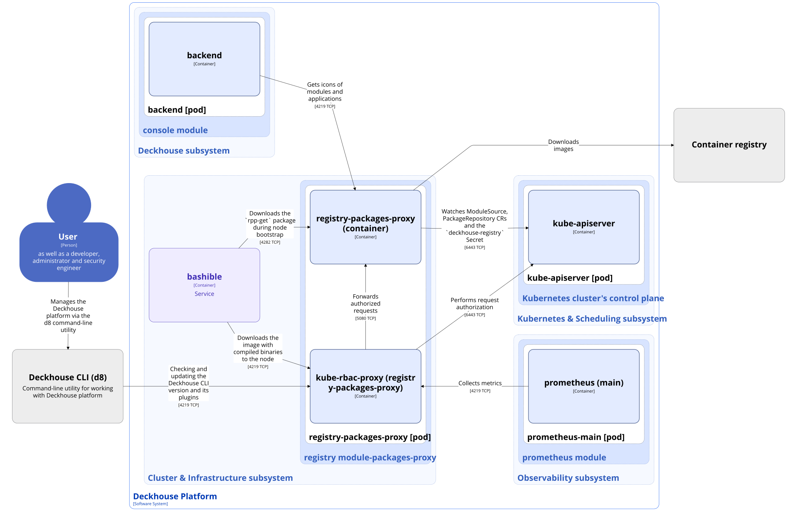

The [`registry-packages-proxy`](/modules/registry-packages-proxy/) module provides an in-cluster HTTP proxy service for accessing
packages from container registries in the Deckhouse Kubernetes Platform (DKP).
It acts as an intermediary between cluster components and external or internal registries,
offering caching capabilities to optimize bandwidth usage and improve package retrieval performance.

This module is a critical infrastructure component that runs on master nodes and is used during cluster bootstrap,
as well as during cluster operation, to fetch packages from container registries.

The module deploys a highly-available proxy service that:

- Runs on master nodes with `hostNetwork` enabled to ensure availability during bootstrap when CNI is not yet available.
- Exposes a separate HTTP endpoint on port `4282` for downloading `rpp-get` during node bootstrap. Requests to this port do not go through TLS or kube-rbac-proxy, unlike the main proxy on port `4219`.
- Listens on port `4219` (HTTPS) on each master node's IP address.
- Provides a `GET /package` endpoint for retrieving registry packages by digest.
- Implements local caching of retrieved packages (up to 1 GB) to reduce network traffic and improve performance.
- Watches the `deckhouse-registry` Secret in the `d8-system` namespace to obtain credentials for the main registry.
- Watches [ModuleSource](../../../reference/api/cr.html#modulesource) and [PackageRepository](../../../reference/api/cr.html#packagerepository) custom resources to obtain registry credentials.
- Uses RBAC-based authorization to secure access to the proxy and metrics endpoints.
- Exposes a public HTTPS API (via Ingress) for Deckhouse CLI binaries and plugins.
- Exposes an in-cluster HTTPS API for package icons (no public Ingress).

For more information about the module, see the [module overview section](/modules/registry-packages-proxy/).

## Module architecture


The following simplifications are made in the diagram:

* The diagram shows containers in different pods interacting directly with each other. In reality, they communicate via the corresponding Kubernetes Services (internal load balancers). Service names are omitted if they are obvious from the diagram context. Otherwise, the Service name is shown above the arrow.
* Pods may run multiple replicas. However, each pod is shown as a single replica in the diagram.


The Level 2 C4 architecture of the [`registry-packages-proxy`](/modules/registry-packages-proxy/) module and its interactions with other DKP components are shown in the following diagram:

## Module components

The `registry-packages-proxy` module consists of a single **registry-packages-proxy** component that includes the following containers:

- **registry-packages-proxy**: Main container.
- **kube-rbac-proxy**: Sidecar container with a Kubernetes RBAC-based authorization proxy that provides secure access to the endpoints of the registry-packages-proxy main container. This component is an [Open Source project](https://github.com/brancz/kube-rbac-proxy).

## Module interactions

The module interacts with the following components:

1. **Kube-apiserver**:

   - Reading and watching ModuleSource and PackageRepository custom resources.
   - Watching the `deckhouse-registry` Secret.
   - Authorizing requests to access the endpoints of the main container.

1. **Container registry**: Downloads container images from container registries.

The following external components interact with the module:

1. **bashible**: Downloads the image with assembled binaries to nodes during cluster bootstrap.

1. **prometheus-main**: Collects metrics from the registry-packages-proxy container.
