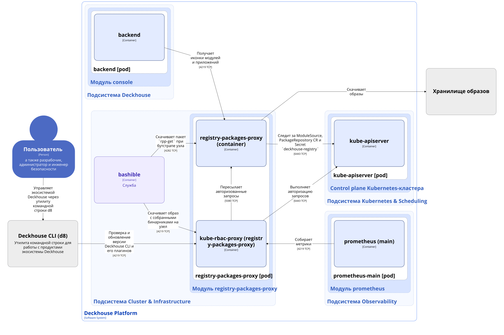

Модуль [`registry-packages-proxy`](/modules/registry-packages-proxy/) предоставляет сервис HTTP-прокси внутри кластера
Deckhouse Kubernetes Platform (DKP) для доступа к пакетам из хранилищ образов контейнеров.
Он выступает в качестве посредника между компонентами кластера и внешними или внутренними хранилищами образов
контейнеров с функциями кеширования для оптимизации использования пропускной способности сети и повышения
производительности при загрузке пакетов.

Модуль является критически важным компонентом инфраструктуры, который работает на master-узлах и используется
во время бутстрапа кластера, а также в процессе работы кластера для извлечения пакетов из хранилищ образов
контейнеров.

Модуль развёртывает высокодоступный прокси-сервис, который:

- работает на master-узлах с включённым `hostNetwork` для обеспечения доступности во время бутстрапа, когда CNI ещё недоступен;
- предоставляет на порту `4282` отдельный HTTP-эндпоинт только для скачивания `rpp-get` при бутстрапе узлов, при этом запросы на этот порт не проходят через TLS и kube-rbac-proxy, в отличие от основного прокси на `4219`;
- прослушивает порт `4219` (HTTPS) на IP-адресе каждого master-узла;
- предоставляет эндпоинт `GET /package` для извлечения пакетов из хранилища образов контейнеров по дайджесту;
- реализует локальное кеширование извлечённых пакетов (до 1 ГБ) для снижения сетевого трафика и улучшения производительности;
- следит за ресурсом Secret `deckhouse-registry` в неймспейсе `d8-system` для получения учётных данных основного хранилища образов;
- следит за кастомными ресурсами [ModuleSource](../../../reference/api/cr.html#modulesource) и [PackageRepository](../../../reference/api/cr.html#packagerepository) для получения учётных данных хранилищ образов контейнеров;
- использует RBAC-авторизацию для защиты доступа к прокси и эндпоинтам метрик;
- предоставляет публичный HTTPS API (через Ingress) для исполняемых файлов и плагинов Deckhouse CLI;
- предоставляет внутрикластерный HTTPS API для иконок пакетов (без публикации через Ingress).

Подробнее с работой модуля можно ознакомиться в [разделе описания модуля](/modules/registry-packages-proxy/).

## Архитектура модуля

Ниже приведена диаграмма архитектуры модуля на уровне 2 модели C4 и его взаимодействий с другими компонентами DKP.


Для упрощения схемы приняты следующие допущения:

* На схеме показано, что контейнеры разных подов взаимодействуют друг с другом напрямую. Фактически они взаимодействуют через соответствующие сервисы Kubernetes (внутренние балансировщики). Названия сервисов не указываются, если они очевидны из контекста. В остальных случаях название сервиса указано над стрелкой.
* Поды могут быть запущены в нескольких репликах, однако на схеме все поды изображены в одной реплике.


## Компоненты модуля

Модуль `registry-packages-proxy` состоит из одного компонента **registry-packages-proxy**, включающего следующие контейнеры:

- **registry-packages-proxy** — основной контейнер;
- **kube-rbac-proxy** — сайдкар-контейнер с авторизующим прокси на основе Kubernetes RBAC для организации защищённого доступа к эндпоинтам основного контейнера registry-packages-proxy. Является [Open Source-проектом](https://github.com/brancz/kube-rbac-proxy).

## Взаимодействия модуля

Модуль взаимодействует со следующими компонентами:

1. **Kube-apiserver**:

   - Чтение и отслеживание кастомных ресурсов ModuleSource и PackageRepository.
   - Отслеживание Secret `deckhouse-registry`.
   - Авторизация запросов на доступ к эндпоинтам основного контейнера.

1. **Хранилище образов** — скачивание образов контейнеров.

С модулем взаимодействуют следующие внешние компоненты:

1. **bashible** — скачивание образа с собранными исполняемыми файлами на узлы при бутстрапе кластера.

1. **prometheus-main** — сбор метрик контейнера registry-packages-proxy.
