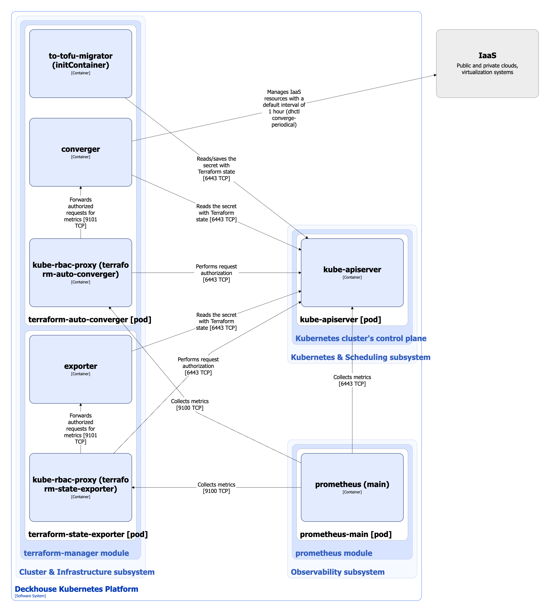

Модуль предоставляет инструменты для работы с состоянием Terraform’а в кластере Kubernetes.
Подробнее с настройками модуля можно ознакомиться в соответствующем [разделе документации](/modules/terraform-manager/).

## Архитектура модуля


Для лучшего восприятия схемы на ней допущены следующие упрощения:

* На схеме выглядит так, что контейнеры подов взаимодействуют с контейнерами других подов напрямую. На самом деле они взаимодействуют через соответствующие им сервисы Kubernetes (внутренние балансировщики). Если взаимодействие происходит через специфичный сервис, в подписи над стрелкой указано название сервиса.
* Поды могут быть запущены несколькими репликами. На схеме все поды изображены в одной реплике.


Архитектура модуля [terraform-manager](/modules/terraform-manager/) на уровне 2 модели C4 и его взаимодействия с другими компонентами платформы изображены на следующей диаграмме:

<!--- Source: structurizr code from https://fox.flant.com/team/d8-system-design/doc/-/tree/main/architecture/diagrams/C4 --->

## Компоненты модуля

Модуль состоит из следующих компонентов:

1. **terraform-auto-converger** - периодически (раз в час по-умолчанию) проверяет состояние Terraform’а и применяет недеструктивные изменения к ресурсам IaaS. **terraform-auto-converger** работает только с базовой инфраструктурой кластера, узлы кластера автоматически к требуемому состоянию не приводятся. Периодичность проверки задается [настройкой модуля](/modules/terraform-manager/configuration.html#parameters-autoconvergerperiod). В свою очередь состоит из следующих контейнеров:

   * **to-tofu-migrator** - init-контейнер для миграции состояния Terraform в OpenTofu. В контейнере запускается утилита [dhctl](https://github.com/deckhouse/deckhouse/tree/main/dhctl) с командой `converge-migration`.
   * **converger** -  основной контейнер, в котором запускается утилита [dhctl](https://github.com/deckhouse/deckhouse/tree/main/dhctl) с командой `converge-periodical`.
   * **kube-rbac-proxy** - sidecar-контейнер с авторизирующим прокси на основе Kubernetes RBAC для организации защищенного доступа к метрикам контейнера **converger**. [Open-source проект](https://github.com/brancz/kube-rbac-proxy).

2. **terraform-state-exporter** - проверяет состояние Terraform’а и экспортирует связанные с ним метрики. В свою очередь состоит из следующих контейнеров:

   * **exporter** -  основной контейнер, в котором запускается утилита [dhctl](https://github.com/deckhouse/deckhouse/tree/main/dhctl) с командой `terraform converge-exporter`.
   * **kube-rbac-proxy** - sidecar-контейнер с авторизирующим прокси на основе Kubernetes RBAC для организации защищенного доступа к метрикам контейнера **exporter**.

## Взаимодействия модуля

Модуль взаимодействует с:

1. **kube-apiserver**:

   * чтение и запись секрета с состоянием Terraform'а,
   * авторизация запросов на получение метрик.

2. IaaS облака (системы виртуализации) - управляет его базовыми ресурсами (приводит к желаемому состоянию).

С модулем взаимодействуют следующие внешние для него компоненты:

1. **prometheus-main** - сбор метрик **terraform-auto-converger** и **terraform-state-exporter**.
