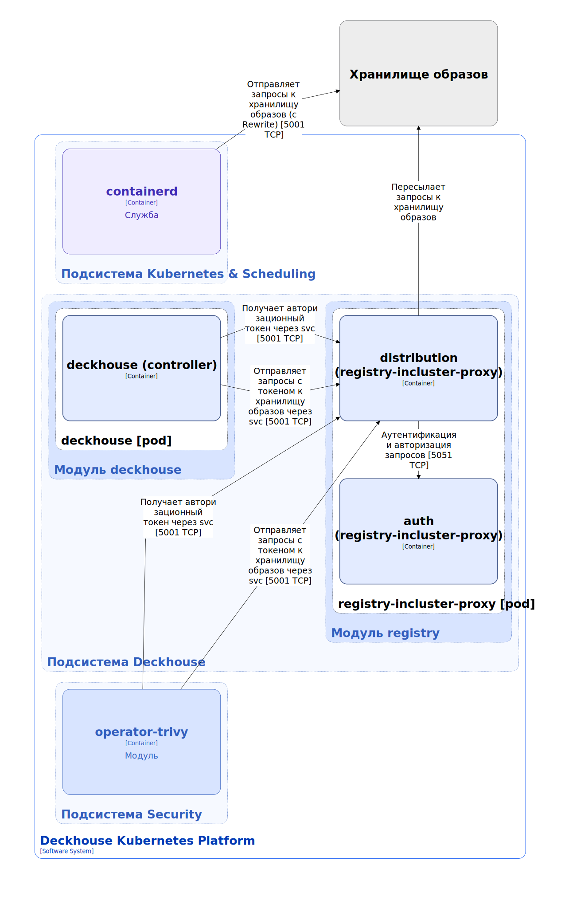
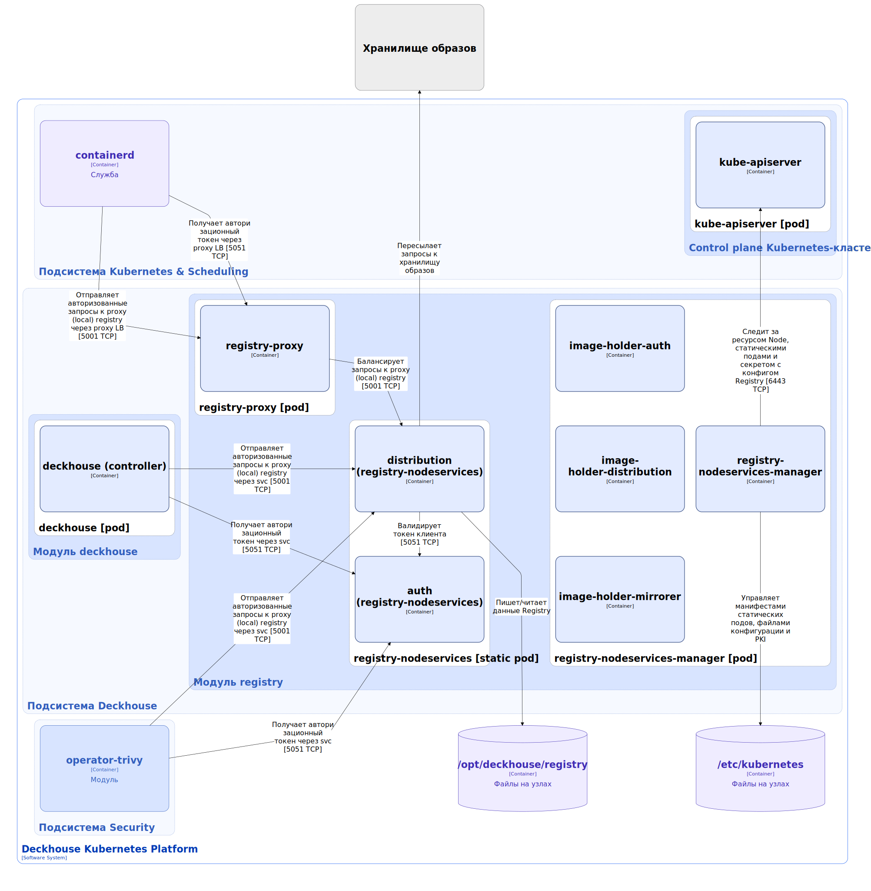
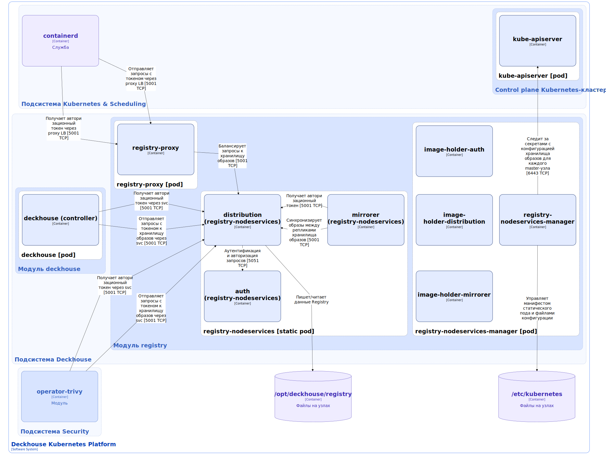

Модуль `registry` отвечает за управление настройками хранилища образов компонентов Deckhouse Kubernetes Platform (DKP).

Модуль работает в следующих режимах:

* `Direct` — использование прямого доступа к внешнему хранилищу образов по фиксированному адресу `registry.d8-system.svc:5001/system/deckhouse`. Фиксированный адрес позволяет избежать повторного скачивания образов и перезапуска компонентов при смене параметров хранилища образов. Фиксированный адрес заменяется фактическим адресом внешнего хранилища при отправке запросов за счет настройки `mirroring/rewrite` в конфигурации компонента containerd и за счет внутреннего registry-incluster-proxy компонента, проксирующего запросы к внешнему хранилищу.

* `Proxy` — использование внутреннего кеширующего хранилища образов для проксирования обращений к внешнему хранилищу, с запуском кеширующего прокси хранилища на control plane (master) узлах. Режим позволяет сократить количество запросов к внешнему хранилищу за счёт кеширования образов. Кешируемые данные хранятся на control plane (master) узлах. Обращение к внутреннему хранилищу образов выполняется по фиксированному адресу `registry.d8-system.svc:5001/system/deckhouse` аналогично `Direct` режиму.

* `Local` — использование локального внутреннего хранилища образов, с запуском хранилища образов на control plane (master) узлах. Режим позволяет кластеру работать в изолированной среде. Данные хранятся на control plane (master) узлах. Обращение к внутреннему хранилищу образов выполняется по фиксированному адресу `registry.d8-system.svc:5001/system/deckhouse` аналогично `Direct` и `Proxy` режимам.

* `Unmanaged` — работа без использования внутреннего хранилища образов. Обращение внутри кластера выполняется напрямую к внешнему хранилищу образов.

Подробнее с описанием настройки и примерами использования модуля можно ознакомиться [в разделе документации модуля](/modules/registry/).

## Архитектура модуля


Для упрощения схемы приняты следующие допущения:

* На схеме показано, что контейнеры разных подов взаимодействуют друг с другом напрямую. Фактически они взаимодействуют через соответствующие сервисы Kubernetes (внутренние балансировщики). Названия сервисов не указываются, если они очевидны из контекста. В остальных случаях название сервиса указано над стрелкой.
* Поды могут быть запущены в нескольких репликах, однако на схеме все поды изображены в одной реплике.


Архитектура модуля [`registry`](/modules/registry/) на уровне 2 модели C4 и его взаимодействия с другими компонентами Deckhouse Kubernetes Platform (DKP) изображены на следующих диаграммах:

Модуль [`registry`](/modules/registry/) в режиме `Direct`:

<!--- Source: structurizr code from https://fox.flant.com/team/d8-system-design/doc/-/tree/main/architecture/diagrams/C4_RU --->

Модуль [`registry`](/modules/registry/) в режиме `Proxy`:

<!--- Source: structurizr code from https://fox.flant.com/team/d8-system-design/doc/-/tree/main/architecture/diagrams/C4_RU --->

Модуль [`registry`](/modules/registry/) в режиме `Local`:

<!--- Source: structurizr code from https://fox.flant.com/team/d8-system-design/doc/-/tree/main/architecture/diagrams/C4_RU --->

## Компоненты модуля

Модуль состоит из следующих компонентов:

1. **Registry-incluster-proxy** (режим `Direct`) — хранилище образов на базе [Distribution](https://github.com/distribution/distribution). Distribution — это Open Source-проект, который является основой для хранения и распределения контейнерных образов и другого контента с использованием спецификации [OCI Distribution Specification](https://github.com/opencontainers/distribution-spec). Registry-incluster-proxy устанавливается в кластере как Deployment, не хранит и не кеширует образы, а пересылает запросы к внешнему хранилищу образов, указанному в [настройках режима Direct в ModuleConfig `deckhouse`](/modules/deckhouse/configuration.html#parameters-registry-direct).

   Состоит из следующих контейнеров:

   * **distribution** — основной контейнер;
   * **auth** — сайдкар-контейнер, реализующий функционал аутентификации и авторизации при обращении к хранилищу образов. Является [Open Source-проектом](https://github.com/cesanta/docker_auth).

     Принцип работы:

     1. **Запрос к сервису аутентификации**. Когда клиент пытается получить доступ к хранилищу образов, distribution возвращает HTTP-ответ `401 Unauthorized` с заголовком `WWW-Authenticate`, указывающим, как пройти аутентификацию.

     1. **Получение токена**. Клиент отправляет запрос к сервису аутентификации auth через сервис distribution (например, `registry.d8-system.svc:5051/auth`), используя значения `service` и `scope` из заголовка `WWW-Authenticate`. Сервис auth возвращает непрозрачный Bearer-токен, который представляет авторизованный доступ клиента.

     1. **Использование токена**. Получив токен, клиент повторно отправляет исходный запрос к distribution, включив токен в заголовок `Authorization`.

     1. **Проверка доступа**. Distribution валидирует токен и содержащиеся в нём `claims`, после чего начинает сессию загрузки образов.

1. **Registry-nodeservices** (режимы `Proxy` или `Local`) — хранилище образов на базе Distribution, запускаемое на control plane (master) узлах. Хранилище запускается в виде статического пода, его жизненным циклом управляет компонент registry-nodeservices-manager. Данные хранятся в каталоге `/opt/deckhouse/registry` на control plane (master) узлах.

   Состоит из следующих контейнеров:

   * **distribution** — основной контейнер;
   * **auth** — сайдкар-контейнер аутентификации и авторизации. Подробно описан выше;
   * **mirrorer** (режим `Local`) — сайдкар-контейнер, синхронизирующий образы между репликами distribution, запущенными на control plane (master) узлах.

1. **Registry-proxy** (режимы `Proxy` или `Local`) — балансировщик, установленный на каждый узел кластера и
обеспечивающий высокую доступность к хранилищу образов. CRI обращается к хранилищу образов через балансировщик. Настройки для обращения к балансировщику указываются в конфигурации containerd.

   Состоит из одного контейнера:

   * **registry-proxy** — контейнер, собранный на базе стандартного образа [NGINX](https://github.com/nginx/nginx). В контейнере также запускается процесс registry-proxy-reloader, который перезагружает процессы nginx балансировщика при изменении его конфигурации.

1. **Registry-nodeservices-manager** (режимы `Proxy` или `Local`) — контроллер, управляющий жизненным циклом компонентов registry-nodeservices. Registry-nodeservices-manager выполняет следующие операции:

   * рендерит манифест статического пода registry-nodeservices из шаблонов и сохраняет его в каталоге `/etc/kubernetes` на control plane (master) узлах. [Kubelet](../kubernetes-and-scheduling/kubelet.html) обнаруживает созданные манифесты и запускает статический под registry-nodeservices;
   * сохраняет в каталоге `/etc/kubernetes/registry` на control plane (master) узлах файлы конфигурации, необходимые для работы компонентов registry-nodeservices;
   * удаляет манифест статичного пода из каталога `/etc/kubernetes`  и конфигурационные файлы из каталога `/etc/kubernetes/registry`, тем самым удаляя локальное хранилище образов, в случае переключения модуля в режим `Direct` или `Unmanaged`.

   Состоит из следующих контейнеров:

   * **registry-nodeservices-manager** — основной контейнер;

   * Набор сайдкар-контейнеров для предварительного скачивания образов соответствующих компонентов registry-nodeservices. Контейнеры стоят на паузе и выполняют только функцию хранения образов:

     * **image-holder-auth**;
     * **image-holder-distribution**;
     * **image-holder-mirrorer**.

## Взаимодействия модуля

Модуль взаимодействует со следующими компонентами:

1. **Kube-apiserver**:

   * проверяет что текущий узел является master'ом;
   * проверяет, что все контейнеры пода registry-nodeservices спулены и под находится в статусе `Ready`;
   * применяет изменения конфигурации статического пода из секрета `registry-node-config-<Node Name>`.

1. **Внешнее хранилище образов** — модуль перенаправляет внутренние запросы к внешнему хранилищу образов.

С модулем взаимодействуют следующие внешние компоненты:

1. **Containerd** — отправляет запросы к хранилищу образов для скачивания образов, используемых для создания контейнеров.

1. **Deckhouse-controller** — отправляет запросы к хранилищу образов для скачивания образов, используемых для установки модулей.

1. **Operator-trivy (а также другие, компоненты, обращающиеся к хранилищу образов напрямую)** — отправляет запросы к хранилищу образов для скачивания образов, например, для проверки их на безопасность (в случае operator-trivy).
