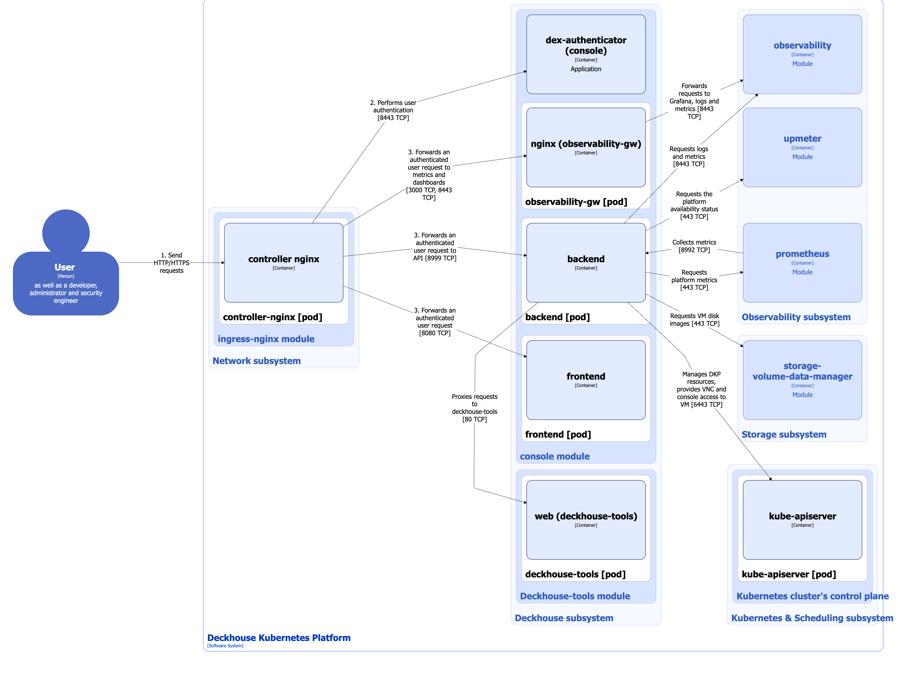
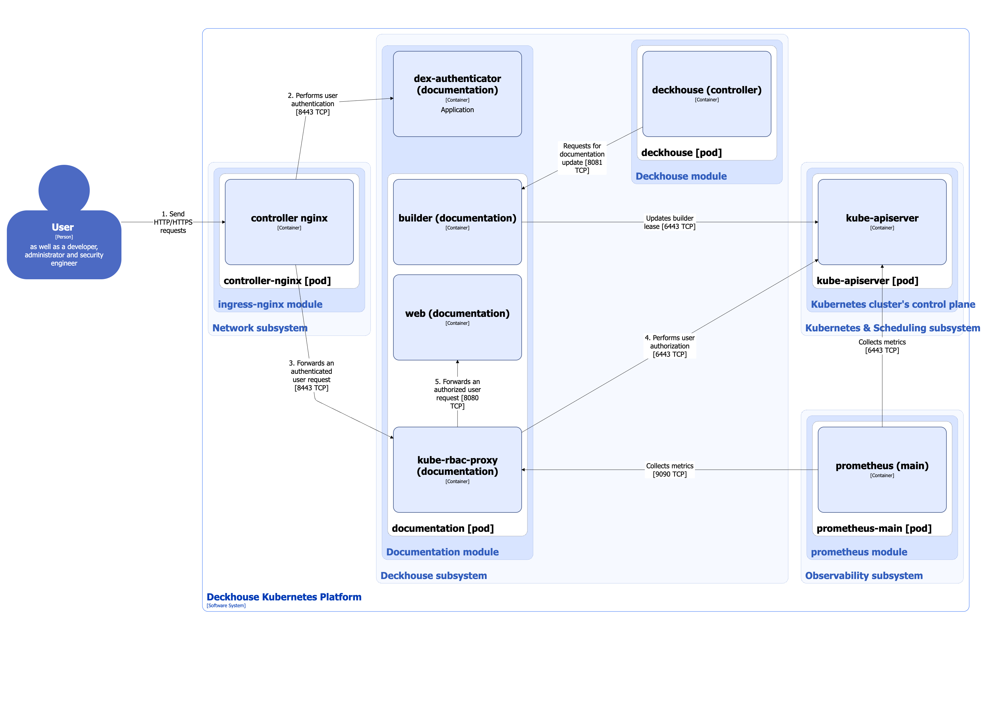
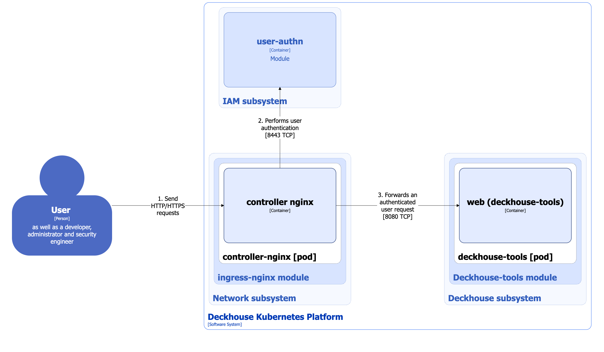

## Web interface

The [`console`](/modules/console/) module implements the web interface of Deckhouse Kubernetes Platform (DKP), simplifying platform management and making the system state easier to understand.

### Module architecture


The following simplifications are made in the diagram:

* The diagram shows containers in different pods interacting directly with each other. In reality, they communicate via the corresponding Kubernetes Services (internal load balancers). Service names are omitted if they are obvious from the diagram context. Otherwise, the Service name is shown above the arrow.
* Pods may run multiple replicas. However, each pod is shown as a single replica in the diagram.


The Level 2 C4 architecture of the [`console`](/modules/console/) module and its interaction with other DKP components are shown in the following diagram:

<!--- Source: structurizr code from https://fox.flant.com/team/d8-system-design/doc/-/tree/main/architecture/diagrams/C4_EN --->

The numbers in the diagram indicate the order in which the module components are accessed: access to `frontend`, `backend`, and `nginx` goes through the Ingress Controller, with mandatory user authentication in Dex.

### Module components

The module consists of the following components:

1. **Frontend**: Consists of a single **frontend** container and provides the web interface for DKP users and platform administrators.

1. **Backend**: Consists of a single **backend** container and implements an API interface that provides the following capabilities:

   * retrieving, creating, deleting, and modifying DKP resources according to the user's permissions;
   * generating a kubeconfig with the user's profile;
   * determining the environment in which the DKP cluster is deployed;
   * detecting Deckhouse and Kubernetes versions;
   * loading metrics and logs;
   * loading platform availability information;
   * exporting disk images in blob format.

1. **Observability-gw**: Consists of a single **nginx** container and proxies requests to Grafana to embed dashboards into the platform's main UI, as well as to work with metrics and logs for the selected project.

1. **Dex-authenticator**: Performs user verification and authentication using the platform's unified authentication system implemented by the [`user-authn`](/modules/authn) module. For more information about the `user-authn` module architecture, refer to [the corresponding documentation section](../iam/user-authn.html).

### Module interactions

The module interacts with the following components:

1. **Kube-apiserver**:
   - organizing VM connections via console and VNC;
   - creating, deleting, modifying, and tracking DKP resources.

1. [**Upmeter**](/modules/upmeter/): Retrieves DKP platform availability information.

1. [**Deckhouse-tools**](/modules/deckhouse-tools/): Forwards requests to download the [Deckhouse CLI](/cli/d8/) utility.

1. [**Prometheus**](/modules/prometheus/): Retrieves system metrics for the platform, such as CPU and RAM usage.

1. [**Observability**](/modules/observability/): Retrieves metrics and logs for the selected project.

1. [**Storage-volume-data-manager**](/modules/storage-volume-data-manager/): Exports disk images in blob format.

The following external component interacts with the module:

* **Nginx Controller**: Forwards external user requests to the module web interface.

## Documentation module

The [`documentation`](/modules/documentation/) module provides a web interface for documentation corresponding to the running version of Deckhouse Kubernetes Platform.

### Module architecture


The following simplifications are made in the diagram:

* The diagram shows containers in different pods interacting directly with each other. In reality, they communicate via the corresponding Kubernetes Services (internal load balancers). Service names are omitted if they are obvious from the diagram context. Otherwise, the Service name is shown above the arrow.
* Pods may run multiple replicas. However, each pod is shown as a single replica in the diagram.


The Level 2 C4 architecture of the [`documentation`](/modules/documentation/) module and its interaction with other DKP components are shown in the following diagram:

<!--- Source: structurizr code from https://fox.flant.com/team/d8-system-design/doc/-/tree/main/architecture/diagrams/C4_EN --->

### Module components

The module consists of the following components:

1. **Documentation**: A component that provides the documentation web interface.

    It consists of the following containers:

    * **web**: Main container.

    * **kube-rbac-proxy**: Sidecar container with an authorization proxy based on Kubernetes RBAC that provides secure access to the main container. It is an [open source project](https://github.com/brancz/kube-rbac-proxy).

    * **builder**: Sidecar container that dynamically extends the documentation when new DKP modules are installed. The [Hugo](https://github.com/gohugoio/hugo) static site generator is used to render and generate the up-to-date site content.

    The **builder** container automatically creates and updates a Kubernetes Lease resource, placing an endpoint for interaction in it. This endpoint is used by the [`deckhouse`](/modules/deckhouse/) module controller to initiate documentation updates, ensuring that changes are displayed promptly when modules are updated or installed.

1. **Dex-authenticator**: Performs user verification and authentication using the platform's unified authentication system implemented by the [`user-authn`](/modules/authn) module. For more information about the `user-authn` module architecture, refer to [the corresponding documentation section](../iam/user-authn.html).

### Module interactions

The module interacts with the following components:

* **Kube-apiserver**:
  - creates and updates the Lease resource;
  - authorizes requests to the documentation web interface.

The following external components interact with the module:

1. [**Deckhouse**](/modules/deckhouse/): Sends requests to update the documentation when the set of modules changes.

1. **Prometheus**: Collects module metrics.

1. **Nginx Controller**: Forwards external user requests to the module web interface.

## Deckhouse-tools module

The [`deckhouse-tools`](/modules/deckhouse-tools/) module provides a web interface with links to download the [Deckhouse CLI](/cli/d8/) utility for various operating systems.

### Module architecture


The following simplifications are made in the diagram:

* The diagram shows containers in different pods interacting directly with each other. In reality, they communicate via the corresponding Kubernetes Services (internal load balancers). Service names are omitted if they are obvious from the diagram context. Otherwise, the Service name is shown above the arrow.
* Pods may run multiple replicas. However, each pod is shown as a single replica in the diagram.


The Level 2 C4 architecture of the [`deckhouse-tools`](/modules/deckhouse-tools/) module and its interaction with other DKP components are shown in the following diagram:

<!--- Source: structurizr code from https://fox.flant.com/team/d8-system-design/doc/-/tree/main/architecture/diagrams/C4_EN --->

### Module components

The module consists of the following components:

1. **Deckhouse-tools**: Consists of a single **web** container and provides a web interface with links to download the Deckhouse CLI utility.

1. **Dex-authenticator**: Performs user verification and authentication using the platform's unified authentication system implemented by the [`user-authn`](/modules/authn) module. For more information about the `user-authn` module architecture, refer to [the corresponding documentation section](../iam/user-authn.html).

### Module interactions

The following external component interacts with the module:

* **Nginx Controller**: Forwards external user requests to the module web interface.
