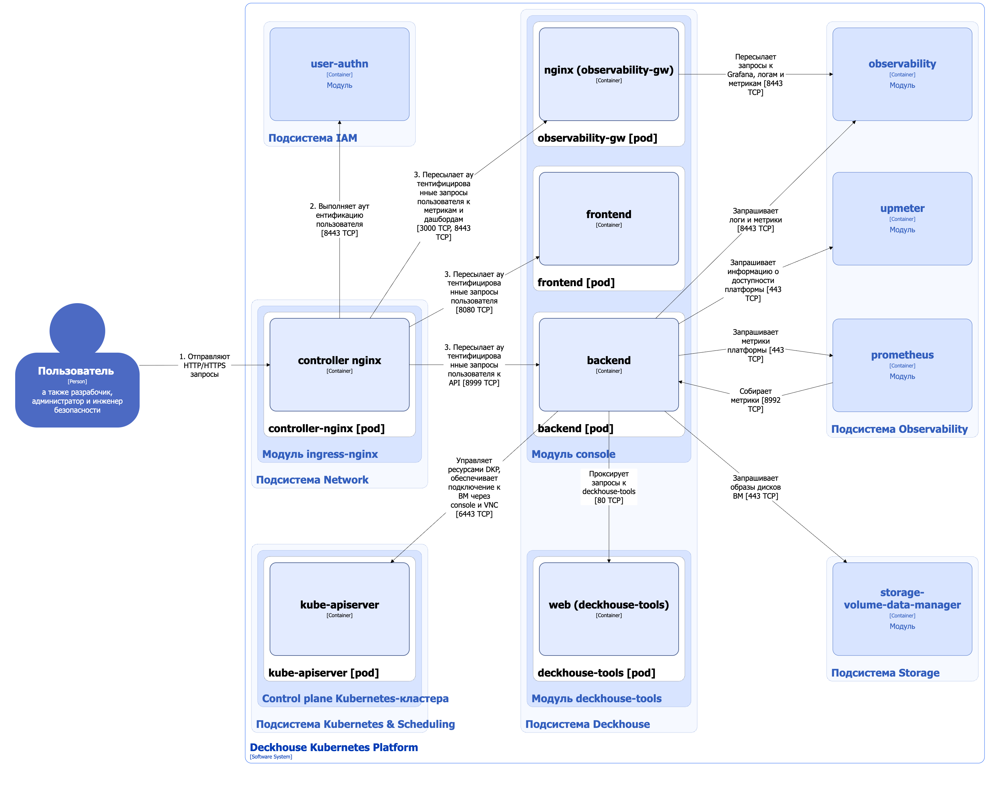
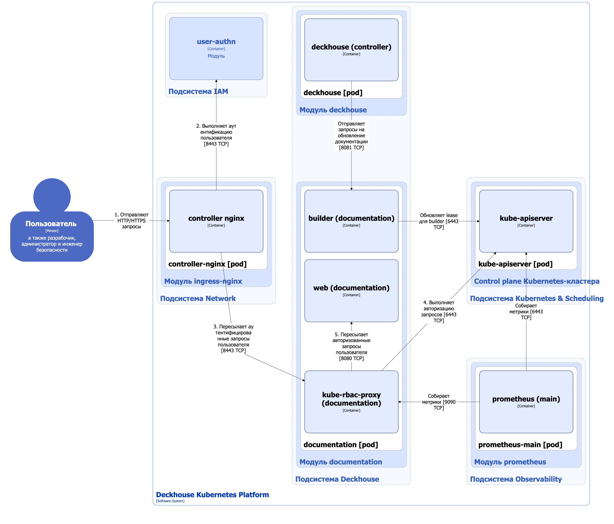
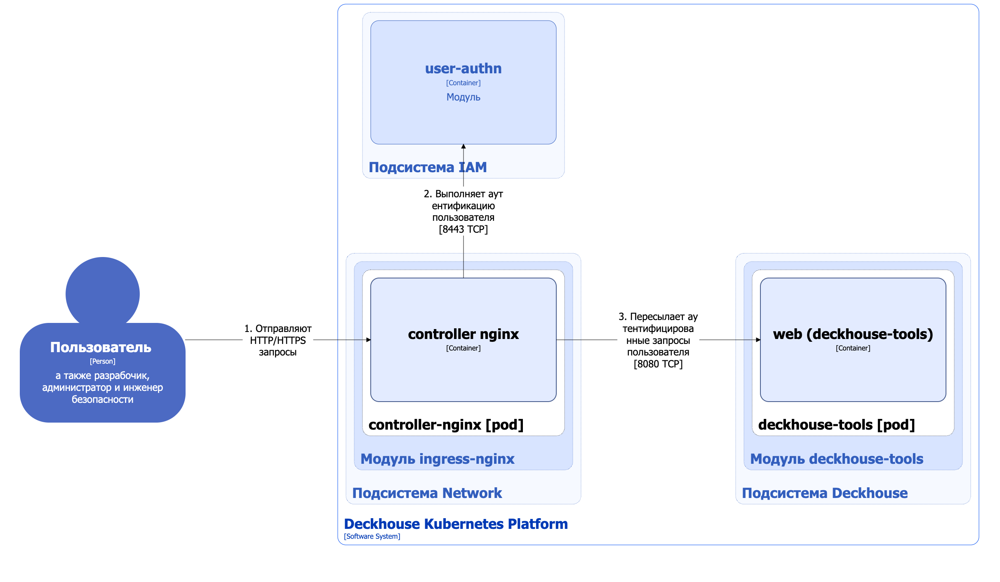

## Модуль console

Модуль [`console`](/modules/console/) реализует веб-интерфейс Deckhouse Kubernetes Platform (DKP), который упрощает управление платформой и позволяет отслеживать состояние системы.

### Архитектура модуля


Для упрощения схемы приняты следующие допущения:

* На схеме показано, что контейнеры разных подов взаимодействуют друг с другом напрямую. Фактически они взаимодействуют через соответствующие сервисы Kubernetes (внутренние балансировщики). Названия сервисов не указываются, если они очевидны из контекста. В остальных случаях название сервиса указано над стрелкой.
* Поды могут быть запущены в нескольких репликах, однако на схеме все поды изображены в одной реплике.


Архитектура модуля [`console`](/modules/console/) на уровне 2 модели C4 и его взаимодействие с другими компонентами DKP изображены на следующей диаграмме:

<!--- Source: structurizr code from https://fox.flant.com/team/d8-system-design/doc/-/tree/main/architecture/diagrams/C4_RU --->


Номерами на схеме отмечен порядок прохождения запроса пользователя к компонентам `frontend`, `backend` и `nginx`.

На шагах 1, 2 и 3 запрос проходит через Ingress NGINX Controller, где выполняется обязательная аутентификация пользователя с использованием модуля [`user-authn`](/modules/user-authn). Подробнее об архитектуре модуля `user-authn` можно узнать [в соответствующем разделе документации](../iam/user-authn.html).


### Компоненты модуля

Модуль состоит из следующих компонентов:

1. **Frontend** — состоит из одного контейнера **frontend** и предоставляет веб-интерфейс для пользователей и администраторов DKP.

1. **Backend** — состоит из одного контейнера **backend** и реализует API-интерфейс, обеспечивающий следующие возможности:

   * получение, создание, удаление и изменение ресурсов DKP в соответствии с правами пользователя;
   * генерация kubeconfig с профилем пользователя;
   * определение окружения, в котором развернут кластер DKP;
   * обнаружение версий DKP и Kubernetes;
   * загрузка метрик и логов;
   * загрузка информации о доступности платформы;
   * скачивание дисков ВМ (при включенных модулях [`virtualization`](/modules/virtualization/) и [`storage-volume-data-manager`](/modules/storage-volume-data-manager/)).

1. **Observability-gw** — состоит из одного контейнера **nginx** и выполняет проксирование запросов к Grafana для встраивания дашбордов в основной веб-интерфейс платформы, а также для работы с метриками и логами выбранного проекта.

### Взаимодействия модуля

Модуль взаимодействует со следующими компонентами:

1. **Kube-apiserver**:
   - организация подключения к ВМ через console и VNC;
   - создание, удаление, изменение и отслеживание ресурсов DKP.

1. [**Upmeter**](/modules/upmeter/) — получение информации о доступности DKP.

1. [**Deckhouse-tools**](/modules/deckhouse-tools/) — пересылка запросов для загрузки утилиты [Deckhouse CLI](../../cli/d8/).

1. [**Prometheus**](/modules/prometheus/) — получение системных метрик (CPU, RAM и др.) платформы.

1. [**Observability**](/modules/observability/) — получение метрик и логов для выбранного проекта.

1. [**Storage-volume-data-manager**](/modules/storage-volume-data-manager/) — экспорт образов дисков ВМ.

С модулем взаимодействуют следующие внешние компоненты:

* **Controller nginx** — пересылка внешних запросов пользователя к веб-интерфейсу модуля.

## Модуль documentation

Модуль [`documentation`](/modules/documentation/) — это реализация веб-интерфейса с документацией, соответствующей запущенной версии DKP.

### Архитектура модуля


Для упрощения схемы приняты следующие допущения:

* На схеме показано, что контейнеры разных подов взаимодействуют друг с другом напрямую. Фактически они взаимодействуют через соответствующие сервисы Kubernetes (внутренние балансировщики). Названия сервисов не указываются, если они очевидны из контекста. В остальных случаях название сервиса указано над стрелкой.
* Поды могут быть запущены в нескольких репликах, однако на схеме все поды изображены в одной реплике.


Архитектура модуля [`documentation`](/modules/documentation/) на уровне 2 модели C4 и его взаимодействие с другими компонентами DKP изображены на следующей диаграмме:

<!--- Source: structurizr code from https://fox.flant.com/team/d8-system-design/doc/-/tree/main/architecture/diagrams/C4_RU --->


Номерами на схеме отмечен порядок прохождения запроса пользователя к компоненту `web`:
- на шагах 1, 2 и 3 запрос проходит через Ingress NGINX Controller, где выполняется обязательная аутентификация пользователя с использованием модуля [`user-authn`](/modules/user-authn);
- на шагах 4 и 5 выполняется авторизация пользователя на основе Kubernetes RBAC для организации защищенного доступа.


### Компоненты модуля

Модуль состоит из одного компонента:

- **Documentation** — компонент, реализующий веб-интерфейс документации.

  Состоит из следующих контейнеров:

  * **web** — основной контейнер;

  * **kube-rbac-proxy** — сайдкар-контейнер с авторизующим прокси на основе Kubernetes RBAC для организации защищенного доступа к основному контейнеру. Является [Open Source-проектом](https://github.com/brancz/kube-rbac-proxy);

  * **builder** — сайдкар-контейнер, который динамически расширяет документацию при установке новых модулей DKP. Для рендеринга и генерации актуального содержимого сайта используется генератор статических сайтов [Hugo](https://github.com/gohugoio/hugo).

    Контейнер **builder** автоматически создаёт и обновляет Kubernetes-ресурс Lease, размещая в нём эндпоинт для обновления документации. Этот эндпоинт используется контроллером модуля [`deckhouse`](/modules/deckhouse/) для запуска обновления документации при обновлении или установке модулей. Благодаря этому изменения своевременно отображаются в веб-интерфейсе.

### Взаимодействия модуля

Модуль взаимодействует со следующими компонентами:

* **Kube-apiserver**:
  - создание и обновление ресурса Lease;
  - авторизация запросов к веб-интерфейсу документации.

С модулем взаимодействуют следующие внешние компоненты:

1. [**Deckhouse**](/modules/deckhouse/) — отправка запросов на обновление документации при изменении состава модулей.

1. [**Prometheus**](/modules/prometheus/) — сбор метрик модуля.

1. **Controller nginx** — пересылка внешних запросов пользователя к веб-интерфейсу модуля.

## Модуль deckhouse-tools

Модуль [`deckhouse-tools`](/modules/deckhouse-tools/) — это реализация веб-интерфейса со ссылками на скачивание утилиты [Deckhouse CLI](../../cli/d8/) под различные операционные системы.

### Архитектура модуля


Для упрощения схемы приняты следующие допущения:

* На схеме показано, что контейнеры разных подов взаимодействуют друг с другом напрямую. Фактически они взаимодействуют через соответствующие сервисы Kubernetes (внутренние балансировщики). Названия сервисов не указываются, если они очевидны из контекста. В остальных случаях название сервиса указано над стрелкой.
* Поды могут быть запущены в нескольких репликах, однако на схеме все поды изображены в одной реплике.


Архитектура модуля [`deckhouse-tools`](/modules/deckhouse-tools/) на уровне 2 модели C4 и его взаимодействие с другими компонентами DKP изображены на следующей диаграмме:

<!--- Source: structurizr code from https://fox.flant.com/team/d8-system-design/doc/-/tree/main/architecture/diagrams/C4_RU --->


Номерами на схеме отмечен порядок прохождения запроса пользователя к компоненту `web`.

На шагах 1, 2 и 3 запрос проходит через Ingress NGINX Controller, где выполняется обязательная аутентификация пользователя с использованием модуля [`user-authn`](/modules/user-authn).


### Компоненты модуля

Модуль состоит из одного компонента:

- **Deckhouse-tools** — состоит из одного контейнера **web** и реализует веб-интерфейс со ссылками на скачивание утилиты [Deckhouse CLI](../../cli/d8/).

### Взаимодействия модуля

С модулем взаимодействуют следующие внешние компоненты:

* **Controller nginx** — пересылка внешних запросов пользователя к веб-интерфейсу модуля.
