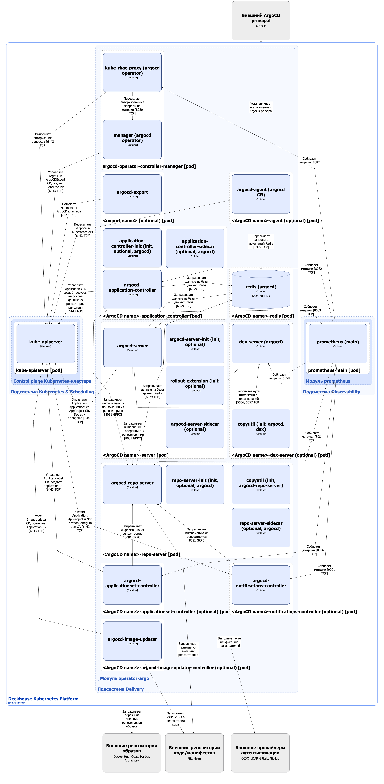
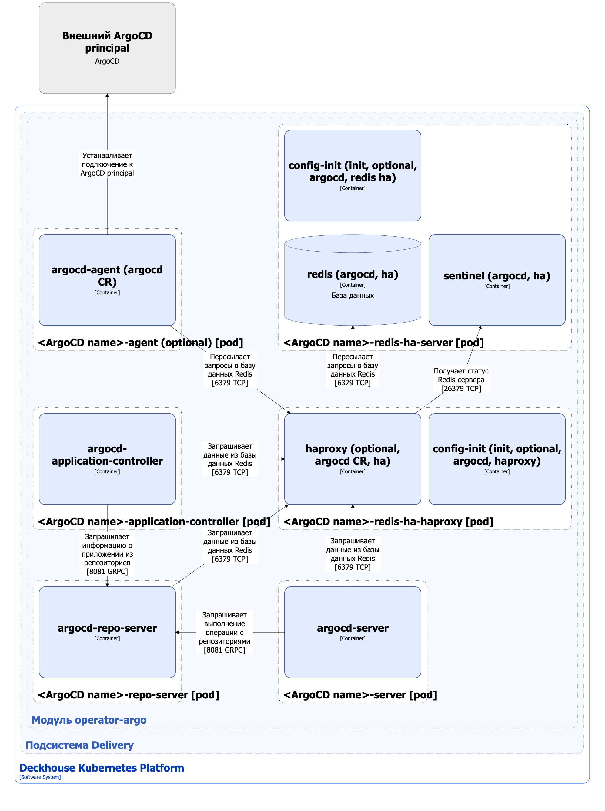
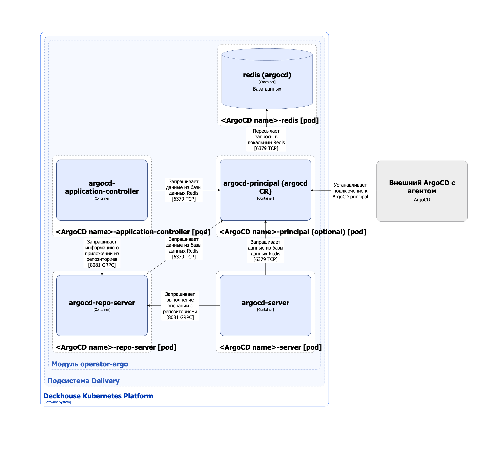

Модуль [`operator-argo`](/modules/operator-argo/) разворачивает [ArgoCD Operator](https://argocd-operator.readthedocs.io/) в кластере Deckhouse Kubernetes Platform (DKP). Это позволяет установить ArgoCD в кластере DKP, используя ресурс ArgoCD.

Модуль работает со следующими кастомными ресурсами:
- [Application](https://argo-cd.readthedocs.io/en/stable/operator-manual/declarative-setup/#applications) — описание и управление развертыванием приложений;
- [ApplicationSet](https://argo-cd.readthedocs.io/en/stable/operator-manual/applicationset/#the-applicationset-resource) — шаблонизация и массовое создание приложений по определённым правилам;
- [AppProject](https://argo-cd.readthedocs.io/en/stable/operator-manual/declarative-setup/#projects) — определение набора приложений и политик доступа к ним;
- [ArgoCD](https://argocd-operator.readthedocs.io/en/latest/reference/argocd/) — основной ресурс для развертывания и настройки экземпляра ArgoCD;
- [ArgoCDExport](https://argocd-operator.readthedocs.io/en/latest/reference/argocdexport/) — экспорт настроек и состояния ArgoCD для резервного копирования или миграции;
- [ImageUpdater](https://argocd-image-updater.readthedocs.io/en/stable/configuration/images/) — автоматическое обновление образов контейнеров приложений;
- [NotificationsConfiguration](https://argocd-operator.readthedocs.io/en/latest/reference/notificationsconfiguration/) — настройка уведомлений о событиях в ArgoCD и приложениях.

Подробнее с настройками модуля и примерами его использования можно ознакомиться в [соответствующем разделе документации](/modules/operator-argo/).

## Архитектура модуля


Для упрощения схемы приняты следующие допущения:

* На схеме показано, что контейнеры разных подов взаимодействуют друг с другом напрямую. Фактически они взаимодействуют через соответствующие сервисы Kubernetes (внутренние балансировщики). Названия сервисов не указываются, если они очевидны из контекста. В остальных случаях название сервиса указано над стрелкой.
* Поды могут быть запущены в нескольких репликах, однако на схеме все поды изображены в одной реплике.


Архитектура модуля [`operator-argo`](/modules/operator-argo/) на уровне 2 модели C4 и его взаимодействия с другими компонентами DKP изображены на следующих диаграммах.

Основной вариант развертывания с базой данных Redis в не отказоустойчивой конфигурации:

<!--- Source: structurizr code from https://fox.flant.com/team/d8-system-design/doc/-/tree/main/architecture/diagrams/C4_RU --->

Вариант с отказоустойчивой конфигурацией Redis (на диаграмме отражено только отличия от основного варианта развертывания):

<!--- Source: structurizr code from https://fox.flant.com/team/d8-system-design/doc/-/tree/main/architecture/diagrams/C4_RU --->

Вариант развертывания ArgoCD в [управляющием кластере](https://argocd-agent.readthedocs.io/stable/concepts/components-terminology/) в мультикластерной конфигурации (на диаграмме отражено только отличия от основного варианта развертывания):

<!--- Source: structurizr code from https://fox.flant.com/team/d8-system-design/doc/-/tree/main/architecture/diagrams/C4_RU --->

## Компоненты модуля

Модуль состоит из следующих компонентов:

1. **Argocd-operator-controller-manager** (Deployment) — реализация [ArgoCD Operator](https://argocd-operator.readthedocs.io/), позволяющая разворачивать экземпляры ArgoCD в кластере DKP. Компонент работает со следующими кастомными ресурсами:
   - [ArgoCD](https://argocd-operator.readthedocs.io/en/latest/reference/argocd/) — основной ресурс для развертывания и настройки экземпляра ArgoCD;
   - [ArgoCDExport](https://argocd-operator.readthedocs.io/en/latest/reference/argocdexport/) — экспорт настроек и состояния ArgoCD для резервного копирования или миграции. Оператор читает кастомный ресурс ArgoCDExport и создаёт Job/CronJob с именем, совпадающим с именем ресурса ArgoCDExport, выполняющий создание резервной копии настроек ArgoCD кластера;
   - [NotificationsConfiguration](https://argocd-operator.readthedocs.io/en/latest/reference/notificationsconfiguration/) — настройка уведомлений о событиях в ArgoCD и приложениях. Оператор читает кастомные ресурсы NotificationsConfiguration и на основе них обновляет конфигурацию в ConfigMap `argocd-notifications-cm`.

   Argocd-operator-controller-manager создает ресурсы Deployment, Secret, ConfigMap и StatefulSet для каждого кастомного ресурса ArgoCD, добавляя имя этого ресурса как префикс для создаваемых ресурсов.

   Состоит из следующих контейнеров:

   - **manager** — основной контейнер;
   - **kube-rbac-proxy** — сайдкар-контейнер с авторизующим прокси на основе Kubernetes RBAC для организации защищенного доступа к метрикам manager.


Следующие компоненты описывают ресурсы, которые создаёт argocd-operator-controller-manager на основе конфигурации, заданной в кастомном ресурсе ArgoCD. Для описания используется префикс &lt;ArgoCD name&gt;, который будет заменяться контроллером на имя ресурса ArgoCD.


1. **&lt;ArgoCD name&gt;-server** (Deployment) — основной компонент взаимодействия с экземпляром ArgoCD. &lt;ArgoCD name&gt;-server предоставляет REST/gRPC API и пользовательский веб-интерфейс для управления ArgoCD. Компонент позволяет управлять кастомными ресурсами Application, ApplicationSet и AppProject через предоставляемые интерфейсы (веб, API, CLI).

   Состоит из следующих контейнеров:

   - **argocd-server-init** — опциональный набор инит-контейнеров, задаваемых пользователем в параметре [`.spec.server.initContainers`](https://argocd-operator.readthedocs.io/en/latest/reference/argocd/#controller-options) кастомного ресурса ArgocD;
   - **rollout-extension** — опциональный инит-контейнер, загружающий расширение UI для работы с [кастомным ресурсом Rollout](https://argoproj.github.io/argo-rollouts/features/specification/). Модуль не предоставляет контроллер, обрабатывающих этот кастомный ресурс, он должен быть установлен и настроен дополнительно. Argocd-operator-controller-manager добавляет rollout-extension если значение параметра [`spec.server.enableRolloutsUI`] принимает значение `true`;
   - **argocd-server-sidecar** — опциональный набор сайдкар-контейнеров, задаваемых пользователем в параметре [`.spec.server.sidecarContainers`](https://argocd-operator.readthedocs.io/en/latest/reference/argocd/#controller-options) кастомного ресурса ArgocD.

1. **&lt;ArgoCD name&gt;-repo-server** (Deployment) — компонент, отвечающий за обработку шаблонов, генерацию манифестов приложений и работу с внешними репозиториями, используемыми в ArgoCD. &lt;ArgoCD name&gt;-repo-server отвечает за синхронизацию манифестов приложений из указанных репозиториев и передачу их в соответствующие компоненты для последующего деплоймента.

   Состоит из следующих контейнеров:

   - **copyutil** — инит-контейнер, копирующий исполняемые файлы для использования из основного контейнера;
   - **argocd-repo-server-init** — опциональный набор инит-контейнеров, настраиваемых через параметр [`.spec.repo.initContainers`](https://argocd-operator.readthedocs.io/en/latest/reference/argocd/#repo-options) кастомного ресурса ArgoCD для подготовки окружения;
   - **argocd-repo-server** — основной контейнер, выполняющий операции по генерации и обработке манифестов, а также работу с удалёнными Git-репозиториями приложений;
   - **argocd-repo-server-sidecar** — опциональный набор сайдкар-контейнеров, задаваемых пользователем в параметре [`.spec.repo.sidecarContainers`](https://argocd-operator.readthedocs.io/en/latest/reference/argocd/#repo-options) кастомного ресурса ArgoCD, позволяющие позволяет расширять функциональность repo-server.

1. **&lt;ArgoCD name&gt;-application-controller** (StatefulSet) — компонент, отвечающий за синхронизацию и управление состоянием приложений, определённых в ArgoCD. &lt;ArgoCD name&gt;-application-controller обеспечивает идемпотентное применение манифестов Kubernetes, управление процессом деплоя, отката, автоматического восстановления, а также отслеживание состояния ресурсов в кластере.

   Состоит из следующих контейнеров:

   - **application-controller-init** — опциональный набор инит-контейнеров, настраиваемых через параметр [`.spec.applicationController.initContainers`](https://argocd-operator.readthedocs.io/en/latest/reference/argocd/#application-controller-options) кастомного ресурса ArgoCD для подготовки окружения;
   - **argocd-application-controller** — основной контейнер, реализующий логику синхронизации кастомных ресурсов Application и создаваемых ресурсов на их основе;
   - **application-controller-sidecar** — опциональный набор сайдкар-контейнеров, задаваемых пользователем в параметре [`.spec.applicationController.sidecarContainers`](https://argocd-operator.readthedocs.io/en/latest/reference/argocd/#application-controller-options) кастомного ресурса ArgoCD, которые позволяют расширить стандартные возможности контроллера.

1. **&lt;ArgoCD name&gt;-applicationset-controller** (Deployment) — опциональный компонент, состоящий  из одного контейнера **applicationset-controller** и отвечающий за управление кастомным ресурсом [ApplicationSet](https://argo-cd.readthedocs.io/en/stable/operator-manual/applicationset/#the-applicationset-resource) в ArgoCD. Он позволяет автоматически создавать, обновлять или удалять ресурсы Application на основе заданных шаблонов и генераторов (например, генераторов Git, List, Matrix и Cluster). Это облегчает массовое управление похожими приложениями, которые должны быть развернуты в различных окружениях или кластерах.

   Для включения компонента необходимо задать в параметре [`.spec.applicationSet.enabled`](https://argocd-operator.readthedocs.io/en/latest/reference/argocd/#applicationset-controller-options) кастомного ресурса ArgoCD значение `true`.

   Более подробную информацию о компоненте можно найти в [документации applicationset-controller](https://argo-cd.readthedocs.io/en/stable/operator-manual/applicationset/).

1. **&lt;ArgoCD name&gt;-argocd-image-updater-controller** (Deployment) — опциональный компонент, состоящий из одного контейнера **argocd-image-updater** и предназначенный для автоматического обновления образов контейнеров в приложениях ArgoCD при появлении новых версий в реестрах образов. Компонент обеспечивает отслеживание изменений тэгов образов и, при обнаружении новой версии, обновляет соответствующие ресурсы Application в ArgoCD (например, значения image tag в manifests или Helm values) через pull-request в Git-репозиторий либо напрямую, в зависимости от выбранного способа работы.

   &lt;ArgoCD name&gt;-argocd-image-updater-controller выполняет следующие функции:
   - управляет кастомным ресурсом [ImageUpdater](https://argocd-image-updater.readthedocs.io/en/stable/operator-manual/installation/#customresourcedefinitions-crds), описывающий параметры для автоматического обновления образов контейнеров приложений;
   - периодически проверяет указанные в приложениях образы контейнеров в поддерживаемых реестрах (Docker Hub, Quay.io, Harbor и др.);
   - поддерживает фильтрацию тэгов образов по шаблонам и стратегиями обновления (semver, latest и др.);
   - при обнаружении новой версии образа автоматически выполняет write-back в Argo CD/Application или Git в зависимости от настроенного метода.

   Для корректной работы компоненту требуется наличие прав доступа к Git-репозиториям и, при необходимости, к приватным реестрам образов (поддерживается хранение Docker credentials в секретах Kubernetes).

   Для включения компонента необходимо задать в параметре [`.spec.imageUpdater.enabled`](https://argocd-operator.readthedocs.io/en/latest/reference/argocd/#image-updater-controller-options) кастомного ресурса ArgoCD значение `true`.

   Более подробную информацию о компоненте можно найти в [документации argocd-image-updater](https://argocd-image-updater.readthedocs.io/).

1. **&lt;ArgoCD name&gt;-notifications-controller** (Deployment) — опциональный контроллер, состоящий из одного контейнера **argocd-notifications-controller** и реализующий отправку уведомлений о событиях в ArgoCD (например, успешная синхронизация приложения, ошибки деплоя, изменения статуса и др.) во внешние системы уведомлений, включая e-mail, Slack, Microsoft Teams, Telegram, OpsGenie, webhooks и другие.

   Оператор argocd-operator-controller-manager формирует настройки для уведомлений на основе кастомных ресурсов [NotificationsConfiguration](https://argocd-operator.readthedocs.io/en/latest/reference/notificationsconfiguration/) и сохраняет их в ресурсы ConfigMap `argocd-notifications-cm` и Secret `argocd-notifications-secret`, которые используются контроллером для формирования и отправки уведомлений.

   Для включения компонента необходимо задать в параметре [`.spec.notifications.enabled`](https://argocd-operator.readthedocs.io/en/latest/reference/argocd/#notifications-controller-options) кастомного ресурса ArgoCD значение `true`.

   Более подробную информацию о механизмах работы можно найти в [документации по ArgoCD Notifications](https://argo-cd.readthedocs.io/en/stable/operator-manual/notifications/).

1. **&lt;ArgoCD name&gt;-dex-server** (Deployment) — опциональный компонент для аутентификации пользователей в ArgoCD, выступающий как OIDC-провайдер (OpenID Connect) на базе Dex. Компонент реализует возможность входа пользователей через различные внешние провайдеры аутентификации (LDAP, GitHub, GitLab, SAML, Azure AD и др.), а также поддерживает работу со статическими пользователями, определёнными в конфигурации Dex.

   Состоит из следующих контейнеров:

   - **copyutil** — инит-контейнер, копирующий исполняемые файлы для использования из основного контейнера;
   - **dex** — основной контейнер.

   Более подробно с настройками Dex-сервера в составе ArgoCD можно найти в [документации ArgoCD по Dex](https://argo-cd.readthedocs.io/en/stable/operator-manual/user-management/#dex).

   
   Модуль также позволяет использовать единую систему аутентификации пользователей DKP, подробнее можно ознакомиться в [соответствующей статье документации](/modules/operator-argo/examples.html#аутентификация).  
   

1. **&lt;ArgoCD name&gt;-redis** (Deployment) — обязательный компонент, состоящий из одного контейнера **redis** и отвечающий за хранение данных очередей задач и состояния сессий в ArgoCD. &lt;ArgoCD name&gt;-redis реализует standalone экземпляр in-memory базы данных [Redis](https://redis.io/).

   Argocd-operator-controller-manager разворачивает этот компонент если параметр [`.spec.ha.enabled`](https://argocd-operator.readthedocs.io/en/latest/reference/argocd/#ha-options) кастомного ресурса ArgoCD принимает значение `false`.

1. **&lt;ArgoCD name&gt;-redis-ha-server** (StatefulSet) — обязательный компонент для развёртывания Redis в режиме высокой доступности (HA) в составе ArgoCD. Реализует отказоустойчивый кластер Redis с репликацией и автоматическим переключением (failover) посредством стороннего механизма sentinel.

   Состоит из следующих контейнеров:
   - **config-init** — инит-контейнер, подготавливающий конфигурацию для Redis и Sentinel перед запуском основных контейнеров;
   - **redis** — основной контейнер, реализующий основной экземпляр Redis-сервера;
   - **sentinel** — вспомогательный контейнер, запускающий [Redis Sentinel](https://redis.io/docs/latest/operate/oss_and_stack/management/sentinel/) для мониторинга состояния экземпляров Redis и автоматического переключения на реплику при отказе мастера.

   Argocd-operator-controller-manager разворачивает этот компонент если параметр [`.spec.ha.enabled`](https://argocd-operator.readthedocs.io/en/latest/reference/argocd/#ha-options) кастомного ресурса ArgoCD принимает значение `true`.

1. **&lt;ArgoCD name&gt;-redis-ha-haproxy** (Deployment) — дополнительный компонент, предназначенный для балансировки нагрузки и распределения трафика к инстансам Redis кластера (redis-ha-server).

   Содержит один контейнер:
   - **config-init** — инит-контейнер, подготавливающий конфигурацию для HA Proxy перед запуском основного контейнера;
   - **haproxy** — контейнер, работающий в роли прокси-сервера, обеспечивающего прозрачную маршрутизацию запросов клиентов к доступным master/replica Redis-инстансам, а также автоматизацию переключения между ними при failover.

   Argocd-operator-controller-manager разворачивает этот компонент если параметр [`.spec.ha.enabled`](https://argocd-operator.readthedocs.io/en/latest/reference/argocd/#ha-options) кастомного ресурса ArgoCD принимает значение `true`.

1. **&lt;ArgoCD name&gt;-agent** (Deployment) — опциональный компонент, состоящий из одного контейнера **&lt;ArgoCD name&gt;-agent** и отвечающий за выполнение операций над управляемыми ресурсами Kubernetes-кластера по заданию из ArgoCD. Компонент устанавливает подключение к ArgoCD Principal, синхронизирует приложения и управляет их состоянием на основе команд поступающих от ArgoCD Principal.

   Подробнее с архитектурой мульти-кластерной конфигурации ArgoCD можно ознакомиться в [документации ArgoCD](https://argocd-agent.readthedocs.io/stable/concepts/architecture/#architectural-diagram).

   Argocd-operator-controller-manager разворачивает этот компонент если параметр `.spec.argoCDAgent.agent.enabled` кастомного ресурса ArgoCD принимает значение `true`. В одном ресурсе ArgoCD не допускается одновременное использование ArgoCD Agent и ArgoCD Principal.

1. **&lt;ArgoCD name&gt;-principal** (Deployment) — опциональный компонент, состоящий из одного контейнера **&lt;ArgoCD name&gt;-principal** и обеспечивающий работу ArgoCD в [мульти-кластерной конфигурации](https://argocd-agent.readthedocs.io/stable/concepts/architecture/#architectural-diagram).

   При включении этого компонента, argocd-operator-controller-manager перенастраивает все компоненты, использующие подключение к базе Redis, на использование &lt;ArgoCD name&gt;-principal в качестве базы данных. Компонент реализует Redis-прокси и обеспечивает маршрутизацию запросов к базе данных на основе анализа ключей Redis и в зависимости от значения ключей запрос маршрутизируется или в локальный экземпляр Redis, или в один из удалённых ArgoCD agent.

   Argocd-operator-controller-manager разворачивает этот компонент если параметр `.spec.argoCDAgent.principal.enabled` кастомного ресурса ArgoCD принимает значение `true`. В одном ресурсе ArgoCD не допускается одновременное использование ArgoCD Agent и ArgoCD Principal.

1. **&lt;Export name&gt;** (Job/CronJob) — опциональный компонент, реализованный в виде Job или CronJob и создающий под из одного контейнера **argocd-export**. Компонент создаёт резервную копию кластера ArgoCD.

## Взаимодействия модуля

Модуль взаимодействует со следующими компонентами:

1. Внешние провайдеры аутентификации — перенаправление пользователя для аутентификации.
1. Внешние репозитории образов — получение списка образов.
1. Внешние репозитории кода/манифестов:
    - получение манифестов развертывания приложения из репозиториев;
    - обновление `image` в исходном коде.
1. Внешний ArgoCD principal:
    - подключение к управляющему кластеру ArgoCD;
    - получение запросов на обработку;
    - передача результатов отработки запросов.
1. **Kube-apiserver**:
    — управление кастомными ресурсами Application, ApplicationSet, AppProject, ArgoCD, ArgoCDExport, ImageUpdater, NotificationsConfiguration, а так же Secret, ConfigMap;
    — авторизация запросов на получение метрик.

С модулем взаимодействуют следующие внешние компоненты:

1. **Prometheus-main** — сбор метрик.
1. Внешний ArgoCD agent:
    - подключение к управляющему кластеру ArgoCD;
    - получение запросов на обработку;
    - передача результатов отработки запросов.
