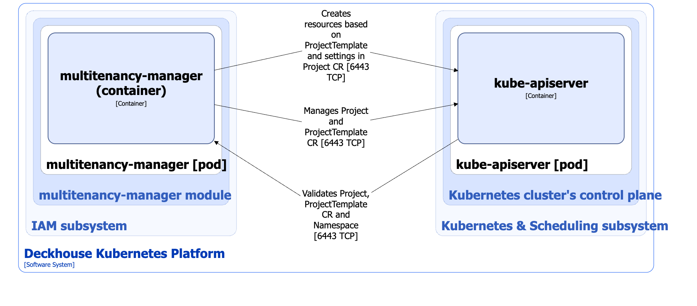

The `multitenancy-manager` module implements multitenancy and isolated environments for running applications in Deckhouse Kubernetes Platform (DKP). The module works with [the custom resources](/modules/multitenancy-manager/cr.html) ProjectTemplate and Project.

For more details about module configuration and usage examples, refer to the [corresponding documentation section](/modules/multitenancy-manager/).

For more details about multitenancy and environment isolation in DKP, refer to the [corresponding documentation section](./multitenancy.html).

## Module architecture


The following simplifications are made in the diagram:

* The diagram shows containers in different pods interacting directly with each other. In reality, they communicate via the corresponding Kubernetes Services (internal load balancers). Service names are omitted if they are obvious from the diagram context. Otherwise, the Service name is shown above the arrow.
* Pods may run multiple replicas. However, each pod is shown as a single replica in the diagram.


The architecture of the [`multitenancy-manager`](/modules/multitenancy-manager/) module at Level 2 of the C4 model and its interactions with other DKP components are shown in the following diagram.

<!--- Source: structurizr code from https://fox.flant.com/team/d8-system-design/doc/-/tree/main/architecture/diagrams/C4_EN --->

## Module components

The module consists of the following components:

- **Multitenancy-manager**: The component consists of a single **multitenancy-manager** container and provides the following functions:

  - Managing the Project and ProjectTemplate custom resources.
  - Validating the Project and ProjectTemplate custom resources.
  - Validating Namespace if `.spec.settings.allowNamespacesWithoutProjects=false` is set in the `multitenancy-manager` module parameters.
  - Creating the resources specified in the ProjectTemplate custom resource based on the parameters set in Project.

   > **Warning.** Multitenancy-manager has `cluster-admin` permissions, which allow it to create any objects described in the ProjectTemplate resource.

## Module interactions

The module interacts with the following components:

- **Kube-apiserver**:
  - Managing the Project and ProjectTemplate custom resources.
  - Validating the Project and ProjectTemplate custom resources and the standard Namespace resource.
  - Creating the resources specified in the ProjectTemplate custom resource based on the parameters set in Project.
