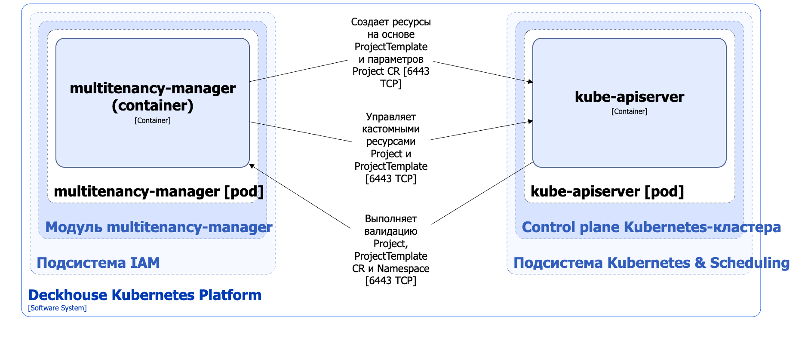

Модуль `multitenancy-manager` реализует изолированные окружения для запуска приложений в Deckhouse Kubernetes Platform (DKP). Модуль работает со следующими [кастомными ресурсами](https://deckhouse.ru/modules/multitenancy-manager/cr.html):

- ProjectTemplate — шаблон, на основе которого можно быстро создавать однотипные проекты. Позволяет автоматически применять заданные настройки ко всем создаваемым проектам;

- Project — основной кастомный ресурс для декларирования изолированного окружения (проекта) в кластере. Позволяет передать параметры шаблону ProjectTemplate, который создаёт namespace, квоты, параметры доступа и другие ресурсы для работы приложений в рамках одного проекта.

Подробнее с настройками модуля и примерами его использования можно ознакомиться в [соответствующем разделе документации](/modules/multitenancy-manager/).

## Архитектура модуля


Для упрощения схемы приняты следующие допущения:

* На схеме показано, что контейнеры разных подов взаимодействуют друг с другом напрямую. Фактически они взаимодействуют через соответствующие сервисы Kubernetes (внутренние балансировщики). Названия сервисов не указываются, если они очевидны из контекста. В остальных случаях название сервиса указано над стрелкой.
* Поды могут быть запущены в нескольких репликах, однако на схеме все поды изображены в одной реплике.


Архитектура модуля [`multitenancy-manager`](/modules/multitenancy-manager/) на уровне 2 модели C4 и его взаимодействия с другими компонентами DKP изображены на следующей диаграмме.

<!--- Source: structurizr code from https://fox.flant.com/team/d8-system-design/doc/-/tree/main/architecture/diagrams/C4_RU --->

## Компоненты модуля

Модуль состоит из следующих компонентов:

- **Multitenancy-manager** — компонент состоит из одного контейнера **multitenancy-manager** и обеспечивает следующие функции:

  - управление кастомными ресурсами Project и ProjectTemplate;
  - валидация кастомных ресурсов Project и ProjectTemplate;
  - валидация стандартного ресурса Namespace если в параметрах модуля `multitenancy-manager` задано `.spec.settings.allowNamespacesWithoutProjects=false`;
  - создание ресурсов, указанных в кастомном ресурсе ProjectTemplate, на основе параметров, заданных в Project.

   Кастомный ресурс ProjectTemplate позволяет определить шаблон в формате [Helm template](https://helm.sh/docs/chart_template_guide/) для создания необходимых объектов Kubernetes. При создании или обновлении ресурса Project **multitenancy-manager** формирует Helm Chart на основе внутренних шаблонов модуля, передаёт в него шаблон ресурсов из ProjectTemplate и параметры из Project в виде Helm values, после чего выполняет установку или обновление полученного release в DKP.

## Взаимодействия модуля

Модуль взаимодействует со следующими компонентами:

- **Kube-apiserver**:
  - управление кастомными ресурсами Project и ProjectTemplate;
  - валидация кастомных ресурсов Project, ProjectTemplate и Namespace;
  - создание ресурсов, указанных в кастомном ресурсе ProjectTemplate, на основе параметров, заданных в Project.
