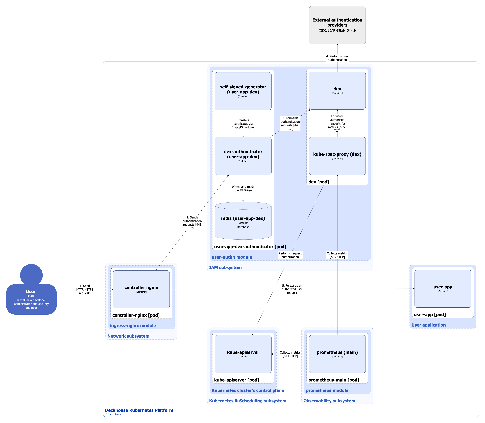
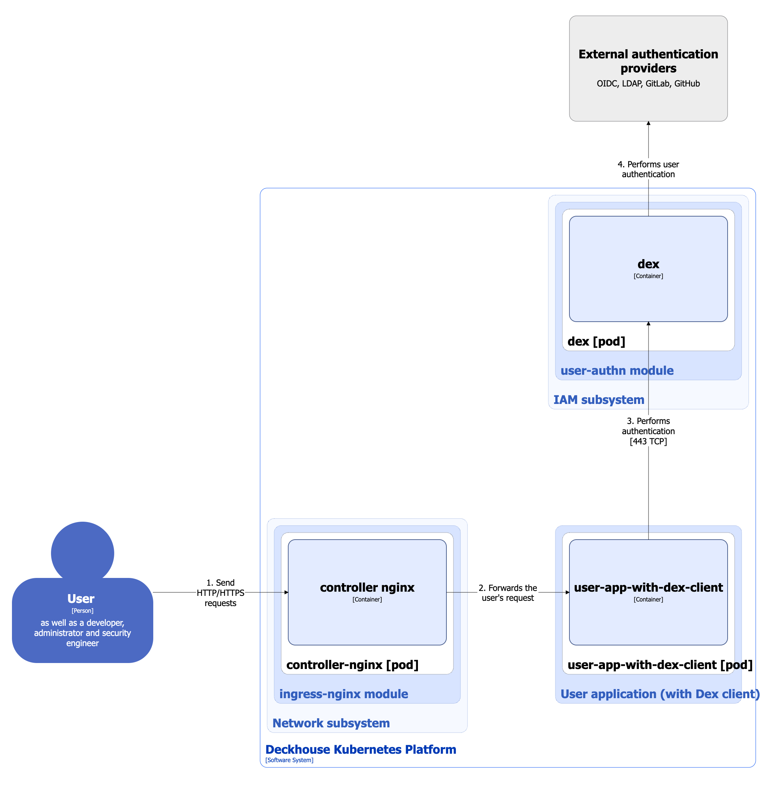
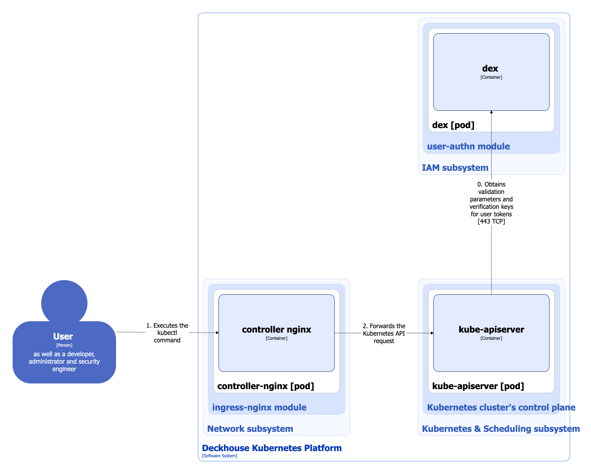

The `user-authn` module implements a unified authentication system integrated with Kubernetes and the web interfaces used by modules of Deckhouse Kubernetes Platform (DKP), such as the [`console`](/modules/console/) module.

For more details about module configuration and usage examples, refer to the [corresponding documentation section](/modules/user-authn/).

## Module architecture


The following simplifications are made in the diagram:

* The diagram shows containers in different pods interacting directly with each other. In reality, they communicate via the corresponding Kubernetes Services (internal load balancers). Service names are omitted if they are obvious from the diagram context. Otherwise, the Service name is shown above the arrow.
* Pods may run multiple replicas. However, each pod is shown as a single replica in the diagram.


In DKP, two authentication schemes are used for platform services and user applications:

* Using dex-authenticator
* Using the Dex client

The architecture of the [`user-authn`](/modules/user-authn/) module at Level 2 of the C4 model and its interactions with other DKP components are shown in the following diagrams.

Using dex-authenticator:

<!--- Source: structurizr code from https://fox.flant.com/team/d8-system-design/doc/-/tree/main/architecture/diagrams/C4_EN --->

Using the Dex client (for simplicity, the interaction between the `prometheus-main` module and dex is not shown in the diagram):

<!--- Source: structurizr code from https://fox.flant.com/team/d8-system-design/doc/-/tree/main/architecture/diagrams/C4_EN --->

When connecting to the Kubernetes API using `kubectl` or other Kubernetes clients with a generated kubeconfig, a separate authentication scheme is used. It is described in detail in the [corresponding documentation section](authentication.html#connecting-to-kubernetes-api-using-a-generated-kubeconfig):

<!--- Source: structurizr code from https://fox.flant.com/team/d8-system-design/doc/-/tree/main/architecture/diagrams/C4_EN --->

## Module components

The module consists of the following components:

1. **Dex**: Federated OpenID Connect provider that supports static users and integration with external authentication providers such as SAML, GitLab, or GitHub.

   It consists of the following containers:

   * **dex**: Main container implementing Dex functions.
   * **kube-rbac-proxy**: Sidecar container with an authorization proxy based on Kubernetes RBAC that provides secure access to provider metrics.

2. **Dex-authenticator**: [Middleware](https://github.com/oauth2-proxy/oauth2-proxy/blob/master/docs/static/img/simplified-architecture.svg) service used to authenticate requests to applications through the DKP cluster authentication service.

   When the Ingress controller is configured accordingly (using the NGINX `auth_request` module), requests are first forwarded to dex-authenticator for authentication.

   It consists of the following containers:

   * **dex-authenticator**: Main container of the service.
   * **redis**: Sidecar container with a Redis database used for temporary storage of ID tokens and fast access to them (since the database resides in memory).
   * **self-signed-generator**: Init container that generates a self-signed certificate when the pod starts.

## Module interactions

The module interacts with the following components:

1. External authentication providers.
2. **Kube-apiserver**: Authorization of requests to retrieve metrics.

The following external components interact with the module:

1. **Ingress controller**: Forwards authentication requests to dex-authenticator for DKP platform services and user applications.

2. **User applications**: Can authenticate directly with dex (without dex-authenticator) if an OAuth2 client is configured in Dex for the application. For more details about configuring a Dex client, refer to the [`user-authn` module documentation](/modules/user-authn/usage.html#configuring-the-oauth2-client-in-dex-for-connecting-an-application).

3. **Kube-apiserver**: Queries dex when processing Kubernetes API requests made using a kubeconfig file:

   * When starting, kube-apiserver requests the OIDC provider configuration endpoint (Dex in this case) to obtain the `issuer` and the parameters required to validate tokens via the JWKS endpoint.
   * When receiving a request with an ID token, kube-apiserver verifies its signature using the keys obtained from the JWKS endpoint.

   More details about connecting to the Kubernetes API using a generated kubeconfig can be found in the [corresponding documentation page](authentication.html#connecting-to-kubernetes-api-using-a-generated-kubeconfig).

4. **Prometheus-main**: Collects metrics from the dex provider.
