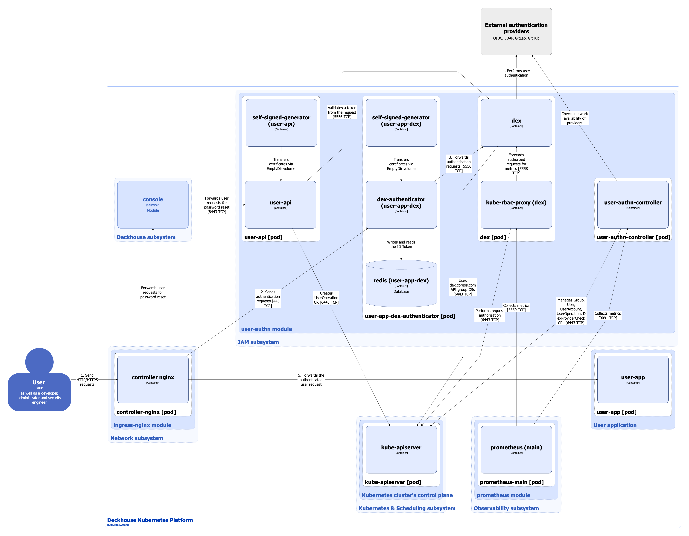
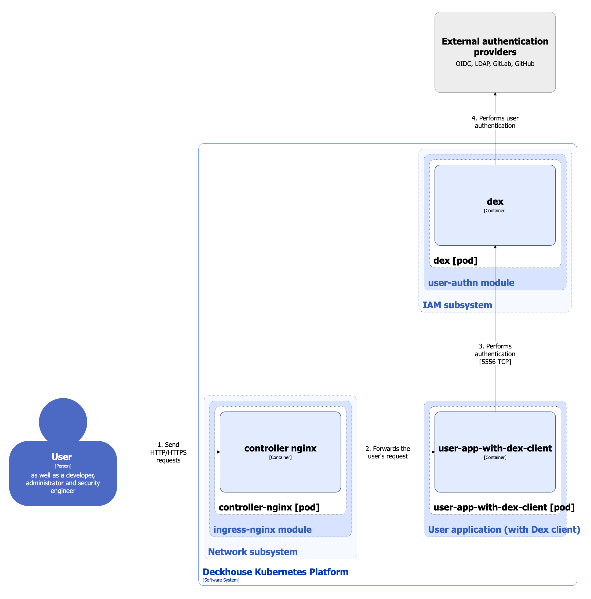
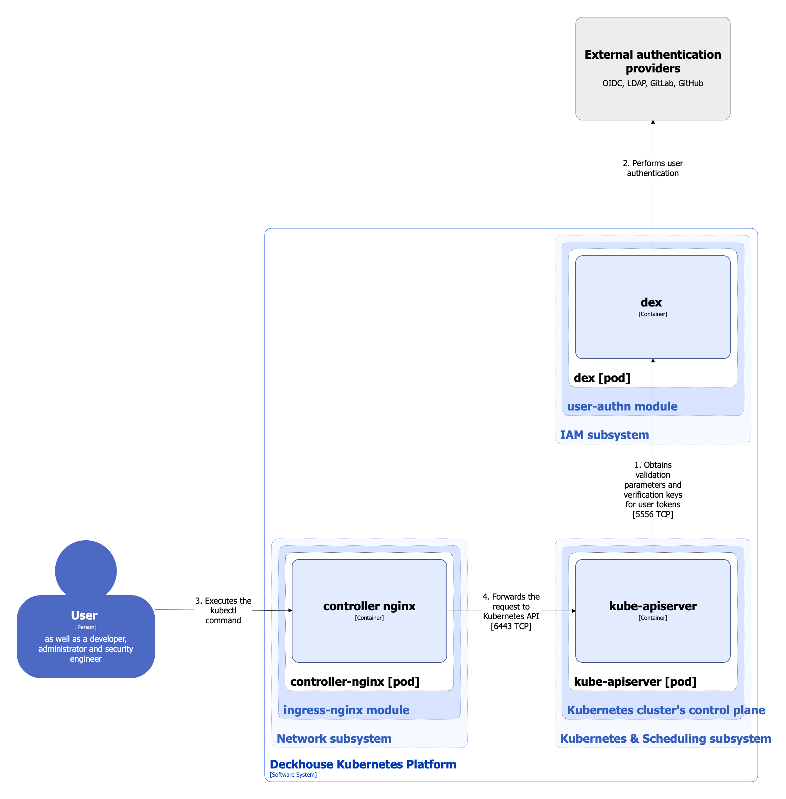
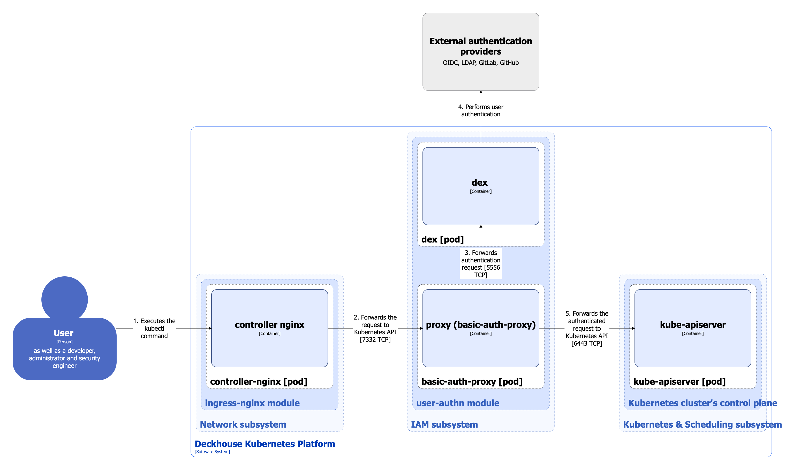

The `user-authn` module implements a unified authentication system integrated with Kubernetes and the web interfaces used by modules of Deckhouse Kubernetes Platform (DKP), such as the [`console`](/modules/console/) module.

For more details about module configuration and usage examples, refer to the [corresponding documentation section](/modules/user-authn/).

## Module architecture


The following simplifications are made in the diagram:

* The diagram shows containers in different pods interacting directly with each other. In reality, they communicate via the corresponding Kubernetes Services (internal load balancers). Service names are omitted if they are obvious from the diagram context. Otherwise, the Service name is shown above the arrow.
* Pods may run multiple replicas. However, each pod is shown as a single replica in the diagram.


In DKP, two authentication schemes are used for platform services and user applications:

* Using dex-authenticator
* Using the Dex client

The architecture of the [`user-authn`](/modules/user-authn/) module at Level 2 of the C4 model and its interactions with other DKP components are shown in the following diagrams.

Using dex-authenticator:


For simplicity, the following diagrams show only the components and their interactions that distinguish these diagrams from the variant using dex-authenticator.


Using the Dex client:

When connecting to the Kubernetes API using `kubectl` or other Kubernetes clients with a generated kubeconfig, a separate authentication schemes are used:

* Token authentication. It is described in detail in the [corresponding documentation section](authentication.html#connecting-to-kubernetes-api-using-a-generated-kubeconfig).
* Basic authentication. An example of configuring basic authentication using an LDAP provider is described in [the module documentation](/modules/user-authn/usage.html#configuring-basic-authentication) section.

Using a generated kubeconfig and a token authentication:

Using a generated kubeconfig and a basic authentication:

## Module components

The module consists of the following components:

1. **Dex**: Federated OpenID Connect provider that supports static users and integration with external authentication providers such as SAML, GitLab, or GitHub. The module uses a modified version of [Dex](https://github.com/dexidp/dex) to support:

   * Groups for static user accounts.
   * Two-factor authentication (2FA).
   * Password policies.
   * Forced password change.
   * Kerberos (SPNEGO) support for the LDAP connector. When enabled, Dex accepts `Authorization: Negotiate` tickets, validates them with a service keytab, and completes the login without rendering the password form, etc.

   For actual list of Dex modifications, refer to the [module repository](https://github.com/deckhouse/deckhouse/blob/main/modules/150-user-authn/images/dex/patches/README.md).

   It consists of the following containers:

   * **dex**: Main container implementing Dex functions.
   * **kube-rbac-proxy**: Sidecar container with an authorization proxy based on Kubernetes RBAC that provides secure access to provider metrics. It is an [open source project](https://github.com/brancz/kube-rbac-proxy).

1. **Dex-authenticator**: [Middleware](https://github.com/oauth2-proxy/oauth2-proxy/blob/master/docs/static/img/simplified-architecture.svg) service used to authenticate requests to applications through the DKP cluster authentication service.

   When the Ingress controller is configured accordingly (using the NGINX `auth_request` module), requests are first forwarded to dex-authenticator for authentication.

   It consists of the following containers:

   * **dex-authenticator**: Main container of the service.
   * **redis**: Sidecar container with a Redis database used for temporary storage of ID tokens and fast access to them (since the database resides in memory).
   * **self-signed-generator**: Init container that generates a self-signed certificate when the pod starts.

1. **User-authn-controller**: A controller that consists of a single **user-authn-controller** container and performing following operations:

   * Manages module custom resources:

     * [Group](/modules/user-authn/cr.html#group): A resource that describes user group.
     * [User](/modules/user-authn/cr.html#user): A resource that describes static user.
     * UserAccount: A resource that describes view of Dex Password and OfflineSessions objects for the DKP web UI.
     * [UserOperation](/modules/user-authn/cr.html#useroperation): A resource that describes an operation to be applied to a user (password reset, 2FA reset, lock/unlock).
     * DexProviderCheck: A resource that describes a one-time connectivity check for a DexProvider. The check verifies that the provider exists, is enabled, Dex is reachable, and the provider endpoint is reachable. It does not perform a full user authentication flow.

   * Deletes expired Users (users whose [`status.expireAt`](/modules/user-authn/cr.html#user-v1-status-expireat) field is in the past).
   * Checks periodically an availability of configured external authentication providers (using DexProviderCheck custom resources).
   * Finds out conflicting TLS-certificates [in external LDAP provider configuration settings](/modules/user-authn/cr.html#dexprovider-v1-spec-ldap) and exports the corresponding metric.

   User-authn-controller uses `dex.coreos.com` API group custom resources (AuthCode, AuthRequest, Password, OfflineSession, Refreshtoken, etc. used by Dex as a storage) as a backend to manage module custom resources.

1. **User-api**: A component that implements a self-service for users to reset a password for their user account. The service is available to the user only via the DKP web interface and does not require platform administrator rights. The password can only be reset for the current user. User-api validates the incoming requests tokens in dex component. To perform this operation, the component creates UserOperation custom resource of the `ResetPassword` type, which is processed by the user-authn-controller component.

It consists of the following containers:

* **self-signed-generator**: Init container that generates a self-signed certificate when the pod starts.
* **user-api**: Main container of the service.

1. **Basic-auth-proxy**: An optional component consisting of a single **proxy** container, which is launched when basic authentication is enabled in the settings of one of an external providers. When connecting to the Kubernetes API, the basic-auth-proxy component performs basic user authentication with external providers via dex, caches credentials validation results, and proxies authenticated requests to the Kubernetes API.

## Module interactions

The module interacts with the following components:

1. **External authentication providers**.
1. **Kube-apiserver**:

   * Manages module custom resources.
   * Authorizes requests for metrics.

The following external components interact with the module:

1. **Ingress controller**: Forwards authentication requests to dex-authenticator for DKP platform services and user applications.

1. **User applications**: Can authenticate directly with dex (without dex-authenticator) if an OAuth2 client is configured in Dex for the application. For more details about configuring a Dex client, refer to the [`user-authn` module documentation](/modules/user-authn/usage.html#configuring-the-oauth2-client-in-dex-for-connecting-an-application).

1. **Kube-apiserver**: Queries dex when processing Kubernetes API requests made using a kubeconfig file:

   * When starting, kube-apiserver requests the OIDC provider configuration endpoint (Dex in this case) to obtain the `issuer` and the parameters required to validate tokens via the JWKS endpoint.
   * When receiving a request with an ID token, kube-apiserver verifies its signature using the keys obtained from the JWKS endpoint, then it compares token claims against the server configuration.

   More details about connecting to the Kubernetes API using a generated kubeconfig can be found in the [corresponding documentation page](authentication.html#connecting-to-kubernetes-api-using-a-generated-kubeconfig).

1. **Prometheus-main**: Collects metrics from the dex provider.
1. **[Deckhouse web UI](/modules/console/)**: Forwards user requests for password reset.
