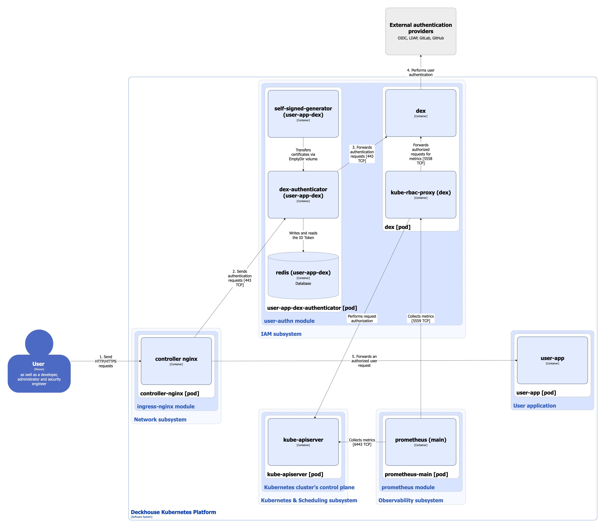
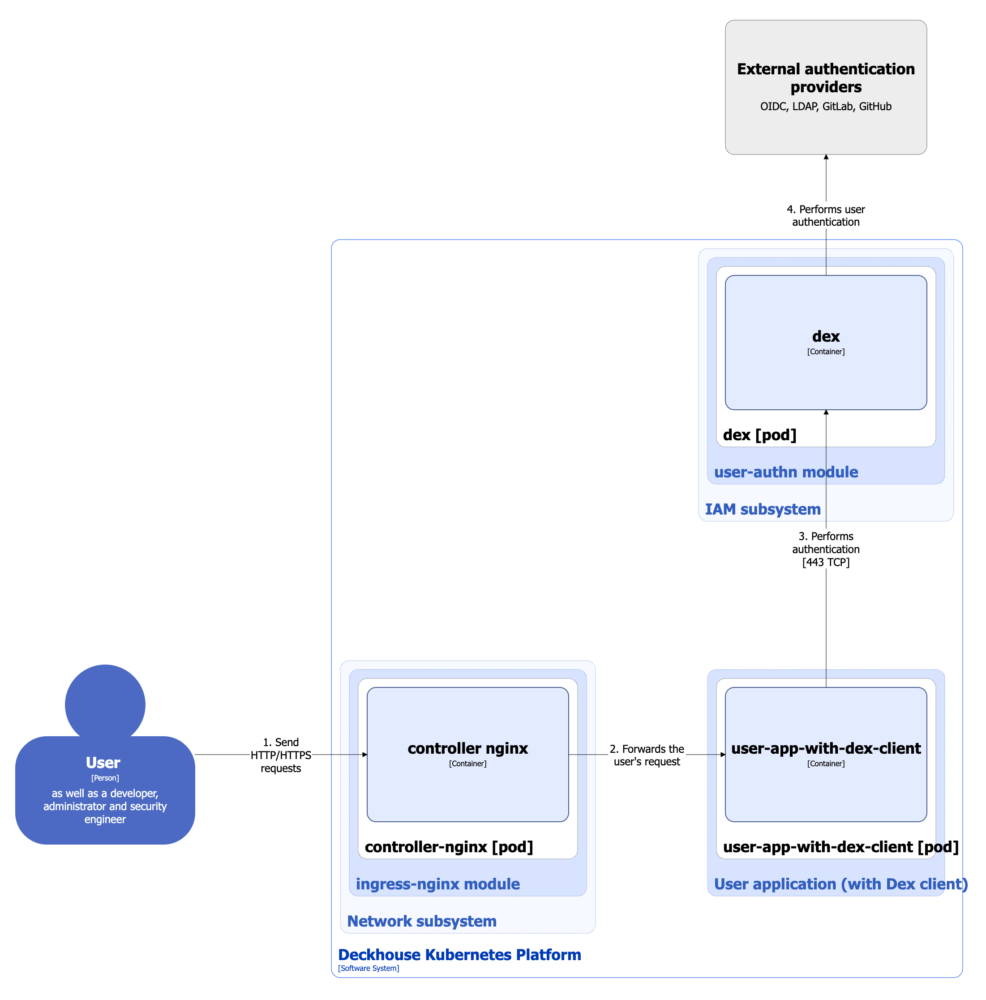

Модуль отвечает за единую систему аутентификации, интегрированную с Kubernetes и веб-интерфейсами, используемыми в других модулях, например, [console](/modules/console/stable/).

Подробнее с настройками модуля и примерами его использования можно ознакомиться в соответствующем [разделе документации](/modules/user-authn/).

## Архитектура модуля


Для лучшего восприятия схемы на ней допущены следующие упрощения:

* На схеме выглядит так, что контейнеры подов взаимодействуют с контейнерами других подов напрямую. На самом деле они взаимодействуют через соответствующие им сервисы Kubernetes (внутренние балансировщики). Если взаимодействие происходит через специфичный сервис, в подписи над стрелкой указано название сервиса.
* Поды могут быть запущены несколькими репликами. На схеме все поды изображены в одной реплике.


В DKP как для служебных сервисов, так и для пользовательских приложений используются две схемы аутентификации:
* с использованием **dex-authenticator**;
* с использованием клиента **Dex**.

Архитектура модуля **user-authn** на уровне 2 модели C4 и его взаимодействия с другими компонентами платформы изображены на следующих диаграммах:

Вариант с использованием **dex-authenticator**:

<!--- Source: structurizr code from https://fox.flant.com/team/d8-system-design/doc/-/tree/main/architecture/diagrams/C4 --->

Вариант с использованием клиента **Dex** (для упрощения убрали взаимодействие модуля **prometheus-main** с **dex**):

<!--- Source: structurizr code from https://fox.flant.com/team/d8-system-design/doc/-/tree/main/architecture/diagrams/C4 --->

При подключении к Kubernetes API утилитой **kubectl** или другими клиентами Kubernetes с помощью сгенерированного `kubeconfig` используется своя схема аутентификации, подробно описанная в следующем [разделе документации](/products/kubernetes-platform/documentation/v1/architecture/authentication.html#%D0%BA%D0%B0%D0%BA-%D1%80%D0%B0%D0%B1%D0%BE%D1%82%D0%B0%D0%B5%D1%82-%D0%BF%D0%BE%D0%B4%D0%BA%D0%BB%D1%8E%D1%87%D0%B5%D0%BD%D0%B8%D0%B5-%D0%BA-kubernetes-api-%D1%81-%D0%BF%D0%BE%D0%BC%D0%BE%D1%89%D1%8C%D1%8E-%D1%81%D0%B3%D0%B5%D0%BD%D0%B5%D1%80%D0%B8%D1%80%D0%BE%D0%B2%D0%B0%D0%BD%D0%BD%D0%BE%D0%B3%D0%BE-kubeconfig):

<!--- Source: structurizr code from https://fox.flant.com/team/d8-system-design/doc/-/tree/main/architecture/diagrams/C4 --->

## Компоненты модуля

Модуль состоит из следующих компонентов:

1. **dex** — федеративный OpenID Connect провайдер, поддерживающий работу со статическими пользователями и с возможностью подключения к различным внешним провайдерам аутентификации, например, SAML, GitLab, GitHub. В свою очередь состоит из следующих контейнеров:

   * **dex** - собственно провайдер **dex**.
   * **kube-rbac-proxy** - sidecar-контейнер с авторизирующим прокси на основе Kubernetes RBAC для организации защищенного доступа к метрикам провайдера.

2. **dex-authenticator** - это [middleware](https://github.com/oauth2-proxy/oauth2-proxy/blob/master/docs/static/img/simplified-architecture.svg)-сервис для аутентификации запросов к приложениям через сервис аутентификации кластера DKP. При соответствующей настройке Ingress-контроллера (через модуль auth_request NGINX) запросы сначала пересылаются в **dex-authenticator** для аутентификации. В свою очередь состоит из следующих контейнеров:

   * **dex-authenticator** - собственно сам **dex-authenticator**.
   * **redis** - sidecar-контейнер c базой-данных Redis, используется для временного хранения ID Token'ов и быстрого к ним доступа (за счет того, что база размещена в памяти).
   * **self-signed-generator** - init-контейнер, генерирует самоподписанный сертификат при старте пода.

## Взаимодействия модуля

Модуль взаимодействует с:

1. Внешними провайдерами аутентификации.
2. **kube-apiserver** - авторизация запросов на получение метрик.

С модулем взаимодействуют следующие внешние для него компоненты:

1. **Ingress-контроллер** - пересылка в **dex-authenticator** запросов на аутентификацию в служебных сервисах платформы и в пользовательских приложениях.
2. Пользовательские приложения - могут аутентифицироваться в **dex** напрямую (без **dex-authenticator**), если настроить OAuth2-клиент в **Dex** (сокращенно клиент **Dex**) для подключения приложения. Подробнее с настройкой клиента **Dex** можно ознакомиться в [документации к модулю user-authn](/modules/user-authn/usage.html#%D0%BD%D0%B0%D1%81%D1%82%D1%80%D0%BE%D0%B9%D0%BA%D0%B0-oauth2-%D0%BA%D0%BB%D0%B8%D0%B5%D0%BD%D1%82%D0%B0-%D0%B2-dex-%D0%B4%D0%BB%D1%8F-%D0%BF%D0%BE%D0%B4%D0%BA%D0%BB%D1%8E%D1%87%D0%B5%D0%BD%D0%B8%D1%8F-%D0%BF%D1%80%D0%B8%D0%BB%D0%BE%D0%B6%D0%B5%D0%BD%D0%B8%D1%8F)
3. **kube-apiserver** - обращается в **dex** при запросах к Kubernetes API с помощью `kubeconfig`-файла:

   * При старте **kube-apiserver** запрашивает конфигурационный эндпоинт OIDC-провайдера (в данном случае — Dex), чтобы получить информацию об issuer и параметры для валидации токенов через JWKS-эндпоинт.
   * При получении запроса с ID token, **kube-apiserver** проверяет его подпись, используя ключи, полученные с JWKS-эндпоинта.

   Подробнее с тем, как работает подключение к Kubernetes API с помощью сгенерированного `kubeconfig`, можно ознакомиться  [на следующей странице](/products/kubernetes-platform/documentation/v1/architecture/authentication.html#%D0%BA%D0%B0%D0%BA-%D1%80%D0%B0%D0%B1%D0%BE%D1%82%D0%B0%D0%B5%D1%82-%D0%BF%D0%BE%D0%B4%D0%BA%D0%BB%D1%8E%D1%87%D0%B5%D0%BD%D0%B8%D0%B5-%D0%BA-kubernetes-api-%D1%81-%D0%BF%D0%BE%D0%BC%D0%BE%D1%89%D1%8C%D1%8E-%D1%81%D0%B3%D0%B5%D0%BD%D0%B5%D1%80%D0%B8%D1%80%D0%BE%D0%B2%D0%B0%D0%BD%D0%BD%D0%BE%D0%B3%D0%BE-kubeconfig).
4. **prometheus-main** - сбор метрик провайдера **dex**.
