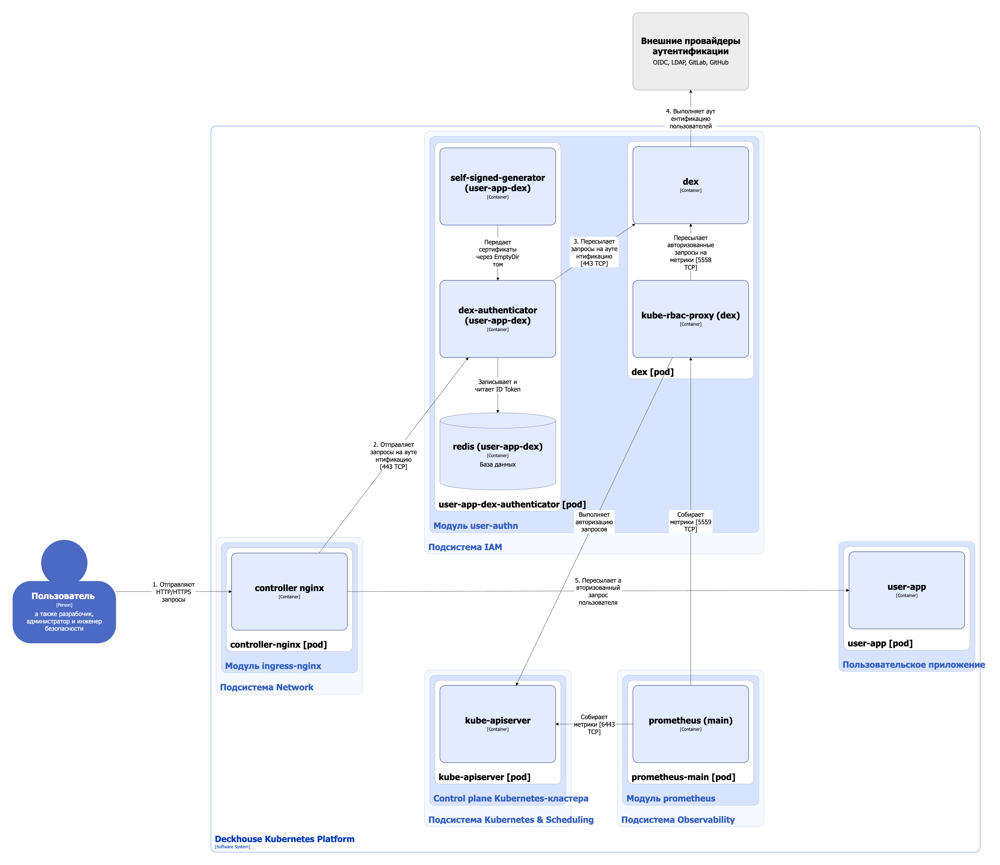
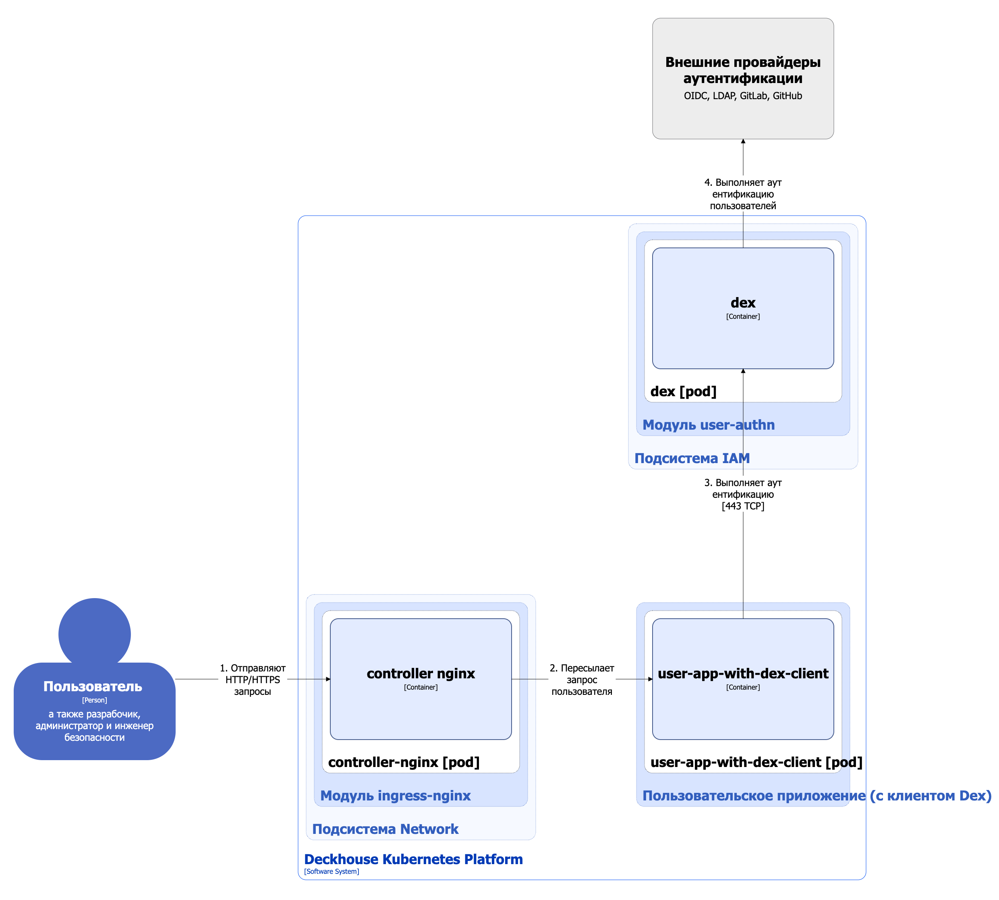
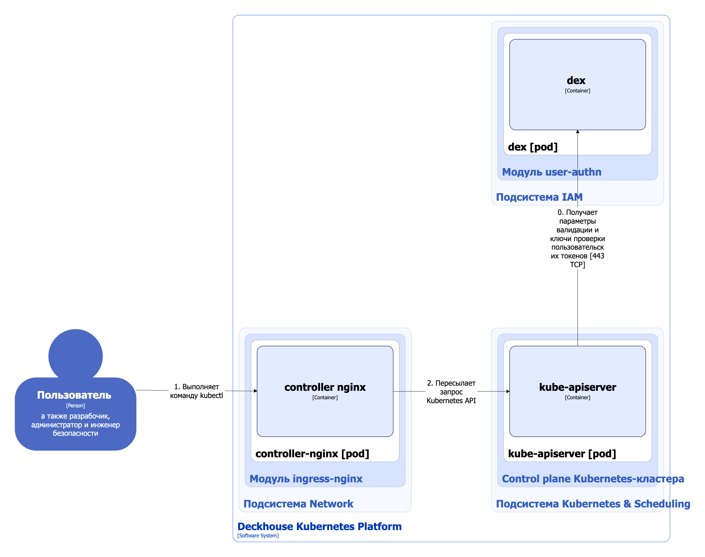

Модуль `user-authn` реализует единую систему аутентификации, интегрированную с Kubernetes и веб-интерфейсами, используемыми в модулях Deckhouse Kubernetes Platform (DKP), например, в модуле [`console`](/modules/console/).

Подробнее с настройками модуля и примерами его использования можно ознакомиться в [соответствующем разделе документации](/modules/user-authn/).

## Архитектура модуля


Для упрощения схемы приняты следующие допущения:

* На схеме показано, что контейнеры разных подов взаимодействуют друг с другом напрямую. Фактически они взаимодействуют через соответствующие сервисы Kubernetes (внутренние балансировщики). Названия сервисов не указываются, если они очевидны из контекста. В остальных случаях название сервиса указано над стрелкой.
* Поды могут быть запущены в нескольких репликах, однако на схеме все поды изображены в одной реплике.


В DKP для служебных сервисов и пользовательских приложений используются две схемы аутентификации:

* с использованием dex-authenticator;
* с использованием клиента Dex.

Архитектура модуля [`user-authn`](/modules/user-authn/) на уровне 2 модели C4 и его взаимодействия с другими компонентами DKP изображены на следующих диаграммах.

Вариант с использованием dex-authenticator:

<!--- Source: structurizr code from https://fox.flant.com/team/d8-system-design/doc/-/tree/main/architecture/diagrams/C4_RU --->

Вариант с использованием клиента Dex (для упрощения на схеме не показано взаимодействие модуля `prometheus-main` с dex):

<!--- Source: structurizr code from https://fox.flant.com/team/d8-system-design/doc/-/tree/main/architecture/diagrams/C4_RU --->

При подключении к API Kubernetes с помощью утилиты `kubectl` или других клиентов Kubernetes с использованием сгенерированного kubeconfig используется отдельная схема аутентификации. Она подробно описана в [соответствующем разделе документации](authentication.html#подключение-к-api-kubernetes-с-помощью-сгенерированного-kubeconfig):

<!--- Source: structurizr code from https://fox.flant.com/team/d8-system-design/doc/-/tree/main/architecture/diagrams/C4_RU --->

## Компоненты модуля

Модуль состоит из следующих компонентов:

1. **Dex** — федеративный провайдер OpenID Connect, поддерживающий работу со статическими пользователями и интеграцию с внешними провайдерами аутентификации, такими как SAML, GitLab или GitHub.

   Состоит из следующих контейнеров:

   * **dex** — основной контейнер, реализующий функции Dex;
   * **kube-rbac-proxy** — сайдкар-контейнер с авторизующим прокси на основе Kubernetes RBAC для организации защищенного доступа к метрикам провайдера.

2. **Dex-authenticator** — [middleware](https://github.com/oauth2-proxy/oauth2-proxy/blob/master/docs/static/img/simplified-architecture.svg)-сервис для аутентификации запросов к приложениям через сервис аутентификации кластера DKP.

   При соответствующей настройке Ingress-контроллера (через модуль `auth_request` NGINX) запросы сначала направляются в dex-authenticator для аутентификации.

   Состоит из следующих контейнеров:

   * **dex-authenticator** — основной контейнер сервиса;
   * **redis** — сайдкар-контейнер c базой данных Redis, используемый для временного хранения ID Token и быстрого доступа к ним (за счет размещения базы в памяти);
   * **self-signed-generator** — init-контейнер, генерирующий самоподписанный сертификат при запуске пода.

## Взаимодействия модуля

Модуль взаимодействует со следующими компонентами:

1. Внешние провайдеры аутентификации.
2. **Kube-apiserver** — авторизация запросов на получение метрик.

С модулем взаимодействуют следующие внешние компоненты:

1. **Ingress-контроллер** — перенаправляет в dex-authenticator запросы на аутентификацию в служебных сервисах DKP и в пользовательских приложениях.

2. **Пользовательские приложения** — могут аутентифицироваться в dex напрямую (без dex-authenticator), если для приложения настроен OAuth2-клиент в Dex. Подробнее с настройкой клиента Dex можно ознакомиться в [документации модуля `user-authn`](/modules/user-authn/usage.html#настройка-oauth2-клиента-в-dex-для-подключения-приложения).

3. **Kube-apiserver** — обращается в dex при обработке запросов к API Kubernetes, выполняемых с использованием файла kubeconfig:

   * при запуске kube-apiserver запрашивает конфигурационный эндпоинт OIDC-провайдера (в данном случае — Dex), чтобы получить информацию об `issuer` и параметры для проверки токенов через JWKS-эндпоинт;
   * при получении запроса с ID token kube-apiserver проверяет его подпись с использованием ключей, полученных с JWKS-эндпоинта.

   Подробнее о тем, как работает подключение к API Kubernetes с помощью сгенерированного kubeconfig, можно ознакомиться на [соответствующей странице документации](authentication.html#подключение-к-api-kubernetes-с-помощью-сгенерированного-kubeconfig).

4. **Prometheus-main** — сбор метрик провайдера dex.
