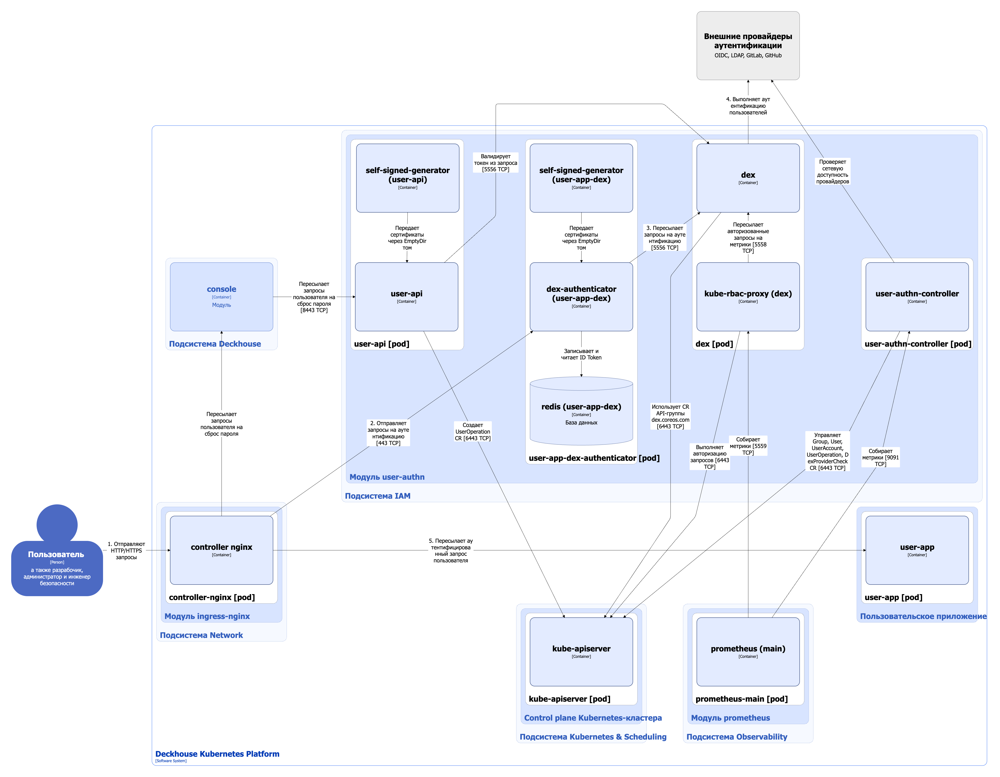
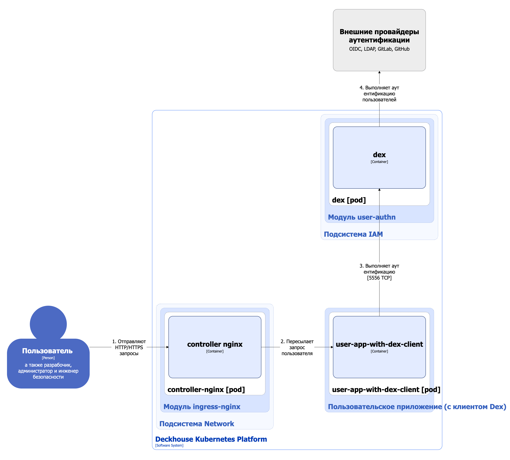
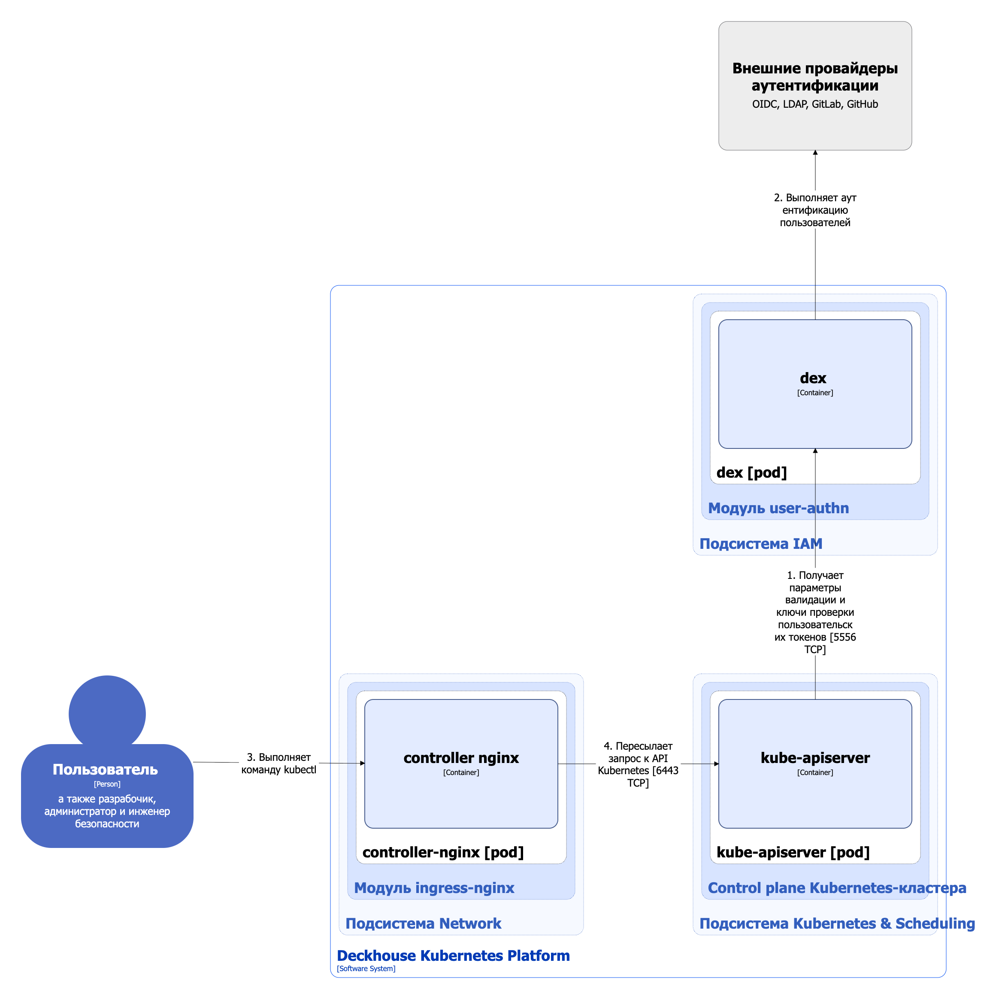
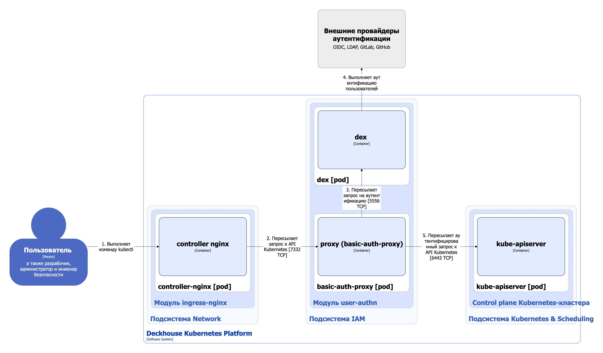

Модуль `user-authn` реализует единую систему аутентификации, интегрированную с Kubernetes и веб-интерфейсами, используемыми в модулях Deckhouse Kubernetes Platform (DKP), например, в модуле [`console`](/modules/console/).

Подробнее с настройками модуля и примерами его использования можно ознакомиться в [соответствующем разделе документации](/modules/user-authn/).

## Архитектура модуля


Для упрощения схемы приняты следующие допущения:

* На схеме показано, что контейнеры разных подов взаимодействуют друг с другом напрямую. Фактически они взаимодействуют через соответствующие сервисы Kubernetes (внутренние балансировщики). Названия сервисов не указываются, если они очевидны из контекста. В остальных случаях название сервиса указано над стрелкой.
* Поды могут быть запущены в нескольких репликах, однако на схеме все поды изображены в одной реплике.


В DKP для служебных сервисов и пользовательских приложений используются две схемы аутентификации:

* с использованием dex-authenticator;
* с использованием клиента Dex.

Архитектура модуля [`user-authn`](/modules/user-authn/) на уровне 2 модели C4 и его взаимодействия с другими компонентами DKP изображены на следующих диаграммах.

Вариант с использованием dex-authenticator:


Для упрощения на следующих схемах показаны только компоненты и их взаимодействия, отличающие эти схемы от варианта с использованием dex-authenticator.


Вариант с использованием клиента Dex:

При подключении к API Kubernetes с помощью утилиты `kubectl` или других клиентов Kubernetes с использованием сгенерированного kubeconfig используются отдельные схемы аутентификации:

* аутентификация по токенам, подробно описана в [соответствующем разделе документации](authentication.html#подключение-к-api-kubernetes-с-помощью-сгенерированного-kubeconfig);
* базовая аутентификация (Basic Authentication), пример настройки базовой аутентификации с использованием провайдера LDAP приведён [в разделе документации модуля](/modules/user-authn/usage.html#%D0%BD%D0%B0%D1%81%D1%82%D1%80%D0%BE%D0%B9%D0%BA%D0%B0-%D0%B1%D0%B0%D0%B7%D0%BE%D0%B2%D0%BE%D0%B9-%D0%B0%D1%83%D1%82%D0%B5%D0%BD%D1%82%D0%B8%D1%84%D0%B8%D0%BA%D0%B0%D1%86%D0%B8%D0%B8).

Вариант подключения к API Kubernetes с аутентификацией по токенам:

Вариант подключения к API Kubernetes с базовой аутентификацией:

## Компоненты модуля

Модуль состоит из следующих компонентов:

1. **Dex** — федеративный провайдер OpenID Connect, поддерживающий работу со статическими пользователями и интеграцию с внешними провайдерами аутентификации, такими как SAML, GitLab или GitHub. Dex также является оператором Kubernetes, управляющий кастомными ресурсами API-группы `dex.coreos.com` AuthCode, AuthRequest,Password, OfflineSession, Refreshtoken и т.д. Модуль использует модифицированную версию [Dex](https://github.com/dexidp/dex) для поддержки:

   * групп для статических учетных записей пользователей и провайдера Bitbucket Cloud (параметр [`bitbucketCloud`](/modules/user-authn/cr.html#dexprovider-v1-spec-bitbucketcloud));
   * передачи параметра `group` клиентам;
   * механизма `obsolete tokens`, который позволяет избежать состояния гонки при продлении токена OIDC-клиентом;
   * SPNEGO (Kerberos) для LDAP‑коннектора. При использовании этого механизма Dex принимает билеты по заголовку `Authorization: Negotiate`, валидирует их по keytab, и завершает вход без отображения формы ввода логина/пароля.

   Состоит из следующих контейнеров:

   * **dex** — основной контейнер, реализующий функции Dex; 
   * **kube-rbac-proxy** — сайдкар-контейнер с авторизующим прокси на основе Kubernetes RBAC для организации защищенного доступа к метрикам провайдера. Является [Open Source-проектом](https://github.com/brancz/kube-rbac-proxy).

1. **Dex-authenticator** — [middleware](https://github.com/oauth2-proxy/oauth2-proxy/blob/master/docs/static/img/simplified-architecture.svg)-сервис для аутентификации запросов к приложениям через сервис аутентификации кластера DKP.

   При соответствующей настройке Ingress-контроллера (через модуль `auth_request` NGINX) запросы сначала направляются в dex-authenticator для аутентификации.

   Состоит из следующих контейнеров:

   * **dex-authenticator** — основной контейнер сервиса;
   * **redis** — сайдкар-контейнер c базой данных Redis, используемый для временного хранения ID Token и быстрого доступа к ним (за счет размещения базы в памяти);
   * **self-signed-generator** — init-контейнер, генерирующий самоподписанный сертификат при запуске пода.

1. **User-authn-controller** — контроллер, состоящий из одного контейнера **user-authn-controller** и выполняющий следующие операции:

   * управление кастомными ресурсами модуля:
     
     * [Group](/modules/user-authn/cr.html#group) — ресурс, описывающий статическую группу;
     * [User](/modules/user-authn/cr.html#user) — ресурс, описывающий статического пользователя;
     * UserAccount — ресурс, описывающий представление объектов Dex Password и OfflineSessions для веб-интерфейса DKP;
     * [UserOperation](/modules/user-authn/cr.html#useroperation) — ресурс, описывающий операции над пользователем (сброс пароля, сброс 2FA, блокировка/разблокировка).

   * удаление пользователей с истекшим сроком действия учетной записи (у которых значение поля [`status.expireAt`](/modules/user-authn/cr.html#user-v1-status-expireat) раньше текущего времени);
   * периодическая проверка сетевой доступности настроенных внешних провайдеров аутентификации;
   * выявление конфликтующих настроек TLS-сертификатов [в конфигурации подключения стороннего провайдера LDAP](/modules/user-authn/cr.html#dexprovider-v1-spec-ldap) и экспорт соответствующей метрики.

   User-authn-controller при управлении кастомными ресурсами модуля использует в качестве бэкенда кастомные ресурсы API-группы `dex.coreos.com`, управляемые провайдером Dex.
     
1. **User-api** — компонент, реализующий сервис сброса пользователем пароля своей учетной записи. Сервис доступен пользователю только через веб-интерфейс DKP и не требует прав администратора платформы. Сбросить можно пароль только для текущего пользователя. User-api валидирует токены поступающих запросов в dex. Для выполнения данной операции компонент создает кастомный ресурс UserOperation с типом `ResetPassword`, который обрабатывается компонентом user-authn-controller.

   Состоит из следующих контейнеров:

   * **self-signed-generator** — init-контейнер, генерирующий самоподписанный сертификат при запуске пода;
   * **user-api** — основной контейнер сервиса.

1. **Basic-auth-proxy** — опциональный компонент, состоящий из одного контейнера **proxy**, который запускается при включении базовой аутентификации в настройках одного из внешних провайдеров. При подключении к API Kubernetes компонент basic-auth-proxy выполняет базовую аутентификацию пользователей во внешних провайдерах через dex, кеширует пароли и проксирует аутентифицированные запросы в API Kubernetes.

## Взаимодействия модуля

Модуль взаимодействует со следующими компонентами:

1. **Внешние провайдеры аутентификации**.
1. **Kube-apiserver**:
   
   * управление кастомными ресурсами модуля;
   * авторизация запросов на получение метрик.

С модулем взаимодействуют следующие внешние компоненты:

1. **Ingress-контроллер** — перенаправляет в dex-authenticator запросы на аутентификацию в служебных сервисах DKP и в пользовательских приложениях.
1. **Пользовательские приложения** — могут аутентифицироваться в dex напрямую (без dex-authenticator), если для приложения настроен OAuth2-клиент в Dex. Подробнее с настройкой клиента Dex можно ознакомиться в [документации модуля `user-authn`](/modules/user-authn/usage.html#настройка-oauth2-клиента-в-dex-для-подключения-приложения).
1. **Kube-apiserver** — обращается в dex при обработке запросов к API Kubernetes, выполняемых с использованием файла kubeconfig:

   * при запуске kube-apiserver запрашивает конфигурационный эндпоинт OIDC-провайдера (в данном случае — Dex), чтобы получить информацию об `issuer` и параметры для проверки токенов через JWKS-эндпоинт;
   * при получении запроса с ID token kube-apiserver проверяет его подпись с использованием ключей, полученных с JWKS-эндпоинта, а затем проверяет значения claim'ов токена на соответствие конфигурации сервера.

   Подробнее о том, как работает подключение к API Kubernetes с помощью сгенерированного kubeconfig, можно ознакомиться на [соответствующей странице документации](authentication.html#подключение-к-api-kubernetes-с-помощью-сгенерированного-kubeconfig).

1. **Prometheus-main** — сбор метрик компонентов модуля.
1. **[Веб-интерфейс Deckhouse](/modules/console/)** — пересылает запросы пользователей на сброс пароля.