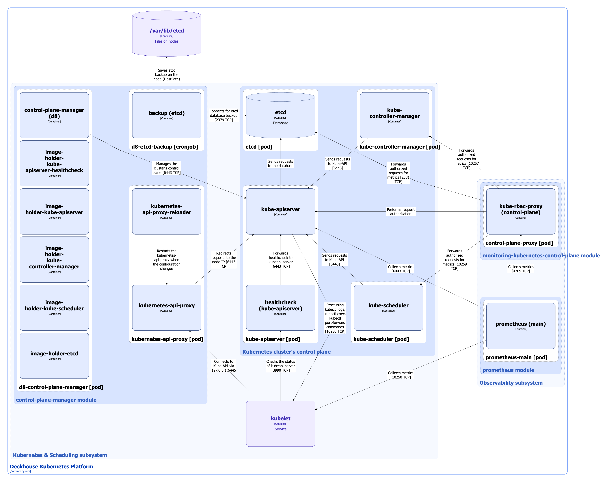

## Модуль control-plane-manager

Управление компонентами control plane кластера осуществляется с помощью модуля [`control-plane-manager`](/modules/control-plane-manager/), который запускается на всех master-узлах кластера (узлах с лейблом `node-role.kubernetes.io/control-plane: ""`).

Функции управления control plane:

* **Управление сертификатами** — выпуск, продление и обновление сертификатов, необходимых для работы control plane. Позволяет автоматически поддерживать безопасную конфигурацию control plane и оперативно добавлять дополнительные альтернативные имена субъекта (Subject Alternative Name, SAN) для организации защищенного доступа к API Kubernetes.
* **Настройка компонентов** — автоматическое создание необходимых конфигураций и манифестов компонентов control plane.
* **Обновление и откат версий компонентов (upgrade/downgrade)** — поддержание в кластере согласованных версий компонентов.
* **Управление конфигурацией etcd-кластера и его членов** — масштабирование master-узлов и миграция между одномастерными и мультимастерными конфигурациями.
* **Настройка kubeconfig** — поддержание актуальной конфигурации для работы `kubectl` на узлах кластера. Генерация, продление и обновление kubeconfig с правами *cluster-admin*, а также создание символьной ссылки для пользователя `root`, чтобы kubeconfig использовался по умолчанию.
* **Расширение работы планировщика** — подключение внешних плагинов через вебхуки с использованием ресурса [KubeSchedulerWebhookConfiguration](/modules/control-plane-manager/cr.html#kubeschedulerwebhookconfiguration). Позволяет использовать продвинутую логику при решении задач планирования нагрузки в кластере, например:

  * размещение подов приложений организации хранилища данных ближе к самим данным;
  * приоритизация узлов в зависимости от их состояния (сетевой нагрузки, состояния подсистемы хранения и т. д.);
  * разделение узлов на зоны, и т. п.

Подробнее с настройками модуля и примерами его использования можно ознакомиться в [документации модуля `control-plane-manager`](/modules/control-plane-manager/).

### Архитектура модуля


Для упрощения схемы приняты следующие допущения:

* На схеме показано, что контейнеры подов взаимодействуют друг с другом напрямую. Фактически они взаимодействуют через соответствующие сервисы Kubernetes (внутренние балансировщики). Если используется конкретный сервис, его название указано над стрелкой.
* Поды могут быть запущены в нескольких репликах. однако на схеме все поды изображены в одной реплике.


Архитектура модуля [`control-plane-manager`](/modules/control-plane-manager/) на уровне 2 модели C4 и его взаимодействия с другими компонентами изображены на следующей диаграмме:

<!--- Source: structurizr code from https://fox.flant.com/team/d8-system-design/doc/-/tree/main/architecture/diagrams/C4 --->

### Компоненты модуля

Модуль состоит из следующих компонентов:

1. **d8-control-plane-manager** (DaemonSet) — управляет компонентами control plane кластера и запускается на всех master-узлах. Состоит из следующих контейнеров:

   * **control-plane-manager** — основной контейнер. Является разработкой компании «Флант».

   * Набор сайдкар-контейнеров для предварительного скачивания образов соответствующих компонентов control plane. Контейнеры стоят на паузе и выполняют только функцию хранения образов:

     * **image-holder-kube-apiserver**;
     * **image-holder-kube-apiserver-healthcheck**;
     * **image-holder-kube-controller-manager**;
     * **image-holder-kube-scheduler**;
     * **image-holder-etcd**.

2. **kubernetes-api-proxy** (статические поды) — на каждом master-узле настраивается дополнительный прокси-сервер, отвечающий на запросы к `localhost`. По умолчанию проксирует запросы к локальному экземпляру **kube-apiserver**, а в случае его недоступности последовательно опрашивает остальные экземпляры **kube-apiserver**. Включает в себя следующие контейнеры:

   * **kubernetes-api-proxy** — прокси-сервер на базе [NGINX](https://github.com/nginx/nginx);
   * **kubernetes-api-proxy-reloader** — сайдкар-контейнер, перезапускающий прокси-сервер при изменении конфигурации. Является разработкой компании «Флант».

3. **d8-etcd-backup** (CronJob) — периодически выполняет резервное копирование базы данных **etcd** кластера. Состоит из контейнера:

   * **backup** — контейнер с shell-скриптом, который через утилиту `etcdctl` создает снимок базы данных и сохраняет его в каталог `/var/lib/etcd` на master-узле (каталог по умолчанию, может быть изменен через [параметры модуля](/modules/control-plane-manager/configuration.html#parameters-etcd-backup)).

### Взаимодействия модуля

Модуль взаимодействует со следующими компонентами:

1. **kube-apiserver**:

   * управление компонентами control-plane кластера;
   * проксирование и балансировка запросов к **kube-apiserver**, отправляемых на адрес `localhost`.

2. **etcd**:

   * управление конфигурацией etcd-кластера и его членов;
   * периодическое резервное копирование базы данных.

С модулем взаимодействуют следующие внешние компоненты:

1. **kubelet** — запросы к **kube-apiserver**, отправляемые на адрес `localhost`, проксируются компонентом **kubernetes-api-proxy** модуля.

## Мониторинг control plane кластера

Мониторинг control plane кластера осуществляется с помощью модуля [`monitoring-kubernetes-control-plane`](/modules/monitoring-kubernetes-control-plane/), который обеспечивает безопасный сбор метрик и предоставляет базовый набор правил мониторинга следующих компонентов кластера:

* **kube-apiserver**;
* **kube-controller-manager**;
* **kube-scheduler**;
* **etcd**.

Подробнее с настройками `monitoring-kubernetes-control-plane` можно ознакомиться в [документации модуля](/modules/monitoring-kubernetes-control-plane/).

### Компоненты модуля monitoring-kubernetes-control-plane

Модуль состоит из одного компонента:

1. **control-plane-proxy** (DaemonSet) — запускается на всех master-узлах кластера и состоит из одного контейнера:

   * **kube-rbac-proxy** — авторизующий прокси на основе Kubernetes RBAC для организации защищенного доступа к метрикам.

### Взаимодействия компонента control-plane-proxy

Control-plane-proxy взаимодействует со следующими компонентами:

1. **kube-apiserver** — авторизация запросов на получение метрик.

2. Компоненты control plane кластера — **control-plane-proxy** пересылает авторизованные запросы на метрики до:

   * **kube-controller-manager**;
   * **kube-scheduler**;
   * **etcd**.

С **control-plane-proxy** взаимодействует **prometheus-main** для сбора метрик компонентов control plane.

Взаимодействие модуля `monitoring-kubernetes-control-plane` с control plane кластера изображено на приведенной выше схеме архитектуры модуля `control-plane-manager`.

### Сбор метрик с kube-apiserver

Метрики **kube-apiserver** собираются **prometheus-main** напрямую. Модуль [`monitoring-kubernetes-control-plane`](/modules/monitoring-kubernetes-control-plane/) добавляет правила сбора этих метрик в конфигурацию **prometheus-main**.
