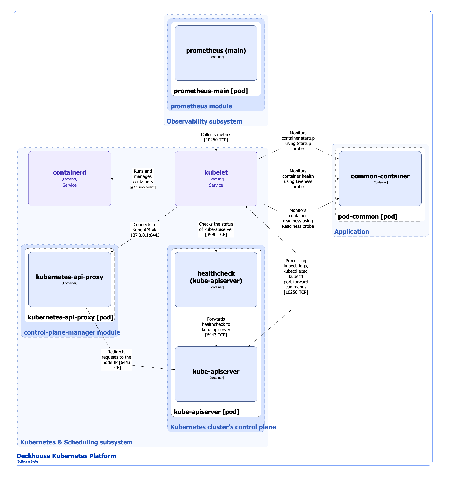

Kubelet is not a control plane component, but it plays a key role in the operation of a Kubernetes cluster.

Kubelet is an agent that runs on every node in a Kubernetes cluster. It ensures that containers in pods are started and run according to their specifications. Kubelet continuously interacts with kube-apiserver to verify and maintain the state of nodes and containers. It is also responsible for starting control plane components.

## Static pod manifests

Kubelet starts control plane components from static pod manifests located in the `/etc/kubernetes/manifests` directory. In Deckhouse Kubernetes Platform, kubelet processes only files with the `.yaml` or `.yml` extension in this directory.

Files with other extensions, such as `kube-apiserver.backup`, `kube-apiserver.yaml.bak`, editor swap files, or other temporary files, are ignored. This prevents accidental processing of backup or non-manifest files as static pod manifests.

## Kubelet interactions


The following simplifications are made in the diagram:

* The diagram shows containers in different pods interacting directly with each other. In reality, they communicate via the corresponding Kubernetes Services (internal load balancers). Service names are omitted if they are obvious from the diagram context. Otherwise, the Service name is shown above the arrow.
* Pods may run multiple replicas. However, each pod is shown as a single replica in the diagram.
* The diagram shows `pod-common`, which represents any pod managed by kubelet.


Kubelet interactions are shown in the following diagram:

<!--- Source: structurizr code from https://fox.flant.com/team/d8-system-design/doc/-/tree/main/architecture/diagrams/C4_EN --->

Kubelet interacts with the following components:

1. **containerd**: Receives commands from kubelet to manage the container lifecycle on the node via the [Container Runtime Interface (CRI)](https://kubernetes.io/docs/concepts/containers/cri/).
1. **kubernetes-api-proxy**: Proxies requests to kube-apiserver that are sent to the `localhost` address. It is part of the [`control-plane-manager`](/modules/control-plane-manager/) module.
1. **pod-common**: Monitors the state of pod containers by performing Startup, Liveness, and Readiness probes according to the pod specification. For more information about probes, see the [Kubernetes documentation](https://kubernetes.io/docs/tasks/configure-pod-container/configure-liveness-readiness-startup-probes).
1. **kube-apiserver-healthcheck**: Checks the health of kube-apiserver.

The following components interact with kubelet:

1. **kube-apiserver**:

   * Retrieving pod logs (the `kubectl logs` command)
   * Executing commands in running pods (the `kubectl exec` command)
   * Port forwarding (the `kubectl port-forward` command)

2. **prometheus-main**: Collects kubelet metrics.
