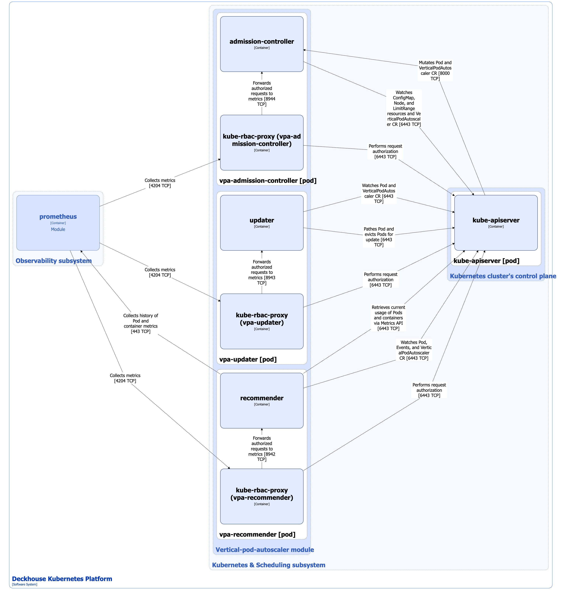

The [`vertical-pod-autoscaler`](/modules/vertical-pod-autoscaler/) module provides [Vertical Pod Autoscaler (VPA)](https://github.com/kubernetes/autoscaler/tree/master/vertical-pod-autoscaler) in Deckhouse Kubernetes Platform (DKP).

For details on module configuration and usage examples, refer to the [relevant documentation section](/modules/vertical-pod-autoscaler/configuration.html).

## Module architecture


The following simplifications are made in the diagram:

* The diagram shows containers in different pods interacting directly with each other. In reality, they communicate via the corresponding Kubernetes Services (internal load balancers). Service names are omitted if they are obvious from the diagram context. Otherwise, the Service name is shown above the arrow.
* Pods may run multiple replicas. However, each pod is shown as a single replica in the diagram.


The Level 2 C4 architecture of the [`vertical-pod-autoscaler`](/modules/vertical-pod-autoscaler/) module and its interactions with other Deckhouse Kubernetes Platform (DKP) components are shown in the following diagram:

<!--- Source: structurizr code from https://fox.flant.com/team/d8-system-design/doc/-/tree/main/architecture/diagrams/C4_EN --->

## Module components

The `vertical-pod-autoscaler` module consists of the following components:

1. **Vpa-admission-controller** (Deployment): A [VPA](https://github.com/kubernetes/autoscaler/tree/master/vertical-pod-autoscaler) controller that handles the [VerticalPodAutoscaler](/modules/vertical-pod-autoscaler/cr.html#verticalpodautoscaler) custom resource.

   The vpa-admission-controller component performs the following actions:

   * Validates VerticalPodAutoscaler custom resources.
   * When a Pod is created and the VPA mode is not [Off](./vpa.html#vpa-operating-modes), the controller automatically sets or updates `requests` and `limits` in containers, optimizing them according to the current recommendations. The controller updates `limits` values only if the resource management policy includes the [`controlledValues: RequestsAndLimits`](/modules/vertical-pod-autoscaler/cr.html#verticalpodautoscaler-v1-spec-resourcepolicy-containerpolicies-controlledvalues) parameter.

   It consists of the following containers:

   * **admission-controller**: Main container.
   * **kube-rbac-proxy**: Sidecar container with a Kubernetes RBAC-based authorization proxy that provides secure access to admission-controller metrics. It is an [open source project](https://github.com/brancz/kube-rbac-proxy).

2. **Vpa-updater** (Deployment): A [VPA](https://github.com/kubernetes/autoscaler/tree/master/vertical-pod-autoscaler) component that checks whether pods with VPA have the correct resource settings. Vpa-updater performs in-place resource updates through `pods/resize`; if that is not possible or does not fit the resource management policy, it evicts the Pod.

   It consists of the following containers:

   * **updater**: Main container.
   * **kube-rbac-proxy**: Sidecar container with a Kubernetes RBAC-based authorization proxy that provides secure access to updater metrics. It is an [open source project](https://github.com/brancz/kube-rbac-proxy).

3. **Vpa-recommender** (Deployment): A [VPA](https://github.com/kubernetes/autoscaler/tree/master/vertical-pod-autoscaler) component that calculates recommendations for `requests` based on past and current pod resource consumption.

   Vpa-admission-controller and vpa-updater recalculate `limits` values proportionally to `requests` values if the resource management policy includes the [`controlledValues: RequestsAndLimits`](/modules/vertical-pod-autoscaler/cr.html#verticalpodautoscaler-v1-spec-resourcepolicy-containerpolicies-controlledvalues) parameter.

   It consists of the following containers:

   * **recommender**: Main container.
   * **kube-rbac-proxy**: Sidecar container with a Kubernetes RBAC-based authorization proxy that provides secure access to recommender metrics. It is an [open source project](https://github.com/brancz/kube-rbac-proxy).

## Module interactions

The module interacts with the following components:

1. **Kube-apiserver**:

   * Watches standard resources such as ConfigMap, Node, LimitRange, and Pod, as well as VerticalPodAutoscaler and VerticalPodAutoscalerCheckpoint custom resources.
   * Retrieves current resource consumption through the Metrics API.
   * Evicts running pods when their resource specifications do not match the recommended values.
   * Authorizes requests for metrics.

2. **Prometheus**: Retrieves the history of pod resource consumption metrics through `aggregating-proxy.d8-monitoring.svc.<clusterDomain>`.

The following external components interact with the module:

1. **Kube-apiserver**:

   * Validates VerticalPodAutoscaler custom resources.
   * Changes `requests` and `limits` in the Pod specification.

2. **Prometheus**: Collects module metrics.
