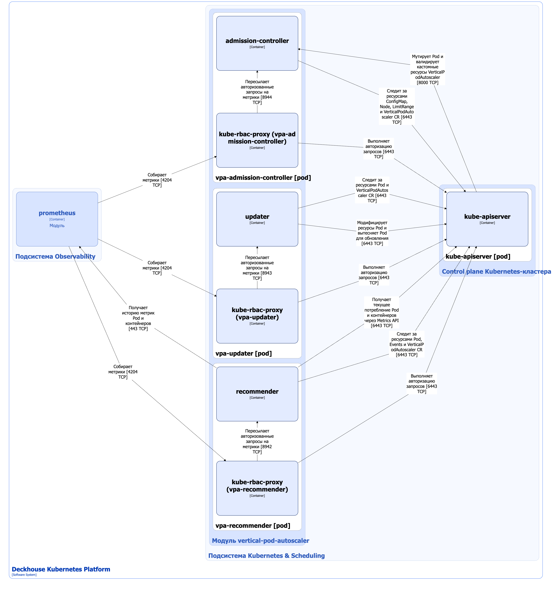

Модуль [`vertical-pod-autoscaler`](/modules/vertical-pod-autoscaler/) обеспечивает работу [Vertical Pod Autoscaler (VPA)](https://github.com/kubernetes/autoscaler/tree/master/vertical-pod-autoscaler) в Deckhouse Kubernetes Platform (DKP).

Подробнее о настройках модуля и примерах его использования можно узнать [в соответствующем разделе документации](/modules/vertical-pod-autoscaler/configuration.html).

## Архитектура модуля


Для упрощения схемы приняты следующие допущения:

* На схеме показано, что контейнеры разных подов взаимодействуют друг с другом напрямую. Фактически они взаимодействуют через соответствующие сервисы Kubernetes (внутренние балансировщики). Названия сервисов не указываются, если они очевидны из контекста. В остальных случаях название сервиса указано над стрелкой.
* Поды могут быть запущены в нескольких репликах, однако на схеме все поды изображены в одной реплике.


Архитектура модуля [`vertical-pod-autoscaler`](/modules/vertical-pod-autoscaler/) на уровне 2 модели C4 и его взаимодействие с другими компонентами Deckhouse Kubernetes Platform (DKP) показаны на следующей диаграмме:

<!--- Source: structurizr code from https://fox.flant.com/team/d8-system-design/doc/-/tree/main/architecture/diagrams/C4_RU --->

## Компоненты модуля

Модуль `vertical-pod-autoscaler` состоит из следующих компонентов:

1. **Vpa-admission-controller** (Deployment) — контроллер [VPA](https://github.com/kubernetes/autoscaler/tree/master/vertical-pod-autoscaler), обслуживающий работу с кастомным ресурсом [VerticalPodAutoscaler](/modules/vertical-pod-autoscaler/cr.html#verticalpodautoscaler).

   Компонент vpa-admission-controller выполняет следующие действия:

   - валидирует кастомные ресурсы VerticalPodAutoscaler;
   - при создании Pod (если режим VPA не [Off](./vpa.html#режимы-работы-vpa)), контроллер автоматически задает или меняет значения `requests` и `limits` в контейнерах, оптимизируя их по текущим рекомендациям. Значения `limits` изменяются контроллером только в том случае, если в политике управления ресурсами указан параметр [`controlledValues: RequestsAndLimits`](/modules/vertical-pod-autoscaler/cr.html#verticalpodautoscaler-v1-spec-resourcepolicy-containerpolicies-controlledvalues).

   Состоит из следующих контейнеров:

   * **admission-controller** — основной контейнер;
   * **kube-rbac-proxy** — сайдкар-контейнер с авторизующим прокси на основе Kubernetes RBAC для защищенного доступа к метрикам admission-controller. Является [Open Source-проектом](https://github.com/brancz/kube-rbac-proxy).

1. **Vpa-updater** (Deployment) — компонент [VPA](https://github.com/kubernetes/autoscaler/tree/master/vertical-pod-autoscaler), проверяющий, что у подов с VPA выставлены корректные ресурсы. Vpa-updater выполняет in-place обновление ресурсов через `pods/resize`, а если это невозможно или не подходит по политике управления ресурсами, вытесняет Pod.

   Состоит из следующих контейнеров:

   * **updater** — основной контейнер;
   * **kube-rbac-proxy** — сайдкар-контейнер с авторизующим прокси на основе Kubernetes RBAC для защищенного доступа к метрикам updater. Является [Open Source-проектом](https://github.com/brancz/kube-rbac-proxy).

1. **Vpa-recommender** (Deployment) — компонент [VPA](https://github.com/kubernetes/autoscaler/tree/master/vertical-pod-autoscaler), определяющий рекомендации для `requests` на основе информации о прошлом и текущем потреблении ресурсов подами.

    Vpa-admission-controller и vpa-updater пересчитывают значения `limits` пропорционально `requests` в том случае, если в политике управления ресурсами указан параметр [`controlledValues: RequestsAndLimits`](/modules/vertical-pod-autoscaler/cr.html#verticalpodautoscaler-v1-spec-resourcepolicy-containerpolicies-controlledvalues).

   Состоит из следующих контейнеров:

   * **recommender** — основной контейнер;
   * **kube-rbac-proxy** — сайдкар-контейнер с авторизующим прокси на основе Kubernetes RBAC для защищенного доступа к метрикам recommender. Является [Open Source-проектом](https://github.com/brancz/kube-rbac-proxy).

## Взаимодействия модуля

Модуль взаимодействует со следующими компонентами:

1. **Kube-apiserver**:

   * наблюдение за стандартными ресурсами ConfigMap, Node, LimitRange, Pod, а также за кастомными ресурсами VerticalPodAutoscaler и VerticalPodAutoscalerCheckpoint;
   * получение текущего потребления ресурсов через Metrics API;
   * вытеснение работающих подов при несоответствии спецификации ресурсов и рекомендуемых значений;
   * авторизация запросов на получение метрик.

1. **Prometheus** — получение истории метрик потребления ресурсов подом (`aggregating-proxy.d8-monitoring.svc.<clusterDomain>`).

С модулем взаимодействуют следующие внешние компоненты:

1. **Kube-apiserver**:
     - валидация кастомных ресурсов VerticalPodAutoscaler;
     - изменение `requests` и `limits` в спецификации Pod.
1. **Prometheus** — собирает метрики модуля.
