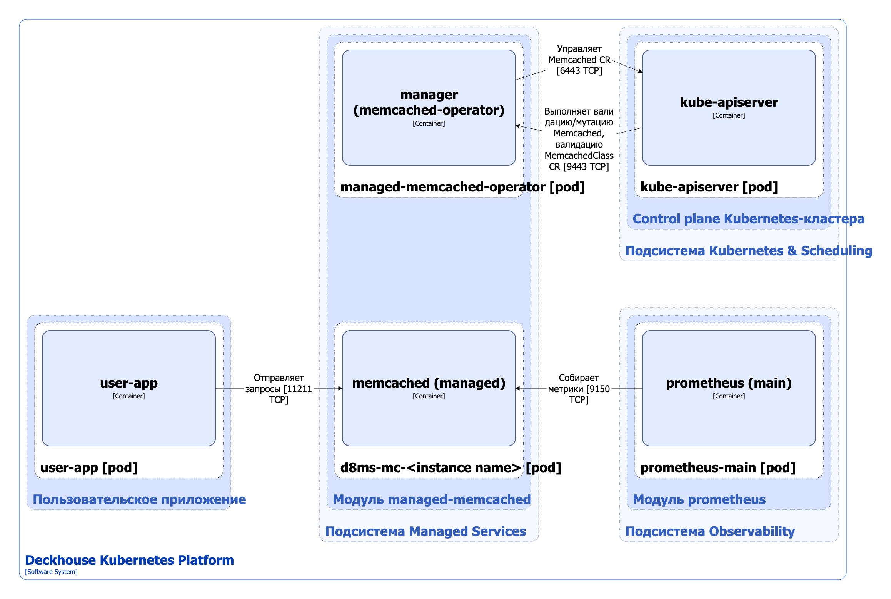

Модуль [`managed-memcached`](/modules/managed-memcached/) упрощает развертывание и управление Memcached инстансами в кластере Deckhouse Kubernetes Platform (DKP). Он предоставляет:

* **Автоматическое развертывание** — развертывание Memcached-инстансов при помощи простой YAML-конфигурации;
* **Высокая доступность** — поддержка как одиночных (Standalone), так и групповых (Group) развертываний;
* **Управление конфигурацией** — гибкая настройка с валидацией и ограничениями через MemcachedClass;
* **Управление ресурсами** — автоматическое распределение ресурсов и масштабирование;
* **Мониторинг** — встроенное отслеживание состояния инстанса и мониторинг самого сервера Memcached;
* **Безопасность** — distroless-образы и применение паттернов безопасной разработки;
* **Валидация** — CEL-правила для проверки конфигурации.

Подробнее с настройками модуля и примерами его использования можно ознакомиться в [соответствующем разделе документации](/modules/managed-memcached/).

## Архитектура модуля


Для упрощения схемы приняты следующие допущения:

* На схеме показано, что контейнеры разных подов взаимодействуют друг с другом напрямую. Фактически они взаимодействуют через соответствующие сервисы Kubernetes (внутренние балансировщики). Названия сервисов не указываются, если они очевидны из контекста. В остальных случаях название сервиса указано над стрелкой.
* Поды могут быть запущены в нескольких репликах, однако на схеме все поды изображены в одной реплике.


Архитектура модуля [`managed-memcached`](/modules/managed-memcached/) на уровне 2 модели C4 и его взаимодействие с другими компонентами DKP изображена на следующей диаграмме:

<!--- Source: structurizr code from https://fox.flant.com/team/d8-system-design/doc/-/tree/main/architecture/diagrams/C4_RU --->

## Компоненты модуля

Модуль состоит из следующих компонентов:

1. **Managed-memcached-operator** — оператор Kubernetes, состоящий из одного контейнера **manager** и выполняющий следующие операции:

   * согласование состояния кастомных ресурсов [Memcached](/modules/managed-memcached/stable/cr.html#memcached) во всех пользовательских пространствах имён. Ресурс Memcached определяет настройки инстанса Memcached, включая топологию размещения и тип развёртывания;

   * валидация кастомных ресурсов Memcached и MemcachedClass, мутация кастомных ресурсов Memcached с помощью механизма [Validating/Mutating Admission Controllers](https://kubernetes.io/docs/reference/access-authn-authz/admission-controllers/).
 
1. **d8ms-mc-\<instance name>** (StatefulSet) — один или несколько инстансов Memcached в зависимости от [типа развёртывания](/modules/managed-memcached/stable/user_guide.html#standalone-vs-group). Создается компонентом managed-memcached-operator.

   Состоит из одного контейнера:
   
   * **memcached** — является [Open Source-проектом](https://github.com/memcached/memcached.git).

## Взаимодействия модуля

Модуль взаимодействует со следующими компонентами:

1. **Kube-apiserver** — управляет кастомными ресурсами Memcached.

С модулем взаимодействуют следующие внешние компоненты:

1. **Kube-apiserver** — отправляет запросы на валидацию кастомных ресурсов Memcached и MemcachedClass, мутацию кастомных ресурсов Memcached.

1. **Prometheus-main** — собирает метрики инстансов Memcached.

1. **Пользовательские приложения** — отправляют запросы к инстансам Memcached.

