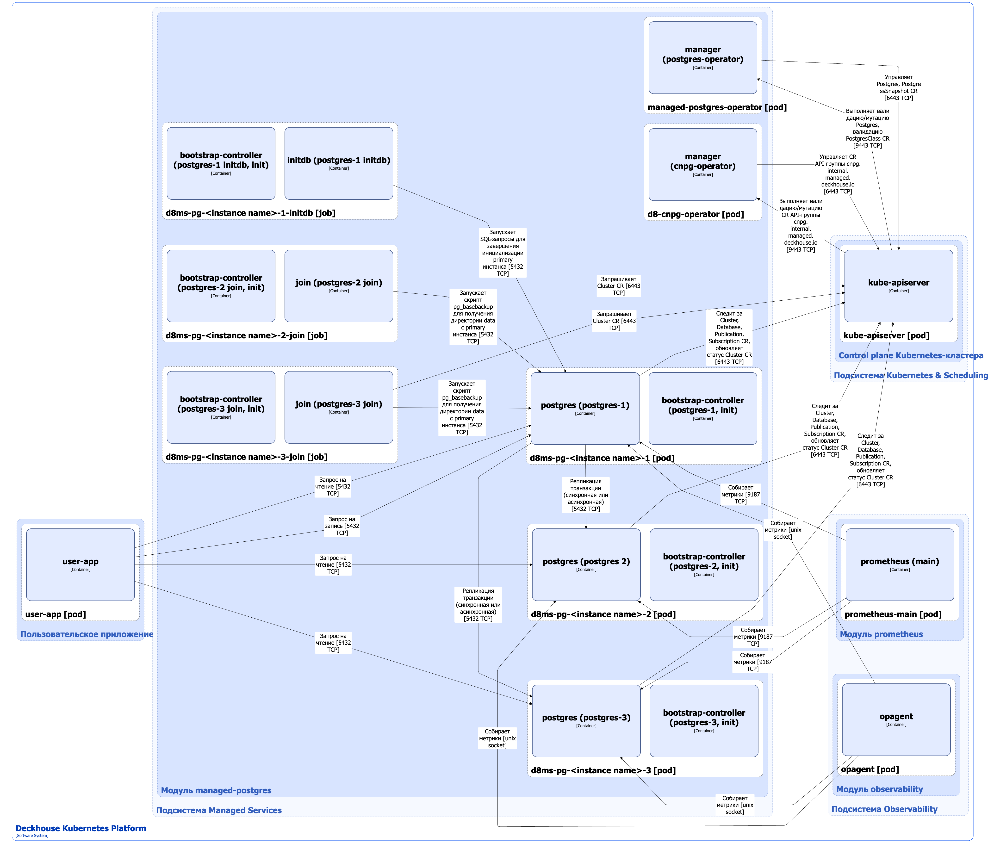

Модуль [`managed-postgres`](/modules/managed-postgres/) управляет кластерами PostgreSQL в Deckhouse Kubernetes Platform (DKP). Он позволяет пользователям конфигурировать и масштабировать PostgreSQL-кластеры в соответствии с их потребностями, обеспечивая оптимальную производительность и безопасность. Основные возможности модуля:

* **Автоматическое развертывание** — разворачивает инстанс PostgreSQL при помощи простой YAML-конфигурации;
* **Высокая доступность** — поддерживает установку отказоустойчивого кластера PostgreSQL или одиночного инстанса на выбор;
* **Управление конфигурацией** — отдельный кастомный ресурс PostgresClass для шаблонизации подхода к созданию кластеров с возможностью гибко валидировать пользовательские конфигурационные файлы;
* **Управление пользователями и базами данных** — декларативная модель создания пользователей и логических баз данных;
* **Отображение статуса** — информативный набор состояний для отслеживания развернутого PostgreSQL.

Подробнее с настройками модуля и примерами его использования можно ознакомиться в [соответствующем разделе документации](/modules/managed-postgres/).

## Архитектура модуля


Для упрощения схемы приняты следующие допущения:

* На схеме показано, что контейнеры разных подов взаимодействуют друг с другом напрямую. Фактически они взаимодействуют через соответствующие сервисы Kubernetes (внутренние балансировщики). Названия сервисов не указываются, если они очевидны из контекста. В остальных случаях название сервиса указано над стрелкой.


Архитектура модуля [`managed-postgres`](/modules/managed-postgres/) на уровне 2 модели C4 и его взаимодействие с другими компонентами DKP изображена на следующей диаграмме:

<!--- Source: structurizr code from https://fox.flant.com/team/d8-system-design/doc/-/tree/main/architecture/diagrams/C4_RU --->

## Компоненты модуля

Модуль состоит из следующих компонентов:

1. **Managed-postgres-operator** — оператор Kubernetes, состоящий из одного контейнера **manager** и выполняющий следующие операции:

   * согласование состояния кастомных ресурсов [Postgres](/modules/managed-postgres/stable/cr.html#postgres) во всех пользовательских пространствах имён. Ресурс Postgres определяет настройки кластера PostgreSQL, включая топологию размещения и режим репликации, конфигурацию инстансов PostgreSQL и прочие параметры, такие как списки логических баз данных и внутренних пользователей;

   * согласование состояния кастомных ресурсов [PostgresSnapshot](/modules/managed-postgres/stable/cr.html#postgressnapshot). Ресурс PostgresSnapshot предназначен для [резервного копирования и восстановления инстансов PostgreSQL](https://deckhouse.ru/modules/managed-postgres/stable/snapshots.html);

   * валидация кастомных ресурсов Postgres и PostgresClass, мутация кастомных ресурсов Postgres с помощью механизма [Validating/Mutating Admission Controllers](https://kubernetes.io/docs/reference/access-authn-authz/admission-controllers/).

   В качестве бэкенда Managed-postgres-operator использует кастомные ресурсы из API-группы `cnpg.internal.managed.deckhouse.io`, управляемые компонентом d8-cnpg-operator.
 
1. **D8-cnpg-operator** — это форк [CloudNativePG](https://github.com/cloudnative-pg/cloudnative-pg), оператора Kubernetes, который автоматизирует управление кластерами PostgreSQL. D8-cnpg-operator состоит из одного контейнера **manager** и выполняет следующие операции:

   * управление кастомными ресурсами из API-группы `cnpg.internal.managed.deckhouse.io`:

     * Cluster — определяет кластер PostgreSQL;
     * Pooler — определяет настройки пула соединений;
     * FailoverQuorum — служит для отображения состояния кворума реплик кластера PostgreSQL в отказоусторйчивой конфигурации;
     * Database — определяет логическую базу данных;
     * Backup — определяет резервную копию инстанса PostgreSQL;
     * ScheduledBackup — определяет настройки резервного копирования PostgreSQL по расписанию;
     * Subscription — определяет принимающую сторону логической репликации;
     * Publication — определяет источник для логической репликации;
     * ImageCatalog — определяет образы PostgreSQL для пользовательских пространств имён;
     * ClusterImageCatalog — определяет образы PostgreSQL для всего кластера Kubernetes.

   * валидация и мутация кастомных ресурсов из API-группы `cnpg.internal.managed.deckhouse.io` помощью механизма [Validating/Mutating Admission Controllers](https://kubernetes.io/docs/reference/access-authn-authz/admission-controllers/).

   
   Ниже описаны компоненты для режима репликации [ConsistencyAndAvailability](/modules/managed-postgres/stable/user_guide.html#consistencyandavailability-3-%D0%B8%D0%BD%D1%81%D1%82%D0%B0%D0%BD%D1%81%D0%B0-primary--%D0%BE%D0%B4%D0%BD%D0%B0-%D1%81%D0%B8%D0%BD%D1%85%D1%80%D0%BE%D0%BD%D0%BD%D0%B0%D1%8F--%D0%BE%D0%B4%D0%BD%D0%B0-%D0%B0%D1%81%D0%B8%D0%BD%D1%85%D1%80%D0%BE%D0%BD%D0%BD%D0%B0%D1%8F-%D1%80%D0%B5%D0%BF%D0%BB%D0%B8%D0%BA%D0%B0). Два других режима репликации по составу компонентов являются частным случаем режима ConsistencyAndAvailability.
   

1. **d8ms-pg-\<instance name>\-1-initdb** (Job) — задание, создаваемое компонентом d8-cnpg-operator, которое запускает SQL-запросы для завершения инициализации primary инстанса PostgreSQL.

   Состоит из следующих контейнеров:

   * **bootstrap-controller** — init-контейнер, выполняющий установку исполняемого файла `manager` компонента D8-cnpg-operator;
   * **initdb** — основной контейнер, в котором запускается исполняемый файл `manager`, выполняющий описанные выше SQL-запросы.

1. **d8ms-pg-\<instance name>\-2-join** (Job) — задание, создаваемое компонентом d8-cnpg-operator, которое запускает скрипт `pg_basebackup` для получения директории `data` c primary инстанса для первой реплики. Задание использует кастомный ресурс Cluster для настройки реплики.

   Состоит из следующих контейнеров:

   * **bootstrap-controller** — init-контейнер, выполняющий установку исполняемого файла `manager` компонента D8-cnpg-operator;
   * **join** — основной контейнер, в котором запускается исполняемый файл `manager`, выполняющий описанный выше скрипт.

1. **d8ms-pg-\<instance name>\-3-join** (Job) — задание, создаваемое компонентом d8-cnpg-operator, которое запускает скрипт `pg_basebackup` для получения директории `data` c primary инстанса для второй реплики. Задание использует кастомный ресурс Cluster для настройки реплики.

   Состоит из следующих контейнеров:

   * **bootstrap-controller** — init-контейнер, выполняющий установку исполняемого файла `manager` компонента D8-cnpg-operator;
   * **join** — основной контейнер, в котором запускается исполняемый файл `manager`, выполняющий описанный выше скрипт.
   
1. **d8ms-pg-\<instance name>\-1** — primary инстанс PostgreSQL. Создается компонентом d8-cnpg-operator.

   Состоит из следующих контейнеров:

   * **bootstrap-controller** — init-контейнер, выполняющий установку исполняемого файла `manager` компонента D8-cnpg-operator;
   * **postgres** — основной контейнер, в котором запускается исполняемый файл `manager`, который выполняет следущие операции:
   
     * старт процессов PostgreSQL;
     * управление жизненным циклом экземпляра PostreSQL, включая мониторинг состояния сервера, обработку остановки и перезапуска сервера;
     * участие в процедурах `switchover`/`failover`. `Switchover` — это плановый, контролируемый процесс, при котором активный первичный инстанс (primary) намеренно выводится из эксплуатации, а назначенный резервный инстанс (реплика) повышается до роли первичного. Его главная цель — обеспечить нулевую потерю данных: перед тем как передать роль реплике, мы ждём, пока все текущие транзакции реплицируются. `Failover` — это аварийная ситуация: первичный инстанс вышел из строя, стал недоступен или его нельзя безопасно использовать для записи. В этом случае назначенный резервный инстанс (реплика) повышается до роли первичного, при этом возможна потеря данных;
     * взаимодействие с оператором и публикация состояния экземпляра;
     * отслеживание изменений кастомных ресурсов Cluster, Database, Publication, Subscription.

1. **d8ms-pg-\<instance name>\-2** — первая реплика PostgreSQL. Создается компонентом d8-cnpg-operator.

   Состоит из следующих контейнеров:

   * **bootstrap-controller** — init-контейнер, выполняющий установку исполняемого файла `manager` компонента D8-cnpg-operator;
   * **postgres** — основной контейнер, в котором запускается исполняемый файл `manager`, выполняющий операции, описанные для primary инстанса PostgreSQL.

1. **d8ms-pg-\<instance name>\-3** — вторая реплика PostgreSQL. Создается компонентом d8-cnpg-operator.

   Состоит из следующих контейнеров:

   * **bootstrap-controller** — init-контейнер, выполняющий установку исполняемого файла `manager` компонента D8-cnpg-operator;
   * **postgres** — основной контейнер, в котором запускается исполняемый файл `manager`, выполняющий операции, описанные для primary инстанса PostgreSQL.

## Взаимодействия модуля

Модуль взаимодействует со следующими компонентами:

1. **Kube-apiserver**:

   * управляет кастомными ресурсами Postgres и PostgresSnapshot;
   * управляет кастомными ресурсами API-группы `cnpg.internal.managed.deckhouse.io`.

С модулем взаимодействуют следующие внешние компоненты:

1. **Kube-apiserver**:

   - отправляет запросы на валидацию кастомных ресурсов Postgres и PostgresClass, мутацию кастомных ресурсов Postgres;
   - отправляет запросы на валидацию и мутацию кастомных ресурсов из `cnpg.internal.managed.deckhouse.io` API-группы.

1. **Prometheus-main** — собирает метрики инстансов кластера PostgreSQL (которые получает исполняемый файл `manager` компонента d8-cnpg-operator, запущенный в контейнере postgres пода инстанса PostgreSQL).

1. **opAgent** — собирает метрики инстансов кластера PostgreSQL (подключаясь к инстансам PostgreSQL напрямую) и отправляет их в prometheus-main.

1. **Пользовательские приложения** — отправляют запросы к инстансам кластера PostgreSQL. Запросы на запись отправляются в primary инстанс через сервис Kubernetes **d8ms-pg-\<instance name>\-rw**. Primary инстанс реплицирует транзакции в реплики.  Запросы на чтение балансируются на инстансы PostgreSQL через сервисы Kubernetes **d8ms-pg-\<instance name>\-r** или **d8ms-pg-\<instance name>\-ro**.
