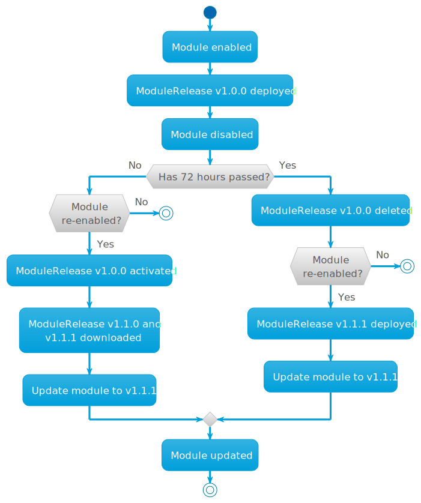
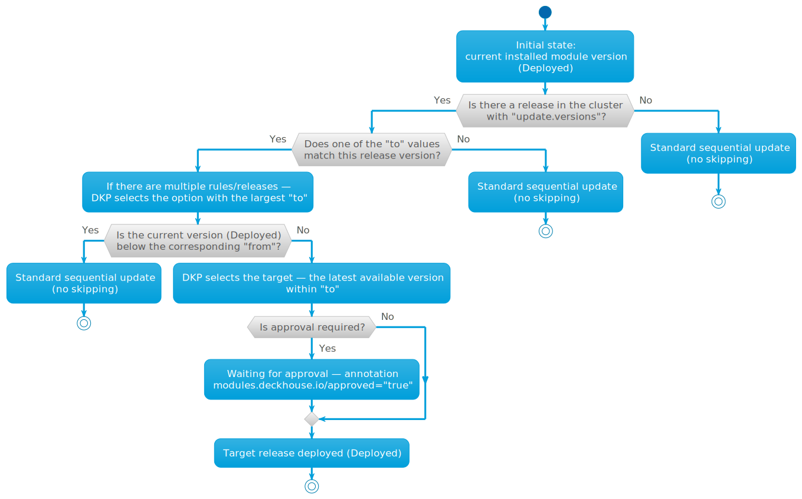

When developing modules, you may want to pull and deploy a module bypassing the release channels. The [ModulePullOverride](/products/kubernetes-platform/documentation/v1/reference/api/cr.html#modulepulloverride) resource is used for this purpose.


The ModulePullOverride resource is intended **for development and debugging environments only**.
Using it in production clusters is **not recommended*. Support for the resource might be removed in future Deckhouse Kubernetes Platform versions.




An example of ModulePullOverride:

```yaml
apiVersion: deckhouse.io/v1alpha2
kind: ModulePullOverride
metadata:
  name: <module-name>
spec:
  imageTag: <tag of the module image>
  scanInterval: <image digest check interval. Default: 15s>
```

The `maintenance mode` can also be used for development purposes. In this mode, Deckhouse disables resource management for the module and does not apply changes automatically. This mode is not intended for use in production clusters.

Example:

```yaml
apiVersion: deckhouse.io/v1alpha1
kind: ModuleConfig
...
spec:
  enabled: true
  maintenance: NoResourceReconciliation
  settings: 
```

Requirements for the resource parameters:

* The module name (`metadata.name`) must match the module name in the ModuleSource (`.status.modules.[].name`).

* The container image tag (`spec.imageTag`) can be anything, e.g., `pr333`, `my-branch`.

The `spec.scanInterval` time interval (optional) defines the interval for scanning images in the registry. The default interval is 15 seconds.
To force scan you can change the interval or set the `renew=""` annotation on ModulePullOverride.

The `spec.rollback` indicates whether the deployed module release should be rollback after deleting the ModulePullOverride.

You can get the result of applying ModulePullOverride in the message (column `MESSAGE`) when retrieving ModulePullOverride information. The value `Ready` indicates the successful application of ModulePullOverride parameters. Any other value indicates conflict.

Example of absence of conflicts when using ModulePullOverride:

```console
$ d8 k get modulepulloverrides.deckhouse.io 
NAME      UPDATED   MESSAGE   ROLLBACK
example1  10s       Ready     false
```

Requirements for the module:

* The module must exist; otherwise the message for ModulePullOverride will be *The module not found*.

  An example:

  ```console
  $ d8 k get modulepulloverrides.deckhouse.io 
  NAME      UPDATED   MESSAGE                ROLLBACK
  example1  10s       The module not found   false
  ```

* The module must not be embedded Deckhouse module; otherwise the message in ModulePullOverride will be *The module is embedded*.

  An example:

  ```console
  $ d8 k get modulepulloverrides.deckhouse.io 
  NAME           UPDATED  MESSAGE                  ROLLBACK
  ingress-nginx  10s      The module is embedded   false
  ```

* The module must be enabled; otherwise, the message for ModulePullOverride will be *The module disabled*.

  An example:

  ```console
  $ d8 k get modulepulloverrides.deckhouse.io 
  NAME     UPDATED   MESSAGE               ROLLBACK
  example  7s        The module disabled   false
  ```

* The module must have a source; otherwise the message at ModulePullOverride will be *The module does not have an active source*.
  
  An example:

  ```console
  $ d8 k get modulepulloverrides.deckhouse.io 
  NAME       UPDATED   MESSAGE                                     ROLLBACK
  example    12s       The module does not have an active source   false
  ```

* The source for the module must exist; otherwise the message for ModulePullOverride will be *The source not found*.

  An example:

  ```console
  $ d8 k get modulepulloverrides.deckhouse.io 
  NAME       UPDATED   MESSAGE                 ROLLBACK
  example    12s       The source not found    false
  ```

To update the module without waiting for the next update cycle to begin, you can execute the following command:

```sh
d8 k annotate mpo <name> renew=""
```

## Module availability and enabling by default

To assign Deckhouse editions the module should be available in,
as well as module bundles where it should be enabled by default,
use the `accessibility` field in `module.yaml`:

```yaml
name: test
accessibility:
  editions:
    ee:
      available: true
      enabledInBundles:
        - Default
```

In this configuration, the module will be available in `ee` (DKP Enterprise Edition)  
and can be enabled using the ModuleConfig object, and will be enabled by default in the `Default` bundle.





* To use this mechanism, the `module.yaml` file must be included in the release image.
* A module can still be disabled using ModuleConfig.
* A module will remain on the last available release if the next release disables it
  (for example, by setting `available: false` in the corresponding edition).





## How ModulePullOverride works

After creating ModulePullOverride, the corresponding module will not consider ModuleUpdatePolicy, and will also not load and create ModuleRelease objects. The module will be loaded upon every change of the `imageDigest` parameter, after which it will be applied in the cluster. The ModuleSource status will have `overridden: true`, which indicates that ModulePullOverride is being used instead of ModuleUpdatePolicy. Also, the corresponding Module object will have an `IsOverridden` field in its status, and the module version from `imageTag`.

An example:

```yaml
apiVersion: deckhouse.io/v1alpha1
kind: Module
metadata:
  creationTimestamp: "2024-11-18T15:34:15Z"
  generation: 16
  labels:
    deckhouse.io/epoch: "1326105356"
  name: example
  resourceVersion: "230347744"
  uid: 7111cee7-50cd-4ecf-ba20-d691b13b0f59
properties:
  availableSources:
  - example
  releaseChannel: Stable
  requirements:
    deckhouse: '> v1.63.0'
    kubernets: '> v1.30.0'
  source: example
  version: mpo-tag
  weight: 910
status:
  conditions:
  - lastProbeTime: "2024-12-03T15:57:20Z"
    lastTransitionTime: "2024-12-03T15:57:20Z"
    status: "True"
    type: EnabledByModuleConfig
  - lastProbeTime: "2024-12-03T15:59:58Z"
    lastTransitionTime: "2024-12-03T15:57:26Z"
    status: "True"
    type: EnabledByModuleManager
  - lastProbeTime: "2024-12-03T15:59:58Z"
    lastTransitionTime: "2024-12-03T15:56:23Z"
    status: "True"
    type: IsReady
  - lastProbeTime: "2024-12-03T15:59:48Z"
    lastTransitionTime: "2024-12-03T15:56:47Z"
    status: "True"
    type: IsOverridden
  phase: Ready
```

The module will keep running after ModulePullOverride is removed. But if there is a [ModuleUpdatePolicy](/products/kubernetes-platform/documentation/v1/reference/api/cr.html#moduleupdatepolicy) for the module, new releases of the module (ModuleRelease) will be pulled to replace the current "developer version".

### An example

1. Suppose there are two modules, `echo` and `hello-world`, defined in [ModuleSource](/products/kubernetes-platform/documentation/v1/reference/api/cr.html#modulesource). The update policy is set for them, and they are pulled in and installed in DKP:

   ```yaml
   apiVersion: deckhouse.io/v1alpha1
   kind: ModuleSource
   metadata:
     name: test
   spec:
     registry:
       ca: ""
       dockerCfg: someBase64String==
       repo: registry.example.com/deckhouse/modules
       scheme: HTTPS
   status:
     modules:
     - name: echo
       policy: test-alpha
     - name: hello-world
       policy: test-alpha
     modulesCount: 2
   ```

1. Enable the module and create [ModulePullOverride](/products/kubernetes-platform/documentation/v1/reference/api/cr.html#modulepulloverride) for the `echo` module:

   ```yaml
   apiVersion: deckhouse.io/v1alpha2
   kind: ModulePullOverride
   metadata:
     name: echo
   spec:
     imageTag: main-patch-03354
   ```

  After creating ModulePullOverride, the image tag `registry.example.com/deckhouse/modules/echo:main-patch-03354` will be used for the module (`ms:spec.registry.repo/mpo:metadata.name:mpo:spec.imageTag`).

1. The ModulePullOverride will change with each update of the module:

   ```yaml
   apiVersion: deckhouse.io/v1alpha2
   kind: ModulePullOverride
   metadata:
     name: echo
   spec:
     imageTag: main-patch-03354
     scanInterval: 15s
   status:
     imageDigest: sha256:ed958cc2156e3cc363f1932ca6ca2c7f8ae1b09ffc1ce1eb4f12478aed1befbc
     message: "Ready"
     updatedAt: "2023-12-07T08:41:21Z"
   ```

   where:
   - `imageDigest` is the unique identifier of the container image that was pulled.
   - `lastUpdated` is the time when the image was last pulled.

1. In this case, ModuleSource would look as follows:

   ```yaml
   apiVersion: deckhouse.io/v1alpha1
   kind: ModuleSource
   metadata:
     name: test
   spec:
     registry:
       ca: ""
       dockerCfg: someBase64String==
       repo: registry.example.com/deckhouse/modules
       scheme: HTTPS
   status:
     modules:
     - name: echo
       overridden: true
     - name: hello-world
       policy: test-alpha
     modulesCount: 2
   ```





## Module auto-update logic



> ModuleRelease versions v1.0.0 and v1.1.1 are provided as examples.

1. **Module installation**. When a module is enabled (`enable module <module name>`), the latest available version from the selected stability channel is automatically downloaded and deployed to the cluster. For example, this could be ModuleRelease v1.0.0. The most recent version is used; older versions are not installed.

1. **Module disabling**. When a module is disabled (`disable module <module name>`):

   - The module stops receiving new releases.
   - The currently deployed version remains in the cluster with the `Deployed` status.

1. **Behavior on re-enabling**.

   If the module is re-enabled within 72 hours:

   - The previously deployed version (ModuleRelease v1.0.0) is used.
   - New releases are checked.
   - If available, they are downloaded (e.g., v1.1.0, v1.1.1).
   - The module is then updated according to [the standard update rules](../../../reference/release-channels.html) (Update). [More information](/modules/deckhouse/configuration.html#parameters-update)

   If the module is re-enabled after 72 hours:

   - The old version is deleted (`delete ModuleRelease v1.0.0`).
   - Upon re-enabling, the latest available version is downloaded (e.g., v1.1.1).
   - The cycle starts again as if the module was enabled for the first time (see step 1).

1. **Behavior of a disabled module**. If a module is disabled, no new releases are downloaded. The previously deployed version (the last one that was enabled) is removed after 72 hours if the module is not re-enabled within that time.

## Skipping intermediate releases (from-to)

The `from-to` mechanism allows you to skip [step-by-step module updates](../development/#module-auto-update-logic). If the current installed module version (status `Deployed`) falls within the `from-to` range, DKP skips intermediate releases and installs the latest available version within `to`.

To enable the mechanism, set transition rules in the module configuration (`module.yaml`). Example:

```yaml
update:
  versions:
    - from: "1.67"
      to:   "1.75"
    - from: "1.99"
      to:   "2.0" # Transitions between major versions are specified in the X.Y format.
```

> A constrained release is a module release whose `module.yaml` contains the [`update.versions`](/products/kubernetes-platform/documentation/v1/reference/api/cr.html#modulerelease-v1alpha1-spec-update) section. The `from-to` mechanism works only with such releases.

Conditions for applying `from-to`:

- Target release version. The rule is read from the release you want to move to — the `to` value must match the version of that very release (constrained release).
- Current version threshold. The current installed module version (`Deployed`) is not lower than `from`. If the current version is lower than `from`, the rule does not apply — the update proceeds sequentially.
- If multiple releases match at the same time, the option with the largest `to` is chosen (the rules may reside in different ModuleRelease objects of the same module).
- If no release meets these conditions, the update proceeds as usual — without skipping intermediate versions.

If a release with [update.versions](/products/kubernetes-platform/documentation/v1/reference/api/cr.html#modulerelease-v1alpha1-spec-update) appears in the cluster, DKP does not require updating in order — such a release appears “as is” in the list, DKP automatically selects a suitable option and, if necessary, waits for approval. You can immediately approve installation of the latest available version within `to`. After approval, intermediate releases between `from` and `to` get the `Skipped` status after reconciliation (not immediately); for some time between `Superseded` and `Deployed` there may be releases in the `Pending` status.



Check available releases (ModuleRelease) with:

```shell
d8 k get mr
```

Example output if the current module version is `0.3.33`, and `module.yaml` contains the rule `from: "0.3" → to: "0.7"`:

```console
p-o-test-v0.1.0    Superseded
p-o-test-v0.2.22   Superseded
p-o-test-v0.3.33   Deployed
p-o-test-v0.4.1    Pending      Release is waiting for the 'modules.deckhouse.io/approved: "true"' annotation
p-o-test-v0.5.27   Pending      awaiting for v0.4.1 release to be deployed
p-o-test-v0.6.11   Pending      awaiting for v0.4.1 release to be deployed
p-o-test-v0.7.25   Pending      Release is waiting for the 'modules.deckhouse.io/approved: "true"' annotation
```

In this example output, the current installed version is `0.3.33` (status `Deployed`). According to the rule `from: 0.3 → to: 0.7`, the latest available version within `0.7` is selected for installation — `p-o-test-v0.7.25` (status `Pending`). After approval, versions `0.4.1`, `0.5.27`, and `0.6.11` change to `Skipped`, and `p-o-test-v0.7.25` becomes `Deployed`.

To approve the module release, apply the annotation:

```shell
d8 k annotate mr p-o-test-v0.7.25 modules.deckhouse.io/approved="true"
```

Example output after approval:

```console
p-o-test-v0.4.1    Skipped
p-o-test-v0.5.27   Skipped
p-o-test-v0.6.11   Skipped
p-o-test-v0.7.25   Deployed
```

Whether an annotation is required depends on the module’s update policy. More details — [Module update policy](../run/#module-update-policy).

### Examples

**Example 1.** The target release contains the rule, and its version equals `to` — the transition is performed.

In this example, the `from-to` rule is defined in the **target** release, and the `to` value equals the version of that release. The current installed version (`Deployed`) is not lower than `from`, so the transition is possible. As soon as the release appears in the cluster, DKP prepares the update. If the update policy requires approval, mark the release with the annotation. After approval, intermediate releases will be skipped and the target release becomes `Deployed`:

```yaml
# Module version (Deployed): v1.67.23 (≥ 1.67) → the 'from' condition is satisfied.
metadata:
  name: module-test-v1.67.23
status:
  phase: Deployed

# Target release: the release version equals update.versions.to (1.75).
metadata:
  name: module-test-v1.75.25
update:
  versions:
  - from: "1.67"
    to:   "1.75"   # The update will be performed to this version after approval (if required).
```

Likewise, if the current version is even higher than `from`, the transition is also performed:

```yaml
# Module version (Deployed): v1.69.0  (≥ 1.67) → the 'from' condition is satisfied.
metadata:
  name: module-test-v1.69.0
status:
  phase: Deployed

# Target release: the release version equals update.versions.to (1.75).
metadata:
  name: module-test-v1.75.25
update:
  versions:
  - from: "1.67"
    to:   "1.75"  # The update will be performed to this version after approval (if required).
```

**Example 2.** The current version is lower than `from` — the transition is not performed.

If the current installed version is lower than `from`, the rule does not apply. The update proceeds sequentially (without skipping):

```yaml
# Module version (Deployed): v1.61.0  (< 1.67) → the 'from' condition is NOT satisfied.
metadata:
  name: module-test-v1.61.0
status:
  phase: Deployed

metadata:
  name: module-test-v1.75.25
update:
  versions:
  - from: "1.67"
    to:   "1.75"   # The from-to transition is not performed → sequential update.
```

**Example 3.** `to` does not match the version of the release that contains the rule — the transition is not performed.

A transition is possible only to a release where `to` equals the version of that release. If the rule is described in another release (for example, `to: "1.74"` is placed in release `v1.75.25`), it will not work — the update goes sequentially.

```yaml
# Module version (Deployed): v1.67.0.
metadata:
  name: module-test-v1.67.0
status:
  phase: Deployed

metadata:
  name: module-test-v1.74.0   # This release has no update.versions.

# The rule is written in another release (v1.75.25), and 'to' does not equal its version.
metadata:
  name: module-test-v1.75.25
update:
  versions:
  - from: "1.67"
    to:   "1.74"   # 'to' does not equal this release version (1.75.25) → the rule is ignored.
```



## Module artifacts in the container registry

After a module has been built, its artifacts must be pushed to the container registry at a path that is the *source* path for pulling and running modules in DKP. The path where module artifacts are pushed to the registry is specified in the [ModuleSource](/products/kubernetes-platform/documentation/v1/reference/api/cr.html#modulesource) resource.

Below is an example of the container image hierarchy after pushing the `module-1` and `modules-2` module artifacts into the registry:

```tree
registry.example.io
📁 modules-source
├─ 📁 module-1
│  ├─ 📦 v1.23.1
│  ├─ 📦 d4bf3e71015d1e757a8481536eeabda98f51f1891d68b539cc50753a-1589714365467
│  ├─ 📦 e6073b8f03231e122fa3b7d3294ff69a5060c332c4395e7d0b3231e3-1589714362300
│  ├─ 📦 v1.23.2
│  └─ 📁 release
│     ├─ 📝 v1.23.1
│     ├─ 📝 v1.23.2
│     ├─ 📝 alpha
│     └─ 📝 beta
└─ 📁 module-2
   ├─ 📦 v0.30.147
   ├─ 📦 d4bf3e71015d1e757a8481536eeabda98f51f1891d68b539cc50753a-1589714365467
   ├─ 📦 e6073b8f03231e122fa3b7d3294ff69a5060c332c4395e7d0b3231e3-1589714362300
   ├─ 📦 v0.31.1
   └─ 📁 release
      ├─ 📝 v0.30.147
      ├─ 📝 v0.31.1
      ├─ 📝 alpha
      └─ 📝 beta
```


The container registry must support a nested repository structure. See [the requirements section](../#requirements) for more details.  


Below is a list of commands for working with the module source. The examples use the [crane](https://github.com/google/go-containerregistry/tree/main/cmd/crane#crane) tool. Follow the [instructions](https://github.com/google/go-containerregistry/tree/main/cmd/crane#installation) to install it. For macOS, use `brew`.

### Print the list of modules in the module source

```shell
crane ls <REGISTRY_URL>/<MODULE_SOURCE>
```

An example:

```shell
$ crane ls registry.example.io/modules-source
module-1
module-2
```

### Print the list of module images

```shell
crane ls <REGISTRY_URL>/<MODULE_SOURCE>/<MODULE_NAME>
```

An example:

```shell
$ crane ls registry.example.io/modules-source/module-1
v1.23.1
d4bf3e71015d1e757a8481536eeabda98f51f1891d68b539cc50753a-1589714365467
e6073b8f03231e122fa3b7d3294ff69a5060c332c4395e7d0b3231e3-1589714362300
v1.23.2
```

In the example above, there are two module images and two application container images in `module-1`.

### Print the list of files in the module image

```shell
crane export <REGISTRY_URL>/<MODULE_SOURCE>/<MODULE_NAME>:<MODULE_TAG> - | tar -tf -
```

An example:

```shell
crane export registry.example.io/modules-source/module-1:v1.23.1 - | tar -tf -
```

The output will be quite large.

### Print the list of images of the module's application containers

```shell
crane export <REGISTRY_URL>/<MODULE_SOURCE>/<MODULE_NAME>:<MODULE_TAG> - | tar -Oxf - images_digests.json
```

An example:

```shell
$ crane export registry.example.io/modules-source/module-1:v1.23.1 -  | tar -Oxf - images_digests.json
{
  "backend": "sha256:fcb04a7fed2c2f8def941e34c0094f4f6973ea6012ccfe2deadb9a1032c1e4fb",
  "frontend": "sha256:f31f4b7da5faa5e320d3aad809563c6f5fcaa97b571fffa5c9cab103327cc0e8"
}
```

### Configuring extra images

Modules can include additional images (such as vulnerability databases or other supplementary data) by adding an `extra_images.json` file. This file specifies extra images that need to be manually pushed to the registry and are separate from the main module images.

To view the extra images configuration:

```shell
crane export <REGISTRY_URL>/<MODULE_SOURCE>/<MODULE_NAME>:<MODULE_TAG> - | tar -Oxf - extra_images.json
```

An example of `extra_images.json` for neuvector vulnerability database:

```json
{
  "scanner": 3
}
```

Important notes:

- Extra images must be manually pushed to the module registry under the `extra/` path.
- Use the `d8 mirror pull --only-extra-images` command to pull only extra images.
- Extra images are stored in the registry as `<module-name>/extra/<image-name>`.

### Print the list of releases

```shell
crane ls <REGISTRY_URL>/<MODULE_SOURCE>/<MODULE_NAME>/release
```

An example:

```shell
$ crane ls <REGISTRY_URL>/<MODULE_SOURCE>/<MODULE_NAME>/release
v1.23.1
v1.23.2
alpha
beta
```

In the example above, there are two releases in the container registry; two release channels, `alpha` and `beta`, are also used:

### Print the version in use on the `alpha` release channel

```shell
crane export <REGISTRY_URL>/<MODULE_SOURCE>/<MODULE_NAME>/release:alpha - | tar -Oxf - version.json
```

An example:

```shell
$ crane export registry.example.io/modules-source/module-1/release:alpha - | tar -Oxf - version.json
{"version":"v1.23.2"}
```
