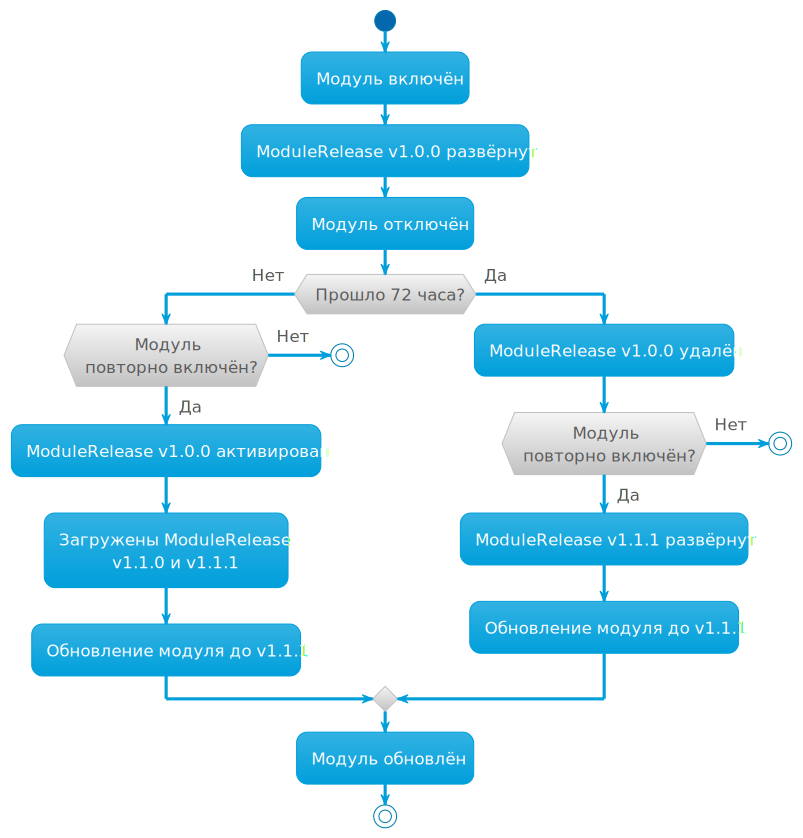

При разработке модулей может возникнуть необходимость загрузить и развернуть модуль в обход каналов обновления. Для этого используется ресурс [ModulePullOverride](/products/kubernetes-platform/documentation/v1/reference/api/cr.html#modulepulloverride).


Ресурс ModulePullOverride предназначен **только для использования в средах разработки и отладки**.
Его применение в production-кластерах **не рекомендуется**. Поддержка ресурса может быть исключена в следующих версиях Deckhouse Kubernetes Platform.




Пример ModulePullOverride:

```yaml
apiVersion: deckhouse.io/v1alpha2
kind: ModulePullOverride
metadata:
  name: <module-name>
spec:
  imageTag: <tag of the module image>
  scanInterval: <image digest check interval. Default: 15s>
```

Также для целей разработки может использоваться режим обслуживания модуля (`maintenance mode`). В этом режиме Deckhouse отключает управление ресурсами модуля и не применяет изменения автоматически. Этот режим не предназначен для эксплуатации в production-кластерах.

Пример:

```yaml
apiVersion: deckhouse.io/v1alpha1
kind: ModuleConfig
...
spec:
  enabled: true
  maintenance: NoResourceReconciliation
  settings: 
```

Требования к параметрам ресурса:

* Имя модуля (`metadata.name`) должно соответствовать имени модуля в ModuleSource (`.status.modules.[].name`).

* Тег образа контейнера (`spec.imageTag`) может быть любым. Например, `pr333`, `my-branch`.

Необязательный параметр `spec.scanInterval` устанавливает интервал времени для проверки образов в registry. По умолчанию задан интервал в 15 секунд. Для принудительного обновления можно изменить интервал, либо установить на ModulePullOverride аннотацию `renew=""`.

Необязательный параметр `spec.rollback` — если установить этот параметр в `true`, это восстановит развернутый модуль до предыдущего состояния после удаления `ModulePullOverride`.

Результат применения ModulePullOverride можно увидеть в сообщении (колонка `MESSAGE`) при получении информации об ModulePullOverride. Значение `Ready` означает применение параметров ModulePullOverride. Любое другое значение означает конфликт.

Пример отсутствия конфликтов при применении ModulePullOverride:

```console
$ d8 k get modulepulloverrides.deckhouse.io 
NAME      UPDATED   MESSAGE   ROLLBACK
example1  10s       Ready     false
```

Требования к модулю:

* Модуль должен существовать, иначе сообщение у ModulePullOverride будет *The module not found*.

  Пример:

  ```console
  $ d8 k get modulepulloverrides.deckhouse.io 
  NAME      UPDATED   MESSAGE                ROLLBACK
  example1  10s       The module not found   false
  ```

* Модуль не должен быть встроенным модулем Deckhouse, иначе сообщение у ModulePullOverride будет *The module is embedded*.

  Пример:

  ```console
  $ d8 k get modulepulloverrides.deckhouse.io 
  NAME           UPDATED  MESSAGE                  ROLLBACK
  ingress-nginx  10s      The module is embedded   false
  ```

* Модуль должен быть включен, иначе сообщение у ModulePullOverride будет *The module disabled*.

  Пример:

  ```console
  $ d8 k get modulepulloverrides.deckhouse.io 
  NAME     UPDATED   MESSAGE               ROLLBACK
  example  7s        The module disabled   false
  ```

* Модуль должен иметь источник, иначе сообщение у ModulePullOverride будет *The module does not have an active source*.
  
  Пример:

  ```console
  $ d8 k get modulepulloverrides.deckhouse.io 
  NAME       UPDATED   MESSAGE                                     ROLLBACK
  example    12s       The module does not have an active source   false
  ```

* Источник модуля должен существовать, иначе сообщение у ModulePullOverride будет *The source not found*.

  Пример:

  ```console
  $ d8 k get modulepulloverrides.deckhouse.io 
  NAME       UPDATED   MESSAGE                 ROLLBACK
  example    12s       The source not found    false
  ```

Чтобы обновить модуль не дожидаясь начала следующего цикла обновления, можно выполнить следующую команду:

```sh
d8 k annotate mpo <name> renew=""
```

## Доступность модуля и включение по умолчанию

Чтобы назначить редакции Deckhouse, в которых должен быть доступен модуль,
а также наборы модулей (bundles), в составе которых модуль должен быть включен по умолчанию,
используйте поле `accessibility` в файле `module.yaml`:

```yaml
name: test
accessibility:
  editions:
    ee:
      available: true
      enabledInBundles:
        - Default
```

В данном примере модуль будет доступен в редакции `ee` (DKP Enterprise Edition)
и может быть включен через объект ModuleConfig, а также будет по умолчанию включен в составе набора модулей `Default`.





* Чтобы использовать этот механизм, файл `module.yaml` должен быть включён в релизный образ.
* Модуль по-прежнему можно отключить с помощью объекта ModuleConfig.
* Модуль останется на последнем доступном релизе, если в следующем релизе он будет отключён
  (например, при установке `available: false` в соответствующей редакции).





## Как работает ModulePullOverride

После создания ModulePullOverride, соответствующий модуль не будет учитывать ModuleUpdatePolicy, а также не будет загружать и создавать объекты ModuleRelease. Модуль будет загружаться при каждом изменении параметра `imageDigest`, после чего будет применяться в кластере. В статусе ModuleSource модуль получит признак `overridden: true`, который указывает на то, что используется ModulePullOverride, а не ModuleUpdatePolicy. Также, соответствующий объект Module будет иметь в своем статусе поле `IsOverridden` и версию модуля из `imageTag`.

Пример:

```yaml
apiVersion: deckhouse.io/v1alpha1
kind: Module
metadata:
  creationTimestamp: "2024-11-18T15:34:15Z"
  generation: 16
  labels:
    deckhouse.io/epoch: "1326105356"
  name: example
  resourceVersion: "230347744"
  uid: 7111cee7-50cd-4ecf-ba20-d691b13b0f59
properties:
  availableSources:
  - example
  releaseChannel: Stable
  requirements:
    deckhouse: '> v1.63.0'
    kubernets: '> v1.30.0'
  source: example
  version: mpo-tag
  weight: 910
status:
  conditions:
  - lastProbeTime: "2024-12-03T15:57:20Z"
    lastTransitionTime: "2024-12-03T15:57:20Z"
    status: "True"
    type: EnabledByModuleConfig
  - lastProbeTime: "2024-12-03T15:59:58Z"
    lastTransitionTime: "2024-12-03T15:57:26Z"
    status: "True"
    type: EnabledByModuleManager
  - lastProbeTime: "2024-12-03T15:59:58Z"
    lastTransitionTime: "2024-12-03T15:56:23Z"
    status: "True"
    type: IsReady
  - lastProbeTime: "2024-12-03T15:59:48Z"
    lastTransitionTime: "2024-12-03T15:56:47Z"
    status: "True"
    type: IsOverridden
  phase: Ready
```

После удаления ModulePullOverride модуль продолжит работать. Но, если для модуля существует [ModuleUpdatePolicy](/products/kubernetes-platform/documentation/v1/reference/api/cr.html#moduleupdatepolicy), то загрузятся новые релизы модуля (ModuleRelease), которые заменят текущую "версию разработчика".

### Пример

1. В [ModuleSource](/products/kubernetes-platform/documentation/v1/reference/api/cr.html#modulesource) присутствуют два модуля `echo` и `hello-world`. Для них определена политика обновления, они загружаются и устанавливаются в DKP:

   ```yaml
   apiVersion: deckhouse.io/v1alpha1
   kind: ModuleSource
   metadata:
     name: test
   spec:
     registry:
       ca: ""
       dockerCfg: someBase64String==
       repo: registry.example.com/deckhouse/modules
       scheme: HTTPS
   status:
     modules:
     - name: echo
       policy: test-alpha
     - name: hello-world
       policy: test-alpha
     modulesCount: 2
   ```

1. Включите модуль и создайте [ModulePullOverride](/products/kubernetes-platform/documentation/v1/reference/api/cr.html#modulepulloverride) для модуля `echo`:

   ```yaml
   apiVersion: deckhouse.io/v1alpha2
   kind: ModulePullOverride
   metadata:
     name: echo
   spec:
     imageTag: main-patch-03354
   ```

   После создания ModulePullOverride, для модуля будет использоваться тег образа `registry.example.com/deckhouse/modules/echo:main-patch-03354` (`ms:spec.registry.repo/mpo:metadata.name:mpo:spec.imageTag`).

1. Данные ModulePullOverride будут меняться при каждом обновлении модуля:

   ```yaml
   apiVersion: deckhouse.io/v1alpha2
   kind: ModulePullOverride
   metadata:
     name: echo
   spec:
     imageTag: main-patch-03354
     scanInterval: 15s
   status:
     imageDigest: sha256:ed958cc2156e3cc363f1932ca6ca2c7f8ae1b09ffc1ce1eb4f12478aed1befbc
     message: "Ready"
     updatedAt: "2023-12-07T08:41:21Z"
   ```

   где:
   - `imageDigest` — уникальный идентификатор образа контейнера, который был загружен.
   - `lastUpdated` — время последней загрузки образа.

1. При этом ModuleSource приобретет вид:

   ```yaml
   apiVersion: deckhouse.io/v1alpha1
   kind: ModuleSource
   metadata:
     name: test
   spec:
     registry:
       ca: ""
       dockerCfg: someBase64String==
       repo: registry.example.com/deckhouse/modules
       scheme: HTTPS
   status:
     modules:
     - name: echo
       overridden: true
     - name: hello-world
       policy: test-alpha
     modulesCount: 2
   ```





## Логика автообновления модулей



> Версии ModuleRelease `v1.0.0` и `v1.1.1` приведены в качестве примера.

1. **Установка модуля**. При включении модуля (`enable module <module name>`) в кластер автоматически загружается и разворачивается актуальная версия модуля из выбранного канала стабильности. Это может быть, например, ModuleRelease v1.0.0. Загружается последняя доступная версия, старые версии не устанавливаются.

1. **Отключение модуля**. При отключении модуля (`disable module <module name>`):

   - Модуль перестаёт получать новые версии.
   - Текущая версия остаётся в кластере в состоянии `Deployed`.

1. **Поведение при повторном включении**.

   Если модуль включён в течение 72 часов:

   - Используется та же версия, которая была задеплоена ранее (ModuleRelease v1.0.0).
   - Проверяются новые релизы.
   - При их наличии они загружаются (например, v1.1.0, v1.1.1).
   - Далее модуль обновляется в соответствии [с обычными правилами обновления](../../../reference/release-channels.html) (Update). [Подробнее](/modules/deckhouse/configuration.html#parameters-update).

   Если модуль включён позже 72 часов:

   - Старая версия удаляется (`delete ModuleRelease v1.0.0`).
   - При включении модуля повторно, загружается последняя актуальная версия (например, v1.1.1).
   - Начинается тот же цикл, что и при первоначальном включении (см. шаг 1).

1. **Поведение выключенного модуля**. Если модуль отключён, то релизы для него не загружаются. Задеплоенная версия модуля (последняя включённая) удаляется через 72 часа, если модуль так и не был повторно включён.

## Пропуск промежуточных релизов (from-to)

Механизм `from-to` позволяет пропускать [пошаговые обновления модуля](../development/#логика-автообновления-модулей). Если текущая установленная версия модуля (в статусе `Deployed`) попадает в диапазон `from-to`, DKP пропускает промежуточные релизы и устанавливает последнюю доступную версию в пределах `to`.

Чтобы включить механизм, задайте правила перехода в конфигурации модуля (`module.yaml`). Пример:

```yaml
update:
  versions:
    - from: "1.67"
      to:   "1.75"
    - from: "1.99"
      to:   "2.0" # Переход между основными версиями задаётся форматом X.0.
```

> Релиз с ограничениями (constrained release) — это релиз модуля, в чьём `module.yaml` задана секция [`update.versions`](/products/kubernetes-platform/documentation/v1/reference/api/cr.html#modulerelease-v1alpha1-spec-update). Механизм `from-to` работает только с такими релизами.

Условия применения `from-to`:

- Версия релиза назначения — правило читается из релиза, на который нужно перейти — значение `to` должно совпадать с версией самого этого релиза (constrained release).
- Текущая установленная версия модуля (`Deployed`) должна быть не ниже значения `from`. Если текущая версия ниже `from`, переход по правилу не выполняется — обновление идёт по порядку.
- Если одновременно подходят несколько релизов, выбирается вариант с наибольшим `to` (правила могут находиться в разных объектах ModuleRelease одного модуля).
- Если ни один релиз не подходит под эти условия, обновление выполняется как обычно — без пропуска промежуточных версий.

Если в кластер попадает релиз с [update.versions](/products/kubernetes-platform/documentation/v1/reference/api/cr.html#modulerelease-v1alpha1-spec-update), DKP не требует обновляться по порядку — такой релиз появляется в списке «как есть», DKP автоматически выбирает подходящий вариант и, при необходимости, ждёт подтверждения. Вы можете сразу подтвердить установку последней доступной версии в пределах `to`. После подтверждения промежуточные релизы между `from` и `to` получат статус `Skipped` после реконсиляции (не сразу); какое-то время между `Superseded` и `Deployed` возможны релизы в статусе `Pending`.


Проверить доступные релизы (ModuleRelease) можно с помощью команды:

```shell
d8 k get mr
```

Пример вывода, если текущая версия модуля — `0.3.33`, а в `module.yaml` задано правило `from: "0.3" → to: "0.7"`:

```console
p-o-test-v0.1.0    Superseded
p-o-test-v0.2.22   Superseded
p-o-test-v0.3.33   Deployed
p-o-test-v0.4.1    Pending      Release is waiting for the 'modules.deckhouse.io/approved: "true"' annotation
p-o-test-v0.5.27   Pending      awaiting for v0.4.1 release to be deployed
p-o-test-v0.6.11   Pending      awaiting for v0.4.1 release to be deployed
p-o-test-v0.7.25   Pending      Release is waiting for the 'modules.deckhouse.io/approved: "true"' annotation
```

В этом примере вывода текущая установленная версия — `0.3.33` (в статусе `Deployed`). По правилу `from: 0.3 → 0.7` к установке выбирается последняя доступная версия в пределах `0.7 — p-o-test-v0.7.25` (в статусе `Pending`). После подтверждения версии `0.4.1`, `0.5.27` и `0.6.11` становятся в статусе `Skipped`, а `p-o-test-v0.7.25`  в статусе `Deployed`.

Подтвердить релиз модуля можно применив аннотацию с помощью команды:

```shell
d8 k annotate mr p-o-test-v0.7.25 modules.deckhouse.io/approved="true"
```

Пример вывода после подтверждения:

```console
p-o-test-v0.4.1    Skipped
p-o-test-v0.5.27   Skipped
p-o-test-v0.6.11   Skipped
p-o-test-v0.7.25   Deployed
```

Нужна ли аннотация зависит от политики обновления модуля. Подробнее — [Политика обновления модуля](../run/#политика-обновления-модуля).

### Примеры

**Пример 1**. Релиз назначения содержит правило, и его версия совпадает с `to` — переход выполняется.

В этом примере правило `from-to` прописано в самом релизе назначения, и значение `to` равно версии этого релиза. Текущая установленная версия (`Deployed`) не ниже значения `from`, значит переход возможен. Как только релиз появляется в кластере, DKP готовит обновление. Если по политике обновления требуется подтверждение — пометьте релиз аннотацией. После подтверждения промежуточные релизы будут пропущены, релиз назначения станет `Deployed`:

```yaml
# Версия модуля (Deployed): v1.67.23 (≥ 1.67) → условие from выполнено.
metadata:
  name: module-test-v1.67.23
status:
  phase: Deployed

# Релиз назначения: версия релиза = update.versions.to (1.75).
metadata:
  name: module-test-v1.75.25
update:
  versions:
  - from: "1.67"
    to:   "1.75"   # Обновление выполнится до этой версии после подтверждения (если подтверждение необходимо).
```

Также если текущая версия ещё выше значения `from`, переход также выполняется:

```yaml
# Версия модуля (Deployed): v1.69.0  (≥ 1.67) → условие from выполнено.
metadata:
  name: module-test-v1.69.0
status:
  phase: Deployed

# Релиз назначения: версия релиза = update.versions.to (1.75)
metadata:
  name: module-test-v1.75.25
update:
  versions:
  - from: "1.67"
    to:   "1.75"  # Обновление выполнится до этой версии после подтверждения (если подтверждение необходимо).
```

**Пример 2**. Текущая версия ниже `from` — переход не выполняется.

Если текущая установленная версия меньше значения `from`, правило не применяется. Обновление идёт по порядку (без пропуска):

```yaml
# Версия модуля (Deployed): v1.61.0  (< 1.67) → условие from НЕ выполнено.
metadata:
  name: module-test-v1.61.0
status:
  phase: Deployed

metadata:
  name: module-test-v1.75.25
update:
  versions:
  - from: "1.67"
    to:   "1.75"   # Переход по from-to не выполняется → происходит обновление по порядку.
```

**Пример 3**. Несовпадение `to` с версией релиза с правилом — переход не выполняется.

Переход возможен только в релиз, где `to` равно версии этого релиза. Если правило описано в другом релизе (например, `to: "1.74"` лежит в релизе `v1.75.25`), оно не сработает — обновление пойдёт по порядку.

```yaml
# Версия модуля (Deployed): v1.67.0.
metadata:
  name: module-test-v1.67.0
status:
  phase: Deployed

metadata:
  name: module-test-v1.74.0   # У этого релиза нет update.versions.

# Правило записано в другом релизе (v1.75.25), и to не равно его версии.
metadata:
  name: module-test-v1.75.25
update:
  versions:
  - from: "1.67"
    to:   "1.74"   # Значение to не равно версии этого релиза (1.75.25) → правило игнорируется.
```



## Артефакты модуля в container registry

После сборки модуля его артефакты должны быть загружены в container registry по пути, который является *источником* для загрузки и запуска модулей в DKP. Путь, по которому загружаются артефакты модулей в registry, указывается в ресурсе [ModuleSource](/products/kubernetes-platform/documentation/v1/reference/api/cr.html#modulesource).

Пример иерархии образов контейнеров после загрузки артефактов модулей `module-1` и `modules-2` в registry:

```tree
registry.example.io
📁 modules-source
├─ 📁 module-1
│  ├─ 📦 v1.23.1
│  ├─ 📦 d4bf3e71015d1e757a8481536eeabda98f51f1891d68b539cc50753a-1589714365467
│  ├─ 📦 e6073b8f03231e122fa3b7d3294ff69a5060c332c4395e7d0b3231e3-1589714362300
│  ├─ 📦 v1.23.2
│  └─ 📁 release
│     ├─ 📝 v1.23.1
│     ├─ 📝 v1.23.2
│     ├─ 📝 alpha
│     └─ 📝 beta
└─ 📁 module-2
   ├─ 📦 v0.30.147
   ├─ 📦 d4bf3e71015d1e757a8481536eeabda98f51f1891d68b539cc50753a-1589714365467
   ├─ 📦 e6073b8f03231e122fa3b7d3294ff69a5060c332c4395e7d0b3231e3-1589714362300
   ├─ 📦 v0.31.1
   └─ 📁 release
      ├─ 📝 v0.30.147
      ├─ 📝 v0.31.1
      ├─ 📝 alpha
      └─ 📝 beta
```


Container registry должен поддерживать вложенную структуру репозиториев. Подробнее об этом [в разделе требований](../#требования).  


Далее приведен список команд для работы с источником модулей. В примерах используется утилита [crane](https://github.com/google/go-containerregistry/tree/main/cmd/crane#crane). Установите ее [по инструкции](https://github.com/google/go-containerregistry/tree/main/cmd/crane#installation). Для macOS воспользуйтесь `brew`.

### Вывод списка модулей в источнике модулей

```shell
crane ls <REGISTRY_URL>/<MODULE_SOURCE>
```

Пример:

```shell
$ crane ls registry.example.io/modules-source
module-1
module-2
```

### Вывод списка образов модуля

```shell
crane ls <REGISTRY_URL>/<MODULE_SOURCE>/<MODULE_NAME>
```

Пример:

```shell
$ crane ls registry.example.io/modules-source/module-1
v1.23.1
d4bf3e71015d1e757a8481536eeabda98f51f1891d68b539cc50753a-1589714365467
e6073b8f03231e122fa3b7d3294ff69a5060c332c4395e7d0b3231e3-1589714362300
v1.23.2
```

В примере в модуле `module-1` присутствуют два образа модуля и два образа контейнеров приложений.

### Вывод файлов в образе модуля

```shell
crane export <REGISTRY_URL>/<MODULE_SOURCE>/<MODULE_NAME>:<MODULE_TAG> - | tar -tf -
```

Пример:

```shell
crane export registry.example.io/modules-source/module-1:v1.23.1 - | tar -tf -
```

Ответ будет достаточно большим.

### Вывод списка образов контейнеров приложений модуля

```shell
crane export <REGISTRY_URL>/<MODULE_SOURCE>/<MODULE_NAME>:<MODULE_TAG> - | tar -Oxf - images_digests.json
```

Пример:

```shell
$ crane export registry.example.io/modules-source/module-1:v1.23.1 -  | tar -Oxf - images_digests.json
{
  "backend": "sha256:fcb04a7fed2c2f8def941e34c0094f4f6973ea6012ccfe2deadb9a1032c1e4fb",
  "frontend": "sha256:f31f4b7da5faa5e320d3aad809563c6f5fcaa97b571fffa5c9cab103327cc0e8"
}
```

### Конфигурация дополнительных образов

Модули могут включать дополнительные образы (например, базы данных уязвимостей или другие вспомогательные данные) путем добавления файла `extra_images.json`. Этот файл указывает дополнительные образы, которые необходимо вручную загрузить в реестр и которые отделены от основных образов модуля.

Для просмотра конфигурации дополнительных образов:

```shell
crane export <REGISTRY_URL>/<MODULE_SOURCE>/<MODULE_NAME>:<MODULE_TAG> - | tar -Oxf - extra_images.json
```

Пример файла `extra_images.json` для базы уязвимостей neuvector:

```json
{
  "scanner": 3
}
```

Важные замечания:

- Дополнительные образы должны быть вручную загружены в реестр модулей по пути `extra/`.
- Используйте команду `d8 mirror pull --only-extra-images` для загрузки только дополнительных образов.
- Дополнительные образы хранятся в реестре как `<имя-модуля>/extra/<имя-образа>`.

### Просмотр списка релизов

```shell
crane ls <REGISTRY_URL>/<MODULE_SOURCE>/<MODULE_NAME>/release
```

Пример:

```shell
$ crane ls <REGISTRY_URL>/<MODULE_SOURCE>/<MODULE_NAME>/release
v1.23.1
v1.23.2
alpha
beta
```

В примере в container registry два релиза и используются два канала обновлений: `alpha` и `beta`.

### Вывод версии, используемой на канале обновлений `alpha`

```shell
crane export <REGISTRY_URL>/<MODULE_SOURCE>/<MODULE_NAME>/release:alpha - | tar -Oxf - version.json
```

Пример:

```shell
$ crane export registry.example.io/modules-source/module-1/release:alpha - | tar -Oxf - version.json
{"version":"v1.23.2"}
```
