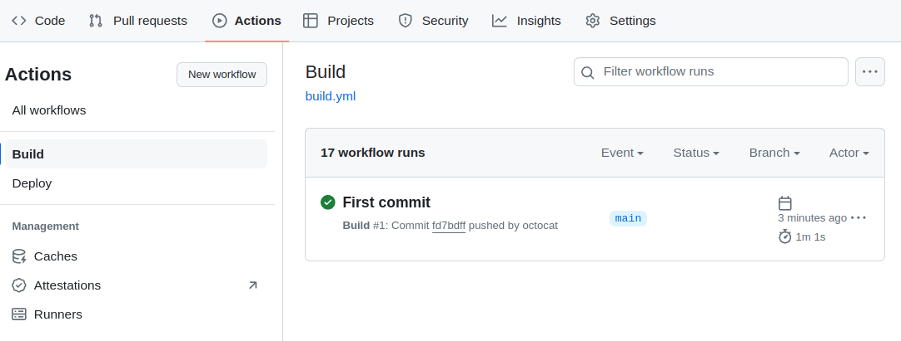
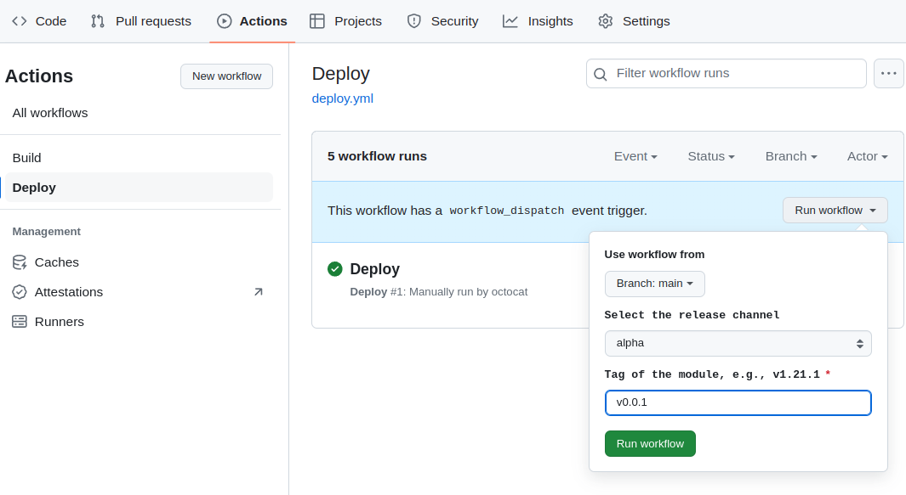



This section provides an example of creating a `helloworld` module based on [module template](https://github.com/deckhouse/modules-template/) and an adaptation of the [hello-world](https://github.com/giantswarm/hello-world-app) Helm-chart.

## Preparing module source code and building

1. Install the tools you will need:
   - [git](https://git-scm.com)
   - [sed](https://github.com/mirror/sed)
   - [yq](https://github.com/mikefarah/yq)

1. Fork the [module template repository](https://github.com/deckhouse/modules-template/) or copy it.

   ```shell
   git clone git@github.com:deckhouse/modules-template.git helloworld \
     && cd helloworld
   ```

1. Enter the name of the module in the `module.yaml` file.

   We will use the `helloworld` module name in this example, but you can use any name you like. For this, replace 'helloworld' in the commands and in your repo's name with the one you prefer.

   > Note that the module name may differ depending on the command. In may be written in *kebab-case* as well as *camelCase*. If you use a custom module name, make sure to modify it accordingly.

   Run the following command to add the module name to the `module.yaml` file or edit it manually:

   ```shell
   sed -i -e 's/^name:.*$/name: helloworld/' module.yaml
   ```

1. Clone the [hello-world](https://github.com/giantswarm/hello-world-app) chart source code into a temporary directory.

   ```shell
   git clone https://github.com/giantswarm/hello-world-app .tmp-chart
   ```

1. Copy the chart templates to the `templates` directory of the module (make sure to empty it beforehand).

   ```shell
   rm -rf templates/*
   cp -fR .tmp-chart/helm/hello-world/templates/* templates/
   cp .tmp-chart/helm/hello-world/values.yaml values.yaml
   ```

1. Replace the `.Values` path in the chart templates with `.Values.helloworld`.

   > This is due to the architectural feature of [addon-operator](https://github.com/flant/addon-operator). You have to stick to it to be able to access module values.

   ```shell
   sed -i -e 's/.Values/.Values.helloworld/g' $(find templates/ -type f)
   ```

1. Add the OpenAPI schema of the module settings.

   The module parameters are specified in the OpenAPI schema in the [openapi](../structure/#openapi) directory. Execute the following command to convert the JSON schema of the chart parameters to the OpenAPI schema of the module:

   ```shell
   jq 'walk(
      if type == "object" and .type == "object" and (keys | length) == 1
      then . + {additionalProperties: true}
      else .
      end
   )' .tmp-chart/helm/hello-world/values.schema.json > openapi/config-values.yaml
   ```

1. Define a rule for building an application container image.

   The rules for building application container images must reside in a subdirectory of the [images](../structure/#images) directory of the module. Run the following commands to create an application image directory and a Dockerfile with the image build rules:

   ```shell
   rm -rf images/*
   mkdir images/helloworld
   echo "FROM quay.io/giantswarm/helloworld:0.2.0" > images/helloworld/Dockerfile
   ```

1. Replace the image in the Deployment manifest with the Deckhouse Kubernetes Platform library helper. This will allow you to use the current content-based image tag.

   ```shell
   sed -Ei 's/image\:(.*)/image: {{ include "helm_lib_module_image" (list . "helloworld") }}/g' templates/deployment.yaml
   ```

1. Delete module hooks, CRDs, and temporary files.

   In our example, hooks and CustomResourceDefinitions are not used. Run the following commands to clear the `hooks` and `crds` directories:

   ```shell
   rm -rf hooks/
   rm -rf crds/
   rm -rf .tmp-chart
   ```

1. Set up CI/CD.

   The project template in the `.github` directory contains pre-built GitHub Actions workflow files that implement a simple scheme for building and publishing a module using the [GitHub Packages](https://github.com/features/packages) registry (ghcr.io). Module artifacts will be pushed to `ghcr.io/<OWNER>/modules/`, which will be the [module source](/products/kubernetes-platform/documentation/v1/reference/api/cr.html#modulesource). Make changes to the workflow files if the suggested option does not work for you.

   Do the following in the properties of your project on GitHub to make the module workflow run smoothly:
   - Open the *Settings -> Actions -> General* page.
   - Enable *Read and write permissions* in the *Workflow permissions* section.

1. Commit the changes to the repository (specify the address of the module's Git repository).

   ```shell
   git add .
   git commit -m "Initial Commit"
   git push --set-upstream origin <GIT_REPO_URL>
   ```

1. Confirm that the module was built successfully.

   Go to the *Actions* section of the module repository and select *Build* from the workflow list on the left. The workflow that starts after you have executed the `git push` command at the previous step is expected to run successfully.

   An example:

   

## Publishing the module to the release channel

Here's how you can publish version `v0.0.1` of the module to the *Alpha* release channel:

1. Create a new release `v0.0.1` of the module in the GitHub repository or add the `v0.0.1` tag.

1. Go to the *Actions* section of the module repository and select *Deploy* in the workflow list on the left.

1. Click on the *Run workflow* drop-down list on the right of the page and select `alpha`. Enter the `v0.0.1` tag in the tag input field. Click the *Run workflow* button.

   

1. Confirm that the module publishing workflow has completed successfully.

You can now access your module in a cluster managed by Deckhouse Kubernetes Platform.

## Enabling a module in a cluster

The following is the sequence of steps to enable the `helloworld` in a cluster managed by Deckhouse Kubernetes Platform.

1. Create an access token in the GitHub repository with permissions to handle GitHub Packages.
1. Generate an authentication string to access the GitHub Packages container registry in [dockerconfigjson](https://kubernetes.io/docs/tasks/configure-pod-container/pull-image-private-registry/#registry-secret-existing-credentials) format; insert your GitHub username (or organization) and access token in the angle brackets below:

   ```shell
   base64 -w0 <<EOF
   {
     "auths": {
       "ghcr.io": {
         "auth": "$(echo -n '<OWNER>:<TOKEN>' | base64 -w0)"
       }
     }
   }
   EOF
   ```

1. Create a [ModuleSource](/products/kubernetes-platform/documentation/v1/reference/api/cr.html#modulesource) resource in the cluster (specify the container registry address and authentication string).

   ```shell
   d8 k apply -f - <<EOF
   apiVersion: deckhouse.io/v1alpha1
   kind: ModuleSource
   metadata:
     name: ghcr
   spec:
     registry:
       # Insert your GitHub username (or organization), e.g., ghcr.io/octocat/modules.
       repo: ghcr.io/<!OWNER>/modules
       # Paste the authentication string for accessing GitHub Packages that you got in the previous step
       dockerCfg: <!REGISTRY_CREDENTIALS>
   EOF
   ```

   Note that it may take a few seconds to synchronize data after a resource has been created.

1. Check the list of available modules

   ```console
   $ d8 k get module
   NAME       STAGE    SOURCE   PHASE       ENABLED   READY
   ...
   helloworld                   Available   False     False     
   ...
   ```

1. Create a [ModuleUpdatePolicy](/products/kubernetes-platform/documentation/v1/reference/api/cr.html#moduleupdatepolicy) resource that defines the module update policy.

   Run the following command to create an update policy with the *Alpha* release channel and *Auto* update mode:

   ```shell
   d8 k apply -f - <<EOF
   apiVersion: deckhouse.io/v1alpha2
   kind: ModuleUpdatePolicy
   metadata:
     name: helloworld-policy
   spec:
     releaseChannel: Alpha
     update:
       mode: Auto
   EOF
   ```

1. Create a ModuleConfig where you specify the module source (the `source` parameter), the update policy (the `updatePolicy` parameter), and set the `enabled` parameter to `true`:

   ```shell
   d8 k apply -f - <<EOF
      apiVersion: deckhouse.io/v1alpha1
      kind: ModuleConfig
      metadata:
        name: helloworld
      spec:
         enabled: true
         source: ghcr
         updatePolicy: helloworld-policy
   ```

1. Check the ModuleSource (the status should have no errors and list the available modules):

   ```shell
   d8 k get ms ghcr -o yaml
   ```

1. Confirm that the new [ModuleRelease](/products/kubernetes-platform/documentation/v1/reference/api/cr.html#modulerelease) objects have been created for the module:

   ```shell
   d8 k get mr
   ```

   An example of output:

   ```console
   $ d8 k get mr
   NAME                                PHASE        UPDATE POLICY        TRANSITIONTIME   MESSAGE
   helloworld-v0.0.1                   Deployed     helloworld-policy    22m            
   ```

1. If the release has been successfully installed, wait for the Deckhouse Kubernetes Platform pod to restart.

   ```shell
   d8 k -n d8-system get pod -l app=deckhouse
   ```

   After a while, the module objects will be available in the cluster.

   If you run into errors while starting the module, check the DKP log:

   ```shell
   d8 k -n d8-system logs deploy/deckhouse -f | jq -rc '.msg'
   ```

  or check the status of the DKP queue:

   ```shell
   d8 platform queue list
   ```

## Migration of ModuleUpdatePolicy to version v1alpha2

If there is a ModuleUpdatePolicy of version v1alpha1 in the cluster, the following migration steps to version v1alpha2 must be performed:

If any ModuleUpdatePolicy of version v1alpha1 in the cluster defines `moduleReleaseSelector`, alerts [ModuleHasDeprecatedUpdatePolicy](../../../reference/alerts.html#monitoring-deckhouse-modulehasdeprecatedupdatepolicy) will be triggered in the monitoring system for all modules that match this selector. In this case, follow these steps to migrate to version v1alpha2 of ModuleUpdatePolicy:
- Specify the update policy for the corresponding modules in the ModuleConfig `spec.updatePolicy` parameter.
- Execute the following command, specifying the required ModuleUpdatePolicy:

  ```shell
  d8 k patch moduleupdatepolicies.v1alpha1.deckhouse.io <MUP_NAME> --type='json' \
    -p='[{"op": "replace", "path": "/spec/moduleReleaseSelector/labelSelector/matchLabels", "value": {"": ""}}]'
  ```


