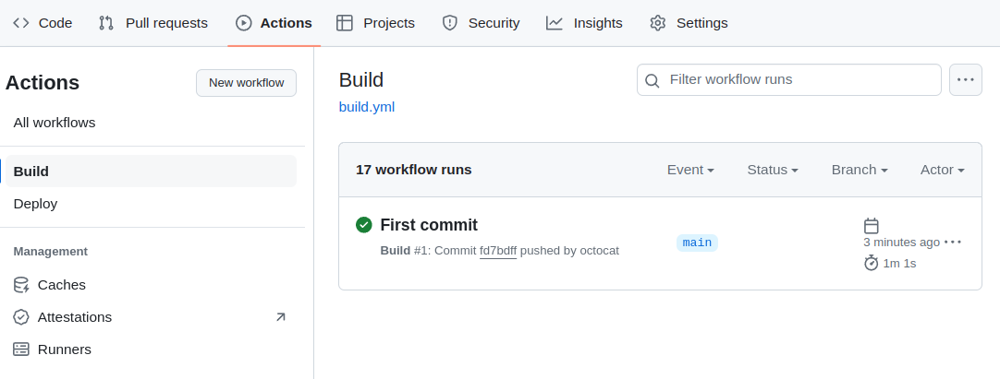
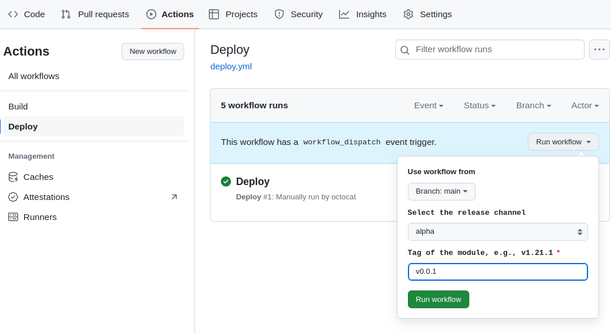



Пример создания модуля `helloworld` на основе [шаблона модуля](https://github.com/deckhouse/modules-template/) и адаптации Helm-чарта [hello-world](https://github.com/giantswarm/hello-world-app).

## Подготовка исходного кода модуля и сборка

1. Установите необходимые утилиты.
   - [git](https://git-scm.com)
   - [sed](https://github.com/mirror/sed)
   - [yq](https://github.com/mikefarah/yq)

1. Сделайте форк или скопируйте [репозиторий шаблона модуля](https://github.com/deckhouse/modules-template/).

   ```shell
   git clone git@github.com:deckhouse/modules-template.git helloworld \
     && cd helloworld
   ```

1. Укажите имя модуля в файле `module.yaml`.

   В примере будет использоваться имя модуля `helloworld`, но вы можете выбрать свое, заменив `helloworld` в командах и в названии вашего репозитория.

   > Обратите внимание, что в некоторых местах в примере имя модуля может быть записано в разных форматах — *kebab-case* или *camelCase*. Если вы используете свое имя модуля, то учитывайте изменение формата имени модуля в приводимых командах.

   Выполните следующую команду, чтобы указать имя модуля в файле `module.yaml`, либо отредактируйте его вручную:

   ```shell
   sed -i -e 's/^name:.*$/name: helloworld/' module.yaml
   ```

1. Склонируйте исходный код чарта [hello-world](https://github.com/giantswarm/hello-world-app) во временную директорию.

   ```shell
   git clone https://github.com/giantswarm/hello-world-app .tmp-chart
   ```

1. Скопируйте шаблоны чарта в директорию `templates` модуля, предварительно очистив ее.

   ```shell
   rm -rf templates/*
   cp -fR .tmp-chart/helm/hello-world/templates/* templates/
   cp .tmp-chart/helm/hello-world/values.yaml values.yaml
   ```

1. Замените в шаблонах чарта путь `.Values` на `.Values.helloworld`.

   > Это архитектурная особенность [addon-operator](https://github.com/flant/addon-operator), ей необходимо следовать для обращения к values модуля.

   ```shell
   sed -i -e 's/.Values/.Values.helloworld/g' $(find templates/ -type f)
   ```

1. Добавьте OpenAPI-схему настроек модуля.

   Параметры модуля указываются в OpenAPI-схеме в директории [openapi](../structure/#openapi). Выполните следующую команду, чтобы преобразовать JSON-схему параметров чарта в OpenAPI-схему модуля:

   ```shell
   jq 'walk(
      if type == "object" and .type == "object" and (keys | length) == 1
      then . + {additionalProperties: true}
      else .
      end
   )' .tmp-chart/helm/hello-world/values.schema.json > openapi/config-values.yaml
   ```

1. Опишите правило сборки образа контейнера приложения.

   Правила сборки образов контейнеров приложений должны находиться в подкаталоге директории [images](../structure/#images) модуля. Выполните следующую команду, чтобы создать директорию образа приложения и Dockerfile с правилами сборки образа.

   ```shell
   rm -rf images/*
   mkdir images/helloworld
   echo "FROM quay.io/giantswarm/helloworld:0.2.0" > images/helloworld/Dockerfile
   ```

1. Замените образ в манифесте Deployment на хелпер библиотеки Deckhouse Kubernetes Platform. Это позволит использовать актуальный content-based-тэг образа.

   ```shell
   sed -Ei 's/image\:(.*)/image: {{ include "helm_lib_module_image" (list . "helloworld") }}/g' templates/deployment.yaml
   ```

1. Удалите хуки модуля, CRD и временные файлы.

   Пример не использует хуки и CustomResourceDefinition. Выполните следующие команды, чтобы очистить папки `hooks` и `crds`:

   ```shell
   rm -rf hooks/
   rm -rf crds/
   rm -rf .tmp-chart
   ```

1. Настройте CI/CD.

   В шаблоне проекта в директории `.github` находятся готовые файлы workflow GitHub Actions, которые реализуют простую схему сборки и публикации модуля с использованием registry [GitHub Packages](https://github.com/features/packages) (ghcr.io). Артефакты модуля будут загружаться по адресу `ghcr.io/<OWNER>/modules/`, который будет являться [источником модулей](/products/kubernetes-platform/documentation/v1/reference/api/cr.html#modulesource). Внесите изменения в файлы workflow, если вам не подходит предложенный вариант.

   Выполните следующие настройки в свойствах вашего проекта на GitHub, чтобы workflow модуля работал корректно:
   - Откройте страницу *Settings -> Actions -> General*.
   - Установите параметр *Read and write permissions* в разделе *Workflow permissions*.

1. Зафиксируйте изменения в репозитории (укажите адрес Git-репозитория модуля).

   ```shell
   git add .
   git commit -m "Initial Commit"
   git push --set-upstream origin <GIT_REPO_URL>
   ```

1. Убедитесь, что сборка модуля выполнилась успешно.

   Перейдите в раздел *Actions* репозитория модуля и слева, в списке workflow, выберите *Build*. Workflow, запущенный после того, как вы выполнили команду `git push` на предыдущем шаге, должен выполниться успешно.

   Пример:

   

## Публикация модуля на канале обновлений

Пример публикации версии `v0.0.1` модуля на канале обновлений *Alpha*:

1. Создайте новый релиз модуля `v0.0.1` в репозитории GitHub или установите тег `v0.0.1`.

1. Перейдите в раздел *Actions* репозитория модуля и слева, в списке workflow, выберите *Deploy*.

1. В правой части страницы нажмите на выпадающий список *Run workflow* и выберите `alpha`. Укажите тег `v0.0.1` в поле ввода тега. Нажмите кнопку *Run workflow*.

   

1. Убедитесь, что workflow публикации модуля выполнился успешно.

Модуль стал доступным для подключения в кластере Deckhouse Kubernetes Platform.

## Подключение модуля в кластере

Пример подключения модуля `helloworld` в кластере Deckhouse Kubernetes Platform.

1. Создайте токен доступа в репозитории GitHub с правами для работы с GitHub Packages.
1. Сгенерируйте строку аутентификации для доступа к GitHub Packages container registry в формате [dockerconfigjson](https://kubernetes.io/docs/tasks/configure-pod-container/pull-image-private-registry/#registry-secret-existing-credentials), указав имя пользователя (или организации) GitHub и токен доступа:

   ```shell
   base64 -w0 <<EOF
   {
     "auths": {
       "ghcr.io": {
         "auth": "$(echo -n '<OWNER>:<TOKEN>' | base64 -w0)"
       }
     }
   }
   EOF
   ```

1. Создайте в кластере ресурс [ModuleSource](/products/kubernetes-platform/documentation/v1/reference/api/cr.html#modulesource) (укажите адрес container registry и строку аутентификации).

   ```shell
   d8 k apply -f - <<EOF
   apiVersion: deckhouse.io/v1alpha1
   kind: ModuleSource
   metadata:
     name: ghcr
   spec:
     registry:
       # Укажите имя пользователя (или организации) GitHub. Например: ghcr.io/octocat/modules
       repo: ghcr.io/<!OWNER>/modules
       # Строка аутентификации для доступа к GitHub Packages из предыдущего шага.
       dockerCfg: <!REGISTRY_CREDENTIALS>
   EOF
   ```

   Синхронизация данных после создания ресурса может занять несколько секунд.

1. Посмотрите список доступных модулей:

   ```console
   $ d8 k get module
   NAME       STAGE    SOURCE   PHASE       ENABLED   READY
   ...
   helloworld                   Available   False     False     
   ...
   ```

1. Создайте ресурс [ModuleUpdatePolicy](/products/kubernetes-platform/documentation/v1/reference/api/cr.html#moduleupdatepolicy), определяющий политику обновления модуля.

   Выполните следующую команду, чтобы создать политику обновления с каналом обновления *Alpha* и режимом обновления *Auto*:

   ```shell
   d8 k apply -f - <<EOF
   apiVersion: deckhouse.io/v1alpha2
   kind: ModuleUpdatePolicy
   metadata:
     name: helloworld-policy
   spec:
     releaseChannel: Alpha
     update:
       mode: Auto
   EOF
   ```

1. Создайте ModuleConfig, где укажите источник модуля (параметр `source`), политику обновления (параметр `updatePolicy`) и установите параметр `enabled` в `true`:

   ```shell
   d8 k apply -f - <<EOF
      apiVersion: deckhouse.io/v1alpha1
      kind: ModuleConfig
      metadata:
        name: helloworld
      spec:
         enabled: true
         source: ghcr
         updatePolicy: helloworld-policy
   ```

1. Проверьте ModuleSource (в статусе не должно содержаться ошибок и должны быть перечислены доступные модули):

   ```shell
   d8 k get ms ghcr -o yaml
   ```

1. Убедитесь, что были созданы новые объекты [ModuleRelease](/products/kubernetes-platform/documentation/v1/reference/api/cr.html#modulerelease) для модуля:

   ```shell
   d8 k get mr
   ```

   Пример вывода:

   ```console
   $ d8 k get mr
   NAME                                PHASE        UPDATE POLICY        TRANSITIONTIME   MESSAGE
   helloworld-v0.0.1                   Deployed     helloworld-policy    22m            
   ```

1. В случае успешной установки релизов дождитесь перезапуска пода Deckhouse Kubernetes Platform.

   ```shell
   d8 k -n d8-system get pod -l app=deckhouse
   ```

   Через некоторое время объекты модуля появятся в кластере.

   Если при запуске модуля возникли ошибки, посмотрите журнал DKP:

   ```shell
   d8 k -n d8-system logs deploy/deckhouse -f | jq -rc '.msg'
   ```

   или проверьте состояние очереди DKP:

   ```shell
   d8 system queue list
   ```

## Миграция ModuleUpdatePolicy на версию v1alpha2

Если в кластере существует ModuleUpdatePolicy версии v1alpha1, то необходимо выполнить следующие шаги по миграции на версию v1alpha2:

Если в кластере в каком-либо ModuleUpdatePolicy версии v1alpha1 определен `moduleReleaseSelector`, то для всех модулей, которые подходят под этот селектор, в системе мониторинга будут гореть алерты [`ModuleHasDeprecatedUpdatePolicy`](../../../reference/alerts.html#monitoring-deckhouse-modulehasdeprecatedupdatepolicy). В этом случае выполните следующие шаги по миграции на версию v1alpha2 ModuleUpdatePolicy:
- Укажите политику обновления для соответствующих модулей в параметре `spec.updatePolicy` ModuleConfig.
- Выполните следующую команду, указав необходимый ModuleUpdatePolicy:

  ```shell
  d8 k patch moduleupdatepolicies.v1alpha1.deckhouse.io <MUP_NAME> --type='json' \
    -p='[{"op": "replace", "path": "/spec/moduleReleaseSelector/labelSelector/matchLabels", "value": {"": ""}}]'
  ```


