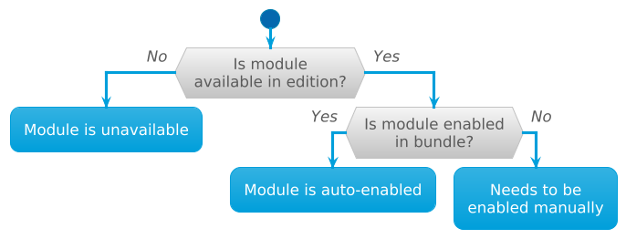

The source code of the module and its assembly rules must be located in a directory with a certain structure. The best analog is a Helm chart.

Not all module folders and files are required. In short, you can use the following guidelines:
- Create a [module.yaml](#moduleyaml) file to describe the module metadata.
- In the [templates](#templates) folder, place the Helm templates that will be used in the cluster.

If you want the objects created by the module to change their behavior depending on any module parameters, define the necessary parameters [in the specification](#config-valuesyaml) and use them in the templates.
- In the [images](#images) folder, place instructions for building container images used by the module.

If the templates only use addresses of *external* images, you don`t need to create a folder.
- If the module should respond to events or interact with the Kubernetes API, you need to create hooks that should be placed in the [hooks](#hooks) folder.
- Place the module documentation in the [docs](#docs) folder. If the module documentation is missing, the module will not appear in the list of modules in the documentation web interface in the cluster.
- If the module has auxiliary Helm charts, place them in the [charts](#charts) folder.
- If the module needs to create custom resources (CRD), place their specifications in the [crds](#crds) folder.

There is a repository containing the sample [module template](https://github.com/deckhouse/modules-template/). We recommend you start your module development with it.

Further down this page you will find a more detailed description of the module directory and file structure.

<details markdown="0"><summary>Example module folder structure...</summary>
<div markdown="1">

Example module folder structure containing build and publish rules using GitHub Actions:  

```tree
📁 my-module/
├─ 📁 .github/
│  ├─ 📁 workflows/
│  │  ├─ 📝 build_dev.yaml
│  │  ├─ 📝 build_prod.yaml
│  │  ├─ 📝 checks.yaml
│  │  ├─ 📝 deploy_dev.yaml
│  │  └─ 📝 deploy_prod.yaml
├─ 📁 .werf/
│  ├─ 📁 workflows/
│  │  ├─ 📝 base-images.yaml
│  │  ├─ 📝 bundle.yaml
│  │  ├─ 📝 images.yaml
│  │  ├─ 📝 images-digest.yaml
│  │  ├─ 📝 batch-go.yaml
│  │  └─ 📝 release.yaml
├─ 📁 charts/
│  └─ 📁 helm_lib/
├─ 📁 crds/
│  ├─ 📝 crd1.yaml
│  ├─ 📝 doc-ru-crd1.yaml
│  ├─ 📝 crd2.yaml
│  └─ 📝 doc-ru-crd2.yaml
├─ 📁 docs/
│  ├─ 📝 README.md
│  ├─ 📝 README.ru.md
│  ├─ 📝 EXAMPLES.md
│  ├─ 📝 EXAMPLES.ru.md
│  ├─ 📝 CONFIGURATION.md
│  ├─ 📝 CONFIGURATION.ru.md
│  ├─ 📝 CR.md
│  ├─ 📝 CR.ru.md
│  ├─ 📝 FAQ.md
│  ├─ 📝 FAQ.ru.md
│  ├─ 📝 ADVANCED_USAGE.md
│  └─ 📝 ADVANCED_USAGE.ru.md
├─ 📁 hooks/
│  ├─ 📁 batch/
│  │  ├─ 📁 my-hooks/
│  │  │  ├─ 📝 my-hook1.go
│  │  │  └─ 📝 my-hook2.go
│  │  ├─ 📝 go.mod
│  │  ├─ 📝 go.sum
│  │  ├─ 📝 main.go
├─ 📁 images/
│  ├─ 📁 nginx
│  │  └─ 📝 Dockerfile
│  └─ 📁 backend
│     └─ 📝 werf.inc.yaml
├─ 📁 lib/
│  └─ 📁 python/
│     └─ 📝 requirements.txt
├─ 📁 openapi/
│  ├─ 📁 conversions
│  │  ├─ 📁 testdata
│  │  │  ├─ 📝 v1-1.yaml
│  │  │  └─ 📝 v2-1.yaml
│  │  ├─ 📝 conversions_test.go
│  │  └─ 📝 v2.yaml
│  ├─ 📝 config-values.yaml
│  ├─ 📝 doc-ru-config-values.yaml
│  └─ 📝 values.yaml
├─ 📁 templates/
│  ├─ 📝 a.yaml
│  └─ 📝 b.yaml
├─ 📝 .helmignore
├─ 📝 Chart.yaml
├─ 📝 module.yaml
├─ 📝 werf.yaml
└─ 📝 werf-giterminism.yaml
```

</div>
</details>

## charts

The `/charts` directory contains Helm helper charts used when rendering templates.

Deckhouse Kubernetes Platform (DKP) has its own library for working with templates called [lib-helm](https://github.com/deckhouse/lib-helm). You can read about the library's features [in the lib-helm repository](https://github.com/deckhouse/lib-helm/blob/main/charts/helm_lib/README.md). To add the library to the module, download the [tgz-archive](https://github.com/deckhouse/lib-helm/releases/) with the appropriate release and move it to the `/charts` directory of the module.

## crds

This directory contains [*CustomResourceDefinitions*](https://kubernetes.io/docs/tasks/extend-kubernetes/custom-resources/custom-resource-definitions/) (CRDs) used by the module components. CRDs are updated every time the module is started, if there are updates.

To render CRDs from the `/crds` directory in the site documentation or documentation module in the cluster, follow these steps:
* create a translation file with a structure identical to the original resource file:
  - in it, keep only the `description` parameters containing the translation text;
  - use the `doc-ru-` prefix in the name: e.g., `/crds/doc-ru-crd.yaml` for `/crds/crd.yaml`.
* create `/docs/CR.md` and `/docs/CR.ru.md` files.

## docs


The module [lifecycle](../versioning/#module-lifecycle) is specified in [module.yaml](#moduleyaml). The availability of the module in the editions of the Deckhouse Kubernetes Platform is not determined by the module developer.


The `/docs` directory contains the module documentation.
The following subfolders aren't involved in the documentation building process:

- `internal`
- `internals`
- `development`
- `dev`

The following files are required for building the documentation:

* `README.md` and `README.ru.md` — this file (and its localized version) describes what the module is for, what problem it solves and outlines the general architectural principles.

  The ([front matter](https://gohugo.io/content-management/front-matter/)) file metadata as a YAML structure must present in all language versions of the file. You can use the following parameters in the metadata:
  - `title` — **(recommended)** The title of the module description page, for example, "Deckhouse web admin console". It is also used in navigation if `linkTitle` parameter is not specified.
  - `menuTitle` — **(recommended)** The name of the module to show in the menu on the left sidebar of the page, e.g., "Deckhouse Admin". If not set, the name of the directory or repository is used, e.g. `deckhouse-admin`.
  - `linkTitle` — **(optional)** Alternative title for navigation if, for example, the `title` is very long. If not set, the `title` parameter is used.
  - `description` — **(recommended)** A short unique description of the page content (up to 150 characters). It should not repeat the `title'. Goes on with the meaning of the title and reveals it in more detail. It is used during generation of preview links and indexing by search engines, e.g., "The module allows you to fully manage your Kubernetes cluster through a web interface with only mouse skills."

  <div markdown="0">
  <details><summary>Metadata example...</summary>
  <div class="highlight">
  <pre class="highlight">
  <code>---
  title: "Deckhouse administrator web console"
  menuTitle: "Deckhouse Admin"
  description: "The module allows you to fully manage your Kubernetes cluster through a web interface with only mouse skills."
  ---</code>
  </pre>
  </div>
  </details>
  </div>

The following files aren't required but have a [predetermined name](https://github.com/deckhouse/deckhouse/blob/main/docs/site/backends/docs-builder-template/data/helpers.yaml#L1) in the sidebar menu and the page title:

* `EXAMPLES.md` and `EXAMPLES.ru.md` — this file (and its localized version) contains examples of module configuration with description.
  
  The ([front matter](https://gohugo.io/content-management/front-matter/)) file metadata as a YAML structure must present in all language versions of the file. You can use the following parameters in the metadata:
  - `title` – **(recommended)** The title of the page, e.g., `Examples`. It is also used in navigation if there is no `linkTitle`.
  - `description` – **(recommended)** A short unique description of the page content (up to 150 characters). It should not repeat the `title'. Goes on with the meaning of the title and reveals it in more detail. It is used during generation of preview links and indexing by search engines, e.g., "Examples of storing secrets in a neural network and automatically substituting them into thoughts when communicating."
  - `linkTitle` – **(optional)** Alternative title for navigation if, for example, the `title` is very long. If not set, the `title` parameter is used.  

  <div markdown="0">
  <details><summary>Metadata example...</summary>
  <div class="highlight">
  <pre class="highlight">
  <code>---
  title: "Examples"
  description: "Examples of storing secrets in a neural network with automatic substitution into thoughts when communicating."
  ---</code>
  </pre>
  </div>
  </details>
  </div>

* `FAQ.md` and `FAQ.ru.md` — this file (and its localized version) contains frequently asked questions related to module operation, e.g., "What scenario should I choose: A or B?".
  
  The ([front matter](https://gohugo.io/content-management/front-matter/)) file metadata as a YAML structure must present in all language versions of the file. You can use the following parameters in the metadata:
  - `title` – **(recommended)** The title of the page.
  - `description` – **(recommended)** A short unique description of the page content (up to 150 characters).
  - `linkTitle` – **(optional)** Alternative title for navigation if, for example, the `title` is very long. If not set, the `title` parameter is used.  

  <div markdown="0">
  <details><summary>Metadata example...</summary>
  <div class="highlight">
  <pre class="highlight">
  <code>---
  title: "FAQs"
  description: "Frequently asked questions."
  ---</code>
  </pre>
  </div>
  </details>
  </div>
  
* `ADVANCED_USAGE.md` and `ADVANCED_USAGE.ru.md` — this file (and its localized version) contains expanded instructions on using and debugging the module.
  
  The ([front matter](https://gohugo.io/content-management/front-matter/)) file metadata as a YAML structure must present in all language versions of the file. You can use the following parameters in the metadata:
  - `title` – **(recommended)** The title of the page.
  - `description` – **(recommended)** A short unique description of the page content (up to 150 characters).
  - `linkTitle` – **(optional)** Alternative title for navigation if, for example, the `title` is very long. If not set, the `title` parameter is used.  

  <div markdown="0">
  <details><summary>Metadata example...</summary>
  <div class="highlight">
  <pre class="highlight">
  <code>---
  title: "Module debugging"
  description: "This section covers all the steps for debugging the module."
  ---</code>
  </pre>
  </div>
  </details>
  </div>
  
* `CR.md` and `CR.ru.md` — the files for generating resources from the `/crds/` directory.
  Add these files if such a generation is required.

  <div markdown="0">
  <details><summary>Metadata example...</summary>
  <div class="highlight">
  <pre class="highlight">
  <code>---
  title: "Custom resources"
  ---</code>
  </pre>
  </div>
  </details>
  </div>

* `CONFIGURATION.md` and `CONFIGURATION.ru.md` — this file (and its localized version) is used to generate OpenAPI specifications from `/openapi/config-values.yaml` and `/openapi/doc-<LANG>-config-values.yaml`.
  Add these files if such a generation is required.

  <div markdown="0">
  <details><summary>Metadata example...</summary>
  <div class="highlight">
  <pre class="highlight">
  <code>---
  title: "Module settings"
  ---</code>
  </pre>
  </div>
  </details>
  </div>
  
All images, PDF files and other media files should be stored in the `/docs` directory or its subdirectories (e.g, `/docs/images/`). All links to files should be relative.

You need a file with the appropriate suffix for each language, e.g. `image1.jpg` and `image1.ru.jpg`. Here's how you can include images in your document:
- `[image1](image1.jpg)` in an English-language document;
- `[image1](image1.ru.jpg)` in a Russian-language document.

## hooks

The `/hooks/batch` directory contains the module's hooks. A hook is an executable file executed in response to an event. Hooks are also used by the module for dynamic interaction with Kubernetes API. For example, they can be used to handle events related to the creation or deletion of objects in a cluster.

[Get to know](../#before-you-start) the concept of hooks before you start developing your own hook. You can use the [Go library](https://github.com/deckhouse/module-sdk) by the Deckhouse team to speed up the development of hooks.


Hook requirements:
- When run with the `hook config` arguments, it should output its hook configuration in JSON format.
- When run with the `hook list` arguments, it should output a run of all hooks with their sequence number.
- When run with the `hook run 0` arguments, the logic of the hook with number 0 should be executed.

The hook files must be executable. Add the appropriate permissions using the `chmod +x <path to the hook file>` command.

You can find Go hook examples in the [module template](https://github.com/deckhouse/modules-template/) repository. Go hook examples can also be found in the [SDK](https://github.com/deckhouse/module-sdk/tree/main/examples).

## images

The `/images` directory contains instructions for building module container images. The first level contains directories for files used to create the container image, the second level contains the building context.

There are two ways to define a container image:

1. [Dockerfile](https://docs.docker.com/engine/reference/builder/) — this file contains commands for building images. To build an application from source code, copy it next to the Dockerfile and include it in the image using the `COPY` command.
2. The `werf.inc.yaml` file, which is the same as the [image definition section in `werf.yaml`](https://werf.io/documentation/v1.2/reference/werf_yaml.html#L33).

The image name matches the directory name for this module, written in *camelCase* notation starting with a small letter. For example, the directory `/images/echo-server` corresponds to the image name `echoServer`.

The built images have content-based tags that can be used when building other images. To use content-based image tags, [enable the lib-helm](#charts) library. You can also use other features of the [helm_lib library](https://github.com/deckhouse/lib-helm/tree/main/charts/helm_lib) of Deckhouse Kubernetes Platform.

Below is an example of using a content-based image tag in a Helm chart:

```yaml
image: {{ include "helm_lib_module_image" (list . "<image name>") }}
```

## openapi

### conversions

The `/openapi/conversions` directory contains module parameter conversion files and their tests.

Module parameter conversions allow you to convert the OpenAPI specification of module parameters from one version to another. Conversions may be necessary when a parameter is renamed or moved to a different location in a new version of the OpenAPI specification.

Each conversion can only be performed between two consecutive versions (e.g., from the first to the second one). There can be several conversions, and the chain of conversions must sequentially cover all versions of the parameter specification with no "gaps".

The conversion file is a YAML file named `v<N>.yaml` or `v<N>.yml`, where `<N>` is the conversion version. It has the following structure:

```yaml
# Version number of the module parameter specification to which the data is converted during the conversion.
version: N
# A set of jq expressions used during conversion in the cluster for the automatic transformation 
# of the previous version module parameters.
conversions: []
# Actions (in two languages) that need to be taken to convert the data 
# from the previous version of the module parameter specification.
description:
  ru: ""
  en: ""
```

The description of actions specified in the description section of the conversion file must be clear and include information on which parameters and in what order need to be changed in the module's parameter specification in order to switch to the new version.

Below is an example of a module parameter conversion file `v2.yaml`, where in version 2 the `.auth.password` parameter has been removed:

```yaml
version: 2
conversions:
  - del(.auth.password) | if .auth == {} then del(.auth) end
description:
  ru: "Remove `.auth.password`, then `auth` if empty."
  en: "Remove `.auth.password`, then `auth` if empty."
```

#### Conversion tests

You can use the `conversion.TestConvert` function to write conversion tests. It receives the following parameters:
- path to the source configuration file (i.e., the version before the conversion);
- path to the resulting configuration file (i.e., the version after the conversion).

An [example](https://github.com/deckhouse/deckhouse/blob/main/modules/300-prometheus/openapi/conversions/conversions_test.go) of a conversion test.

### config-values.yaml

This file is required to validate the module parameters that the user can configure via [ModuleConfig](/products/kubernetes-platform/documentation/v1/reference/api/cr.html#moduleconfig).

To render the schema in the documentation on the site or in the documentation module in the cluster, create:
- the `doc-ru-config-values.yaml` file with a structure similar to that of the `config-values.yaml` file. Keep only the translated description parameters in the `doc-ru-config-values.yaml` file;
- the `/docs/CONFIGURATION.md` and `/docs/CONFIGURATION.ru.md` files to enable rendering of data from the `/openapi/config-values.yaml` and `/openapi/doc-ru-config-values.yaml` files.

An example of a `/openapi/config-values.yaml` schema with a single configurable `nodeSelector` parameter:

```yaml
type: object
properties:
  nodeSelector:
    type: object
    additionalProperties:
      type: string
    description: |
      The same as the Pods' `spec.nodeSelector` parameter in Kubernetes.

      If the parameter is omitted or `false`, `nodeSelector` will be determined
      [automatically](../../installing/#advanced-scheduling).</code>
```

An example of the `/openapi/doc-ru-config-values.yaml` file:

```yaml
properties:
  nodeSelector:
    description: |
      English description. Markdown markup.</code>
```

#### x-deckhouse-validations (CEL validations)

When developing a module for the Deckhouse Kubernetes Platform, you can use the OpenAPI extension `x-deckhouse-validations` to describe complex validation rules for module parameters using CEL (Common Expression Language).

When using CEL validations, keep the following features in mind:

- Validations can be placed at the root level or inside any property (including inside objects, arrays, and additionalProperties).
- All parameters at the current level are available in expressions via the `self` variable.
- Validation works recursively: all nested objects, arrays, and maps can also contain their own `x-deckhouse-validations`.
- Supported types: scalars, arrays, objects, and maps (`additionalProperties`).
- If there are multiple validation errors, the user will see all messages from the corresponding rules.

##### Examples of complex rules

Below are examples of complex validation rules described in CEL:

- Checking whether the parameter value falls within the range:
  
  ```yaml
  type: object
  properties:
    replicas:
      type: integer
    minReplicas:
      type: integer
    maxReplicas:
      type: integer
  x-deckhouse-validations:
    - expression: "self.minReplicas <= self.replicas && self.replicas <= self.maxReplicas"
      message: "replicas must be between minReplicas and maxReplicas"
  ```

- Checking for the presence of a key:
  
  ```yaml
  - expression: "'Available' in self.stateCounts"
    message: "The key 'Available' must be present"
  ```

- Checking that exactly one of two lists is non-empty:
  
  ```yaml
  - expression: "(self.list1.size() == 0) != (self.list2.size() == 0)"
    message: "Exactly one of the lists must be non-empty"
  ```

- Checking a value by regular expression:
  
  ```yaml
  - expression: "self.details.all(key, self.details[key].matches('^[a-zA-Z]*$'))"
    message: "All values must contain only letters"
  ```

##### Scalar and array value validation

Validation of scalar values and arrays has the following features:

- If the property is a scalar (e.g., number or string), then in the CEL expression `self` will be that value.
- If the property is an array, then `self` will be an array, and you can use methods like `.size()`, `.all()`, `.exists()`, etc.

Example for an array:

```yaml
type: object
properties:
  items:
    type: array
    items:
      type: string
    x-deckhouse-validations:
      - expression: "self.size() > 0"
        message: "The items list must not be empty"
```

##### Validation of additionalProperties (map)

For objects with additionalProperties (map), you can validate keys and values using methods like `.all(key, ...)`, `.exists(key, ...)`, etc.

Example:

```yaml
type: object
properties:
  mymap:
    type: object
    additionalProperties:
      type: integer
    x-deckhouse-validations:
      - expression: "self.all(key, self[key] > 0)"
        message: "All values in mymap must be greater than 0"
```

### values.yaml

This file is required for validating the source data when rendering templates without using extra Helm chart functions.
Its closest analogs are Helm's [schema files](https://helm.sh/docs/topics/charts/#schema-files).

You can automatically add parameter validation from `config-values.yaml` to `values.yaml`. In this case, the basic `values.yaml` looks as follows:

```yaml
x-extend:
  schema: config-values.yaml
type: object
properties:
  internal:
    type: object
    default: {}
```

## templates

The `/templates` directory contains [Helm templates](https://helm.sh/docs/chart_template_guide/getting_started/).

* Use the path `.Values.<moduleName>` to access module settings in templates, and `.Values.global` for global settings. The module name is converted to *camelCase* notation.

* To facilitate working with templates, use [lib-helm](https://github.com/deckhouse/lib-helm), which is a set of extra functions that make it easier to work with global and module values.

* Accesses to the registry from the ModuleSource resource are available at the `.Values.<moduleName>.registry.dockercfg` path.

* To use these functions to pull image pools in controllers, create a secret and add it to the corresponding parameter: `"imagePullSecrets": [{"name":"registry-creds"}]`.

  ```yaml
  apiVersion: v1
  kind: Secret
  metadata:
    name: registry-creds
  type: kubernetes.io/dockerconfigjson
  data:
    .dockerconfigjson: {{ .Values.<moduleName>.registry.dockercfg }}
  ```

A module can have parameters with which it can alter its behavior. Module parameters and their validation scheme are described in OpenAPI-schemes in `/openapi` directory.

The settings are stored in two files: [`config-values.yaml`](#config-valuesyaml) and [`values.yaml`](#valuesyaml).

You can find an example of an OpenAPI schema in [module template](https://github.com/deckhouse/modules-template/blob/main/openapi/config-values.yaml).

## .helmignore

`.helmignore` allows you to exclude files from the Helm release. In case of DKP modules, directories `/crds`, `/images`, `/hooks`, `/openapi` must be added to `.helmignore` to avoid exceeding 1 Mb limit of Helm release size.

## Chart.yaml

This is a file for a chart, similar to [`Chart.yaml`](https://helm.sh/docs/topics/charts/#the-chartyaml-file) in Helm. It must contain at least a `name` parameter with the module name and a `version` parameter with the version.
You don't need to create this file, Deckhouse will create it automatically.

An example:

```yaml
name: echoserver
version: 0.0.1
dependencies:
- name: deckhouse_lib_helm
  version: 1.38.0
  repository: https://deckhouse.github.io/lib-helm
```

## module.yaml

The `module.yaml` file in the root of the module folder contains the module's metadata.

The file might not be present, but it is recommended to fill it in. Most of the metadata will be available in the [Module](/products/kubernetes-platform/documentation/v1/reference/api/cr.html#module) object in the cluster. The Module object will be created automatically after the module source (resource [ModuleSource](/products/kubernetes-platform/documentation/v1/reference/api/cr.html#modulesource)) is configured and synchronization is successful.

Parameters that can be used in `module.yaml`:

- `namespace` — *String.* The namespace where the module components will be deployed.
- `subsystems` — *Array of strings.* List of subsystems the module belongs to.
- `accessibility` — *Object.* Module accessibility settings.
  - `editions` — *Object.* Module operation settings in Deckhouse editions.
    - `available` — *Boolean.* Defines whether the module is available in a Deckhouse edition.
    - `enabledInBundles` — *Array of strings.* List of module bundles in which the module should be enabled by default.
- `descriptions` — *Object.* Arbitrary text description of the module's purpose.
  - `en` — *String.* Description in English.
  - `ru` — *String.* Description in Russian.
- `disable` — *Object.* Parameters related to the behavior when disabling a module.
  - `confirmation` — *Boolean.* Requires confirmation when disabling the module.
  - `message` — *String.* Message explaining what will happen when the module is disabled.

  If confirmation is required to disable a module (`confirmation` is set to `true`), then disabling the module is only possible if the corresponding ModuleConfig object has the annotation `modules.deckhouse.io/allow-disabling=true`. If this annotation is not present, Deckhouse will block the disabling attempt and display the warning message from the `message` field.
- `name` — *String, mandatory parameter.* The name of the module in Kebab Case. For example, `echo-server`.
- `exclusiveGroup` — *String.* If multiple modules belong to the same `exclusiveGroup`, only one of them can be active in the system at any given time. This prevents conflicts between modules performing similar or incompatible functions.
- `requirements` — *Object.* [Module dependencies](../dependencies/) — a set of conditions that must be met for Deckhouse Kubernetes Platform (DKP) to run the module.
  - `deckhouse` — *String.* Dependency on the [Deckhouse Kubernetes Platform version](../dependencies/#deckhouse-kubernetes-platform-version-dependency) that the module is compatible with.
  - `kubernetes` — *String.* Dependency on the [Kubernetes version](../dependencies/#kubernetes-version-dependency) that the module is compatible with.
  - `modules` — *Object.* Dependency on the [version of other modules](../dependencies/#dependency-on-the-version-of-other-modules).
- `stage` — *String.* [Module lifecycle stage](../versioning/#how-do-i-figure-out-how-stable-a-module-is). Possible values: `Experimental`, `Preview`, `General Availability`, `Deprecated`.
If `stage` is set to `Experimental`, the module cannot be enabled by default. To allow the use of such modules, set the [`allowExperimentalModules`](/modules/deckhouse/configuration.html#parameters-allowexperimentalmodules) parameter to `true`.
- `tags` — *Array of strings.* List of additional module tags. Tags are converted to [Module](../../../reference/api/global.html#parameters-modules) object labels using the template `module.deckhouse.io/<TAG>=""` (where `<TAG>` is the tag name).

  For example, if you specify `tags: ["test", "myTag"]`, then the corresponding Module object in the cluster will have the labels `module.deckhouse.io/test=""` and `module.deckhouse.io/myTag=""`.
- `weight` — *Number.* The weight of the module. Used to determine the startup order among modules — the lower the weight, the earlier the module will start. Default: 900.

  The startup order can also be influenced by the list of [module dependencies](../dependencies/).

Example of metadata description for the `hello-world` module:

```yaml
name: hello-world
tags: ["test", "myTag"]
weight: 960
stage: "Experimental"
namespace: "test"
exclusiveGroup: "group"
subsystems:
  - test
  - test1
accessibility:
  editions:
    ee:
      available: true
      enabledInBundles:
        - Default
descriptions: 
  en: "The module to say hello to the world."
  ru: "Модуль, который приветствует мир."
requirements:
    deckhouse: ">= 1.61"
    kubernetes: ">= 1.27"
disable:
  confirmation: true
  message: "Disabling this module will delete all resources, created by the module."
```

### Configuring module accessibility in DKP editions

The `accessibility` parameter lets you define the DKP editions and module bundles in which a module is available,
and whether it should be enabled by default.

```yaml
accessibility:
  editions:
    _default:
      available: true
      enabledInBundles:
        - Default
        - Managed
    ce:
      available: false
    ee:
      available: true
      enabledInBundles:
        - Managed   
```

Parameter description:

- `accessibility`: *Object.* Root block for configuring module accessibility.
- `editions`: *Object.* Set of keys representing edition names.
  Each edition can have its own accessibility settings.
- `_default`: *Object.* Default configuration used when no settings are defined for a specific edition.
- `available`: *Boolean.* Defines whether the module is available in the specified edition.
- `enabledInBundles`: *Array of strings.* Module bundles in which the module is enabled by default.
  Supported module bundles (the full contents of each bundle are listed on [this page](../../../admin/configuration/#module-bundles)):
  - `Default`: Recommended set of modules for running a cluster.
    Includes monitoring, authorization control, networking, and other essential components.
  - `Managed`: Set of modules for clusters managed by cloud providers (for example, Google Kubernetes Engine).
  - `Minimal`: Minimal set that includes only the current module.
    > Note that basic modules (such as the CNI module) are not included in this set.
    > Without basic modules, Deckhouse can only operate in an already deployed cluster.
- Sections containing edition names. Define module behavior in specified editions.
  Possible values: `be`, `ce`, `ee`, `se`, `se-plus`.

#### Module accessibility logic

The following diagram illustrates the logic for determining module accessibility and whether it is enabled by default:



#### Configuration examples

In the following example, the module will be unavailable in all editions except DKP Enterprise Edition.
In DKP Enterprise Edition, the module will be enabled by default in the `Managed` bundle.

```yaml
accessibility:
  editions:
    _default:
      available: false
    ee:
      available: true
      enabledInBundles:
        - Managed
```

In the next example, the module will be available in all DKP editions.
In the `Managed` and `Default` bundles, the module will be enabled by default.

```yaml
accessibility:
  editions:
    _default:
      available: true
      enabledInBundles:
        - Managed
        - Default
```

In the following example, the module will be available in all DKP editions.
It will be enabled in the `Default` and `Managed` bundles for all editions,
except for DKP Basic Edition and DKP Community Edition.

```yaml
accessibility:
  editions:
    _default:                   
      available: true           
      enabledInBundles:         
        - Default
        - Managed
    be:
      available: false
    ce:                         
      available: false
```


