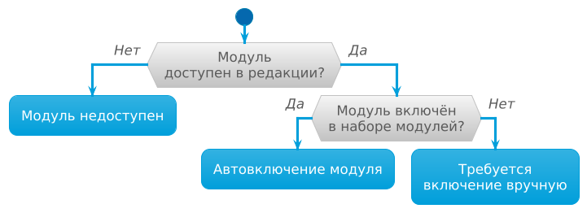

Исходный код модуля и правила его сборки должны находиться в директории с определенной структурой. Ближайший аналог — Helm chart.

Не все папки и файлы модуля обязательны. Кратко, можно руководствоваться следующим:
- Создайте файл [module.yaml](#moduleyaml), в котором опишите метаданные модуля.
- В папке [templates](#templates) разместите шаблоны Helm, которые будут применяться в кластере.

  Если необходимо чтобы объекты, создаваемые модулем, меняли свое поведение в зависимости от каких-либо параметров модуля, определите необходимые параметры [в спецификации](#config-valuesyaml) и используйте их в шаблонах.
- В папке [images](#images) разместите инструкции по сборке образов контейнеров, используемых модулем.

  Если в шаблонах используются только адреса *внешних* образов, папку можно не создавать.
- Если модуль должен реагировать на события или взаимодействовать с Kubernetes API, то необходимо создать хуки, которые разместить в папке [hooks](#hooks).
- Разместите документацию к модулю в папке [docs](#docs). Если документация модуля отсутствует, то модуль не появится в списке модулей в веб-интерфейсе документации в кластере.
- Если у модуля есть вспомогательные чарты Helm, разместите их в папке [charts](#charts).
- Если модуль должен создавать кастомные ресурсы (CRD), разместите их спецификации в папке [crds](#crds).

Мы подготовили репозиторий [шаблона модуля](https://github.com/deckhouse/modules-template/), содержащий структуру файлов и директорий, с которой мы рекомендуем начинать разработку модуля.

Далее на этой странице вы найдете более подробное описание структуры директорий и файлов модуля.

<details markdown="0"><summary>Пример структуры папки модуля...</summary>
<div markdown="1">

Пример структуры папки модуля, содержащий правила сборки и публикации с помощью GitHub Actions:  

```tree
📁 my-module/
├─ 📁 .github/
│  ├─ 📁 workflows/
│  │  ├─ 📝 build_dev.yaml
│  │  ├─ 📝 build_prod.yaml
│  │  ├─ 📝 checks.yaml
│  │  ├─ 📝 deploy_dev.yaml
│  │  └─ 📝 deploy_prod.yaml
├─ 📁 .werf/
│  ├─ 📁 workflows/
│  │  ├─ 📝 base-images.yaml
│  │  ├─ 📝 bundle.yaml
│  │  ├─ 📝 images.yaml
│  │  ├─ 📝 images-digest.yaml
│  │  ├─ 📝 batch-go.yaml
│  │  └─ 📝 release.yaml
├─ 📁 charts/
│  └─ 📁 helm_lib/
├─ 📁 crds/
│  ├─ 📝 crd1.yaml
│  ├─ 📝 doc-ru-crd1.yaml
│  ├─ 📝 crd2.yaml
│  └─ 📝 doc-ru-crd2.yaml
├─ 📁 docs/
│  ├─ 📝 README.md
│  ├─ 📝 README.ru.md
│  ├─ 📝 EXAMPLES.md
│  ├─ 📝 EXAMPLES.ru.md
│  ├─ 📝 CONFIGURATION.md
│  ├─ 📝 CONFIGURATION.ru.md
│  ├─ 📝 CR.md
│  ├─ 📝 CR.ru.md
│  ├─ 📝 FAQ.md
│  ├─ 📝 FAQ.ru.md
│  ├─ 📝 ADVANCED_USAGE.md
│  └─ 📝 ADVANCED_USAGE.ru.md
├─ 📁 hooks/
│  ├─ 📁 batch/
│  │  ├─ 📁 my-hooks/
│  │  │  ├─ 📝 my-hook1.go
│  │  │  └─ 📝 my-hook2.go
│  │  ├─ 📝 go.mod
│  │  ├─ 📝 go.sum
│  │  ├─ 📝 main.go
├─ 📁 images/
│  ├─ 📁 nginx
│  │  └─ 📝 Dockerfile
│  └─ 📁 backend
│     └─ 📝 werf.inc.yaml
├─ 📁 lib/
│  └─ 📁 python/
│     └─ 📝 requirements.txt
├─ 📁 openapi/
│  ├─ 📁 conversions
│  │  ├─ 📁 testdata
│  │  │  ├─ 📝 v1-1.yaml
│  │  │  └─ 📝 v2-1.yaml
│  │  ├─ 📝 conversions_test.go
│  │  └─ 📝 v2.yaml
│  ├─ 📝 config-values.yaml
│  ├─ 📝 doc-ru-config-values.yaml
│  └─ 📝 values.yaml
├─ 📁 templates/
│  ├─ 📝 a.yaml
│  └─ 📝 b.yaml
├─ 📝 .helmignore
├─ 📝 Chart.yaml
├─ 📝 module.yaml
├─ 📝 werf.yaml
└─ 📝 werf-giterminism.yaml
```

</div>
</details>

## charts

В папке `/charts` находятся вспомогательные чарты Helm, которые используются при рендере шаблонов.

У Deckhouse Kubernetes Platform (DKP) существует собственная библиотека для работы с шаблонами – [lib-helm](https://github.com/deckhouse/lib-helm). О возможностях библиотеки можно почитать [в репозитории lib-helm](https://github.com/deckhouse/lib-helm/blob/main/charts/helm_lib/README.md). Чтобы положить библиотеку в модуль, загрузите [tgz-архив](https://github.com/deckhouse/lib-helm/releases/) с нужным релизом и переместите его в директорию `/charts` модуля.

## crds

В этой директории лежат [*CustomResourceDefinition*](https://kubernetes.io/docs/tasks/extend-kubernetes/custom-resources/custom-resource-definitions/) (CRD), которые используются компонентами модуля. CRD обновляются каждый раз, когда запускается модуль, если есть обновления.

Чтобы отобразить CRD из директории `/crds` в документации на сайте или модуле documentation в кластере, выполните следующие шаги:
* создайте файл перевода со структурой аналогичной исходному файлу ресурса:
  - оставьте только параметры `description`, в которых укажите текст перевода;
  - используйте префикс `doc-ru-` в названии: например `/crds/doc-ru-crd.yaml` для `/crds/crd.yaml`.
* создайте файлы `/docs/CR.md` и `/docs/CR.ru.md`.

## docs


Статус [жизненного цикла](../versioning/#жизненный-цикл-модуля) модуля указывается в [module.yaml](#moduleyaml). Доступность модуля в редакциях Deckhouse Kubernetes Platform не определяется разработчиком модуля.


В папке `/docs` находится документация к модулю:

* `README.md` — описание, для чего нужен модуль, какую проблему он решает и общие архитектурные принципы.

  Метаданные файла ([front matter](https://gohugo.io/content-management/front-matter/)) в виде YAML-структуры должны быть во всех языковых версиях файла. Параметры, доступные для использования в метаданных:
  - `title` — **(рекомендуется)** Заголовок страницы описания модуля. Пример — "Веб-консоль администратора Deckhouse". Он же используется в навигации, если не указан параметр `linkTitle`.
  - `menuTitle` — **(желательно)** Название модуля в меню слева на странице (sidebar). Пример — "Deckhouse Admin". Если отсутствует, то используется название директории или репозитория, например `deckhouse-admin`.
  - `linkTitle` — **(опционально)** Отдельный заголовок для навигации, если, например, `title` очень длинный. Если отсутствует, то используется параметр `title`.
  - `description` — **(желательно)** Краткое уникальное описание содержимого страницы (до 150 символов). Не повторяет `title`. Служит продолжением названия и раскрывает его детальнее. Используется при генерации превью-ссылок и индексации поисковыми системами. Пример — «Модуль позволяет полностью управлять кластером Kubernetes через веб-интерфейс, имея только навыки работы мышью.»
  
  <div markdown="0">
  <details><summary>Пример метаданных...</summary>
  <div class="highlight">
  <pre class="highlight">
  <code>---
  title: "Веб-консоль администратора Deckhouse"
  menuTitle: "Deckhouse Admin"
  description: "Модуль позволяет полностью управлять кластером Kubernetes через веб-интерфейс, имея только навыки работы мышью."
  ---</code>
  </pre>
  </div>
  </details>
  </div>

* `EXAMPLES.md` – примеры конфигурации модуля с описанием.
  
  Метаданные файла ([front matter](https://gohugo.io/content-management/front-matter/)) в виде YAML-структуры должны быть во всех языковых версиях файла. Параметры, доступные для использования в метаданных:
  - `title` – **(рекомендуется)** Заголовок страницы. Пример: "Примеры". Он же используется в навигации, если нет `linkTitle`.
  - `description` – **(желательно)** Краткое уникальное описание содержимого страницы (до 150 символов). Не повторяет `title`. Служит продолжением названия и раскрывает его детальнее. Используется при генерации превью-ссылок, индексации поисковиками. Пример: "Примеры хранения секретов в нейронной сети с автоматической подстановкой в мысли при общении."
  - `linkTitle` – **(опционально)** Отдельный заголовок для навигации, если, например, `title` очень длинный. Если отсутствует, то используется `title`.  

  <div markdown="0">
  <details><summary>Пример метаданных...</summary>
  <div class="highlight">
  <pre class="highlight">
  <code>---
  title: "Примеры"
  description: "Примеры хранения секретов в нейронной сети с автоматической подстановкой в мысли при общении."
  ---</code>
  </pre>
  </div>
  </details>
  </div>

* `FAQ.md` – часто задаваемые вопросы, касающиеся эксплуатации модуля ("Какой сценарий выбрать: А или Б?").
  
  Метаданные файла ([front matter](https://gohugo.io/content-management/front-matter/)) в виде YAML-структуры должны быть во всех языковых версиях файла. Параметры, доступные для использования в метаданных:
  - `title` – **(рекомендуется)** Заголовок страницы.
  - `description` – **(желательно)** Краткое уникальное описание содержимого страницы (до 150 символов).
  - `linkTitle` – **(опционально)** Отдельный заголовок для навигации, если, например, `title` очень длинный. Если отсутствует, то используется `title`.  

  <div markdown="0">
  <details><summary>Пример метаданных...</summary>
  <div class="highlight">
  <pre class="highlight">
  <code>---
  title: "Часто задаваемые вопросы"
  description: "Часто задаваемые вопросы и ответы на них."
  ---</code>
  </pre>
  </div>
  </details>
  </div>
  
* `ADVANCED_USAGE.md` -- инструкция по отладке модуля.
  
  Метаданные файла ([front matter](https://gohugo.io/content-management/front-matter/)) в виде YAML-структуры должны быть во всех языковых версиях файла. Параметры, доступные для использования в метаданных:
  - `title` – **(рекомендуется)** Заголовок страницы.
  - `description` – **(желательно)** Краткое уникальное описание содержимого страницы (до 150 символов).
  - `linkTitle` – **(опционально)** Отдельный заголовок для навигации, если, например, `title` очень длинный. Если отсутствует, то используется `title`.  

  <div markdown="0">
  <details><summary>Пример метаданных...</summary>
  <div class="highlight">
  <pre class="highlight">
  <code>---
  title: "Отладка модуля"
  description: "В разделе разбираются все шаги по отладке модуля."
  ---</code>
  </pre>
  </div>
  </details>
  </div>
  
* `CR.md` и `CR.ru.md` – файл для генерации ресурсов из папки `/crds/` добавьте вручную.  

  <div markdown="0">
  <details><summary>Пример метаданных...</summary>
  <div class="highlight">
  <pre class="highlight">
  <code>---
  title: "Кастомные ресурсы"
  ---</code>
  </pre>
  </div>
  </details>
  </div>

* `CONFIGURATION.md` – файл для создания ресурсов из `/openapi/config-values.yaml` и `/openapi/doc-<LANG>-config-values.yaml` добавьте вручную.  

  <div markdown="0">
  <details><summary>Пример метаданных...</summary>
  <div class="highlight">
  <pre class="highlight">
  <code>---
  title: "Настройки модуля"
  ---</code>
  </pre>
  </div>
  </details>
  </div>
  
Все изображения, PDF-файлы и другие медиафайлы нужно хранить в директории `/docs` или ее подкаталогах (например, `/docs/images/`). Все ссылки на файлы должны быть относительными.

Для каждого языка нужен файл с соответствующим суффиксом. Например, `image1.jpg` и `image1.ru.jpg`. Используйте ссылки:
- `[image1](image1.jpg)` в англоязычном документе;
- `[image1](image1.ru.jpg)` в русскоязычном документе.

## hooks

В директории `/hooks/batch` находятся хуки модуля. Хук — это исполняемый файл, выполняемый при реакции на событие. Хуки используются модулем также для динамического взаимодействия с API Kubernetes. Например, они могут быть использованы для обработки событий, связанных с созданием или удалением объектов в кластере.

[Познакомьтесь](../#прежде-чем-начать) с концепцией хуков, прежде чем начать разрабатывать свой собственный хук. Для ускорения разработки хуков можно воспользоваться [Go-библиотекой](https://github.com/deckhouse/module-sdk) от команды Deckhouse.


Требования к работе хука:
- При запуске с аргументами `hook config` должна выводиться конфигурация хуков в формате JSON.
- При запуске с аргументами `hook list` должен выводиться список всех хуков с их порядковым номером.
- При запуске с аргументами `hook run 0` должна выполняться логика хука под номером 0.

Файлы хуков должны иметь права на выполнение. Добавьте их командой `chmod +x <путь до файла с хуком>`.

В репозитории [шаблона модуля](https://github.com/deckhouse/modules-template/) можно найти примеры хуков на Go. Примеры хуков на Go также можно найти в [SDK](https://github.com/deckhouse/module-sdk/tree/main/examples).

## images

В директории `/images` находятся инструкции по сборке образов контейнеров модуля. На первом уровне находятся директории для файлов, используемых при создании образа контейнера, на втором — контекст для сборки.

Существует два способа описания образа контейнера:

1. [Dockerfile](https://docs.docker.com/engine/reference/builder/) — файл, который содержит команды для быстрой сборки образов. Если необходимо собрать приложение из исходного кода, поместите его рядом с Dockerfile и включите его в образ с помощью команды `COPY`.
2. Файл `werf.inc.yaml`, который является аналогом [секции описания образа из `werf.yaml`](https://werf.io/documentation/v1.2/reference/werf_yaml.html#L33).

Имя образа совпадает с именем директории для этого модуля, записанным в нотации *camelCase* с маленькой буквы. Например, директории `/images/echo-server` соответствует имя образа `echoServer`.

Собранные образы имеют content-based теги, которые можно использовать в сборке других образов. Чтобы использовать content-based теги образов, [подключите библиотеку lib-helm](#charts). Вы также можете воспользоваться другими функциями [библиотеки helm_lib](https://github.com/deckhouse/lib-helm/tree/main/charts/helm_lib) Deckhouse Kubernetes Platform.

Пример использования content-based тега образа в Helm-чарте:

```yaml
image: {{ include "helm_lib_module_image" (list . "<имя образа>") }}
```

## openapi

### conversions

В директории `/openapi/conversions` находятся файлы конверсий параметров модуля и их тесты.

Конверсии параметров модуля позволяют конвертировать OpenAPI-спецификацию параметров модуля одной версии в другую. Конверсии могут быть необходимы в случаях, когда в новой версии OpenAPI-спецификации параметр переименовывается или переносится в другое место.

Каждая конверсия возможна только между двумя смежными версиями (например с первой версии на вторую). Конверсий может быть несколько, и цепочка конверсий должна последовательно покрывать все версии спецификации параметров модуля, без "пропусков".

Файл конверсии — это YAML-файл с именем `v<N>.yaml` или `v<N>.yml`, где `<N>` — версия конверсии. Его структура:

```yaml
# Номер версии спецификации параметров модуля, в которую преобразовываются данные при конверсии.
version: N
# Набор выражений jq, которые используются при конверсии в кластере для автоматического преобразования 
# параметров модуля предыдущей версии.
conversions: []
# Описание действий (на двух языках), которые необходимо выполнить, чтобы преобразовать данные 
# из предыдущей версии спецификации параметров модуля. 
description:
  ru: ""
  en: ""
```

Описание действий, указываемое в секции description файла конверсий, должно быть понятным и содержать информацию о том, какие параметры и в каком порядке нужно изменить в спецификации параметров модуля, чтобы перейти к новой версии.

Пример файла конверсии параметров модуля `v2.yaml`, где в версии 2 удаляется параметр `.auth.password`:

```yaml
version: 2
conversions:
  - del(.auth.password) | if .auth == {} then del(.auth) end
description:
  ru: "Удалите `.auth.password`, затем `auth`, если он пуст."
  en: "Remove `.auth.password`, then `auth` if empty."
```

#### Тесты конверсий

Для написания тестов конверсий можно использовать функцию `conversion.TestConvert`, которой нужно передать:
- путь до исходного файла конфигурации (версия до конвертации);
- путь до ожидаемого файла конфигурации (версия после конвертации).

[Пример](https://github.com/deckhouse/deckhouse/blob/main/modules/300-prometheus/openapi/conversions/conversions_test.go) теста конверсии.

### config-values.yaml

Необходим для проверки параметров модуля, которые пользователь может настроить через [ModuleConfig](/products/kubernetes-platform/documentation/v1/reference/api/cr.html#moduleconfig).

Чтобы схема была представлена в документации на сайте или в модуле documentation в кластере, создайте:
- файл `doc-ru-config-values.yaml` со структурой, аналогичной структуре файла `config-values.yaml`. В файле `doc-ru-config-values.yaml` оставьте только переведенные параметры description;
- файлы `/docs/CONFIGURATION.md` и `/docs/CONFIGURATION.ru.md` — это включит показ данных из файлов `/openapi/config-values.yaml` и `/openapi/doc-ru-config-values.yaml`.

Пример схемы `/openapi/config-values.yaml` с одним настраиваемым параметром `nodeSelector`:

```yaml
type: object
properties:
  nodeSelector:
    type: object
    additionalProperties:
      type: string
    description: |
      The same as the Pods' `spec.nodeSelector` parameter in Kubernetes.

      If the parameter is omitted or `false`, `nodeSelector` will be determined
      [automatically](../../installing/#advanced-scheduling).</code>
```

Пример файла `/openapi/doc-ru-config-values.yaml` для русскоязычного перевода схемы:

```yaml
properties:
  nodeSelector:
    description: |
      Описание на русском языке. Разметка Markdown.</code>
```

#### CEL-валидации (x-deckhouse-validations)

При разработке модуля для Deckhouse Kubernetes Platform вы можете использовать расширение OpenAPI `x-deckhouse-validations` для описания сложных правил валидации параметров модуля на языке CEL (Common Expression Language).

При использовании CEL-валидаций учитывайте следующие особенности:

- Валидации можно размещать как на корневом уровне, так и внутри любого свойства (в том числе внутри объектов, массивов и additionalProperties).
- В выражениях доступны все параметры текущего уровня через переменную `self`.
- Валидация работает рекурсивно: все вложенные объекты, массивы и карты также могут содержать свои `x-deckhouse-validations`.
- Поддерживаются скалярные типы, массивы, объекты и карты (`additionalProperties`).
- В случае множественных ошибок валидации пользователю будут показаны все сообщения из соответствующих правил.

##### Примеры правил

Ниже представлены примеры описаний сложных правил валидации на языке CEL:

- Проверка попадания значения параметра в диапазон:
  
  ```yaml
  type: object
  properties:
    replicas:
      type: integer
    minReplicas:
      type: integer
    maxReplicas:
      type: integer
  x-deckhouse-validations:
    - expression: "self.minReplicas <= self.replicas && self.replicas <= self.maxReplicas"
      message: "replicas должно быть между minReplicas и maxReplicas"
  ```

- Проверка наличия ключа:
  
  ```yaml
  - expression: "'Available' in self.stateCounts"
    message: "Должен быть ключ Available"
  ```

- Проверка, что хотя бы один из двух списков не пуст:
  
  ```yaml
  - expression: "(self.list1.size() == 0) != (self.list2.size() == 0)"
    message: "Ровно один из списков должен быть непустым"
  ```

- Проверка значения по регулярному выражению:
  
  ```yaml
  - expression: "self.details.all(key, self.details[key].matches('^[a-zA-Z]*$'))"
    message: "Все значения должны содержать только буквы"
  ```

##### Валидация скалярных значений и массивов

Валидации скалярных значений и массивов имеют следующие особенности:

- Если свойство — скаляр (например, число или строка), то в CEL-выражении `self` будет этим значением.
- Если свойство — массив, то `self` будет массивом, и можно использовать методы `.size()`, `.all()`, `.exists()` и т.д.

Пример для массива:

```yaml
type: object
properties:
  items:
    type: array
    items:
      type: string
    x-deckhouse-validations:
      - expression: "self.size() > 0"
        message: "Список items не должен быть пустым"
```

##### Валидация additionalProperties (map)

Для объектов с additionalProperties (map) можно валидировать ключи и значения через методы `.all(key, ...)`, `.exists(key, ...)` и т.д.

Пример:

```yaml
type: object
properties:
  mymap:
    type: object
    additionalProperties:
      type: integer
    x-deckhouse-validations:
      - expression: "self.all(key, self[key] > 0)"
        message: "Все значения в mymap должны быть больше 0"
```

### values.yaml

Необходим для проверки исходных данных при рендере шаблонов без использования дополнительных функций Helm chart.
Ближайший аналог — [schema-файлы](https://helm.sh/docs/topics/charts/#schema-files) из Helm.

В `values.yaml` можно автоматически добавить валидацию параметров из `config-values.yaml`. В этом случае, минимальный `values.yaml` выглядит следующим образом:

```yaml
x-extend:
  schema: config-values.yaml
type: object
properties:
  internal:
    type: object
    default: {}
```

## templates

В директории `/templates` находятся [шаблоны Helm](https://helm.sh/docs/chart_template_guide/getting_started/).

* Для доступа к настройкам модуля в шаблонах используйте путь `.Values.<имяМодуля>`, а для глобальных настроек `.Values.global`. Имя модуля конвертируется в нотации *camelCase*.

* Для упрощения работы с шаблонами используйте [lib-helm](https://github.com/deckhouse/lib-helm) – это набор дополнительных функций, которые облегчают работу с глобальными и модульными значениями.

* Доступы в registry из ресурса ModuleSource доступны по пути `.Values.<имяМодуля>.registry.dockercfg`.

* Чтобы использовать эти функции для пула образов в контроллерах, создайте секрет и добавьте его в соответствующий параметр: `"imagePullSecrets": [{"name":"registry-creds"}]`.

  ```yaml
  apiVersion: v1
  kind: Secret
  metadata:
    name: registry-creds
  type: kubernetes.io/dockerconfigjson
  data:
    .dockerconfigjson: {{ .Values.<имяМодуля>.registry.dockercfg }}
  ```

Модуль может иметь параметры, с помощью которых может менять свое поведение. Параметры модуля и схема их валидации описываются в OpenAPI-схемах в директории `/openapi`.

Настройки лежат в двух файлах: [`config-values.yaml`](#config-valuesyaml) и [`values.yaml`](#valuesyaml).

Пример OpenAPI-схемы можно найти в [шаблоне модуля](https://github.com/deckhouse/modules-template/blob/main/openapi/config-values.yaml).

## .helmignore

Исключите файлы из Helm-релиза с помощью `.helmignore`. В случае модулей DKP директории `/crds`, `/images`, `/hooks`, `/openapi` обязательно добавляйте в `.helmignore`, чтобы избежать превышения лимита размера Helm-релиза в 1 Мб.

## Chart.yaml

Файл для чарта, аналогичный [`Chart.yaml`](https://helm.sh/docs/topics/charts/#the-chartyaml-file) из Helm. Должен содержать, как минимум, параметр `name` с именем модуля и параметр `version` с версией.
Вы можете не создавать данный файл, Deckhouse создаст его автоматически.

Пример:

```yaml
name: echoserver
version: 0.0.1
dependencies:
- name: deckhouse_lib_helm
  version: 1.38.0
  repository: https://deckhouse.github.io/lib-helm
```

## module.yaml

Файл `module.yaml` в корне папки модуля содержит метаданные модуля.

Файл может отсутствовать, но рекомендуется его заполнить. Большинство метаданных будут доступны в объекте [Module](/products/kubernetes-platform/documentation/v1/reference/api/cr.html#modulesource)) и успешной синхронизации.

Параметры, которые можно использовать в `module.yaml`:

- `namespace` — *Строка.* Пространство имён, где будут развернуты компоненты модуля.
- `subsystems` — *Массив строк.* Список подсистем, к которым относится модуль.
- `accessibility` — *Объект.* Настройки доступности модуля.
  - `editions` — *Объект.* Настройки работы модуля в редакциях Deckhouse.
    - `available` — *Булевый.* Определяет доступность модуля в редакции Deckhouse.
    - `enabledInBundles` — *Массив строк.* Список наборов модулей (bundles), в которых модуль должен быть включен по умолчанию.
- `descriptions` — *Объект.* Произвольное текстовое описание назначения модуля.
  - `en` — *Строка.* Текстовое описание на английском языке.
  - `ru` — *Строка.* Текстовое описание на русском языке.
- `disable` — *Объект.* Параметры, связанные с поведением при отключении модуля.
  - `confirmation` — *Булевый.* Требовать подтверждение при отключении модуля.
  - `message` — *Строка.* Сообщение с информацией о том, что произойдёт при отключении модуля.

  Если для отключения модуля требуется подтверждение (параметр `confirmation` установлен в `true`), то отключение будет возможно только в случае, если на соответствующем объекте ModuleConfig установлена аннотация `modules.deckhouse.io/allow-disabling=true`. Если такой аннотации нет, при попытке отключить модуль будет выведено предупреждение, включающее сообщение из параметра `message`.
- `name` — *Строка, обязательный параметр.* Имя модуля в Kebab Case. Например, `echo-server`.
- `exclusiveGroup` — *Строка.* Если несколько модулей принадлежат к одной и той же `exclusiveGroup`, то только один из них может быть активен в системе одновременно. Это предотвращает конфликты между модулями, выполняющими схожие или несовместимые задачи.
- `requirements` — *Объект.* [Зависимости](../dependencies/) модуля — условия, при которых Deckhouse Kubernetes Platform (DKP) может запустить модуль.
  - `deckhouse` — *Строка.* Зависимость от [версии Deckhouse Kubernetes Platform](../dependencies/#зависимость-от-версии-deckhouse-kubernetes-platform).
  - `kubernetes` — *Строка.* Зависимость от [версии Kubernetes](../dependencies/#зависимость-от-версии-kubernetes).
  - `modules` — *Объект.* Зависимость от [версий других модулей](../dependencies/#зависимость-от-версии-других-модулей).
- `stage` — *Строка.* [Стадия жизненного цикла модуля](../versioning/#как-понять-насколько-модуль-стабилен). Допустимые значения: `Experimental`, `Preview`, `General Availability`, `Deprecated`.
Если `stage` установлен в `Experimental`, модуль нельзя включить по умолчанию. Чтобы разрешить использовать такие модули установите [параметр `allowExperimentalModules`](/modules/deckhouse/configuration.html#parameters-allowexperimentalmodules) в `true`.
- `tags` — *Массив строк.* Дополнительные теги модуля. Теги преобразуются в лейблы объекта [Module](/products/kubernetes-platform/documentation/v1/reference/api/global.html#parameters-modules) по шаблону `module.deckhouse.io/<TAG>=""`.

  Например, если указать `tags: ["test", "myTag"]`, то объект Module получит лейблы `module.deckhouse.io/test=""` и `module.deckhouse.io/myTag=""`.
- `weight` — *Число.* Вес модуля. Влияет на порядок запуска модулей: модули с меньшим значением `weight` запускаются раньше. По умолчанию — `900`.

  На порядок запуска также влияют [зависимости модуля](../dependencies/).

Пример описания метаданных модуля `hello-world`:

```yaml
name: hello-world
tags: ["test", "myTag"]
weight: 960
stage: "Experimental"
namespace: "test"
exclusiveGroup: "group"
subsystems:
  - test
  - test1
accessibility:
  editions:
    ee:
      available: true
      enabledInBundles:
        - Default
descriptions:
  en: "The module to say hello to the world."
  ru: "Модуль, который приветствует мир."
requirements:
  deckhouse: ">= 1.61"
  kubernetes: ">= 1.27"
disable:
  confirmation: true
  message: "Отключение этого модуля приведёт к удалению всех созданных им ресурсов."
```

### Настройка доступности модуля в редакциях DKP

Параметр `accessibility` позволяет задать редакции DKP и наборы модулей (bundles), в которых будет доступен модуль,
а также определить, будет ли он включаться по умолчанию.

```yaml
accessibility:
  editions:
    _default:
      available: true
      enabledInBundles:
        - Default
        - Managed
    ce:
      available: false
    ee:
      available: true
      enabledInBundles:
        - Managed   
```

Описание параметров:

- `accessibility` — *Объект.* Корневой блок настройки доступности модуля.
- `editions` — *Объект.* Набор ключей с названиями редакций.
  Для каждой редакции можно задать собственные настройки доступности.
- `_default` — *Объект.* Настройка по умолчанию, если отсутствует конфигурация для конкретной редакции.
- `available` — *Булевый.* Определяет, доступен ли модуль в рамках указанной редакции.
- `enabledInBundles` — *Массив строк.* Наборы модулей, в которых модуль будет включён по умолчанию.
  Поддерживаемые наборы модулей (состав каждого из наборов доступен [на этой странице](../../../admin/configuration/#наборы-модулей)):
  - `Default` — рекомендованный набор модулей для работы кластера.
    Включает средства мониторинга, контроля авторизации, организации работы сети и другие необходимые компоненты.
  - `Managed` — набор модулей для кластеров, управляемых облачными провайдерами (например, Google Kubernetes Engine).
  - `Minimal` — минимальный набор, включающий только текущий модуль.
    > Обратите внимание, что в этот набор не входят базовые модули (например, модуль работы с CNI).
    > Без включения базовых модулей Deckhouse может работать только в уже развернутом кластере.
- Блоки с названиями редакций. Позволяют задать поведение модуля в указанных редакциях.
  Возможные значения: `be`, `ce`, `ee`, `se`, `se-plus`.

#### Логика определения доступности модуля

Схема ниже показывает логику определения доступности и включения модуля в зависимости от настроек:



#### Примеры конфигурации

В следующем примере конфигурации модуль будет недоступен во всех редакциях, кроме DKP Enterprise Edition.
В DKP Enterprise Edition модуль будет включён по умолчанию в наборе модулей `Managed`.

```yaml
accessibility:
  editions:
    _default:
      available: false
    ee:
      available: true
      enabledInBundles:
        - Managed
```

В следующем примере конфигурации модуль будет доступен во всех редакциях DKP.
В наборах модулей `Managed` и `Default` модуль будет включён по умолчанию.

```yaml
accessibility:
  editions:
    _default:
      available: true
      enabledInBundles:
        - Managed
        - Default
```

В следующем примере модуль будет доступен во всех редакциях DKP.
Модуль будет включён в наборах модулей `Default` и `Managed` во всех редакциях,
кроме DKP Basic Edition и DKP Community Edition.

```yaml
accessibility:
  editions:
    _default:                   
      available: true           
      enabledInBundles:         
        - Default
        - Managed
    be:
      available: false
    ce:                         
      available: false
```


