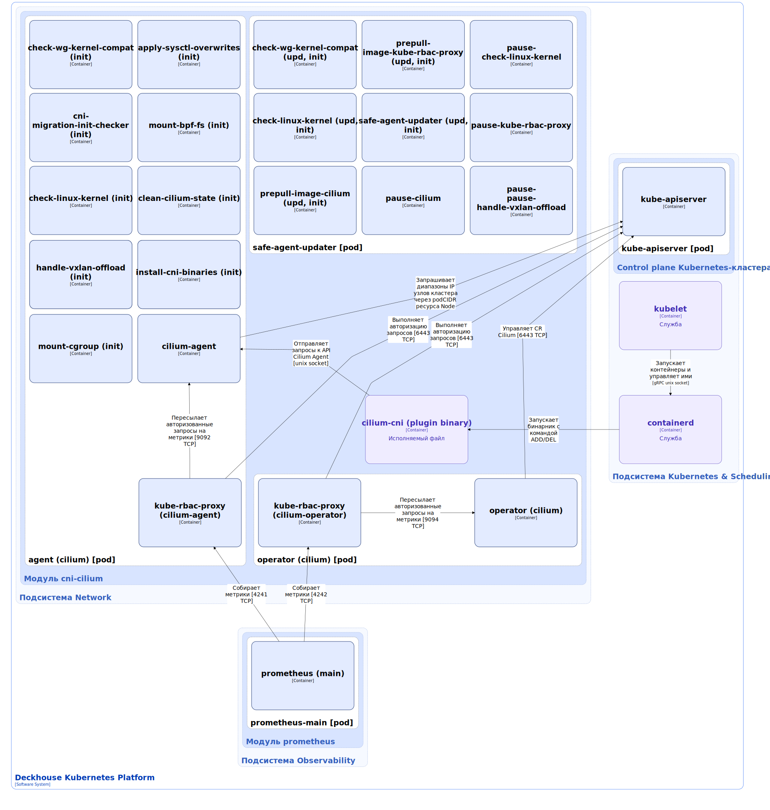

Модуль `cni-cilium` обеспечивает работу сети в кластере. Основан на проекте [Cilium](https://github.com/cilium/cilium).

Подробнее с описанием настройки и примерами использования модуля можно ознакомиться [в разделе документации модуля](/modules/cni-cilium/).

## Архитектура модуля


Для упрощения схемы приняты следующие допущения:

* На схеме показано, что контейнеры разных подов взаимодействуют друг с другом напрямую. Фактически они взаимодействуют через соответствующие сервисы Kubernetes (внутренние балансировщики). Названия сервисов не указываются, если они очевидны из контекста. В остальных случаях название сервиса указано над стрелкой.
* Поды могут быть запущены в нескольких репликах, однако на схеме все поды изображены в одной реплике.


Архитектура модуля [`cni-cilium`](/modules/cni-cilium/) на уровне 2 модели C4 и его взаимодействия с другими компонентами Deckhouse Kubernetes Platform (DKP) изображены на следующих диаграммах:

<!--- Source: structurizr code from https://fox.flant.com/team/d8-system-design/doc/-/tree/main/architecture/diagrams/C4_RU --->

## Компоненты модуля

Модуль состоит из следующих компонентов:

1. **Operator** (Deployment) — компонент в архитектуре Cilium, который берёт на себя централизованное управление глобальными задачами в кластере Kubernetes. Operator выполняет следующие функции:

   * **Управление кастомными ресурсами** — автоматически регистрирует Custom Resource Definitions (CRD), необходимые для работы Cilium, в Kubernetes API, например, CiliumEndpoint, CiliumEndpointSlice, CiliumNetworkPolicy. С полным списком CRD можно ознакомиться [в документации Cilium](https://docs.cilium.io/en/stable/internals/cilium_operator/#crd-registration);

   * **Сборка мусора для идентификаторов безопасности** — поддерживает локальный кэш активных идентификаторов (CiliumIdentity) и периодически сканирует его, удаляя записи об идентификаторах, которые перестали подавать сигнал активности (heartbeat). Это важно, поскольку идентификаторы представлены 16-битным целым числом, и их исчерпание (максимум 65536) может привести к проблемам;

   * **Управление CiliumEndpointSlices (CES)** — поддерживает актуальную информацию о конечных точках (endpoints) в кластере, что критично для корректной работы сетевых политик и балансировки нагрузки.
   
   Состоит из следующих контейнеров:

   * **operator** — основной контейнер;
   * **kube-rbac-proxy** — сайдкар-контейнер с авторизующим прокси на основе Kubernetes RBAC для организации защищенного доступа к метрикам контейнера operator. Является [Open Source-проектом](https://github.com/brancz/kube-rbac-proxy).

1. **Agent** (DaemonSet) — это агент, работающий на каждом узле Kubernetes-кластера, основной компонент управления в архитектуре Cilium. Он отвечает за перевод высокоуровневых конфигураций из Kubernetes API в низкоуровневые настройки для сетевых интерфейсов и eBPF-программ, которые реально обрабатывают трафик. Agent выполняет следующие функции:

   * **Управление конечными точками (Endpoints)** — отслеживает состояние всех подов (endpoints) на своём узле. Каждому поду присваивается уникальный IP-адрес и security identity (числовой идентификатор), который формируется на основе меток Kubernetes;

   * **Применение сетевых политик (Policy Enforcement)** — вычисляет и применяет правила сетевых политик, заданных в кластере. Cilium использует концепцию identity-based политик: правила строятся не на IP-адресах, а на security identity пода. Агент преобразует эти правила в структуры данных (BPF-карты), которые ядро Linux использует для фильтрации трафика;

   * **Управление IP-адресами (IPAM)** — выделяет IP-адреса для подов на своём узле, используя диапазоны IP-адресов из полей `spec.podCIDRs` или `spec.podCIDR` спецификации соответствующего ресурса Node;

   * **Оркестрация плоскости данных (Datapath Orchestration)** — компилирует, загружает в ядро Linux и привязывает к сетевым интерфейсам eBPF-программы. Именно эти программы в ядре и выполняют реальную обработку пакетов: пересылку, фильтрацию по политикам, отслеживание соединений, NAT и балансировку нагрузки;

   * **Реализация балансировки для сервисов (Service Load Balancing)** — настраивает правила балансировки нагрузки для сервисов в кластере, используя возможности eBPF;

   * **Обработка событий кластера**. Agent работает по событийной модели: он постоянно наблюдает за изменениями в Kubernetes API (создание подов, обновление сервисов, изменение Endpoints, обновление кастомных ресурсов) и на лету обновляет конфигурацию eBPF-программ;

   * **Обеспечение наблюдаемости (Observability)**. Агент запускает локальный сервер Hubble, который собирает метрики и данные о сетевых потоках. Это позволяет мониторить состояние сети, выявлять проблемы и анализировать трафик между подами. Сервер Hubble запускается при включении модуля [`cilium-hubble`](/modules/cilium-hubble).

   Принцип работы: когда в кластере происходит событие (например, стартует новый под), агент получает об этом уведомление и на основе текущего состояния кластера и политик настраивает eBPF-программы так, чтобы трафик для этого пода проходил корректно.

   Состоит из следующих контейнеров:

   * **cni-migration-init-checker** — init-контейнер, ожидающий завершения процесса миграции с другого CNI-плагина, если такая миграция была запущена;
   * **check-wg-kernel-compat** — init-контейнер, проверяющий версию ядра Linux на соответствие минимальным требованиям для работы с WireGuard, используемым в CNI Cilium;
   * **check-linux-kernel** — init-контейнер, проверяющий версию ядра Linux на соответствие минимальным требованиям для работы с CNI Cilium;
   * **clearing-unnecessary-iptables** — init-контейнер, запускающий скрипт очистки ненужных правил `iptables`;
   * **handle-vxlan-offload** — init-контейнер, исправляющий настройки UPD-сегментации (если [режим работы туннеля](/modules/cni-cilium/configuration.html#parameters-tunnelmode) настроен на `VXLAN`);
   * **config** — init-контейнер, генерирующий конфигурационный файл, используемый для настройки агента;
   * **mount-cgroup** — init-контейнер, настраивающий Linux cgroups (контрольные группы);
   * **apply-sysctl-overwrites** — init-контейнер, настраивающий параметры ядра Linux;
   * **mount-bpf-fs** — init-контейнер, монтирующий файловую систему BPF;
   * **clean-cilium-state** — init-контейнер, запускающий скрипт очистки состояния CNI Cilium;
   * **install-cni-binaries** — init-контейнер, запускающий скрипт установки бинарных файлов, используемых агентом;
   * **agent** — основной контейнер;
   * **kube-rbac-proxy** — сайдкар-контейнер, обеспечивающий авторизованный доступа к метрикам контейнера agent. Подробно описан выше.

1. **cilium-cni** — исполняемый файл, запускаемый компонентом containerd, который передает в качестве аргумента определенные команды в соответствии [со спецификацией CNI](https://www.cni.dev/docs/spec/#cni-operations), например ADD при запуске контейнера и DEL при его удалении. Cilium-cni взаимодействует с API агента Сilium через Unix-сокет и инциирует настройку datapath, чтобы обеспечить подключение к сети, балансировку нагрузки и сетевые политики для пода. Datapath в Cilium — это компонент, который работает в ядре Linux и который отвечает за реальную, низкоуровневую обработку сетевых пакетов в кластере Kubernetes. Проще говоря, это «дорога», по которой данные путешествуют: как пакеты идут от одного пода к другому, как маршрутизируются, как применяются сетевые политики и балансировка нагрузки.

1. **safe-agent-updater** (DaemonSet) — специальное приложение, предназначенное для исключения сбойных ситуаций, которые могут возникнуть при обновлении версии агента Cilium и привести к проблемам с сетевой доступностью компонентов DKP.

   Состоит из следующих контейнеров:

   * **check-wg-kernel-compat** — init-контейнер, проверяющий версию ядра Linux на соответствие минимальным требованиям для работы с WireGuard, используемым в CNI Cilium;
   * **check-linux-kernel** — init-контейнер, проверяющий версию ядра Linux на соответствие минимальным требованиям для работы с CNI Cilium;

   * Набор init-контейнеров для предварительного скачивания новых версий образов соответствующих контейнеров компонента agent:
   
     * **prepull-image-cilium**;
     * **prepull-image-kube-rbac-proxy**;
      
   * **safe-agent-updater** — init-контейнер, который сравнивает значения специальных аннотаций в манифесте DaemonSet обновленного агента Cilium со значениями соответствующих аннотаций в метаданных запущенного на узле пода агента. В частности, в аннотации `safe-agent-updater-daemonset-generation` хранится хеш-сумма образа агента. Если хеш-суммы не совпадают, safe-agent-updater удаляет запущенный под и ожидает, пока под с новой версией агента не перейдет в состояние `Ready`.
   
   * Набор сайдкар-контейнеров для предварительного скачивания новых версий образов соответствующих контейнеров компонента agent. Контейнеры стоят на паузе и выполняют только функцию хранения образов:

     * **pause-cilium**;
     * **pause-check-linux-kernel**;
     * **pause-kube-rbac-proxy**;
     * **pause-pause-handle-vxlan-offload**.

## Взаимодействия модуля

Модуль взаимодействует со следующими компонентами:

1. **Kube-apiserver**:

   * Запрашивает диапазоны IP узлов кластера через атрибуты `podCIDR`/`podCIDRs` спецификации ресурса Node;
   * Выполняет авторизацию запросов на получение метрик компонентов agent и operator;
   * Управляет кастомными ресурсами Cilium.

С модулем взаимодействуют следующие внешние компоненты:

1. **Prometheus-main** — сбор метрик компонентов agent и operator.
2. **Containerd** — запускает бинарник cilium-cni с определенными командами в соответствии со спецификацией CNI, например ADD при запуске контейнера и DEL при его удалении.
