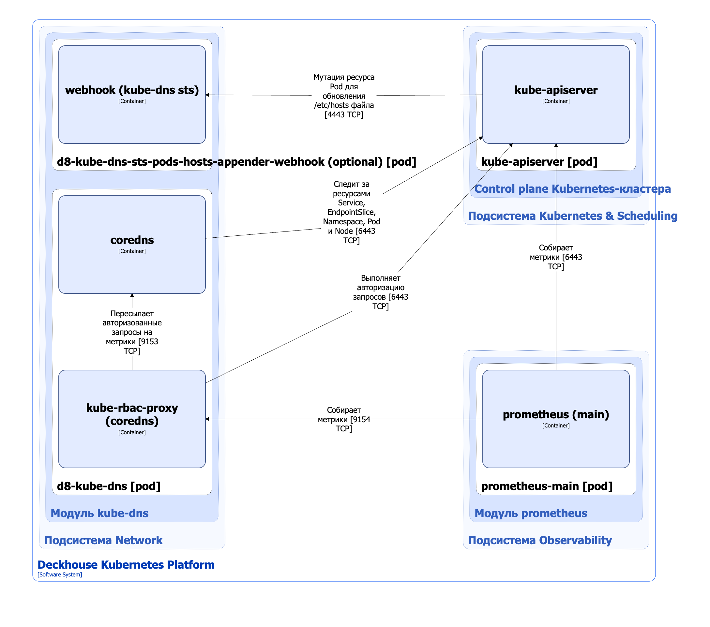
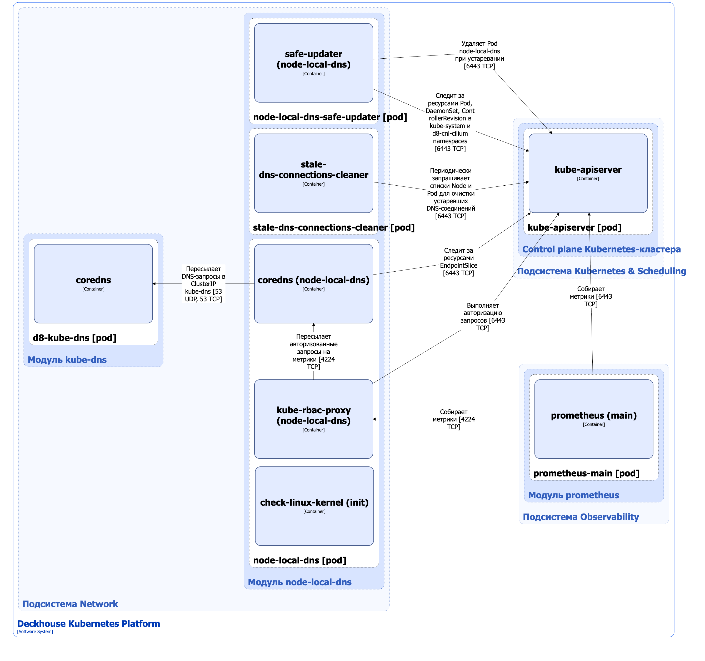
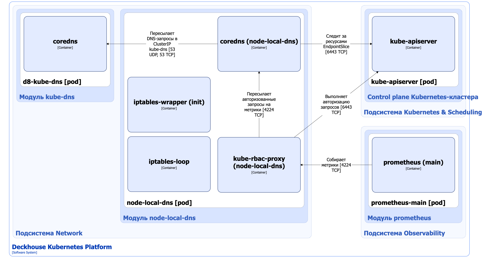

Модуль [`kube-dns`](/modules/kube-dns/) обеспечивает работу сервиса разрешения доменных имён на базе [CoreDNS](https://coredns.io/) в Deckhouse Kubernetes Platform (DKP).

Модуль [`node-local-dns`](/modules/node-local-dns/) предоставляет кеширующий DNS-сервис на каждом узле кластера и снижает нагрузку на CoreDNS.

Подробнее о настройках модулей и примерах их использования можно узнать в соответствующих разделах документации:
- [`kube-dns`](/modules/kube-dns/configuration.html);
- [`node-local-dns`](/modules/node-local-dns/configuration.html).

## Модуль `kube-dns`

### Архитектура модуля


Для упрощения схемы приняты следующие допущения:

* На схеме показано, что контейнеры разных подов взаимодействуют друг с другом напрямую. Фактически они взаимодействуют через соответствующие сервисы Kubernetes (внутренние балансировщики). Названия сервисов не указываются, если они очевидны из контекста. В остальных случаях название сервиса указано над стрелкой.
* Поды могут быть запущены в нескольких репликах, однако на схеме все поды изображены в одной реплике.


Архитектура модуля [`kube-dns`](/modules/kube-dns/) на уровне 2 модели C4 и его взаимодействие с другими компонентами Deckhouse Kubernetes Platform (DKP) показаны на следующей диаграмме:

<!--- Source: structurizr code from https://fox.flant.com/team/d8-system-design/doc/-/tree/main/architecture/diagrams/C4_RU --->

### Компоненты модуля

Модуль `kube-dns` состоит из следующих компонентов:

1. **D8-kube-dns** (Deployment) — основной компонент модуля, реализующий DNS-сервер в кластере Kubernetes.

   Компонент **d8-kube-dns** отслеживает изменения стандартных ресурсов Service, EndpointSlice, Namespace, Pod, а так же периодически запрашивает Node. На основе этих изменений он обновляет записи в локальной базе объектов.

   Состоит из следующих контейнеров:

   * **coredns** — основной контейнер;
   * **kube-rbac-proxy** — сайдкар-контейнер с авторизующим прокси на основе Kubernetes RBAC для защищенного доступа к метрикам **coredns**. Является [Open Source-проектом](https://github.com/brancz/kube-rbac-proxy).

1. **D8-kube-dns-sts-pods-hosts-appender-webhook** (Deployment) — опциональный компонент, состоящий из одного контейнера **webhook**.

   Deckhouse-контроллер модуля [`deckhouse`](/modules/deckhouse/) создаёт этот компонент, если в ModuleConfig задан параметр `.spec.settings.clusterDomainAliases`.

   Компонент реализует мутирующий webhook-сервер. Он добавляет init-контейнер **render-etc-hosts-with-cluster-domain-aliases** в Pod, созданный StatefulSet-контроллером, если в спецификации Pod указана опция `.spec.subdomain`.

   Init-контейнер изменяет файл `/etc/hosts`, чтобы подсистема разрешения имён корректно работала с алиасами домена кластера.

### Взаимодействия модуля

Модуль взаимодействует со следующими компонентами:

* **Kube-apiserver**:

   * наблюдение за стандартными ресурсами Service, Endpoint, EndpointSlice, Namespace, Pod и Node;
   * авторизация запросов на получение метрик.

С модулем взаимодействуют следующие внешние компоненты:

1. **Kube-apiserver** — изменение ресурсов Pod, созданных StatefulSet-контроллером.
1. **Prometheus-main** — собирает метрики модуля.

## Модуль `node-local-dns`

Архитектура модуля [`node-local-dns`](/modules/node-local-dns/) зависит от используемого CNI-плагина. Есть два основных варианта: при использовании Cilium в качестве CNI-плагина и при использовании другого CNI-плагина, поддерживаемого DKP.

### Архитектура модуля (Cilium)


Для упрощения схемы приняты следующие допущения:

* На схеме показано, что контейнеры разных подов взаимодействуют друг с другом напрямую. Фактически они взаимодействуют через соответствующие сервисы Kubernetes (внутренние балансировщики). Названия сервисов не указываются, если они очевидны из контекста. В остальных случаях название сервиса указано над стрелкой.
* Поды могут быть запущены в нескольких репликах, однако на схеме все поды изображены в одной реплике.


Архитектура модуля [`node-local-dns`](/modules/node-local-dns/) при использовании Cilium в качестве CNI-плагина на уровне 2 модели C4 и его взаимодействие с другими компонентами Deckhouse Kubernetes Platform (DKP) показаны на следующей диаграмме:

<!--- Source: structurizr code from https://fox.flant.com/team/d8-system-design/doc/-/tree/main/architecture/diagrams/C4_RU --->

### Компоненты модуля (Cilium)

Модуль `node-local-dns` состоит из следующих компонентов:

1. **Node-local-dns** (DaemonSet) — основной компонент модуля, реализующий кеширующий DNS-сервер в кластере Kubernetes.

   Компонент **node-local-dns** отслеживает изменения стандартных ресурсов EndpointSlice и на их основе обновляет список DNS-серверов для перенаправления запросов.

   Состоит из следующих контейнеров:

   * **check-linux-kernel** — init-контейнер, выполняющий проверку версии ядра Linux;
   * **coredns** — основной контейнер;
   * **kube-rbac-proxy** — сайдкар-контейнер с авторизующим прокси на основе Kubernetes RBAC для защищенного доступа к метрикам **coredns**. Является [Open Source-проектом](https://github.com/brancz/kube-rbac-proxy).

1. **Stale-dns-connections-cleaner** (DaemonSet) — компонент, который удаляет оставшиеся открытые соединения при рестарте **coredns**. Состоит из одного контейнера **stale-dns-connections-cleaner**.

   > **Внимание.** Компонент имеет привилегированный доступ к сетевой системе каждого узла. В Linux для этого требуется capability `CAP_NET_ADMIN`. Такой доступ необходим для выполнения операций с сетевыми подключениями на уровне ядра ОС Linux.

1. **Safe-updater** (Deployment) — компонент, обеспечивающий безопасный рестарт **node-local-dns** при изменении спецификации DaemonSet.

   **Safe-updater** проверяет, что на узле запущен и находится в корректном состоянии Cilium, и только после этого отправляет команду на удаление пода с **node-local-dns**.

### Взаимодействия модуля (Cilium)

Модуль взаимодействует со следующими компонентами:

1. **Kube-apiserver**:

   * наблюдение за стандартными ресурсами EndpointSlice, DaemonSet, ControllerRevision и Pod;
   * периодическое получение ресурсов Node;
   * удаление Pod `node-local-dns` при устаревании конфигурации DaemonSet;
   * авторизация запросов на получение метрик.

1. **D8-kube-dns** — выполнение DNS-запросов.

С модулем взаимодействуют следующие внешние компоненты:

* **Prometheus-main** — собирает метрики модуля.

### Архитектура модуля (без Cilium)


Для упрощения схемы приняты следующие допущения:

* На схеме показано, что контейнеры разных подов взаимодействуют друг с другом напрямую. Фактически они взаимодействуют через соответствующие сервисы Kubernetes (внутренние балансировщики). Названия сервисов не указываются, если они очевидны из контекста. В остальных случаях название сервиса указано над стрелкой.
* Поды могут быть запущены в нескольких репликах, однако на схеме все поды изображены в одной реплике.


Архитектура модуля [`node-local-dns`](/modules/node-local-dns/) при использовании CNI-плагина, отличного от Cilium, на уровне 2 модели C4 и его взаимодействие с другими компонентами Deckhouse Kubernetes Platform (DKP) показаны на следующей диаграмме:

<!--- Source: structurizr code from https://fox.flant.com/team/d8-system-design/doc/-/tree/main/architecture/diagrams/C4_RU --->

### Компоненты модуля (без Cilium)

Модуль `node-local-dns` состоит из следующих компонентов:

1. **Node-local-dns** (DaemonSet) — основной компонент модуля, реализующий кеширующий DNS-сервер в кластере Kubernetes.

   Компонент **node-local-dns** отслеживает изменения стандартных ресурсов EndpointSlice и на их основе обновляет список DNS-серверов для перенаправления запросов.

   Состоит из следующих контейнеров:

   * **iptables-wrapper** — init-контейнер, выполняющий подготовку необходимых для работы с iptables исполняемых файлов;
   * **coredns** — основной контейнер;
   * **iptables-loop** — сайдкар-контейнер, обеспечивающий синхронизацию iptables-правил с готовностью **node-local-dns**;
   * **kube-rbac-proxy** — сайдкар-контейнер с авторизующим прокси на основе Kubernetes RBAC для защищенного доступа к метрикам **coredns**. Является [Open Source-проектом](https://github.com/brancz/kube-rbac-proxy).

### Взаимодействия модуля (без Cilium)

Модуль взаимодействует со следующими компонентами:

1. **Kube-apiserver**:

   * наблюдение за стандартными ресурсами EndpointSlice;
   * авторизация запросов на получение метрик.

1. **D8-kube-dns** — выполнение DNS-запросов.

С модулем взаимодействуют следующие внешние компоненты:

* **Prometheus-main** — собирает метрики модуля.