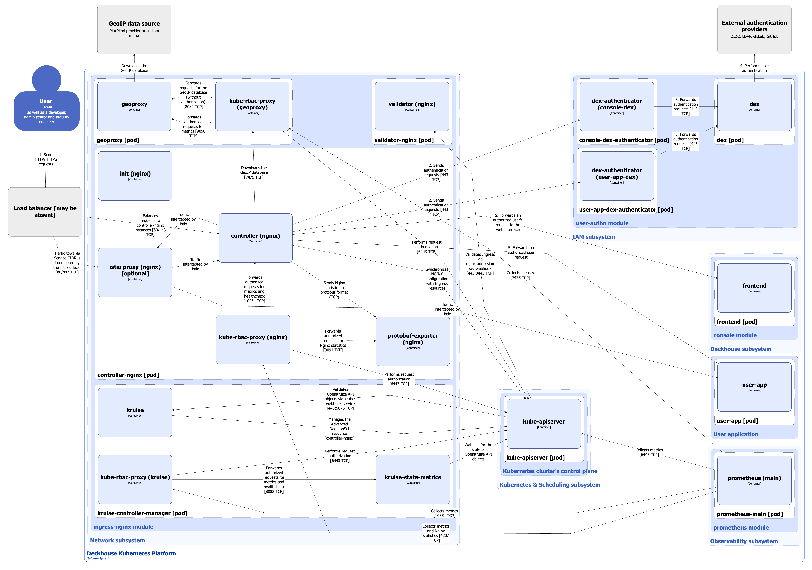
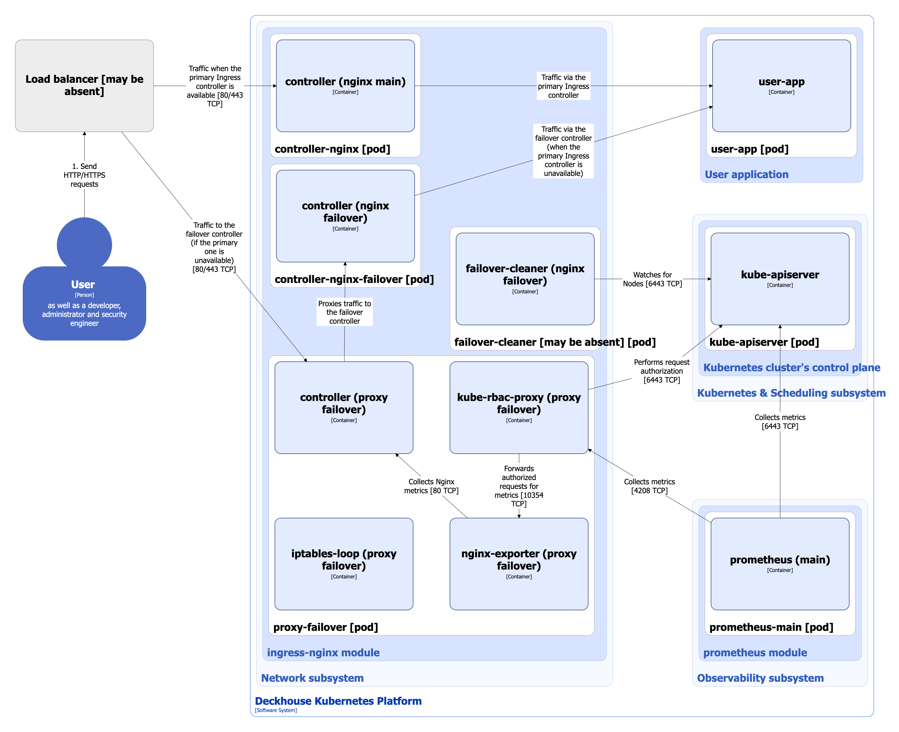

The `ingress-nginx` module installs and manages the [Ingress NGINX Controller](https://kubernetes.github.io/ingress-nginx/) using the IngressNginxController custom resource.

The module can operate in high availability (HA) mode and provides flexible configuration for placing Ingress controllers on cluster nodes, as well as tuning controller behavior according to the specifics of the underlying infrastructure.

The module supports running and configuring multiple instances of the Ingress NGINX Controller independently. This allows, for example, separating external and intranet application Ingress resources.

For more details about module configuration and usage examples, refer to the [corresponding documentation section](/modules/ingress-nginx/configuration.html).

## Module architecture


The following simplifications are made in the diagram:

* The diagram shows containers in different pods interacting directly with each other. In reality, they communicate via the corresponding Kubernetes Services (internal load balancers). Service names are omitted if they are obvious from the diagram context. Otherwise, the Service name is shown above the arrow.
* Pods may run multiple replicas. However, each pod is shown as a single replica in the diagram.


The Level 2 C4 architecture of the [`ingress-nginx`](/modules/ingress-nginx/) module and its interactions with other components of Deckhouse Kubernetes Platform (DKP) are shown in the following diagram:

<!--- Source: structurizr code from https://fox.flant.com/team/d8-system-design/doc/-/tree/main/architecture/diagrams/C4_EN --->

## Module components

The module consists of the following components:

1. **Controller-nginx** ([Advanced DaemonSet](https://openkruise.io/docs/user-manuals/advanceddaemonset)): Non-standard DaemonSet with advanced capabilities managed by kruise-controller-manager.

   It consists of the following containers:

   * **init**: Init container configuring a file system for the Ingress controller.
   * **controller**: Main container running Ingress NGINX Controller and implementing the core module logic. It is an [open source project](https://kubernetes.github.io/ingress-nginx/).
   * **protobuf-exporter**: Sidecar container in the ingress-controller pod that receives NGINX statistics in protobuf format. It parses and aggregates the messages according to predefined rules and exports metrics in Prometheus format. This exporter is developed by Flant.
   * **kube-rbac-proxy**: Sidecar container with an authorization proxy based on Kubernetes RBAC, providing secure access to controller metrics and status as well as to `protobuf-exporter`. It is an [open source project](https://github.com/brancz/kube-rbac-proxy).
   * **istio-proxy**: Istio sidecar container added to the pod when the [`spec.enableIstioSidecar`](/modules/ingress-nginx/cr.html#ingressnginxcontroller-v1-spec-enableistiosidecar) parameter of the IngressNginxController custom resource is enabled. In this case, part of the user traffic passes through it.

2. **Validator-nginx** (Deployment): Consists of a single container. Validator is an Ingress NGINX Controller running in validation mode with a reduced set of privileges. It implements a webhook server used to validate Ingress resources via the [Validating Admission Controllers](https://kubernetes.io/docs/reference/access-authn-authz/admission-controllers/) mechanism.

3. **Kruise-controller-manager** (Deployment): Controller that manages the [Advanced DaemonSet](https://openkruise.io/docs/user-manuals/advanceddaemonset) custom resource. This DaemonSet extension provides advanced update capabilities for the Ingress NGINX Controller that are not available in the standard Kubernetes DaemonSet controller.

   It consists of the following containers:

   * **kruise**: Main container running kruise-controller-manager.
   * **kruise-state-metrics**: Sidecar container that monitors the state of OpenKruise API objects and exposes corresponding metrics (but not metrics of the kruise-controller-manager itself).
   * **kube-rbac-proxy**: Sidecar container providing authorized access to controller metrics and status (described above).

4. **Geoproxy** (StatefulSet): Caching proxy server for the Ingress controller that provides quick access to the GeoIP database downloaded from the MaxMind provider. This component also grants access to already downloaded bases in clusters that have no internet access, improving the stability of the Ingress NGINX Controller when working with GeoIP databases.

   This component provides the following features:

   * MaxMind license saving (databases are downloaded from a single point once a day).
   * Persistent data storage (if components are restarted, it doesn't require accessing the MaxMind servers again).
   * It lets you specify a custom mirror for downloading databases.

   It consists of the following containers:

   * **geoproxy**: Proxy server. This server is developed by Flant.
   * **kube-rbac-proxy**: Sidecar container providing authorized access to geoproxy metrics (the GeoIP databases are available without authorization). This container is described in detail above.

## Module interactions

The module interacts with the following components:

1. **Kube-apiserver**:

   * Synchronizes the NGINX configuration when Ingress resources change.
   * Authorizes requests for metrics, statistics, and controller status checks.
   * Forwards external HTTP requests to the Kubernetes API endpoint.

2. **GeoIP database source** (MaxMind provider or custom mirror): The module downloads the GeoIP database.

3. **Dex-authenticator of platform services and user applications**: Used to authenticate requests in dex via dex-authenticator, which acts as an OAuth2 proxy.

4. **DKP platform services** (such as `console`, `dashboard`, Grafana, and others): The module forwards HTTP requests that have been authenticated via Dex.

5. **User services deployed in DKP**: The module forwards external HTTP requests to user services. To enable this, the user must create the corresponding Ingress resources and, if authentication via Dex is required, the [DexAuthenticator](/modules/user-authn/cr.html#dexauthenticator) custom resource.


To keep the diagram simple, it shows interactions between ingress-controller and only one DKP service, the frontend component of the `console` module and its corresponding console-dex-authenticator.


The following external components interact with the module:

1. **Kube-apiserver**: Uses a validation webhook to validate created or updated [Ingress resources](https://kubernetes.io/docs/concepts/services-networking/ingress/).
2. **Prometheus-main**: Collects metrics from ingress and kruise controllers, geoproxy, as well as NGINX statistics.
3. **Load balancer**: Distributes HTTP/HTTPS traffic across healthy ingress-controller instances.

## Receiving traffic from external networks

Methods for receiving traffic from external networks are described in the [`spec.inlet`](/modules/ingress-nginx/cr.html#ingressnginxcontroller-v1-spec-inlet) parameter of the IngressNginxController custom resource.

For inlet types LoadBalancer, LoadBalancerWithProxyProtocol, and LoadBalancerWithSSLPassthrough, the load balancer shown in the diagram is automatically provided by the cloud provider (when DKP is deployed in a cloud environment) or can be implemented using the MetalLB controller (for bare-metal installations). For configuration details, refer to the [`metallb` module documentation](/modules/metallb/configuration.html).

For inlet types HostPort, HostPortWithProxyProtocol, HostPortWithSSLPassthrough, and HostWithFailover, the load balancer is deployed by the user or may be absent. In this case, the user must configure the load balancer backends or otherwise ensure network connectivity to the ingress-controller. The ingress-controller entry point in this case is the ports on the cluster nodes where the controller is running.

## Architecture of Ingress controller with HostWithFailover inlet type

When the value `HostWithFailover` of the [`spec.inlet`](/modules/ingress-nginx/cr.html#ingressnginxcontroller-v1-spec-inlet) parameter of the IngressNginxController custom resource is set, two Ingress controllers are installed in the cluster: the primary controller and the failover controller, as well as a proxy-failover controller that coordinates traffic switch between them.

The primary controller starts in `hostNetwork`, while the failover controller starts in `podNetwork`. If the main controller pod is unavailable on the node, the proxy failover starts proxying traffic to the failover controller pod using the `PROXY PROTOCOL` to save information about the client's IP address.


The following diagram does not show the architecture of the main Ingress controller, as well as the module interactions, as they are described in detail in the diagram above.


The Level 2 C4 architecture of Ingress controller with HostWithFailover inlet type and its interactions with other components of Deckhouse Kubernetes Platform (DKP) are shown in the following diagram:

<!--- Source: structurizr code from https://fox.flant.com/team/d8-system-design/doc/-/tree/main/architecture/diagrams/C4_EN --->

### Components of failover Ingress controller

1. **Controller-nginx-failover** ([Advanced DaemonSet](https://openkruise.io/docs/user-manuals/advanceddaemonset)): Failover Ingress-controller deployed on the same nodes as the main one. Failover controller has the same containers on the pod with the same purpose as the main Ingress controller.

2. **Proxy-failover** ([Advanced DaemonSet](https://openkruise.io/docs/user-manuals/advanceddaemonset)): Proxy server.

   It consists of the following containers:

   * **controller**: Server that performs the following functions:

     * Monitors a performance of the main Ingress controller and returns its status.
     * Monitors the NGINX configuration file on the node and reboots Ingress controller if this configuration is changed.
     * Starts a [NGINX](https://github.com/nginx/nginx) instance that proxies traffic to the failover controller in case the main one is unavailable. Traffic is switched to the failover controller and back to the main controller with the use of `iptables` rules, that are configured by the iptables-loop container depending on the availability of the `80` and `443` TCP ports on the main controller.

     This controller is developed by Flant.

   * **iptables-loop**: Sidecar container that updates the `iptables` rules on the node that are necessary for the Ingress controller to work. It is developed by Flant.

   * **nginx-exporter**: Sidecar container that connects to NGINX over HTTP and exports metrics in the Prometheus format. It is an [open source project](https://github.com/nginx/nginx-prometheus-exporter).
  
   * **kube-rbac-proxy**: Sidecar container providing authorized access to controller metrics and status (described above).

3. **Failover-cleaner** (DaemonSet): Component deployed to the cluster nodes that are labeled with `ingress-nginx-controller.deckhouse.io/need-hostwithfailover-cleanup=true`. It cleans up the `iptables` rules. If the Ingress controller operates normally, the failover-cleaner component doesn't run on any node.

### Failover Ingress controller interactions

Failover Ingress controller interacts with the following components:

1. **Kube-apiserver**:

   * Watches Node resources for `ingress-nginx-controller.deckhouse.io/need-hostwithfailover-cleanup=true` labels.
   * Authorizes requests for metrics, statistics, and controller status checks.
   * Forwards external HTTP requests to the Kubernetes API endpoint.

2. **GeoIP database source** (MaxMind provider or custom mirror): Failover Ingress controller downloads the GeoIP database.

3. **Dex-authenticator of platform services and user applications**: Used to authenticate requests in dex via dex-authenticator, which acts as an OAuth2 proxy.

4. **DKP platform services** (such as `console`, `dashboard`, Grafana, and others): The module forwards HTTP requests that have been authenticated via Dex.

5. **User services deployed in DKP**: The module forwards external HTTP requests to user services. To enable this, the user must create the corresponding Ingress resources and, if authentication via Dex is required, the [DexAuthenticator](/modules/user-authn/cr.html#dexauthenticator) custom resource.

The following external components interact with the failover Ingress controller:

1. **Prometheus-main**: Collects failover Ingress controller metrics.
2. **Load balancer**: Routes HTTP/HTTPS traffic in case the main Ingress controller is unavailable.
