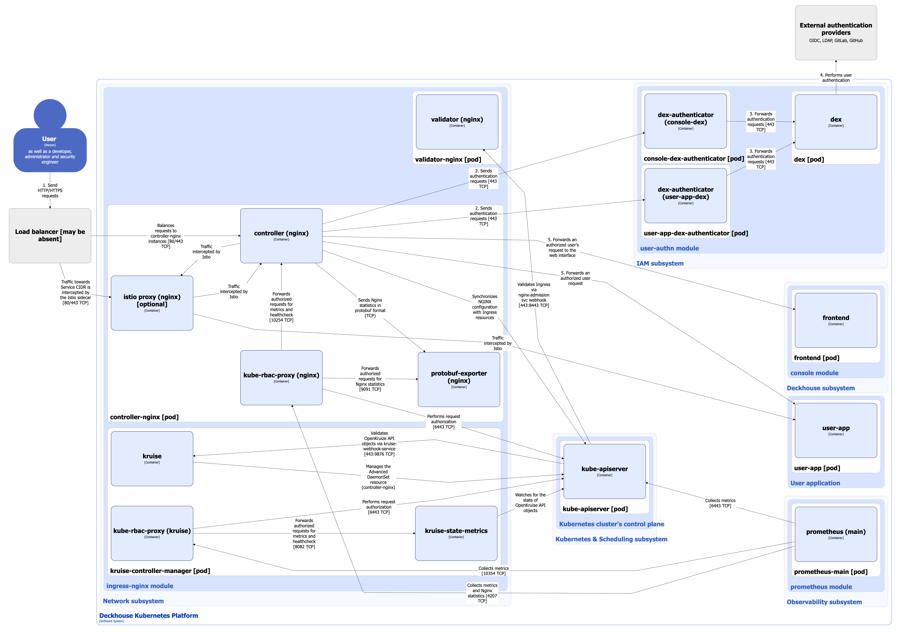

Устанавливает и управляет [Ingress-NGINX controller](https://kubernetes.github.io/ingress-nginx/) с помощью Custom Resources ***IngressNginxController***. Возможен запуск модуля в режиме высокой доступности, а настройки модуля позволяют гибко управлять размещением Ingress-контроллеров на узлах кластера, а так же настраивать контроллер с учетом особенностей реализации инфраструктуры.

Поддерживает запуск и раздельное конфигурирование одновременно нескольких NGINX Ingress controller’ов. Например, это позволяет отделять внешние и intranet Ingress-ресурсы приложений.

Подробнее с настройками модуля и примерами его использования можно ознакомиться в соответствующем [разделе документации](/modules/ingress-nginx/).

## Архитектура модуля


Для лучшего восприятия схемы на ней допущены следующие упрощения:

* На схеме выглядит так, что контейнеры подов взаимодействуют с контейнерами других подов напрямую. На самом деле они взаимодействуют через соответствующие им сервисы Kubernetes (внутренние балансировщики). Если взаимодействие происходит через специфичный сервис, в подписи над стрелкой указано название сервиса.
* Поды могут быть запущены несколькими репликами. На схеме все поды изображены в одной реплике.


Архитектура модуля **ingress-nginx** на уровне 2 модели C4 и его взаимодействия с другими компонентами платформы изображены на следующей диаграмме:

<!--- Source: structurizr code from https://fox.flant.com/team/d8-system-design/doc/-/tree/main/architecture/diagrams/C4 --->

## Компоненты модуля

Модуль состоит из следующих компонентов:

1. **controller-nginx** ([Advanced DaemonSet](https://openkruise.io/docs/user-manuals/advanceddaemonset)) - нестандартный DaemonSet с продвинутыми возможностями, управляемый **kruise-controller-manager**. В свою очередь состоит из следующих контейнеров:

   * **controller** - собственно **Ingress-NGINX controller**, реализует основную логику модуля. [Open-source проект](https://kubernetes.github.io/ingress-nginx/).
   * **protobuf-exporter** - sidecar-контейнер в поде ingress-controller, принимает статистику NGINX в виде сообщений в формате protobuf, разбирает, агрегирует их по установленным правилам и экспортирует в формате для Prometheus. Данный экспортер является разработкой компании Флант.
   * **kube-rbac-proxy** - sidecar-контейнер с авторизирующим прокси на основе Kubernetes RBAC для организации защищенного доступа к метрикам и healthcheck контроллера и protobuf-exporter. [Open-source проект](https://github.com/brancz/kube-rbac-proxy).
   * **istio-proxy** - sidecar-контейнер Istio добавляется в под при включенном параметре `spec.enableIstioSidecar` в Custom Resource [IngressNginxController](/modules/ingress-nginx/cr.html#ingressnginxcontroller). В этом случае часть пользовательских запросов проходит через него. Подробнее о включении sidecar Istio можно ознакомиться в [документации модуля](/modules/ingress-nginx/cr.html#ingressnginxcontroller-v1-spec-enableistiosidecar).

2. **validator-nginx** (Deployment) - состоит из одного контейнера. Validator - это ingress-nginx контроллер, запущенный в режиме валидации и обладающий меньшим набором привилегий. Реализует webhook-сервер, используемый для валидации ресурсов Ingress через механику [Validating Admission Controllers](https://kubernetes.io/docs/reference/access-authn-authz/admission-controllers/).

3. **kruise-controller-manager** (Deployment) - контроллер, управляющий Custom Resource [Advanced DaemonSet](https://openkruise.io/docs/user-manuals/advanceddaemonset). Данное расширение DaemonSet позволяет использовать продвинутые возможности при обновлении **Ingress-NGINX controller**, которых нет в стандартной реализации DaemonSet-контроллера Kubernetes. Состоит из следующих контейнеров:

   * **kruise** - собственно **kruise-controller-manager**.
   * **kruise-state-metrics** - sidecar-контейнер в поде **kruise-controller-manager**, следит за состоянием объектов API OpenKruise и предоставляет соответствующие метрики (но не метрики работы самого **kruise-controller-manager**).
   * **kube-rbac-proxy** - sidecar-контейнер, прокси для авторизованного доступа к метрикам и healthcheck контроллера. Подробно описан выше.

4. **failover-cleaner** (DaemonSet) - деплоится на узлах кластера, отмеченных меткой `ingress-nginx-controller.deckhouse.io/need-hostwithfailover-cleanup=true`. Представляет собой bash-скрипт, который выполняет актуализацию правил iptables в зависимости от используемого инлета контроллера. При штатной работе ingress-controller компонент **failover-cleaner** не запущен ни на одном узле.

## Взаимодействия модуля

Модуль взаимодействует с:

1. **kube-apiserver**:

   * синхронизация конфигурации NGINX в соответствии с изменением ресурсов Ingress.
   * авторизация запросов на получение метрик, статистики и проверки healthcheck контроллера.
   * пересылка внешних HTTP-запросов на эндпойнт Kube-API сервера.

2. **dex-authenticator**'ы служебных сервисов и пользовательских приложений - аутентификация запросов в **dex** через **dex-authenticator**, которые выполняют функции OAuth2 Proxy.
3. Служебными сервисами платформы (Console, Dashboard, Grafana и прочие) - пересылка авторизованных через **Dex** HTTP-запросов.
4. Пользовательскими сервисами, развернутыми в платформе, - пересылка внешних HTTP-запросов. Для этого пользователь должен создать соответствующие Ingress-ресурсы, а также Custom Resource [DexAuthenticator](/modules/user-authn/cr.html#dexauthenticator), если требуется аутентификация через **Dex**.


Для того, чтобы не усложнять схему, на ней изображены взаимодействия ingress-controller только c одним служебным сервисом платформы - компонентом **frontend** модуля **console** и соответствующим **console-dex-authenticator**.


С модулем взаимодействуют следующие внешние для него компоненты:

1. **kube-apiserver** - использование *Validation webhook* для проверки создаваемых или обновляемых ресурсов [Ingress](https://kubernetes.io/docs/concepts/services-networking/ingress/).
2. **prometheus-main** - сбор метрик контроллеров **ingress** и **kruise**, а также статистики NGINX.
3. **Балансировщик нагрузки** - балансировка HTTP/HTTPS-трафика на работоспособные инстансы ingress-controller.

## Способы приема трафика из внешней сети

Подробно способы приема трафика из внешней сети описаны в [разделе спецификации параметра spec.inlet](/modules/ingress-nginx/cr.html#ingressnginxcontroller-v1-spec-inlet) Custom Resource [IngressNginxController](/modules/ingress-nginx/cr.html#ingressnginxcontroller).

Для типов inlet **LoadBalancer**, **LoadBalancerWithProxyProtocol** и **LoadBalancerWithSSLPassthrough** указанный на схеме **балансировщик нагрузки** автоматически предоставляется облаком (в случае установки Deckhouse Kubernetes Platform в инфраструктуре облачного провайдера) или может быть реализован при помощи MetalLB-контроллера (в случае установки на Bare metal хостах). С настройками модуля **metallb** можно ознакомиться в соответствующем [разделе документации](/modules/metallb/).

Для типов inlet **HostPort**, **HostPortWithProxyProtocol**, **HostPortWithSSLPassthrough** и **HostWithFailover** **балансировщик нагрузки** разворачивается самостоятельно пользователем платформы, либо он вообще может отсутствовать. Пользователь настраивает бэкенды балансировщика или (в случае его отсутствия) обеспечивает сетевую связность до ingress-controller. Точкой входа в ingress-controller в этом случае являются порты на узлах кластера, на которых запущен контроллер.
