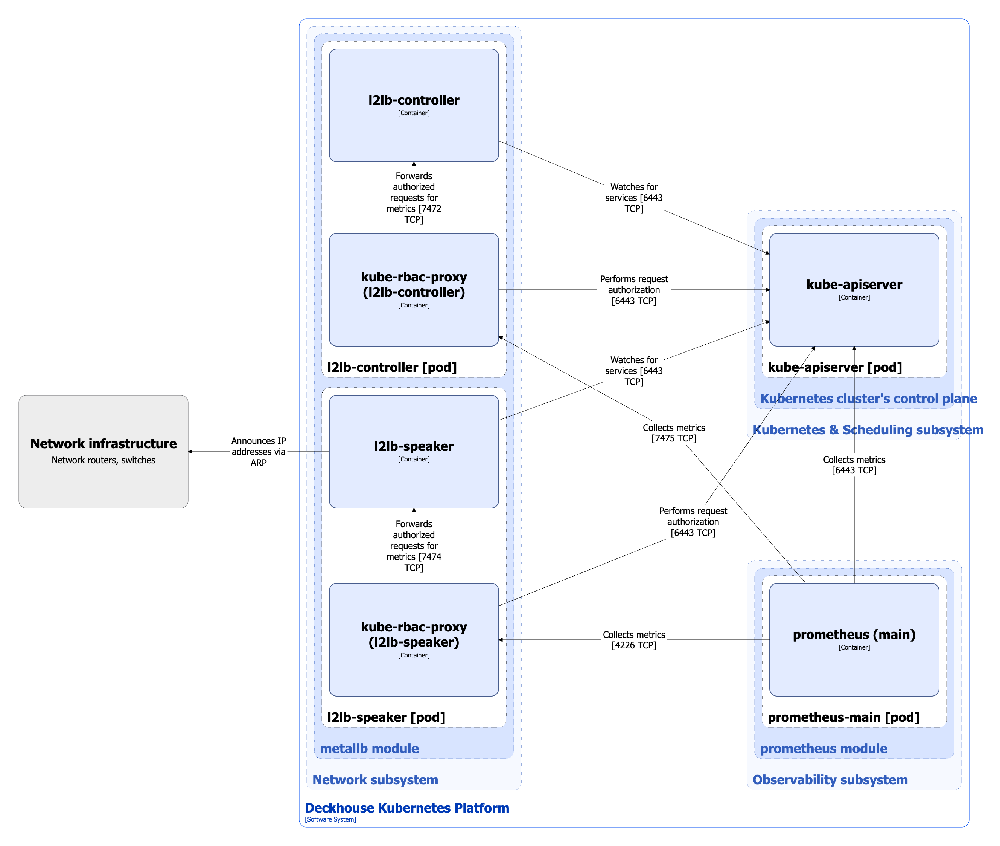
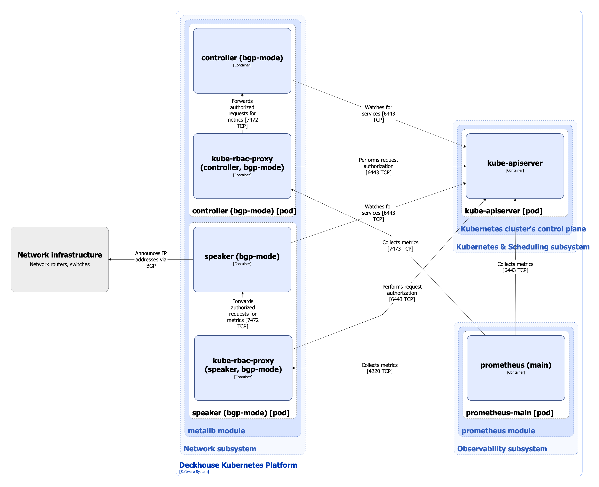

The `metallb` module implements the LoadBalancer mechanism for services in bare-metal clusters.

The following operating modes are supported:

* **Layer 2**: Implements an improved load balancing mechanism (compared to the standard L2 mode in MetalLB) for bare-metal clusters. It allows using multiple "public" IP addresses for services and distributing them evenly across available cluster nodes.
* **BGP**: Fully based on the [MetalLB](https://metallb.universe.tf/) solution and uses the BGP protocol to create routes.

For more details about module configuration and usage examples, refer to the [corresponding documentation section](/modules/metallb/configuration.html).

## Module architecture


The following simplifications are made in the diagram:

* The diagram shows containers in different pods interacting directly with each other. In reality, they communicate via the corresponding Kubernetes Services (internal load balancers). Service names are omitted if they are obvious from the diagram context. Otherwise, the Service name is shown above the arrow.
* Pods may run multiple replicas. However, each pod is shown as a single replica in the diagram.


The Level 2 C4 architecture of the [`metallb`](/modules/metallb/) module and its interactions with other components of Deckhouse Kubernetes Platform (DKP) are shown in the following diagrams.

MetalLB in Layer 2 mode:

<!--- Source: structurizr code from https://fox.flant.com/team/d8-system-design/doc/-/tree/main/architecture/diagrams/C4_EN --->

MetalLB in BGP mode:

<!--- Source: structurizr code from https://fox.flant.com/team/d8-system-design/doc/-/tree/main/architecture/diagrams/C4_EN --->

## Module components

The module consists of the following components:

1. **Controller**/**l2lb-controller** (Deployment): MetalLB controller responsible for assigning IP addresses to LoadBalancer services.

   The controller monitors changes in Kubernetes services and applies IP address configuration based on a predefined address pool specified in the module configuration.

   It consists of the following containers:

   * **controller**/**l2lb-controller**: Main container.
   * **kube-rbac-proxy**: Sidecar container with an authorization proxy based on Kubernetes RBAC that provides secure access to controller metrics. It is an [open-source project](https://github.com/brancz/kube-rbac-proxy).

2. **Speaker**/**l2lb-speaker** (DaemonSet): MetalLB speaker running on each cluster node that participates in load balancing. It is responsible for implementing the load balancing mechanism at the network level.

   Depending on the operating mode, it performs the following functions:

   * In **Layer 2 mode**, it uses ARP to associate virtual IP addresses of services with the physical addresses of cluster nodes.
   * In **BGP mode**, it announces routes to virtual IP addresses via the BGP protocol, making services accessible from outside the cluster.

   It consists of the following containers:

   * **speaker**/**l2lb-speaker**: Main container.
   * **kube-rbac-proxy**: Sidecar container with an authorization proxy based on Kubernetes RBAC that provides secure access to speaker metrics.

## Module interactions

The module interacts with the following components:

1. **Kube-apiserver**:

   * Monitors changes in Kubernetes services and applies IP address configuration.
   * Authorizes requests for metrics.

2. **Network equipment**: Ensures the availability of virtual IP addresses outside the cluster:

   * In **BGP mode**, it advertises routes to virtual IP addresses using the BGP protocol.
   * In **Layer 2 mode**, it uses ARP/GARP to notify upstream routers that the virtual IP addresses are associated with the MAC addresses of specific nodes.

The following external components interact with the module:

* **Prometheus-main**: Collects metrics from the MetalLB controller and speaker.
