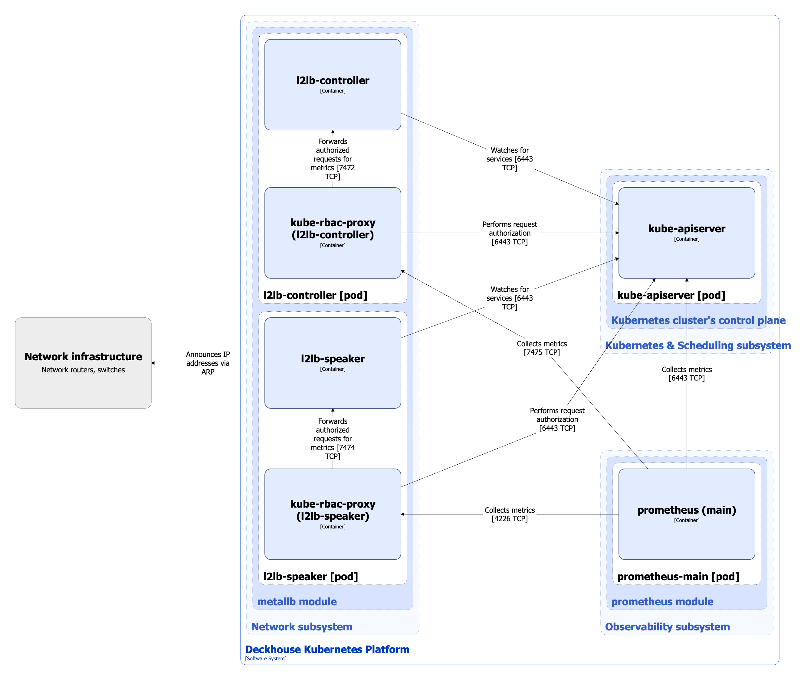
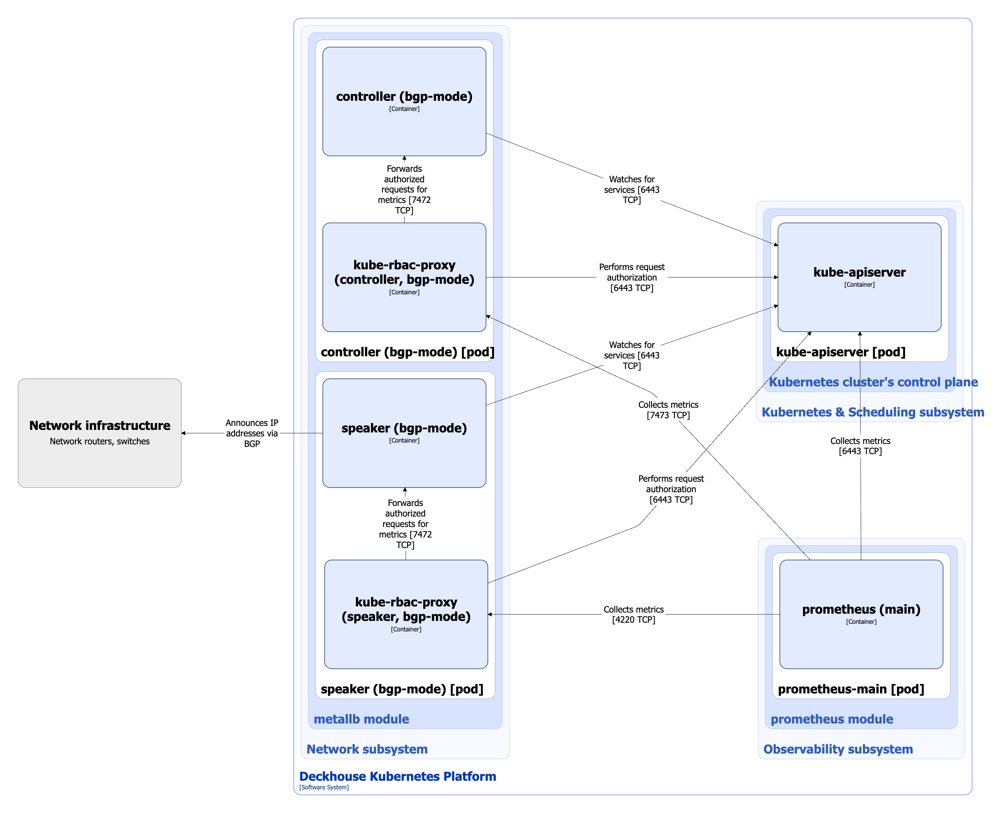

Модуль реализует механизм LoadBalancer для сервисов в кластерах bare metal.

Поддерживает следующие режимы работы:

* **Режим Layer 2** — реализует улучшенный (относительно стандартного режима L2 в MetalLB) механизм балансировки в кластерах bare metal, который позволяет использовать несколько «публичных» адресов для сервисов, равномерно распределяя их по доступным узлам кластера.
* **Режим BGP** — полностью основан на решении [MetalLB](https://metallb.universe.tf/).

Подробнее с настройками модуля и примерами его использования можно ознакомиться в соответствующем [разделе документации](/modules/metallb/).

## Архитектура модуля


Для лучшего восприятия схемы на ней допущены следующие упрощения:

* На схеме выглядит так, что контейнеры подов взаимодействуют с контейнерами других подов напрямую. На самом деле они взаимодействуют через соответствующие им сервисы Kubernetes (внутренние балансировщики). Если взаимодействие происходит через специфичный сервис, в подписи над стрелкой указано название сервиса.
* Поды могут быть запущены несколькими репликами. На схеме все поды изображены в одной реплике.


Архитектура модуля **metallb** на уровне 2 модели C4 и его взаимодействия с другими компонентами платформы изображены на следующих диаграммах:

MetalLB в режиме Layer 2:

<!--- Source: structurizr code from https://fox.flant.com/team/d8-system-design/doc/-/tree/main/architecture/diagrams/C4 --->

MetalLB в режиме BGP:

<!--- Source: structurizr code from https://fox.flant.com/team/d8-system-design/doc/-/tree/main/architecture/diagrams/C4 --->

## Компоненты модуля

Модуль состоит из следующих компонентов:

1. **controller**/**l2lb-controller** (Deployment) - контроллер MetalLB, отвечает за назначение IP-адресов сервисам типа LoadBalancer. Он наблюдает за изменениями в сервисах Kubernetes и применяет конфигурацию IP-адресов, основываясь на заранее определённом пуле адресов, указанных в настройках. В свою очередь состоит из следующих контейнеров:

   * **controller**/**l2lb-controller** - основной контейнер.
   * **kube-rbac-proxy** - sidecar-контейнер с авторизирующим прокси на основе Kubernetes RBAC для организации защищенного доступа к метрикам контроллера. [Open-source проект](https://github.com/brancz/kube-rbac-proxy).

2. **speaker**/**l2lb-speaker** (DaemonSet) - спикер MetalLB, работает на уровне каждого узла кластера, входящего в группу балансировки, и отвечает за реализацию протокола балансировки нагрузки на уровне сети:

   * В режиме L2 спикер использует ARP для ассоциации виртуальных IP-адресов сервисов с физическими адресами узлов.
   * В режиме BGP спикер анонсирует маршруты к виртуальным IP через протокол BGP, обеспечивая их доступность снаружи кластера.

   В свою очередь состоит из следующих контейнеров:

    * **speaker**/**l2lb-speaker** - основной контейнер.
    * **kube-rbac-proxy** - sidecar-контейнер с авторизирующим прокси на основе Kubernetes RBAC для организации защищенного доступа к метрикам спикера.

## Взаимодействия модуля

Модуль взаимодействует с:

1. **kube-apiserver**:

   * следит за изменениями в сервисах Kubernetes и применяет конфигурацию IP-адресов.
   * авторизация запросов на получение метрик.

2. **Сетевым оборудованием**, обеспечивая доступность виртуальных IP снаружи кластера:

   * в режиме BGP - анонсирует маршруты к виртуальным IP через протокол BGP,
   * в режиме ARP - оповещает вышестоящий роутер о том, что виртуальные IP находятся за mac-адресами определенных узлов при помощи ARP/GARP.

С модулем взаимодействуют следующие внешние для него компоненты:

1. **prometheus-main** - сбор метрик контроллера и спикера MetalLB.
