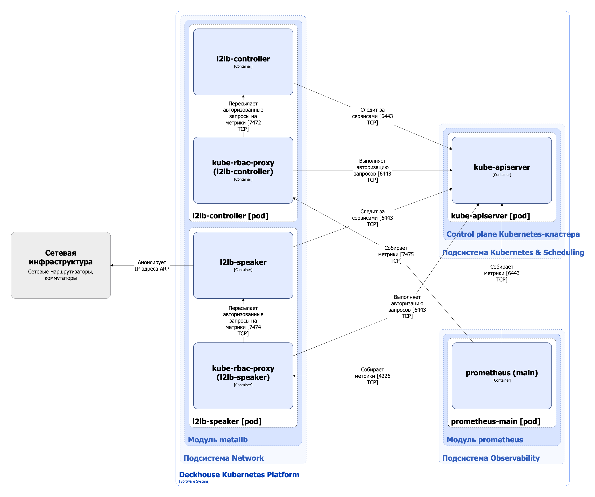
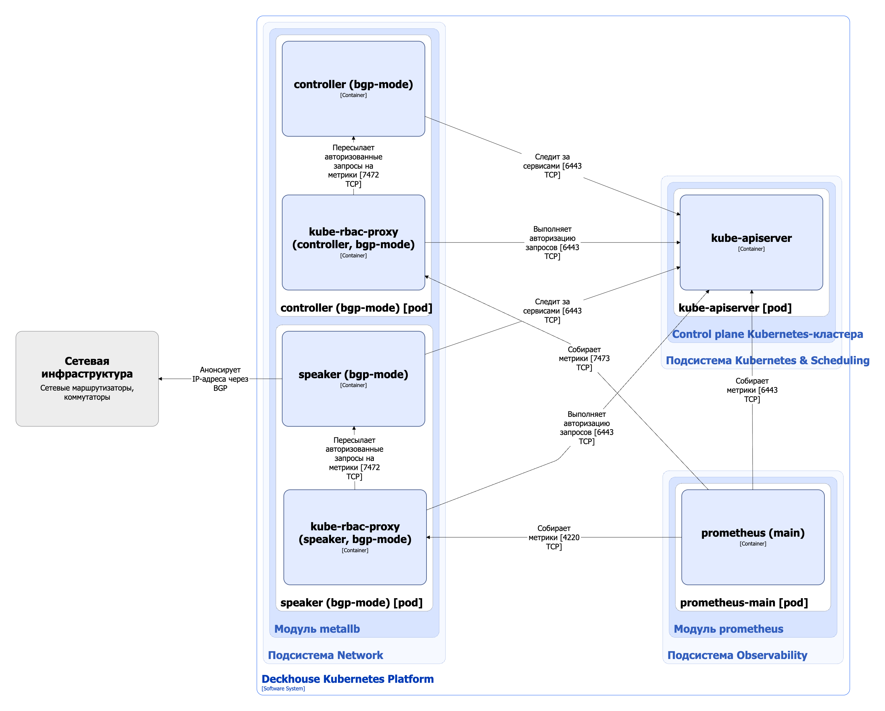

Модуль `metallb` реализует механизм LoadBalancer для сервисов в bare-metal-кластерах.

Поддерживаются следующие режимы работы:

* **Layer 2** — реализует улучшенный (по сравнению со стандартным режимом L2 в MetalLB) механизм балансировки в bare-metal-кластерах. Позволяет использовать несколько «публичных» IP-адресов для сервисов, равномерно распределяя их по доступным узлам кластера.
* **BGP** — полностью основан на решении [MetalLB](https://metallb.universe.tf/). Использует протокол BGP для построения маршрутов.

Подробнее с настройками модуля и примерами его использования можно ознакомиться в [соответствующем разделе документации](/modules/metallb/configuration.html).

## Архитектура модуля


Для упрощения схемы приняты следующие допущения:

* На схеме показано, что контейнеры разных подов взаимодействуют друг с другом напрямую. Фактически они взаимодействуют через соответствующие сервисы Kubernetes (внутренние балансировщики). Названия сервисов не указываются, если они очевидны из контекста. В остальных случаях название сервиса указано над стрелкой.
* Поды могут быть запущены в нескольких репликах, однако на схеме все поды изображены в одной реплике.


Архитектура модуля [`metallb`](/modules/metallb/) на уровне 2 модели C4 и его взаимодействия с другими компонентами Deckhouse Kubernetes Platform (DKP) изображены на следующих диаграммах.

MetalLB в режиме Layer 2:

<!--- Source: structurizr code from https://fox.flant.com/team/d8-system-design/doc/-/tree/main/architecture/diagrams/C4_RU --->

MetalLB в режиме BGP:

<!--- Source: structurizr code from https://fox.flant.com/team/d8-system-design/doc/-/tree/main/architecture/diagrams/C4_RU --->

## Компоненты модуля

Модуль состоит из следующих компонентов:

1. **Controller**/**l2lb-controller** (Deployment) — контроллер MetalLB, отвечающий за назначение IP-адресов сервисам типа LoadBalancer.

   Контроллер отслеживает изменения в сервисах Kubernetes и применяет конфигурацию IP-адресов, основываясь на заранее определённом пуле адресов, указанных в настройках.

   Состоит из следующих контейнеров:

   * **controller**/**l2lb-controller** — основной контейнер;
   * **kube-rbac-proxy** — сайдкар-контейнер с авторизующим прокси на основе Kubernetes RBAC для организации защищенного доступа к метрикам контроллера. Является [Open Source-проектом](https://github.com/brancz/kube-rbac-proxy).

2. **Speaker**/**l2lb-speaker** (DaemonSet) — спикер MetalLB, запускаемый на каждом узле кластера, входящем в группу балансировки. Отвечает за реализацию протокола балансировки нагрузки на уровне сети.

   В зависимости от режима работы выполняет следующие функции:

   * в режиме L2 использует ARP для сопоставления виртуальных IP-адресов сервисов с физическими адресами узлов;
   * в режиме BGP анонсирует маршруты к виртуальным IP-адресам через протокол BGP, обеспечивая доступность сервисов за пределами кластера.

   Состоит из следующих контейнеров:

    * **speaker**/**l2lb-speaker** — основной контейнер;
    * **kube-rbac-proxy** — сайдкар-контейнер с авторизующим прокси на основе Kubernetes RBAC для организации защищенного доступа к метрикам спикера.

## Взаимодействия модуля

Модуль взаимодействует со следующими компонентами:

1. **Kube-apiserver**:

   * отслеживает изменения в сервисах Kubernetes и применяет конфигурацию IP-адресов;
   * авторизует запросы на получение метрик.

2. **Сетевое оборудование** — обеспечивает доступность виртуальных IP-адресов за пределами кластера:

   * в режиме BGP — анонсирует маршруты к виртуальным IP-адресам по протоколу BGP;
   * в режиме ARP — используя ARP/GARP, оповещает вышестоящий роутер о том, что виртуальные IP-адреса находятся за MAC-адресами определенных узлов.

С модулем взаимодействуют следующие внешние компоненты:

* **Prometheus-main** — сбор метрик контроллера и спикера MetalLB.
