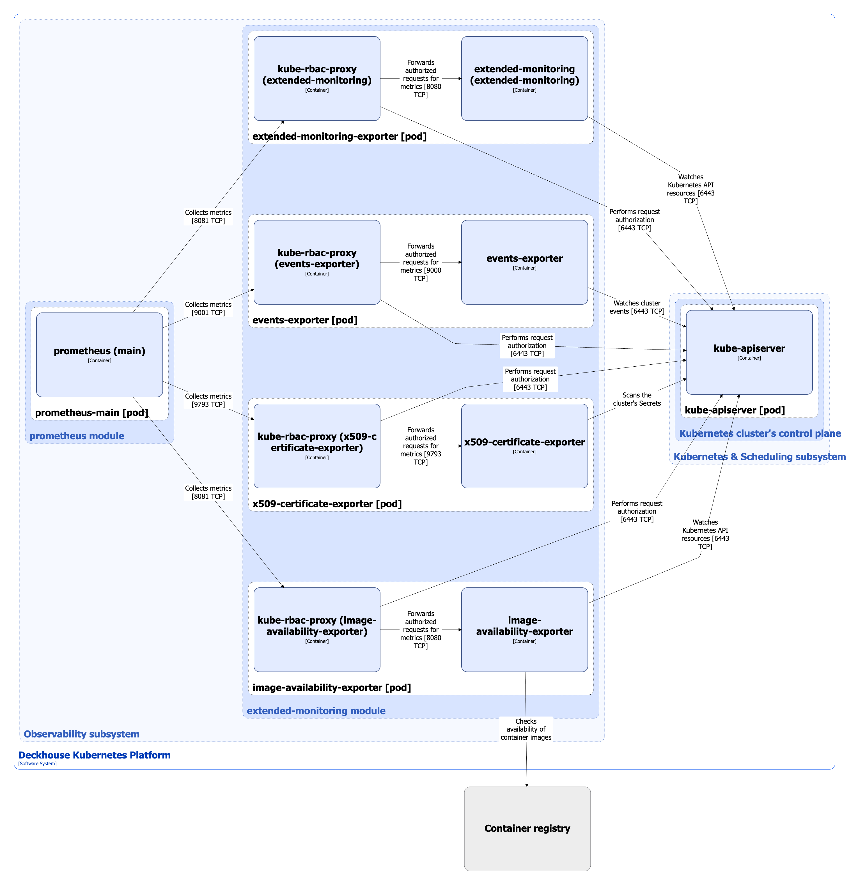

The [`extended-monitoring`](/modules/extended-monitoring/) module extends cluster monitoring capabilities with additional Prometheus exporters, which allow you to identify potential problems before they affect the operation of services.

Module features:

* Advanced metrics collection.
* Container image monitoring.
* Cluster events collection.
* Certificate control.

For more details about module configuration and usage examples, refer to the [corresponding documentation section](/modules/extended-monitoring/configuration.html).

## Module architecture


The following simplifications are made in the diagram:

* The diagram shows containers in different pods interacting directly with each other. In reality, they communicate via the corresponding Kubernetes Services (internal load balancers). Service names are omitted if they are obvious from the diagram context. Otherwise, the Service name is shown above the arrow.
* Pods may run multiple replicas. However, each pod is shown as a single replica in the diagram.


The Level 2 C4 architecture of the [`extended-monitoring`](/modules/extended-monitoring/) module and its interactions with other components of Deckhouse Kubernetes Platform (DKP) are shown in the following diagrams.

## Module components

The module consists of the following components:

1. **Extended-monitoring-exporter**: Prometheus exporter that collects additional metrics, and also includes ready-made alerts and dashboards that allow you to detect and diagnose incidents faster:

   * Collects and expounds metrics for free space and inodes on nodes, as well as for objects with a label `extended-monitoring.deckhouse.io/enabled =""` in the namespace.
   * Automatically generates alerts when the thresholds are reached.

   It consists of the following containers:

   * **extended-monitoring-exporter**: Main container. This exporter is developed by Flant.
   * **kube-rbac-proxy**: Sidecar container with an authorization proxy based on Kubernetes RBAC, providing secure access to exporter metrics. It is an [open source project](https://github.com/brancz/kube-rbac-proxy).

1. **Image-availability-exporter**: Prometheus exporter that performs container image monitoring:

   * Adds metrics and sends alerts about unavailability of container images to registry for all types of workload (Deployments, StatefulSets, DaemonSets, CronJobs).
   * Helps to find out in advance about possible problems with launching or updating pods.

   It consists of the following containers:

    * **image-availability-exporter**: Main container. This exporter is developed by Flant.
    * **kube-rbac-proxy**: Sidecar container providing authorized access to exporter metrics (described above).

1. **Events-exporter**: Prometheus exporter that collects Kubernetes events and displays them as metrics, which allows you to track the dynamics of changes and respond faster to incidents.

   It consists of the following containers:

   * **events-exporter**: Main container. This exporter is developed by Flant.
   * **kube-rbac-proxy**: Sidecar container providing authorized access to exporter metrics (described above).

1. **X509-certificate-exporter**: Prometheus exporter that provides certificate control:

   * Scans the cluster's Secrets and generates metrics about the expiration of x509 certificates.
   * Allows you not to miss critical moments and update certificates on time, avoiding application downtime due to expired certificates.

   It consists of the following containers:

   * **x509-certificate-exporter**: Main container. It is an [open source project](https://github.com/enix/x509-certificate-exporter);
   * **kube-rbac-proxy**: Sidecar container providing authorized access to exporter metrics (described above).

## Module interactions

The module interacts with the following components:

1. **Kube-apiserver**:

   * Watches Kubernetes API resources.
   * Watches cluster events (Events resources).
   * Scans the cluster's Secrets.
   * Authorizes requests for metrics.

1. **Container registry**: Checks availability of container images.

The following external components interact with the module:

1. **Prometheus-main**: Collects metrics from module exporters.
